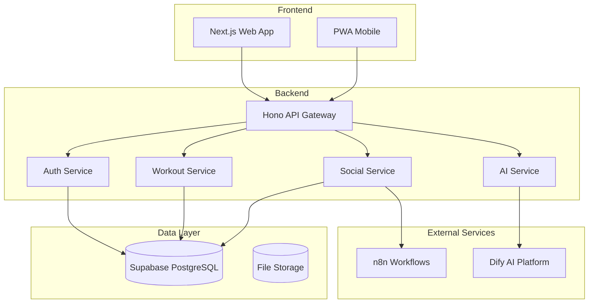

# GymPal - General Documentation Index

## 📚 **Complete Documentation Structure**

This document serves as the main index for navigating through all the technical documentation of the GymPal project.

---

## 🏗️ **Architecture and Design**

### [01. Project Vision and Scope](./architecture/01-vision-and-scope.md)
- Project vision and key objectives
- Academic requirements and scope (5 months, 5 students)
- Main use cases
- High-level architecture diagrams
- Main user flows

### [02. Technology Stack](./architecture/02-tech-stack.md)
- Final technology decisions
- Frontend: Next.js 14 + TypeScript + Tailwind CSS + Zustand
- Backend: Hono + TypeScript + Supabase
- Infrastructure: Docker + Kubernetes + ArgoCD
- Technology comparisons and justifications
- **NEW**: Real project structure Backend and Frontend

### [03. Software Architecture](./architecture/03-software-architecture.md)
- System capabilities map
- Design principles
- Frontend Architecture (Feature-Slice with App Router)
- Backend Architecture (Service-Middleware-Types modules)
- Microservices communication
- Flow and sequence diagrams
- **NEW**: Backend and Frontend class diagrams (Social)

---

## 🗄️ **Database**

### [01. Database Schema](./database/01-database-schema.md)
- Data architecture
- Main tables and relationships
- Row Level Security (RLS)
- Indexes and optimization
- Complete ER diagrams
- Migration strategies

---

## 🔌 **API and Endpoints**

### [01. Endpoints Documentation](./api/01-api-endpoints.md)
- 31 documented endpoints
- User personal information
- Custom routines
- Advanced social posts
- Authentication and authorization
- API flow diagrams
- **NEW**: Unified OpenAPI generation (single script)

---

## 🤖 **Artificial Intelligence**

### [01. AI Integration](./ai/01-ai-integration.md)
- Dify AI client
- Context builder
- Frontend Chat component
- Recommendation system
- AI routine generation
- n8n integration for automation

---

## 🔐 **Security**

### [01. Security and Compliance](./security/01-security-compliance.md)
- Security principles
- Authentication and authorization
- JWT implementation
- Row Level Security (RLS)
- Rate limiting and validation
- Data encryption
- GDPR compliance

---

## 🚀 **DevOps**

### [01. DevOps and CI/CD](./devops/01-devops-cicd.md)
- Complete CI/CD pipeline
- Docker configuration
- Kubernetes configuration
- ArgoCD for GitOps
- Helm Charts
- **Monitoring Configuration**: Prometheus, Grafana, Loki
- **Production Alerts**: AlertManager, Slack, Email
- Deployment scripts
- **NEW**: Detailed pipeline diagrams (Push to main, Testing, Deploy, Quality, Notifications)

---

## 🧪 **Testing**

### [01. Testing Strategy](./testing/01-testing-strategy.md)
- Testing architecture
- Unit tests (Frontend and Backend)
- Integration tests
- End-to-end tests with Playwright
- Load tests with Artillery
- Mocks and fixtures
- Coverage configuration

---

---

## ⚙️ **Configuration**

### [01. Project Configuration](./configuration/01-project-config.md)
- Environment variables
- Docker configuration
- Kubernetes configuration
- Deployment scripts
- Development tools

---

## 🚀 **Quick Start**

### [01. Getting Started Guide](./quick-start/01-getting-started.md)
- Installation in 5 minutes
- Basic configuration
- First steps
- Troubleshooting
- Installation verification

---

## 📋 **Technical Summary**

### [Technical Summary](./executive-summary.md)
- Project overview
- Technical architecture
- Main functionalities
- Academic objectives
- Development plan
- Technical innovations

---

## 📊 **Main Diagrams**

### General Architecture

---

## 🛠️ **Technologies Used**

| Category | Technology | Version | Purpose |
|-----------|------------|---------|-----------|
| **Frontend** | Next.js | 14 | React Framework |
| **Frontend** | TypeScript | 5.3+ | Static typing |
| **Frontend** | Tailwind CSS | 3.x | Styles |
| **Frontend** | shadcn/ui | Latest | UI Components |
| **Backend** | Node.js | 20 LTS | Runtime |
| **Backend** | Hono | Latest | Web framework |
| **Backend** | TypeScript | 5.3+ | Static typing |
| **Database** | Supabase | Latest | BaaS |
| **Database** | PostgreSQL | 15+ | Database |
| **AI** | Dify AI | Latest | AI Platform |
| **Automation** | n8n | Latest | Workflows |
| **Container** | Docker | Latest | Containerization |
| **Orchestration** | Kubernetes | 1.28+ | Orchestration |
| **GitOps** | ArgoCD | Latest | Deployment |
| **Testing** | Vitest | Latest | Unit testing |
| **Testing** | Playwright | Latest | E2E testing |

---
