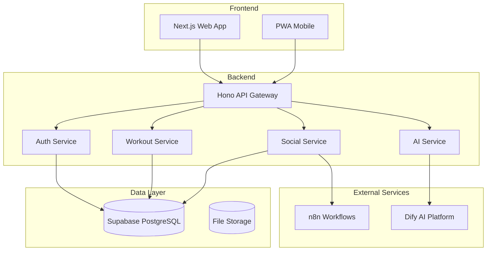
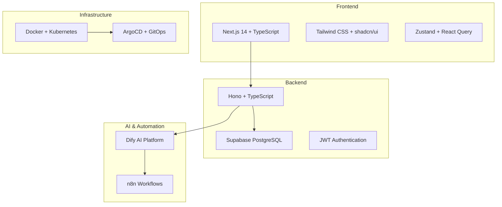

# GymPal - Documentation

### 🏗️ Architecture
- [**Vision and Scope**](./architecture/01-vision-and-scope.md) - Project vision, objectives and use cases
- [**Technology Stack**](./architecture/02-tech-stack.md) - Technologies used and justifications
- [**Software Architecture**](./architecture/03-software-architecture.md) - System design and patterns

### 🗄️ Database
- [**Database Schema**](./database/01-database-schema.md) - Data structure, tables and relationships

### 🔌 API
- [**API Endpoints**](./api/01-api-endpoints.md) - Complete REST endpoints documentation

### 🤖 Artificial Intelligence
- [**AI Integration**](./ai/01-ai-integration.md) - Chatbot, recommendations and content generation

### 🔐 Security
- [**Security and Compliance**](./security/01-security-compliance.md) - Security policies and GDPR

### 🚀 DevOps
- [**DevOps and CI/CD**](./devops/01-devops-cicd.md) - Deployment pipeline and automation

### 🧪 Testing
- [**Testing Strategy**](./testing/01-testing-strategy.md) - Unit, integration and E2E tests

### ⚙️ Configuration
- [**Project Configuration**](./configuration/01-project-config.md) - Variables, Docker, K8s and scripts

### 🚀 Quick Start
- [**Getting Started Guide**](./quick-start/01-getting-started.md) - Installation in 5 minutes

### 📋 Executive Summary
- [**Executive Summary**](./executive-summary.md) - Project overview and achievements

## 🎯 Project Summary

GymPal is a comprehensive fitness platform that combines:

- **💪 Workout Management**: Custom routines, progress tracking
- **🤖 Artificial Intelligence**: Contextual chatbot and recommendation system
- **👥 Social Network**: Posts, interactions and fitness community
- **📊 Analytics**: Dashboard with progress statistics
- **🍎 Nutrition**: Macro tracking and nutritional goals

## 🛠️ Technology Stack

### Frontend
- **Next.js 14** with App Router
- **TypeScript** for static typing
- **Tailwind CSS** + **shadcn/ui** for UI
- **Zustand** for global state
- **React Query** for data management

### Backend
- **Node.js** with **Hono** framework
- **TypeScript** across the entire stack
- **Supabase** for database and authentication
- **Dify AI** for AI functionalities
- **n8n** for automation

### Infrastructure
- **Docker** for containerization
- **Kubernetes** for orchestration
- **ArgoCD** for GitOps
- **Prometheus + Grafana** for monitoring
- **GitHub Actions** for CI/CD

## 📊 System Architecture

## 🏗️ **Technical Architecture**

### Technology Stack

## 📄 License

This project is under the MIT License. See the [LICENSE](../LICENSE) file for more details.

---
