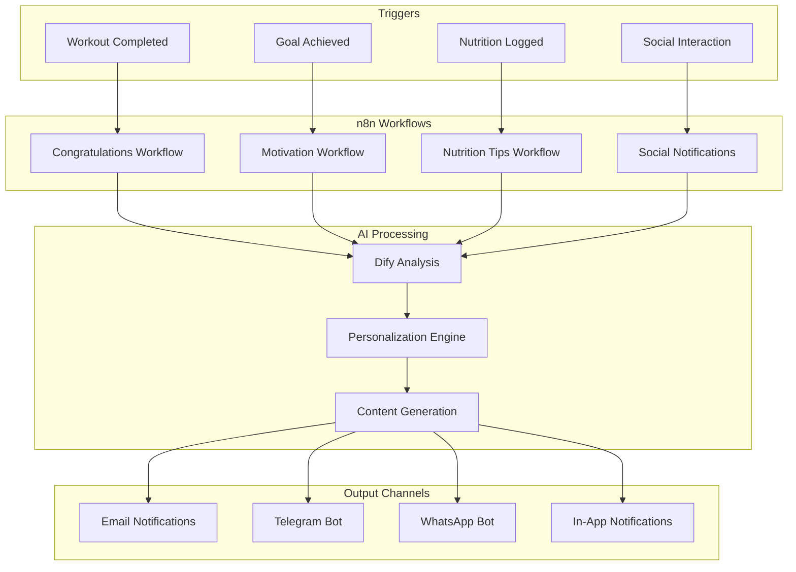

# AI Integration (Detailed)

## Dify Client

```typescript
// backend/src/modules/ai/dify.client.ts
export class DifyClient {
  private apiKey: string;
  private baseUrl = 'https://api.dify.ai/v1';
  
  constructor(apiKey: string) {
    this.apiKey = apiKey;
  }
  
  async chat(params: {
    query: string;
    user: string;
    conversationId?: string;
    inputs?: Record<string, any>;
  }) {
    const response = await fetch(`${this.baseUrl}/chat-messages`, {
      method: 'POST',
      headers: {
        'Authorization': `Bearer ${this.apiKey}`,
        'Content-Type': 'application/json'
      },
      body: JSON.stringify({
        query: params.query,
        user: params.user,
        conversation_id: params.conversationId,
        inputs: params.inputs || {},
        response_mode: 'blocking'
      })
    });
    
    if (!response.ok) {
      throw new Error(`Dify API error: ${response.status}`);
    }
    
    return response.json();
  }
  
  async completion(params: {
    prompt: string;
    user: string;
    inputs?: Record<string, any>;
  }) {
    const response = await fetch(`${this.baseUrl}/completion-messages`, {
      method: 'POST',
      headers: {
        'Authorization': `Bearer ${this.apiKey}`,
        'Content-Type': 'application/json'
      },
      body: JSON.stringify({
        inputs: { prompt: params.prompt, ...params.inputs },
        user: params.user,
        response_mode: 'blocking'
      })
    });
    
    if (!response.ok) {
      throw new Error(`Dify API error: ${response.status}`);
    }
    
    return response.json();
  }
}
```

## Context Builder

```typescript
// backend/src/modules/ai/context.builder.ts
import { createClient } from '@supabase/supabase-js';

export class ContextBuilder {
  private supabase;
  
  constructor() {
    this.supabase = createClient(
      process.env.SUPABASE_URL!,
      process.env.SUPABASE_SERVICE_KEY!
    );
  }
  
  async buildForUser(userId: string) {
    // Get user profile
    const { data: profile } = await this.supabase
      .from('users')
      .select('*')
      .eq('id', userId)
      .single();
    
    // Get recent workouts (last 5)
    const { data: recentWorkouts } = await this.supabase
      .from('workout_logs')
      .select('*')
      .eq('user_id', userId)
      .order('log_date', { ascending: false })
      .limit(5);
    
    // Get active workout plan
    const { data: activeWorkout } = await this.supabase
      .from('workouts')
      .select('*')
      .eq('user_id', userId)
      .order('created_at', { ascending: false })
      .limit(1)
      .single();
    
    return {
      profile: profile || {},
      recentWorkouts: recentWorkouts || [],
      activeWorkout: activeWorkout || null,
      goals: profile?.goals || {}
    };
  }
}
```

## Frontend Chat Component

```typescript
// frontend/src/components/ai/chat-interface.tsx
'use client';

import { useState, useRef, useEffect } from 'react';
import { Button } from '@/components/ui/button';
import { Input } from '@/components/ui/input';
import { ScrollArea } from '@/components/ui/scroll-area';
import { apiClient } from '@/lib/api/client';

interface Message {
  role: 'user' | 'assistant';
  content: string;
  timestamp: Date;
}

export function ChatInterface() {
  const [messages, setMessages] = useState<Message[]>([]);
  const [input, setInput] = useState('');
  const [isLoading, setIsLoading] = useState(false);
  const [sessionId, setSessionId] = useState<string>();
  const scrollRef = useRef<HTMLDivElement>(null);
  
  useEffect(() => {
    scrollRef.current?.scrollIntoView({ behavior: 'smooth' });
  }, [messages]);
  
  const sendMessage = async () => {
    if (!input.trim()) return;
    
    const userMessage: Message = {
      role: 'user',
      content: input,
      timestamp: new Date()
    };
    
    setMessages(prev => [...prev, userMessage]);
    setInput('');
    setIsLoading(true);
    
    try {
      const response = await apiClient.post<{
        message: string;
        sessionId: string;
        suggestions?: string[];
      }>('/ai/chat', {
        message: input,
        sessionId
      });
      
      setSessionId(response.sessionId);
      
      const assistantMessage: Message = {
        role: 'assistant',
        content: response.message,
        timestamp: new Date()
      };
      
      setMessages(prev => [...prev, assistantMessage]);
    } catch (error) {
      console.error('Chat error:', error);
      setMessages(prev => [...prev, {
        role: 'assistant',
        content: 'Sorry, an error occurred. Please try again.',
        timestamp: new Date()
      }]);
    } finally {
      setIsLoading(false);
    }
  };
  
  return (
    <div className="flex flex-col h-[600px] border rounded-lg">
      <div className="p-4 border-b">
        <h2 className="text-xl font-semibold">AI Fitness Assistant</h2>
        <p className="text-sm text-muted-foreground">
          Ask about exercises, nutrition, or your progress
        </p>
      </div>
      
      <ScrollArea className="flex-1 p-4">
        <div className="space-y-4">
          {messages.map((msg, idx) => (
            <div
              key={idx}
              className={`flex ${msg.role === 'user' ? 'justify-end' : 'justify-start'}`}
            >
              <div
                className={`max-w-[80%] rounded-lg p-3 ${
                  msg.role === 'user'
                    ? 'bg-primary text-primary-foreground'
                    : 'bg-muted'
                }`}
              >
                <p className="text-sm">{msg.content}</p>
                <span className="text-xs opacity-70">
                  {msg.timestamp.toLocaleTimeString()}
                </span>
              </div>
            </div>
          ))}
          {isLoading && (
            <div className="flex justify-start">
              <div className="bg-muted rounded-lg p-3">
                <div className="flex space-x-2">
                  <div className="w-2 h-2 bg-gray-500 rounded-full animate-bounce" />
                  <div className="w-2 h-2 bg-gray-500 rounded-full animate-bounce delay-100" />
                  <div className="w-2 h-2 bg-gray-500 rounded-full animate-bounce delay-200" />
                </div>
              </div>
            </div>
          )}
          <div ref={scrollRef} />
        </div>
      </ScrollArea>
      
      <div className="p-4 border-t">
        <form
          onSubmit={(e) => {
            e.preventDefault();
            sendMessage();
          }}
          className="flex gap-2"
        >
          <Input
            value={input}
            onChange={(e) => setInput(e.target.value)}
            placeholder="Type your message..."
            disabled={isLoading}
          />
          <Button type="submit" disabled={isLoading || !input.trim()}>
            Send
          </Button>
        </form>
      </div>
    </div>
  );
}
```

## AI Architecture


## AI Chat Flow


## Recommendation System


## AI-Driven Workout Generation


## Integration with n8n for Automation



## AI Prompts and Templates

### Workout Generation Prompt

```typescript
const WORKOUT_GENERATION_PROMPT = `
You are an expert personal trainer. Generate a personalized workout routine based on:

User profile:
- Experience level: {experience_level}
- Primary goal: {primary_goal}
- Secondary goals: {secondary_goals}
- Training frequency: {workout_frequency} days/week
- Preferred duration: {preferred_duration} minutes
- Available equipment: {available_equipment}
- Medical restrictions: {medical_restrictions}

Generate a routine that includes:
1. Warm up (5-10 minutes)
2. Main exercises (organized by muscle groups)
3. Cool down (5-10 minutes)
4. Weekly progression
5. Form and safety tips

Response format (JSON):
{
  "name": "Routine name",
  "description": "Detailed description",
  "duration_minutes": 60,
  "exercises": [
    {
      "name": "Exercise name",
      "muscle_group": "Muscle group",
      "sets": 3,
      "reps": "12-15",
      "rest_seconds": 60,
      "notes": "Specific tips"
    }
  ],
  "progression": "Weekly progression plan",
  "tips": ["Tip 1", "Tip 2"]
}
`;
```

### Recommendation Prompt

```typescript
const RECOMMENDATION_PROMPT = `
Analyze the user's profile and history to generate personalized recommendations:

User data:
- Profile: {user_profile}
- Workout history: {workout_history}
- Social interactions: {social_interactions}
- Nutrition preferences: {nutrition_preferences}

Generate recommendations for:
1. Similar workout routines
2. Users with compatible goals
3. Relevant content (posts, tips, etc.)
4. Diet adjustments
5. New exercises to try

Response format (JSON):
{
  "workout_recommendations": [...],
  "user_recommendations": [...],
  "content_recommendations": [...],
  "nutrition_suggestions": [...],
  "new_exercises": [...]
}
`;
```

## AI Monitoring and Metrics


