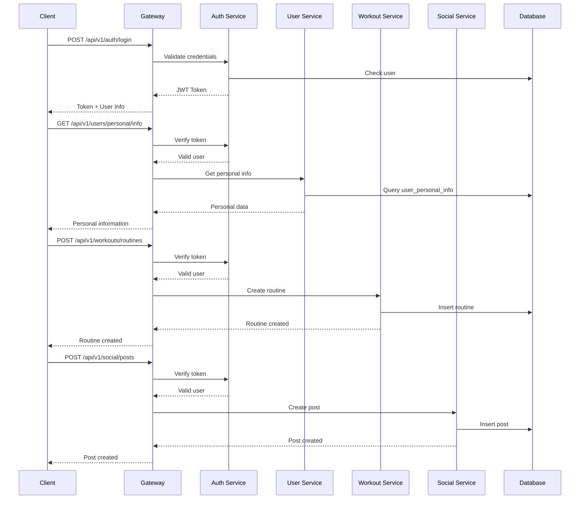
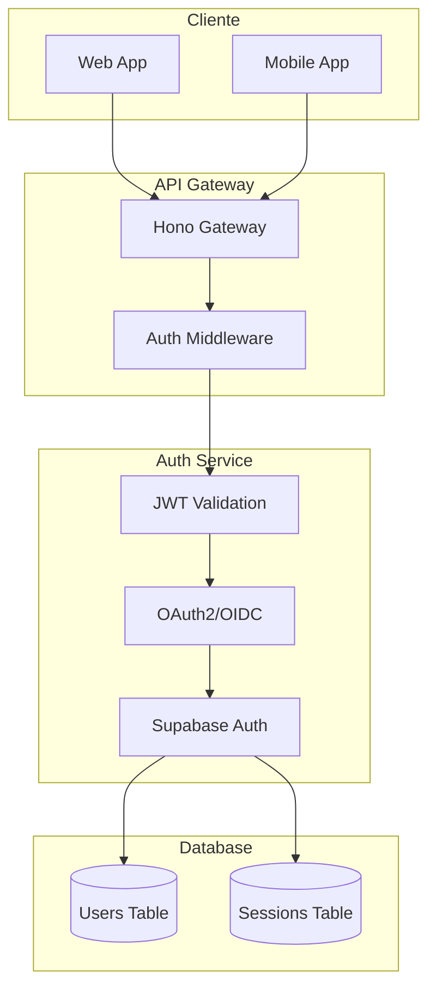

# 📚 Detailed API Endpoints Documentation

| Category | Endpoints | Description |
|-----------|-----------|-------------|
| 🔐 **Authentication** | 6 | Register, login, refresh, logout, profile, password change |
| 👤 **Users** | 6 | Profile, settings, statistics, public profile |
| 💪 **Workouts** | 5 | Basic workout CRUD |
| 📱 **Social** | 11 | Feed, posts, likes, comments, follows |
| 👤 **Personal** | 6 | Personal info, goals, dietary preferences |
| 🏋️ **Routines** | 7 | Custom routines CRUD, duplicate, share |
| 📝 **Advanced Posts** | 4 | Trending, search, share, repost |
| 📊 **Dashboard** | 2 | Statistics and recent activity |
| ⚙️ **Settings** | 3 | General user settings |

## 1. User Personal Information

### GET /api/v1/users/personal/info
Get complete user personal information.

**Response:**
```json
{
  "success": true,
  "data": {
    "age": 25,
    "gender": "male",
    "weight_kg": 75.5,
    "height_cm": 180,
    "bmi": 23.3,
    "body_fat_percentage": 15.2,
    "created_at": "2024-01-15T10:30:00Z",
    "updated_at": "2024-01-20T14:45:00Z"
  }
}
```

### PUT /api/v1/users/personal/info
Update user personal information.

**Request Body:**
```json
{
  "age": 25,
  "gender": "male",
  "weight_kg": 75.5,
  "height_cm": 180
}
```

**Response:**
```json
{
  "success": true,
  "data": {
    "age": 25,
    "gender": "male",
    "weight_kg": 75.5,
    "height_cm": 180,
    "bmi": 23.3,
    "body_fat_percentage": 15.2,
    "updated_at": "2024-01-20T14:45:00Z"
  }
}
```

### GET /api/v1/users/personal/objectives
Get user goals and experience level.

**Response:**
```json
{
  "success": true,
  "data": {
    "experience_level": "intermediate",
    "primary_goal": "muscle_gain",
    "secondary_goals": ["strength_building", "flexibility"],
    "workout_frequency": 4,
    "preferred_workout_duration": 60,
    "available_equipment": ["full_gym", "dumbbells"],
    "fitness_goals_timeline": "6_months",
    "motivation_level": 8
  }
}
```

### PUT /api/v1/users/personal/objectives
Update goals and experience level.

**Request Body:**
```json
{
  "experience_level": "intermediate",
  "primary_goal": "muscle_gain",
  "secondary_goals": ["strength_building"],
  "workout_frequency": 4,
  "preferred_workout_duration": 60,
  "available_equipment": ["full_gym", "dumbbells"],
  "fitness_goals_timeline": "6_months",
  "motivation_level": 8
}
```

### GET /api/v1/users/personal/dietary-preferences
Get user dietary preferences.

**Response:**
```json
{
  "success": true,
  "data": {
    "dietary_restrictions": ["high_protein", "dairy_free"],
    "allergies": ["nuts", "shellfish"],
    "calorie_goal": 2500,
    "protein_goal": 150,
    "carb_goal": 300,
    "fat_goal": 100,
    "water_intake_goal": 3000,
    "meal_frequency": 5
  }
}
```

### PUT /api/v1/users/personal/dietary-preferences
Update dietary preferences.

**Request Body:**
```json
{
  "dietary_restrictions": ["high_protein", "dairy_free"],
  "allergies": ["nuts"],
  "calorie_goal": 2500,
  "protein_goal": 150,
  "carb_goal": 300,
  "fat_goal": 100,
  "water_intake_goal": 3000,
  "meal_frequency": 5
}
```

## 2. Custom Routines

### GET /api/v1/workouts/routines
List user routines with filters.

**Query Parameters:**
- `page` (number): Page (default: 1)
- `limit` (number): Items per page (default: 10)
- `goal` (string): Filter by goal
- `level` (string): Filter by level
- `equipment` (string): Filter by equipment
- `duration_min` (number): Minimum duration in minutes
- `duration_max` (number): Maximum duration in minutes

**Response:**
```json
{
  "success": true,
  "data": {
    "routines": [
      {
        "id": "uuid",
"name": "Strength Routine",
"description": "Routine focused on muscle gain",
        "type": "strength",
        "difficulty": "intermediate",
        "duration_minutes": 60,
        "target_goal": "muscle_gain",
        "target_level": "intermediate",
        "days_per_week": 4,
        "equipment_required": ["full_gym", "dumbbells"],
"user_notes": "Focus on correct form",
"tags": ["strength", "hypertrophy"],
        "share_count": 5,
        "like_count": 12,
        "is_public": true,
        "created_at": "2024-01-15T10:30:00Z"
      }
    ],
    "pagination": {
      "page": 1,
      "limit": 10,
      "total": 25,
      "total_pages": 3
    }
  }
}
```

### POST /api/v1/workouts/routines
Create a new custom routine.

**Request Body:**
```json
{
"name": "Strength Routine",
"description": "Routine focused on muscle gain",
  "type": "strength",
  "difficulty": "intermediate",
  "duration_minutes": 60,
  "target_goal": "muscle_gain",
  "target_level": "intermediate",
  "days_per_week": 4,
  "equipment_required": ["full_gym", "dumbbells"],
"user_notes": "Focus on correct form",
"tags": ["strength", "hypertrophy"],
  "is_public": true
}
```

### GET /api/v1/workouts/routines/search
Search routines by criteria.

**Query Parameters:**
- `goal` (string): Main goal
- `level` (string): Experience level
- `equipment` (string): Available equipment
- `duration_min` (number): Minimum duration
- `duration_max` (number): Maximum duration
- `days_per_week` (number): Days per week
- `tags` (string): Tags separated by commas

### POST /api/v1/workouts/routines/:routineId/share
Share routine with other users.

**Request Body:**
```json
{
  "user_ids": ["uuid1", "uuid2", "uuid3"],
"message": "Sharing this routine that has worked great for me"
}
```

## 3. Advanced Social Posts

### GET /api/v1/social/posts
List posts with filters.

**Query Parameters:**
- `page` (number): Page
- `limit` (number): Items per page
- `type` (string): Post type (achievement, routine, tip, progress)
- `user_id` (string): Filter by user
- `hashtags` (string): Filter by hashtags
- `date_from` (string): From date (ISO)
- `date_to` (string): To date (ISO)

**Response:**
```json
{
  "success": true,
  "data": {
    "posts": [
      {
        "id": "uuid",
        "user": {
          "id": "uuid",
          "username": "fitness_user",
"full_name": "John Doe",
          "avatar_url": "https://example.com/avatar.jpg"
        },
"content": "I achieved my 100kg bench press goal! 💪",
        "post_type": "achievement",
        "image_urls": ["https://example.com/photo1.jpg"],
"hashtags": ["#benchpress", "#achievement", "#strength"],
        "likes_count": 25,
        "comments_count": 8,
        "shares_count": 3,
        "reposts_count": 2,
        "is_original": true,
        "created_at": "2024-01-20T15:30:00Z",
        "workout": {
          "id": "uuid",
"name": "Strength Routine"
        }
      }
    ],
    "pagination": {
      "page": 1,
      "limit": 10,
      "total": 150,
      "total_pages": 15
    }
  }
}
```

### POST /api/v1/social/posts
Create new post.

**Request Body:**
```json
{
"content": "I achieved my 100kg bench press goal! 💪",
  "post_type": "achievement",
  "image_urls": ["https://example.com/photo1.jpg"],
"hashtags": ["#benchpress", "#achievement", "#strength"],
  "workout_id": "uuid",
  "is_public": true
}
```

### POST /api/v1/social/posts/:postId/share
Share/forward a post.

**Request Body:**
```json
{
  "user_ids": ["uuid1", "uuid2"],
"message": "Check out this amazing achievement!",
  "share_type": "share"
}
```

### POST /api/v1/social/posts/:postId/repost
Repost content.

**Request Body:**
```json
{
"comment": "Awesome routine! I'm going to try it"
}
```

### GET /api/v1/social/posts/trending
Get trending posts.

**Query Parameters:**
- `timeframe` (string): Period (1h, 24h, 7d, 30d)
- `limit` (number): Number of posts

### GET /api/v1/social/posts/search
Search posts by content or hashtags.

**Query Parameters:**
- `q` (string): Search term
- `hashtags` (string): Comma-separated hashtags
- `type` (string): Post type
- `user_id` (string): Filter by user

## API Flow Diagram



## Authentication Diagram



## Environment Variables

Create `.env.example` and set:
- `SUPABASE_URL`, `SUPABASE_ANON_KEY`, `SUPABASE_SERVICE_KEY`
- `JWT_SECRET`, `JWT_EXPIRY`
- `PORT` (server port)
- `NODE_ENV` (development/production)
- `SMTP_HOST`, `SMTP_PORT`, `SMTP_USER`, `SMTP_PASS` (emails)
