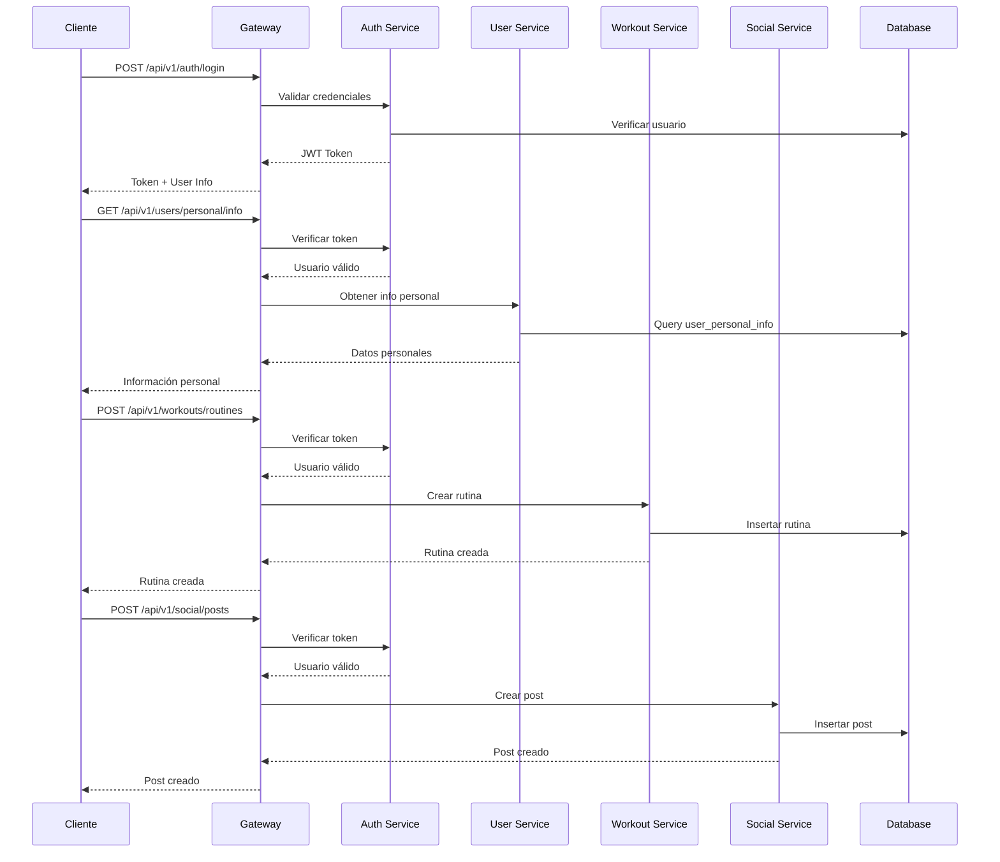
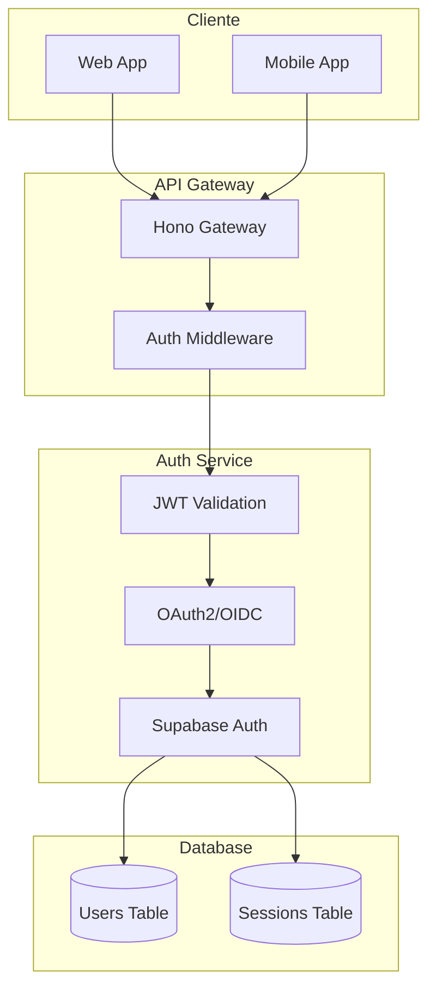

# 📚 Documentación Detallada de Endpoints

| Categoría | Endpoints | Descripción |
|-----------|-----------|-------------|
| 🔐 **Autenticación** | 6 | Registro, login, refresh, logout, perfil, cambio de contraseña |
| 👤 **Usuarios** | 6 | Perfil, configuración, estadísticas, perfil público |
| 💪 **Entrenamientos** | 5 | CRUD de entrenamientos básicos |
| 📱 **Social** | 11 | Feed, posts, likes, comentarios, follows |
| 👤 **Personal** | 6 | Información personal, objetivos, preferencias dietéticas |
| 🏋️ **Rutinas** | 7 | CRUD de rutinas personalizadas, duplicar, compartir |
| 📝 **Posts Avanzados** | 4 | Trending, búsqueda, compartir, repostear |
| 📊 **Dashboard** | 2 | Estadísticas y actividad reciente |
| ⚙️ **Configuración** | 3 | Configuración general del usuario |

## 1. Información Personal del Usuario

### GET /api/v1/users/personal/info
Obtener información personal completa del usuario.

**Response:**
```json
{
  "success": true,
  "data": {
    "age": 25,
    "gender": "male",
    "weight_kg": 75.5,
    "height_cm": 180,
    "bmi": 23.3,
    "body_fat_percentage": 15.2,
    "created_at": "2024-01-15T10:30:00Z",
    "updated_at": "2024-01-20T14:45:00Z"
  }
}
```

### PUT /api/v1/users/personal/info
Actualizar información personal del usuario.

**Request Body:**
```json
{
  "age": 25,
  "gender": "male",
  "weight_kg": 75.5,
  "height_cm": 180
}
```

**Response:**
```json
{
  "success": true,
  "data": {
    "age": 25,
    "gender": "male",
    "weight_kg": 75.5,
    "height_cm": 180,
    "bmi": 23.3,
    "body_fat_percentage": 15.2,
    "updated_at": "2024-01-20T14:45:00Z"
  }
}
```

### GET /api/v1/users/personal/objectives
Obtener objetivos y nivel de experiencia del usuario.

**Response:**
```json
{
  "success": true,
  "data": {
    "experience_level": "intermediate",
    "primary_goal": "muscle_gain",
    "secondary_goals": ["strength_building", "flexibility"],
    "workout_frequency": 4,
    "preferred_workout_duration": 60,
    "available_equipment": ["full_gym", "dumbbells"],
    "fitness_goals_timeline": "6_months",
    "motivation_level": 8
  }
}
```

### PUT /api/v1/users/personal/objectives
Actualizar objetivos y nivel de experiencia.

**Request Body:**
```json
{
  "experience_level": "intermediate",
  "primary_goal": "muscle_gain",
  "secondary_goals": ["strength_building"],
  "workout_frequency": 4,
  "preferred_workout_duration": 60,
  "available_equipment": ["full_gym", "dumbbells"],
  "fitness_goals_timeline": "6_months",
  "motivation_level": 8
}
```

### GET /api/v1/users/personal/dietary-preferences
Obtener preferencias dietéticas del usuario.

**Response:**
```json
{
  "success": true,
  "data": {
    "dietary_restrictions": ["high_protein", "dairy_free"],
    "allergies": ["nuts", "shellfish"],
    "calorie_goal": 2500,
    "protein_goal": 150,
    "carb_goal": 300,
    "fat_goal": 100,
    "water_intake_goal": 3000,
    "meal_frequency": 5
  }
}
```

### PUT /api/v1/users/personal/dietary-preferences
Actualizar preferencias dietéticas.

**Request Body:**
```json
{
  "dietary_restrictions": ["high_protein", "dairy_free"],
  "allergies": ["nuts"],
  "calorie_goal": 2500,
  "protein_goal": 150,
  "carb_goal": 300,
  "fat_goal": 100,
  "water_intake_goal": 3000,
  "meal_frequency": 5
}
```

## 2. Rutinas Personalizadas

### GET /api/v1/workouts/routines
Listar rutinas del usuario con filtros.

**Query Parameters:**
- `page` (number): Página (default: 1)
- `limit` (number): Elementos por página (default: 10)
- `goal` (string): Filtrar por objetivo
- `level` (string): Filtrar por nivel
- `equipment` (string): Filtrar por equipo
- `duration_min` (number): Duración mínima en minutos
- `duration_max` (number): Duración máxima en minutos

**Response:**
```json
{
  "success": true,
  "data": {
    "routines": [
      {
        "id": "uuid",
        "name": "Rutina de Fuerza",
        "description": "Rutina enfocada en ganancia de músculo",
        "type": "strength",
        "difficulty": "intermediate",
        "duration_minutes": 60,
        "target_goal": "muscle_gain",
        "target_level": "intermediate",
        "days_per_week": 4,
        "equipment_required": ["full_gym", "dumbbells"],
        "user_notes": "Enfocarse en forma correcta",
        "tags": ["fuerza", "hipertrofia"],
        "share_count": 5,
        "like_count": 12,
        "is_public": true,
        "created_at": "2024-01-15T10:30:00Z"
      }
    ],
    "pagination": {
      "page": 1,
      "limit": 10,
      "total": 25,
      "total_pages": 3
    }
  }
}
```

### POST /api/v1/workouts/routines
Crear nueva rutina personalizada.

**Request Body:**
```json
{
  "name": "Rutina de Fuerza",
  "description": "Rutina enfocada en ganancia de músculo",
  "type": "strength",
  "difficulty": "intermediate",
  "duration_minutes": 60,
  "target_goal": "muscle_gain",
  "target_level": "intermediate",
  "days_per_week": 4,
  "equipment_required": ["full_gym", "dumbbells"],
  "user_notes": "Enfocarse en forma correcta",
  "tags": ["fuerza", "hipertrofia"],
  "is_public": true
}
```

### GET /api/v1/workouts/routines/search
Buscar rutinas por criterios.

**Query Parameters:**
- `goal` (string): Objetivo principal
- `level` (string): Nivel de experiencia
- `equipment` (string): Equipo disponible
- `duration_min` (number): Duración mínima
- `duration_max` (number): Duración máxima
- `days_per_week` (number): Días por semana
- `tags` (string): Tags separados por coma

### POST /api/v1/workouts/routines/:routineId/share
Compartir rutina con otros usuarios.

**Request Body:**
```json
{
  "user_ids": ["uuid1", "uuid2", "uuid3"],
  "message": "Te comparto esta rutina que me ha funcionado muy bien"
}
```

## 3. Posts Sociales Avanzados

### GET /api/v1/social/posts
Listar posts con filtros.

**Query Parameters:**
- `page` (number): Página
- `limit` (number): Elementos por página
- `type` (string): Tipo de post (achievement, routine, tip, progress)
- `user_id` (string): Filtrar por usuario
- `hashtags` (string): Filtrar por hashtags
- `date_from` (string): Fecha desde (ISO)
- `date_to` (string): Fecha hasta (ISO)

**Response:**
```json
{
  "success": true,
  "data": {
    "posts": [
      {
        "id": "uuid",
        "user": {
          "id": "uuid",
          "username": "fitness_user",
          "full_name": "Juan Pérez",
          "avatar_url": "https://example.com/avatar.jpg"
        },
        "content": "¡Logré mi objetivo de 100kg en press banca! 💪",
        "post_type": "achievement",
        "image_urls": ["https://example.com/photo1.jpg"],
        "hashtags": ["#pressbanca", "#logro", "#fuerza"],
        "likes_count": 25,
        "comments_count": 8,
        "shares_count": 3,
        "reposts_count": 2,
        "is_original": true,
        "created_at": "2024-01-20T15:30:00Z",
        "workout": {
          "id": "uuid",
          "name": "Rutina de Fuerza"
        }
      }
    ],
    "pagination": {
      "page": 1,
      "limit": 10,
      "total": 150,
      "total_pages": 15
    }
  }
}
```

### POST /api/v1/social/posts
Crear nuevo post.

**Request Body:**
```json
{
  "content": "¡Logré mi objetivo de 100kg en press banca! 💪",
  "post_type": "achievement",
  "image_urls": ["https://example.com/photo1.jpg"],
  "hashtags": ["#pressbanca", "#logro", "#fuerza"],
  "workout_id": "uuid",
  "is_public": true
}
```

### POST /api/v1/social/posts/:postId/share
Compartir/reenviar post.

**Request Body:**
```json
{
  "user_ids": ["uuid1", "uuid2"],
  "message": "Mira este logro increíble!",
  "share_type": "share"
}
```

### POST /api/v1/social/posts/:postId/repost
Repostear contenido.

**Request Body:**
```json
{
  "comment": "¡Increíble rutina! La voy a probar"
}
```

### GET /api/v1/social/posts/trending
Obtener posts trending.

**Query Parameters:**
- `timeframe` (string): Período (1h, 24h, 7d, 30d)
- `limit` (number): Número de posts

### GET /api/v1/social/posts/search
Buscar posts por contenido o hashtags.

**Query Parameters:**
- `q` (string): Término de búsqueda
- `hashtags` (string): Hashtags separados por coma
- `type` (string): Tipo de post
- `user_id` (string): Filtrar por usuario

## Diagrama de Flujo de API



## Diagrama de Autenticación



## Variables de Entorno

Crear `.env.example` y configurar:
- `SUPABASE_URL`, `SUPABASE_ANON_KEY`, `SUPABASE_SERVICE_KEY`
- `JWT_SECRET`, `JWT_EXPIRY`
- `PORT` (puerto del servidor)
- `NODE_ENV` (development/production)
- `SMTP_HOST`, `SMTP_PORT`, `SMTP_USER`, `SMTP_PASS` (para emails)
