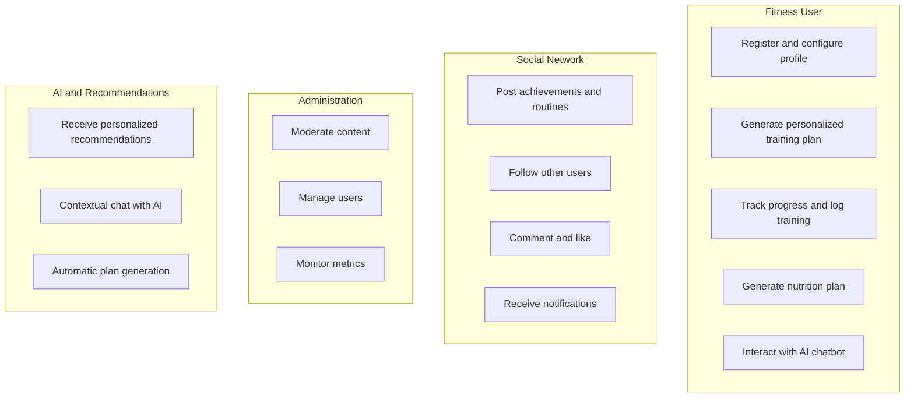
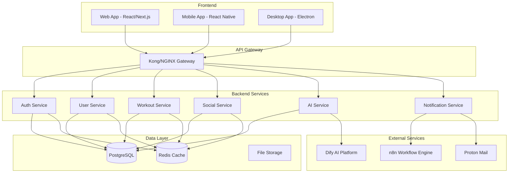
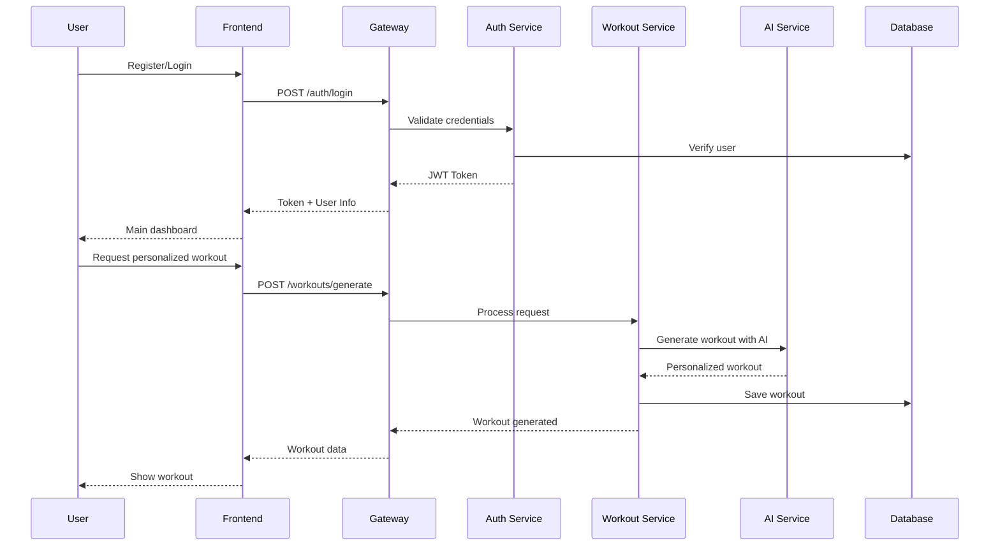
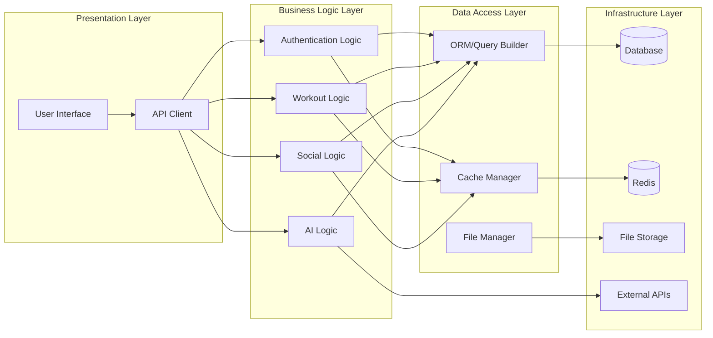

# 1. Project Vision and Scope 🏗️

## Vision
GymPal is a web application (with desktop option via Electron) to manage training and nutrition in a personalized way. Users can generate workout plans and diets tailored to their body type, goals, and pace; share posts with routines, achievements, and recommendations; interact with other users through ratings and comments; and receive help from an AI chatbot and an active recommendation engine.

## Key Objectives
- **Intelligent generation** of personalized workout and diet plans.
- **Fitness social network**: posts, comments, likes, and profile following.
- **AI chatbot** available in the web app per session and as an automated chatbot (n8n) on Telegram/WhatsApp/Gmail.
- **Recommendation system** (Dify AI) for users, workouts, diets, and content.
- **Scalable and secure architecture** with microservices, CI/CD, and observability.

## Academic Requirements and Scope (5 months, 5 IT students)
- Client-server; REST APIs; microservice patterns; Docker containers; Kubernetes.
- Security: OAuth2/OIDC, JWT, HTTPS, Policies, TLS Secrets.
- Integration of external APIs and workflow orchestration with n8n.
- GitOps with ArgoCD; monitoring with Prometheus + Grafana + Promtail.
- Transactional email with Proton Mail; complete technical documentation.
- AI Integration: Chatbot and recommendations with Dify AI; LLM for scheduled generation.
- Optional blockchain service for achievement certification or evidence stamping.

## Main Use Cases

## High-Level Architecture Diagram

## Main User Flow

## System Component Diagram

