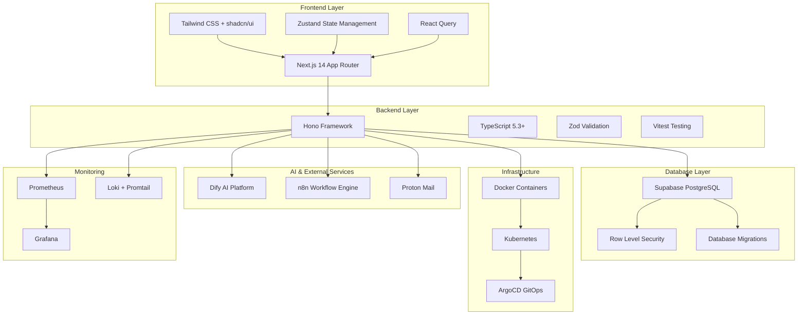
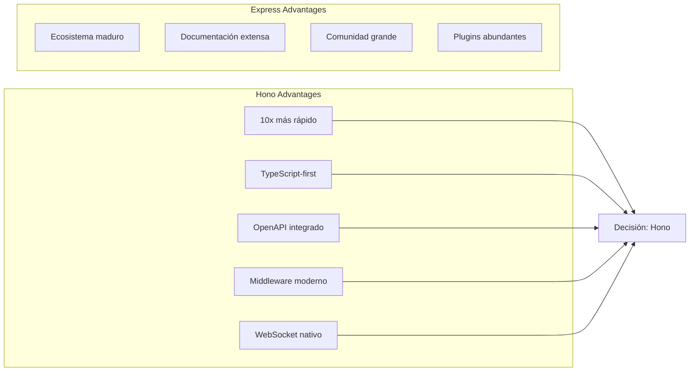
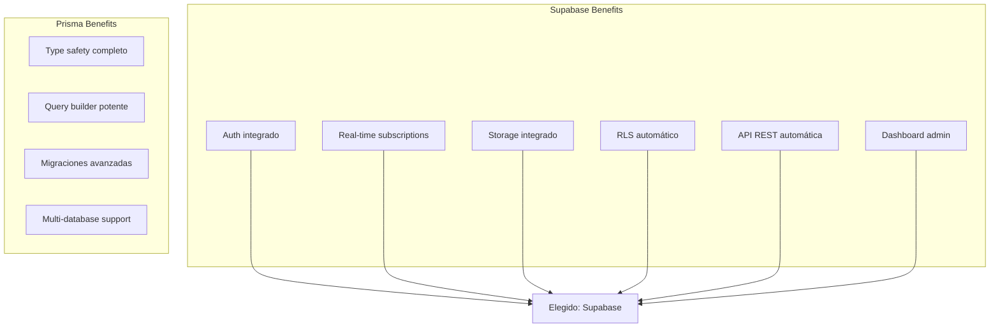

# 2. Proposed Technology Stack 💻

## Mejoras y Correcciones Implementadas

### Correcciones a la Documentación Actual

1. **Inconsistencia en Stack Tecnológico**: Los documentos mencionan tanto casino/blockchain como fitness. Nos enfocamos exclusivamente en GymPal fitness.

2. **Complejidad Innecesaria Inicial**: 
   - Kafka puede ser reemplazado por Redis Pub/Sub inicialmente
   - Service mesh (Istio) es overkill para el MVP
   - Kubernetes puede diferirse hasta fase de producción

3. **Falta de Especificaciones**:
   - No hay esquema detallado de base de datos ejecutable
   - Faltan migraciones iniciales de Supabase
   - No hay ejemplos concretos de implementación de servicios

4. **Mejoras Recomendadas**:
   - Estructura de backend modular y escalable
   - Implementar tipos compartidos para reutilización
   - Definir contratos de API con Zod para validación runtime
   - Configurar testing desde día 1
   - Implementar observabilidad básica (logging estructurado)

## Decisión Final

| Capa | Tecnología | Justificación |
|------|------------|---------------|
| **Frontend** | Next.js 14 (App Router) + Zustand | SSR, SEO, File-based routing |
| **UI Components** | shadcn/ui + Tailwind | Moderno, accesible, customizable |
| **Backend** | Hono + TypeScript | 10x más rápido que Express, TS-first |
| **Database** | Supabase (Postgres) | BaaS completo, Auth integrado |
| **Auth** | Supabase Auth (OAuth2) | OAuth2/OIDC out-of-the-box |
| **Storage** | Supabase Storage | S3-compatible, integrado con Auth |
| **AI Platform** | Dify AI | Orchestración LLM, prompts management |
| **Containerization** | Docker | Standard de facto |
| **Orchestration** | Kubernetes (kind local) | Requisito académico |
| **GitOps** | ArgoCD | Declarative deployments |
| **Monitoring** | Prometheus + Grafana | Metrics y dashboards |
| **Logs** | Loki + Promtail | Agregación de logs |
| **Package Manager** | npm/yarn | Gestión de dependencias |
| **Testing** | Vitest + Supertest | Testing moderno y rápido |
| **Validation** | Zod | Validación runtime type-safe |

## Frontend

- **Next.js 14** (App Router) + **TypeScript**.
- **Tailwind CSS** + **shadcn/ui** para UI moderna y accesible.
- **Auth** con OAuth2/OIDC vía Supabase Auth o Auth.js.
- **Estado**: React Query/Server Actions, Zustand donde convenga.
- **SSR/ISR** para SEO y rendimiento.

## Backend

- **Node.js + TypeScript** con **Hono** para APIs REST y WebSocket.
- **Supabase** (PostgreSQL, Auth, Storage, Realtime) como backend acelerador.
- **n8n** para orquestación de flujos (chatbots en Telegram/WhatsApp, emails, cron).
- **Dify AI** para recomendador y flujos de IA; integración vía API.
- **Proton Mail** (o SMTP compatible) para emails.

## Arquitectura Backend Simplificada

### Estructura del Proyecto Backend (Actualizada)

```
PTI-GymPalBack/
├── src/
│   ├── app.ts                    # Main Hono application setup
│   ├── server.ts                 # Server entry point
│   │
│   ├── core/                     # Core application infrastructure
│   │   ├── config/               # Configuration files
│   │   │   ├── database.ts       # Supabase client configuration
│   │   │   ├── database-helpers.ts # Type-safe DB operation helpers
│   │   │   ├── env.ts            # Environment variables with Zod
│   │   │   └── logger.ts         # Pino logger configuration
│   │   ├── constants/            # Application constants
│   │   │   └── api.ts            # HTTP status codes, error codes
│   │   ├── routes.ts             # Centralized route constants
│   │   ├── types/                # Type definitions
│   │   │   └── database.types.ts # Supabase generated types
│   │   └── utils/                # Utility functions
│   │       ├── response.ts       # Response helpers
│   │       ├── errors.ts         # Custom error classes
│   │       └── auth.ts           # Auth utilities
│   │
│   ├── middleware/               # HTTP middleware
│   │   ├── auth.ts              # Authentication middleware
│   │   ├── error.ts             # Global error handler
│   │   ├── logging.ts           # Request logging with Pino
│   │   ├── validation.ts        # Zod validation middleware
│   │   └── rate-limit.ts         # Rate limiting middleware
│   │
│   ├── modules/                  # Business domain modules
│   │   ├── auth/                # Authentication module
│   │   │   ├── routes.ts         # Route definitions with @openapi
│   │   │   ├── handlers.ts       # HTTP request handlers
│   │   │   ├── service.ts        # Business logic
│   │   │   ├── schemas.ts       # Zod validation schemas
│   │   │   └── types.ts         # TypeScript type definitions
│   │   ├── users/               # User management module
│   │   ├── workouts/            # Workout management module
│   │   ├── exercises/           # Exercise library module
│   │   ├── social/              # Social features module
│   │   ├── dashboard/           # Dashboard analytics module
│   │   ├── personal/            # Personal data module
│   │   └── settings/            # User settings module
│   │
│   └── plugins/                  # Hono plugins
│       ├── health.ts            # Health check plugin
│       └── openapi.ts           # OpenAPI documentation plugin
│
├── supabase/                     # Database configuration
│   └── migrations/               # Database migrations
│       ├── 001_schema.sql        # Database schema
│       ├── 002_rls_policies.sql  # Row Level Security
│       ├── 003_seed_data.sql    # Seed data (optional)
│       └── 004_triggers.sql     # Triggers and database functions
│
├── dist/                         # Compiled TypeScript output
├── Dockerfile                    # Production Docker image
├── docker-compose.yml            # Development environment
├── package.json                  # Dependencies
├── tsconfig.json                 # TypeScript configuration
└── openapi.json                  # OpenAPI specification
```

### Configuración Base

- **Runtime**: Node.js 20 LTS
- **Framework**: Hono (ligero y rápido)
- **TypeScript**: 5.3+ con strict mode
- **ES Modules**: Configuración moderna con `"type": "module"`
- **OpenAPI 3.1**: Documentación automática con Scalar
- **Validación**: Zod para validación robusta de datos

### Arquitectura Actual Implementada

**🏗️ Arquitectura Modular Moderna:**
- **Estructura modular**: Cada módulo contiene routes, handlers, service, schemas, types
- **Core infrastructure**: Configuración centralizada (database, env, logger)
- **Middleware global**: Auth, error handling, logging, validation, rate limiting
- **Plugins**: Health check y OpenAPI documentation integrados
- **Type-safe operations**: Database helpers con TypeScript generics
- **Self-service features**: Account deletion sin service role key (vía database function)
- **OpenAPI integrado**: Documentación automática con @openapi comments
- **Logging estructurado**: Pino para logging JSON estructurado

**📊 Funcionalidades Avanzadas:**
- **Información personal detallada** (edad, peso, altura, BMI, grasa corporal)
- **Objetivos de fitness** (nivel de experiencia, metas, frecuencia)
- **Preferencias dietéticas** (restricciones, alergias, objetivos nutricionales)
- **Rutinas personalizadas** (creación, búsqueda, compartición)
- **Posts sociales avanzados** (tipos, hashtags, trending, búsqueda)
- **Dashboard analítico** (estadísticas, actividad reciente)
- **Configuración de usuario** (notificaciones, privacidad, preferencias)

**🔧 Herramientas de Desarrollo:**
- **Supabase CLI**: Migraciones y tipos generados automáticamente
- **Vitest**: Testing completo con cobertura
- **ESLint + Prettier**: Linting y formateo automático
- **Scripts OpenAPI**: Generación automática de documentación
- **Documentación Interactiva**: Scalar API Reference integrada

## Diagrama de Arquitectura Tecnológica



## Comparación de Tecnologías

### Framework Backend: Hono vs Express



### Base de Datos: Supabase vs Prisma + PostgreSQL



