# 2. Stack Tecnológico Propuesto 💻

## Mejoras y Correcciones Implementadas

### Correcciones a la Documentación Actual

1. **Inconsistencia en Stack Tecnológico**: Los documentos mencionan tanto casino/blockchain como fitness. Nos enfocamos exclusivamente en GymPal fitness.

2. **Complejidad Innecesaria Inicial**: 
   - Kafka puede ser reemplazado por Redis Pub/Sub inicialmente
   - Service mesh (Istio) es overkill para el MVP
   - Kubernetes puede diferirse hasta fase de producción

3. **Falta de Especificaciones**:
   - No hay esquema detallado de base de datos ejecutable
   - Faltan migraciones iniciales de Supabase
   - No hay ejemplos concretos de implementación de servicios

4. **Mejoras Recomendadas**:
   - Estructura de backend modular y escalable
   - Implementar tipos compartidos para reutilización
   - Definir contratos de API con Zod para validación runtime
   - Configurar testing desde día 1
   - Implementar observabilidad básica (logging estructurado)

## Decisión Final

| Capa | Tecnología | Justificación |
|------|------------|---------------|
| **Frontend** | Next.js 14 (App Router) + Zustand | SSR, SEO, File-based routing |
| **UI Components** | shadcn/ui + Tailwind | Moderno, accesible, customizable |
| **Backend** | Hono + TypeScript | 10x más rápido que Express, TS-first |
| **Database** | Supabase (Postgres) | BaaS completo, Auth integrado |
| **Auth** | Supabase Auth (OAuth2) | OAuth2/OIDC out-of-the-box |
| **Storage** | Supabase Storage | S3-compatible, integrado con Auth |
| **AI Platform** | Dify AI | Orchestración LLM, prompts management |
| **Containerization** | Docker | Standard de facto |
| **Orchestration** | Kubernetes (kind local) | Requisito académico |
| **GitOps** | ArgoCD | Declarative deployments |
| **Monitoring** | Prometheus + Grafana | Metrics y dashboards |
| **Logs** | Loki + Promtail | Agregación de logs |
| **Package Manager** | npm/yarn | Gestión de dependencias |
| **Testing** | Vitest + Supertest | Testing moderno y rápido |
| **Validation** | Zod | Validación runtime type-safe |

## Frontend

- **Next.js 14** (App Router) + **TypeScript**.
- **Tailwind CSS** + **shadcn/ui** para UI moderna y accesible.
- **Auth** con OAuth2/OIDC vía Supabase Auth o Auth.js.
- **Estado**: React Query/Server Actions, Zustand donde convenga.
- **SSR/ISR** para SEO y rendimiento.

## Backend

- **Node.js + TypeScript** con **Hono** para APIs REST y WebSocket.
- **Supabase** (PostgreSQL, Auth, Storage, Realtime) como backend acelerador.
- **n8n** para orquestación de flujos (chatbots en Telegram/WhatsApp, emails, cron).
- **Dify AI** para recomendador y flujos de IA; integración vía API.
- **Proton Mail** (o SMTP compatible) para emails.

## Arquitectura Backend Simplificada

### Estructura del Proyecto Backend

```
backend/
├── config/           # Configuración de variables de entorno
│   └── env.ts        # Validación de variables con Zod
├── doc/             # Esquemas de documentación API
│   └── schemas.ts    # Esquemas Zod para validación
├── lib/             # Librerías compartidas
│   ├── db.ts        # Cliente Supabase con helpers
│   ├── auth.ts      # Utilidades de autenticación JWT
│   ├── mailer.ts    # Servicio de email con Nodemailer
│   └── types.ts     # Tipos de base de datos
├── src/
│   ├── routes/      # 🎯 Controladores profesionales (Handlers)
│   │   ├── auth.handler.ts          # Autenticación con OpenAPI docs
│   │   ├── user.handler.ts          # Gestión de usuarios con validación
│   │   ├── workout.handler.ts       # Entrenamientos y ejercicios
│   │   ├── social.handler.ts        # Funcionalidades sociales
│   │   ├── personal.handler.ts      # Información personal del usuario
│   │   ├── routines.handler.ts      # Rutinas personalizadas
│   │   ├── posts.handler.ts         # Posts sociales avanzados
│   │   ├── dashboard.handler.ts     # Analytics y estadísticas
│   │   └── settings.handler.ts      # Configuración de usuario
│   ├── modules/     # 📦 Módulos de funcionalidad (Servicios)
│   │   ├── auth/    # Módulo de autenticación completo
│   │   │   ├── auth.service.ts    # Lógica de negocio
│   │   │   ├── auth.types.ts      # Tipos específicos
│   │   │   └── auth.middleware.ts # Middleware específico
│   │   ├── users/   # Módulo de usuarios completo
│   │   │   ├── user.service.ts    # Lógica de usuarios
│   │   │   ├── user.types.ts      # Tipos de usuarios
│   │   │   └── user.middleware.ts # Validación de usuarios
│   │   ├── workouts/ # Módulo de entrenamientos completo
│   │   │   ├── workout.service.ts    # Lógica de workouts
│   │   │   ├── workout.types.ts      # Tipos de workouts
│   │   │   └── workout.middleware.ts # Validación de workouts
│   │   ├── social/   # Módulo social completo
│   │   │   ├── social.service.ts    # Lógica social
│   │   │   ├── social.types.ts      # Tipos sociales
│   │   │   └── social.middleware.ts # Validación social
│   │   └── ai/       # Módulo de IA (pendiente)
│   ├── shared/      # 🔧 Utilidades compartidas
│   │   ├── middleware/ # Middlewares globales
│   │   │   ├── error.middleware.ts
│   │   │   ├── rate-limit.middleware.ts
│   │   │   └── validation.middleware.ts
│   │   └── utils/   # Utilidades comunes
│   │       ├── helpers.ts
│   │       ├── constants.ts
│   │       └── response.ts
│   └── index.ts     # 🚀 Punto de entrada optimizado
├── supabase/        # Configuración de Supabase
│   ├── migrations/  # Migraciones de base de datos
│   ├── config.toml  # Configuración de Supabase
│   └── seed.sql     # Datos de prueba
├── tests/           # Tests del proyecto
├── docs/            # Documentación del proyecto
│   ├── README.md              # Documentación de la API
│   └── OPENAPI_DOCUMENTATION.md # Resumen de documentación OpenAPI
├── scripts/         # Scripts de utilidad
│   ├── generate-openapi.js          # Generación OpenAPI básica
│   └── generate-complete-openapi-v2.js # Generación OpenAPI completa
├── package.json
├── tsconfig.json
├── vitest.config.ts
├── openapi.json     # Especificación OpenAPI 3.1 
├── env.example      # Variables de entorno de ejemplo
└── Dockerfile
```

### Configuración Base

- **Runtime**: Node.js 20 LTS
- **Framework**: Hono (ligero y rápido)
- **TypeScript**: 5.3+ con strict mode
- **ES Modules**: Configuración moderna con `"type": "module"`
- **OpenAPI 3.1**: Documentación automática con Scalar
- **Validación**: Zod para validación robusta de datos

### Mejoras Implementadas Recientemente

**🏗️ Arquitectura Profesional:**
- **Separación clara**: Controladores (routes) vs Servicios (modules)
- **Handlers profesionales**: Documentación OpenAPI integrada
- **Servicios modulares**: Lógica de negocio encapsulada
- **Middleware especializado**: Validación por módulo
- **Tipos TypeScript**: Completos y consistentes

**📊 Funcionalidades Avanzadas:**
- **Información personal detallada** (edad, peso, altura, BMI, grasa corporal)
- **Objetivos de fitness** (nivel de experiencia, metas, frecuencia)
- **Preferencias dietéticas** (restricciones, alergias, objetivos nutricionales)
- **Rutinas personalizadas** (creación, búsqueda, compartición)
- **Posts sociales avanzados** (tipos, hashtags, trending, búsqueda)
- **Dashboard analítico** (estadísticas, actividad reciente)
- **Configuración de usuario** (notificaciones, privacidad, preferencias)

**🔧 Herramientas de Desarrollo:**
- **Supabase CLI**: Migraciones y tipos generados automáticamente
- **Vitest**: Testing completo con cobertura
- **ESLint + Prettier**: Linting y formateo automático
- **Scripts OpenAPI**: Generación automática de documentación
- **Documentación Interactiva**: Scalar API Reference integrada

## Diagrama de Arquitectura Tecnológica


## Comparación de Tecnologías

### Framework Backend: Hono vs Express

```mermaid
graph LR
  subgraph "Hono Advantages"
    H1[10x más rápido]
    H2[TypeScript-first]
    H3[OpenAPI integrado]
    H4[Middleware moderno]
    H5[WebSocket nativo]
  end
  
  subgraph "Express Advantages"
    E1[Ecosistema maduro]
    E2[Documentación extensa]
    E3[Comunidad grande]
    E4[Plugins abundantes]
  end
  
  H1 --> DECISION[Decisión: Hono]
  H2 --> DECISION
  H3 --> DECISION
  H4 --> DECISION
  H5 --> DECISION
```



### Base de Datos: Supabase vs Prisma + PostgreSQL

```mermaid
graph TB
  subgraph "Supabase Benefits"
    S1[Auth integrado]
    S2[Real-time subscriptions]
    S3[Storage integrado]
    S4[RLS automático]
    S5[API REST automática]
    S6[Dashboard admin]
  end
  
  subgraph "Prisma Benefits"
    P1[Type safety completo]
    P2[Query builder potente]
    P3[Migraciones avanzadas]
    P4[Multi-database support]
  end
  
  S1 --> CHOICE[Elegido: Supabase]
  S2 --> CHOICE
  S3 --> CHOICE
  S4 --> CHOICE
  S5 --> CHOICE
  S6 --> CHOICE
```



