# 3. Software Architecture 🔄

## Capability Map
- **Auth and Profiles**: registration/login, profiles, nutrition/workout goals, body metrics.
- **Training**: exercises, weekly plan, progress tracking, PRs.
- **Nutrition**: diet templates, macros, calories, history.
- **Social**: posts, comments, likes, followers, reporting/moderation.
- **AI Chatbot**: contextual assistant per user (web) and automated flows (n8n).
- **Recommendations**: routine, friend, and content suggestions (Dify AI).
- **Notifications**: email, in-app, and messaging (Telegram/WhatsApp via n8n).

## Logical Diagram (High Level)

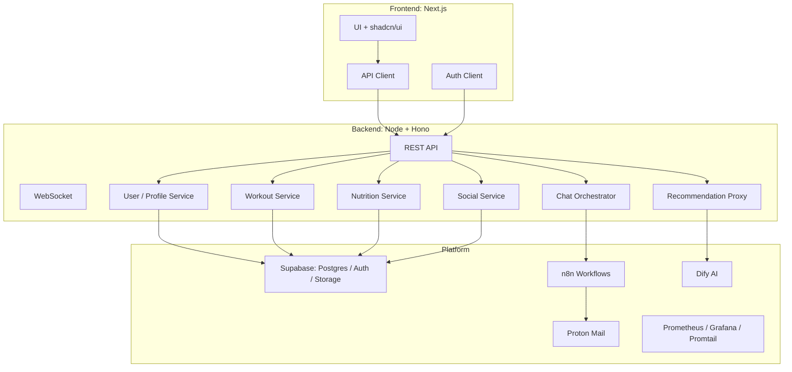
```mermaid
graph TB
  subgraph Frontend ["Frontend: Next.js"]
    UI["UI + shadcn/ui"]
    FEAuth["Auth Client"]
    FEAPI["API Client"]
  end

  subgraph Backend ["Backend: Node + Hono"]
    API["REST API"]
    WS["WebSocket"]
    SVC_USER["User / Profile Service"]
    SVC_WORKOUT["Workout Service"]
    SVC_NUTR["Nutrition Service"]
    SVC_SOCIAL["Social Service"]
    SVC_CHAT["Chat Orchestrator"]
    SVC_REC["Recommendation Proxy"]
  end

  subgraph Platform ["Platform"]
    SUPA["Supabase: Postgres / Auth / Storage"]
    N8N["n8n Workflows"]
    DIFY["Dify AI"]
    MAIL["Proton Mail"]
    OBS["Prometheus / Grafana / Promtail"]
  end

  UI --> FEAPI
  FEAPI --> API
  FEAuth --> API

  API --> SVC_USER --> SUPA
  API --> SVC_WORKOUT --> SUPA
  API --> SVC_NUTR --> SUPA
  API --> SVC_SOCIAL --> SUPA
  API --> SVC_CHAT --> N8N
  API --> SVC_REC --> DIFY
  N8N --> MAIL
```

## Complete Platform Architecture

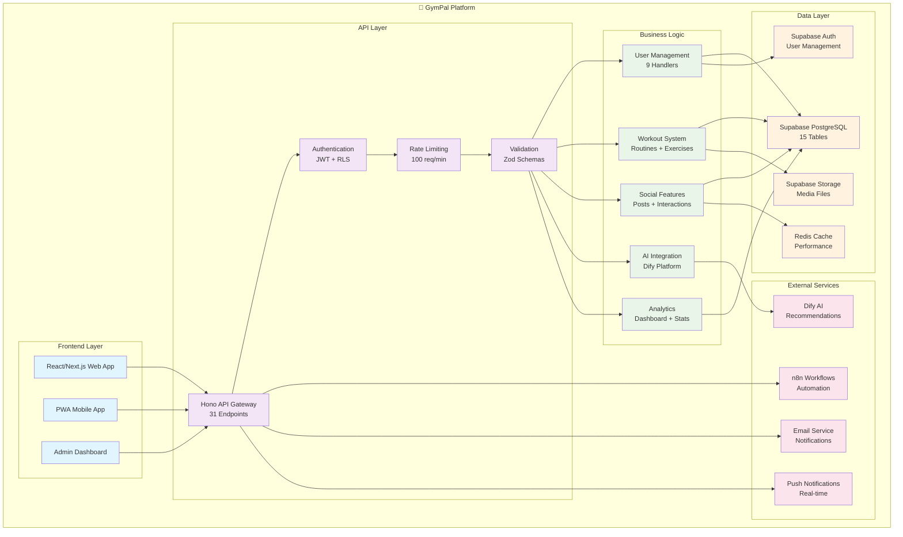
```mermaid
graph TB
    subgraph "🎯 GymPal Platform"
        subgraph "Frontend Layer"
            A[React/Next.js Web App]
            B[PWA Mobile App]
            C[Admin Dashboard]
        end
        
        subgraph "API Layer"
            D[Hono API Gateway<br/>31 Endpoints]
            E[Authentication<br/>JWT + RLS]
            F[Rate Limiting<br/>100 req/min]
            G[Validation<br/>Zod Schemas]
        end
        
        subgraph "Business Logic"
            H[User Management<br/>9 Handlers]
            I[Workout System<br/>Routines + Exercises]
            J[Social Features<br/>Posts + Interactions]
            K[AI Integration<br/>Dify Platform]
            L[Analytics<br/>Dashboard + Stats]
        end
        
        subgraph "Data Layer"
            M[Supabase PostgreSQL<br/>15 Tables]
            N[Supabase Auth<br/>User Management]
            O[Supabase Storage<br/>Media Files]
            P[Redis Cache<br/>Performance]
        end
        
        subgraph "External Services"
            Q[Dify AI<br/>Recommendations]
            R[n8n Workflows<br/>Automation]
            S[Email Service<br/>Notifications]
            T[Push Notifications<br/>Real-time]
        end
    end
    
    %% Connections
    A --> D
    B --> D
    C --> D
    
    D --> E
    E --> F
    F --> G
    G --> H
    G --> I
    G --> J
    G --> K
    G --> L
    
    H --> M
    I --> M
    J --> M
    K --> Q
    L --> M
    
    H --> N
    I --> O
    J --> P
    
    D --> R
    D --> S
    D --> T
    
    %% Styling
    classDef frontend fill:#e1f5fe
    classDef api fill:#f3e5f5
    classDef business fill:#e8f5e8
    classDef data fill:#fff3e0
    classDef external fill:#fce4ec
    
    class A,B,C frontend
    class D,E,F,G api
    class H,I,J,K,L business
    class M,N,O,P data
    class Q,R,S,T external
```

## Design Principles
- Clear domain boundaries by context (user, workout, nutrition, social, ai).
- Stable REST contracts with OpenAPI.
- Read/write separation where necessary (read-mostly caches).
- Security by default: auth at gateway, policies in K8s, least privilege.

## Frontend Architecture (Feature-Slice)

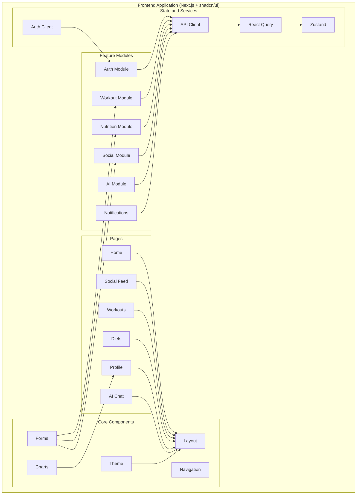
```mermaid
graph TB
  subgraph "Frontend Application (Next.js + shadcn/ui)"
    subgraph "Pages"
      HOME[Home]
      FEED[Social Feed]
      WORKOUTS[Workouts]
      DIETS[Diets]
      PROFILE[Profile]
      CHAT[AI Chat]
    end

    subgraph "Feature Modules"
      AUTH_MOD[Auth Module]
      WORKOUT_MOD[Workout Module]
      NUTR_MOD[Nutrition Module]
      SOCIAL_MOD[Social Module]
      AI_MOD[AI Module]
      NOTIF_MOD[Notifications]
    end

    subgraph "Core Components"
      NAV[Navigation]
      LAYOUT[Layout]
      THEME[Theme]
      FORM[Forms]
      CHARTS[Charts]
    end

    subgraph "State and Services"
      QUERY[React Query]
      STORE[Zustand]
      API_CLIENT[API Client]
      AUTH_CLIENT[Auth Client]
    end
  end

  HOME & FEED & WORKOUTS & DIETS & PROFILE & CHAT --> LAYOUT
  AUTH_MOD & WORKOUT_MOD & NUTR_MOD & SOCIAL_MOD & AI_MOD & NOTIF_MOD --> API_CLIENT
  API_CLIENT --> QUERY
  AUTH_CLIENT --> AUTH_MOD
  QUERY --> STORE
  THEME --> LAYOUT
  FORM --> WORKOUT_MOD & NUTR_MOD & SOCIAL_MOD
  CHARTS --> PROFILE
```

## Frontend Directory Structure

```
frontend/
├── src/
│   ├── app/                    # Next.js App Router
│   │   ├── (auth)/            # Auth routes group
│   │   ├── (dashboard)/       # Protected routes
│   │   ├── layout.tsx
│   │   └── page.tsx
│   ├── components/            # React components
│   │   ├── ui/               # shadcn components
│   │   ├── workout/          # Domain components
│   │   ├── social/
│   │   └── shared/
│   ├── lib/                   # Utilities
│   │   ├── api/              # API client
│   │   ├── auth/             # Auth helpers
│   │   └── utils.ts
│   ├── hooks/                 # Custom React hooks
│   ├── stores/                # Zustand stores
│   └── types/                 # TypeScript types
├── public/
└── package.json
```

## Backend Directory Structure

```
backend/
├── src/
│   ├── index.ts              # Entry point
│   ├── app.ts                # Hono app setup
│   ├── modules/              # Feature modules
│   │   ├── auth/
│   │   │   ├── auth.routes.ts
│   │   │   ├── auth.service.ts
│   │   │   ├── auth.types.ts
│   │   │   └── auth.middleware.ts
│   │   ├── workouts/
│   │   │   ├── workouts.routes.ts
│   │   │   ├── workouts.service.ts
│   │   │   ├── workouts.repository.ts
│   │   │   └── workouts.types.ts
│   │   ├── social/
│   │   └── ai/
│   ├── shared/               # Shared utilities
│   │   ├── db/              # Database client
│   │   ├── middleware/      # Global middleware
│   │   └── utils/
│   └── types/               # Shared types
├── prisma/                   # Prisma schema (optional)
├── tests/
└── package.json
```

## Microservices Communication (async + sync)

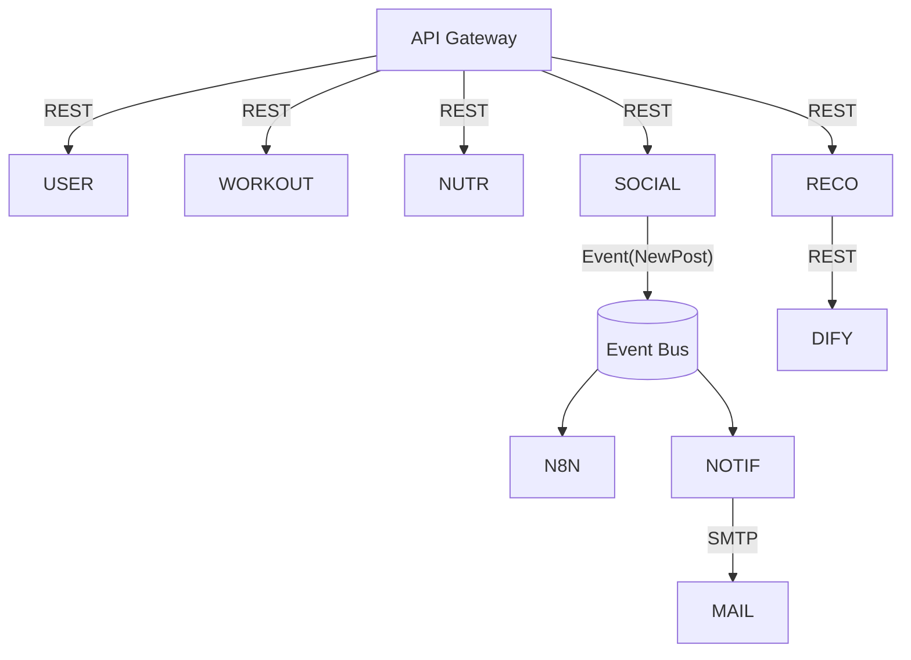
```mermaid
graph TB
  API[API Gateway] -- REST --> USER
  API -- REST --> WORKOUT
  API -- REST --> NUTR
  API -- REST --> SOCIAL
  API -- REST --> RECO
  SOCIAL -- Event(NewPost) --> BUS[(Event Bus)]
  BUS --> N8N
  BUS --> NOTIF
  RECO -- REST --> DIFY
  NOTIF -- SMTP --> MAIL
```

## Event Flow: Workout Progress

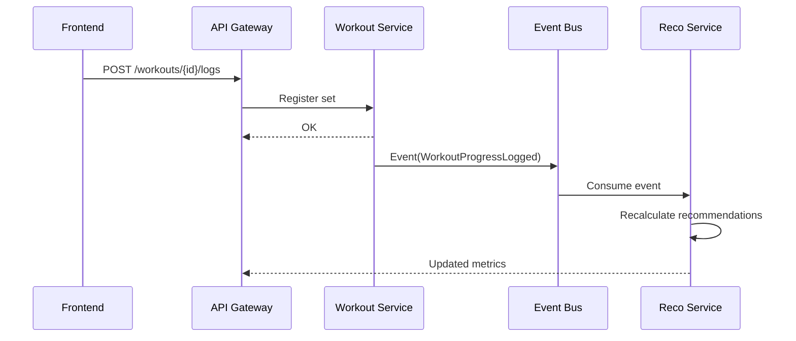
```mermaid
sequenceDiagram
  participant FE as Frontend
  participant API as API Gateway
  participant WO as Workout Service
  participant BUS as Event Bus
  participant RECO as Reco Service
  FE->>API: POST /workouts/{id}/logs
  API->>WO: Register set
  WO-->>API: OK
  WO->>BUS: Event(WorkoutProgressLogged)
  BUS->>RECO: Consume event
  RECO->>RECO: Recalculate recommendations
  RECO-->>API: Updated metrics
```

## User State

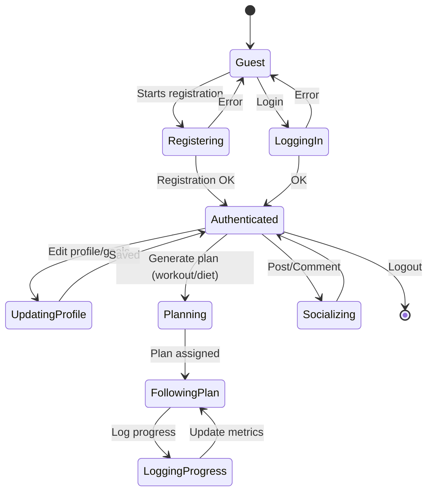
```mermaid
stateDiagram-v2
  [*] --> Guest
  Guest --> Registering: Starts registration
  Registering --> Authenticated: Registration OK
  Registering --> Guest: Error
  Guest --> LoggingIn: Login
  LoggingIn --> Authenticated: OK
  LoggingIn --> Guest: Error
  Authenticated --> UpdatingProfile: Edit profile/goals
  UpdatingProfile --> Authenticated: Saved
  Authenticated --> Planning: Generate plan (workout/diet)
  Planning --> FollowingPlan: Plan assigned
  FollowingPlan --> LoggingProgress: Log progress
  LoggingProgress --> FollowingPlan: Update metrics
  Authenticated --> Socializing: Post/Comment
  Socializing --> Authenticated
  Authenticated --> [*]: Logout
```

## AI Chatbot State

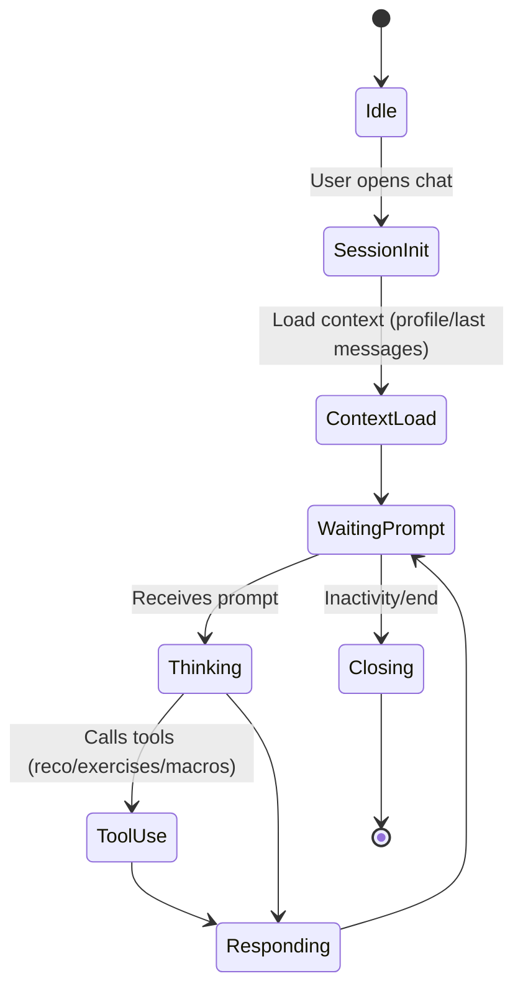
```mermaid
stateDiagram-v2
  [*] --> Idle
  Idle --> SessionInit: User opens chat
  SessionInit --> ContextLoad: Load context (profile/last messages)
  ContextLoad --> WaitingPrompt
  WaitingPrompt --> Thinking: Receives prompt
  Thinking --> ToolUse: Calls tools (reco/exercises/macros)
  ToolUse --> Responding
  Thinking --> Responding
  Responding --> WaitingPrompt
  WaitingPrompt --> Closing: Inactivity/end
  Closing --> [*]
```

## Client-Server Communication (Login + Fetch Data)

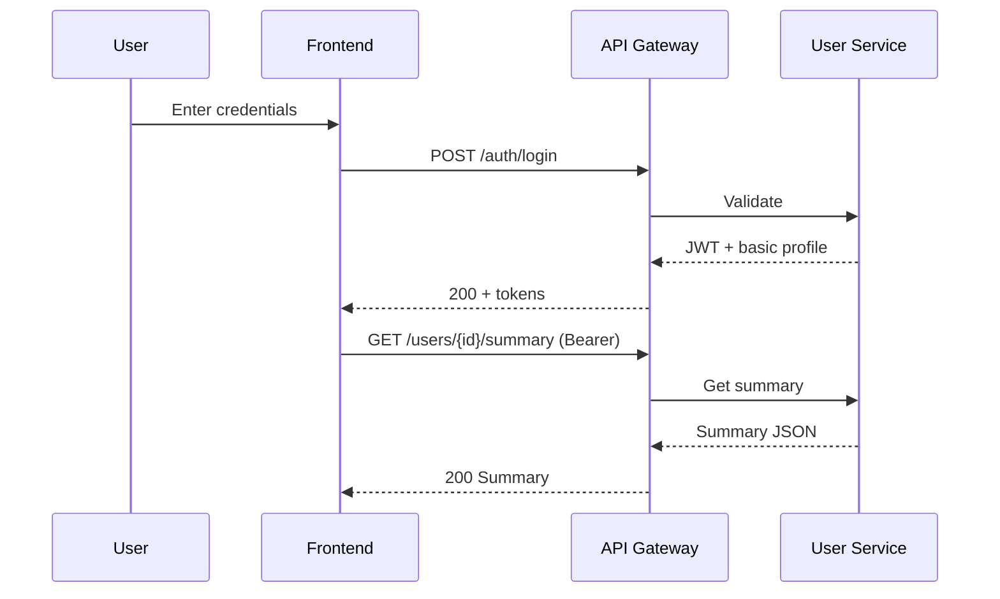
```mermaid
sequenceDiagram
    participant U as User
  participant FE as Frontend
  participant API as API Gateway
    participant US as User Service
  U->>FE: Enter credentials
  FE->>API: POST /auth/login
  API->>US: Validate
  US-->>API: JWT + basic profile
  API-->>FE: 200 + tokens
  FE->>API: GET /users/{id}/summary (Bearer)
  API->>US: Get summary
  US-->>API: Summary JSON
  API-->>FE: 200 Summary
```

## Backend-Frontend Communication (SSR/CSR)

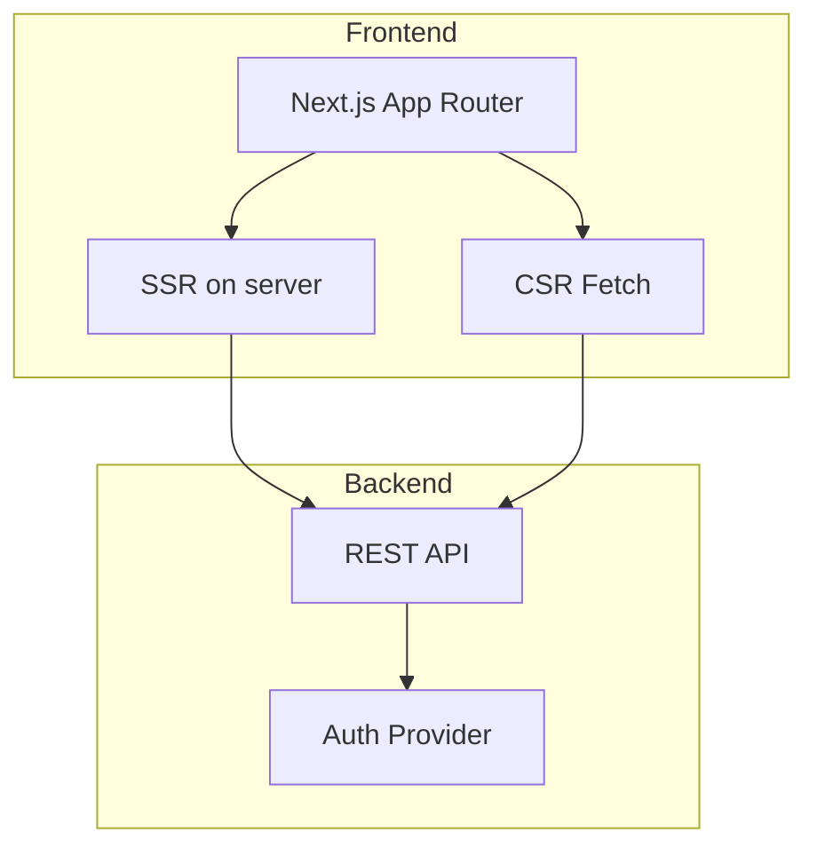
```mermaid
graph TB
  subgraph Frontend
    NEXT[Next.js App Router]
    CSR[CSR Fetch]
    SSR[SSR on server]
  end
  subgraph Backend
    API[REST API]
    AUTH[Auth Provider]
  end
  NEXT --> SSR --> API
  NEXT --> CSR --> API
  API --> AUTH
```

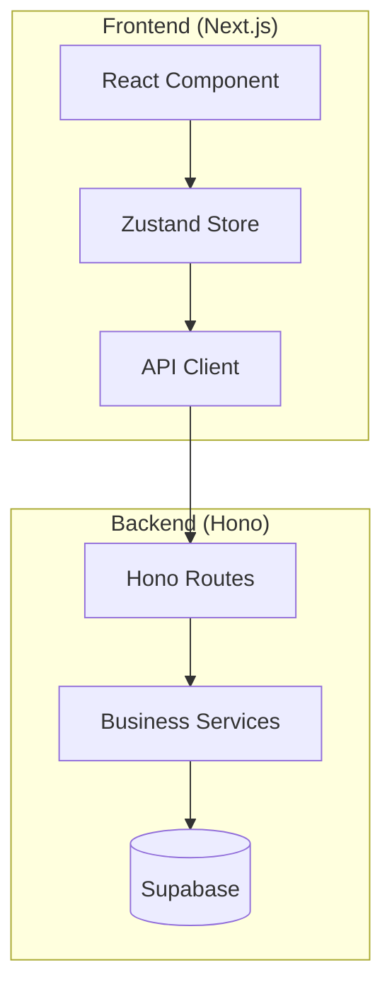
```mermaid
graph TB
    subgraph "Frontend (Next.js)"
        COMPONENT[React Component]
        ZUSTAND[Zustand Store]
        API_CLIENT[API Client]
    end
    
    subgraph "Backend (Hono)"
        ROUTES[Hono Routes]
        SERVICES[Business Services]
        DATABASE[(Supabase)]
    end
    
    COMPONENT --> ZUSTAND
    ZUSTAND --> API_CLIENT
    API_CLIENT --> ROUTES
    ROUTES --> SERVICES
    SERVICES --> DATABASE
```

## Realtime via WebSocket (notifications)

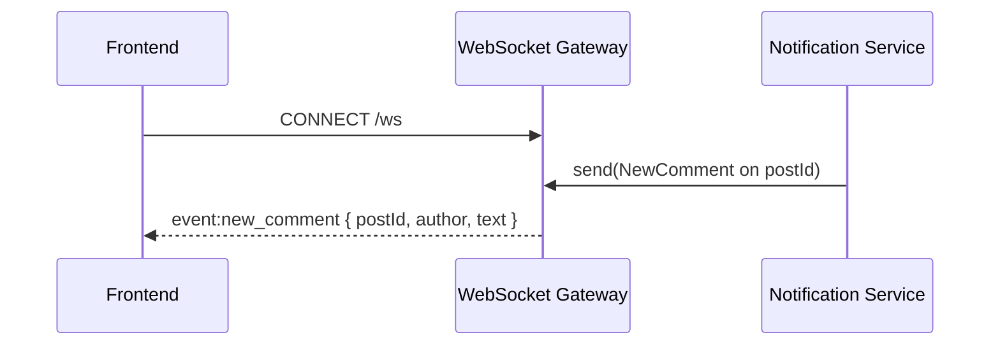
```mermaid
sequenceDiagram
  participant FE as Frontend
  participant WS as WebSocket Gateway
  participant NOTIF as Notification Service
  FE->>WS: CONNECT /ws
  NOTIF->>WS: send(NewComment on postId)
  WS-->>FE: event:new_comment { postId, author, text }
```

## API Request Lifecycle

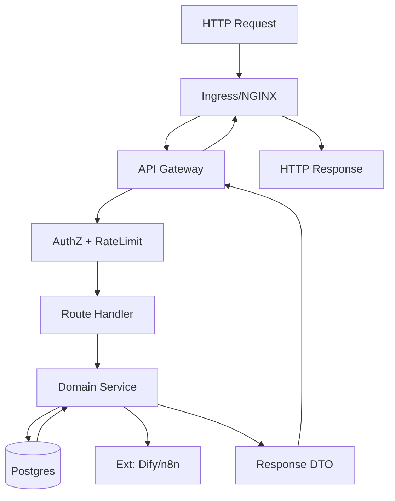
```mermaid
graph TB
  REQ[HTTP Request] --> EDGE[Ingress/NGINX]
  EDGE --> GATE[API Gateway]
  GATE --> AUTHZ[AuthZ + RateLimit]
  AUTHZ --> HANDLER[Route Handler]
  HANDLER --> SERVICE[Domain Service]
  SERVICE --> DB[(Postgres)]
  SERVICE --> EXT[Ext: Dify/n8n]
  DB --> SERVICE
  SERVICE --> RESP[Response DTO]
  RESP --> GATE --> EDGE --> RES[HTTP Response]
```

## Session Lifecycle (tokens)

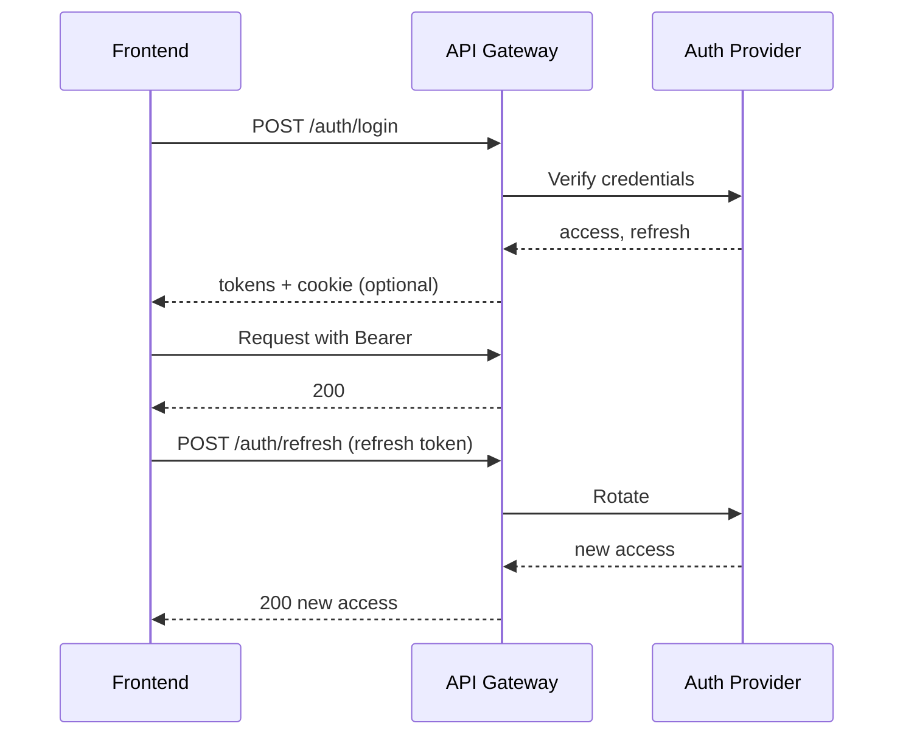
```mermaid
sequenceDiagram
  participant FE as Frontend
  participant API as API Gateway
  participant AUTH as Auth Provider
  FE->>API: POST /auth/login
  API->>AUTH: Verify credentials
  AUTH-->>API: access, refresh
  API-->>FE: tokens + cookie (optional)
  FE->>API: Request with Bearer
  API-->>FE: 200
  FE->>API: POST /auth/refresh (refresh token)
  API->>AUTH: Rotate
  AUTH-->>API: new access
  API-->>FE: 200 new access
```

## Backend Architecture (Layers)

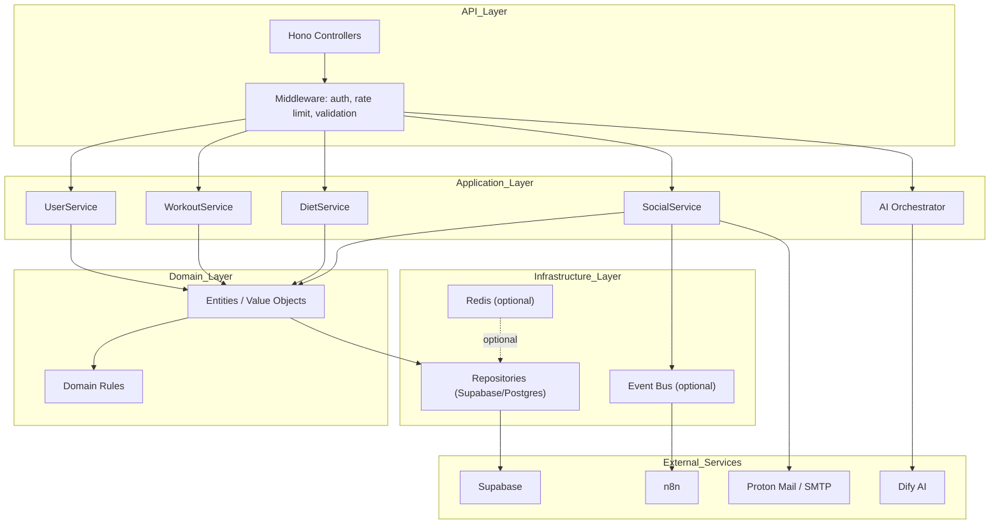
```mermaid
graph TB
  subgraph API_Layer
    HONO[Hono Controllers]
    MIDDLE["Middleware: auth, rate limit, validation"]
  end
  subgraph Application_Layer
    USER_SVC[UserService]
    WORKOUT_SVC[WorkoutService]
    DIET_SVC[DietService]
    SOCIAL_SVC[SocialService]
    AI_SVC[AI Orchestrator]
  end
  subgraph Domain_Layer
    ENTITIES["Entities / Value Objects"]
    RULES[Domain Rules]
  end
  subgraph Infrastructure_Layer
    REPOS["Repositories (Supabase/Postgres)"]
    CACHE["Redis (optional)"]
    MQ["Event Bus (optional)"]
  end
  subgraph External_Services
    SUPA[Supabase]
    DIFY[Dify AI]
    N8N[n8n]
    SMTP["Proton Mail / SMTP"]
  end

  HONO --> MIDDLE
  MIDDLE --> USER_SVC
  MIDDLE --> WORKOUT_SVC
  MIDDLE --> DIET_SVC
  MIDDLE --> SOCIAL_SVC
  MIDDLE --> AI_SVC
  USER_SVC --> ENTITIES
  WORKOUT_SVC --> ENTITIES
  DIET_SVC --> ENTITIES
  SOCIAL_SVC --> ENTITIES
  ENTITIES --> RULES
  ENTITIES --> REPOS
  REPOS --> SUPA
  CACHE -. optional .-> REPOS
  AI_SVC --> DIFY
  SOCIAL_SVC --> MQ
  MQ --> N8N
  SOCIAL_SVC --> SMTP
```

## Detailed Service Communication Flow (with queues)

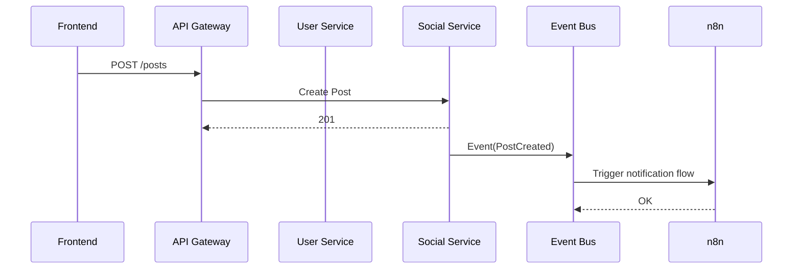
```mermaid
sequenceDiagram
  participant FE as Frontend
    participant API as API Gateway
  participant US as User Service
  participant SO as Social Service
  participant BUS as Event Bus
  participant N8 as n8n
  FE->>API: POST /posts
  API->>SO: Create Post
  SO-->>API: 201
  SO->>BUS: Event(PostCreated)
  BUS->>N8: Trigger notification flow
  N8-->>BUS: OK
```

## AI Recommendation System Flow

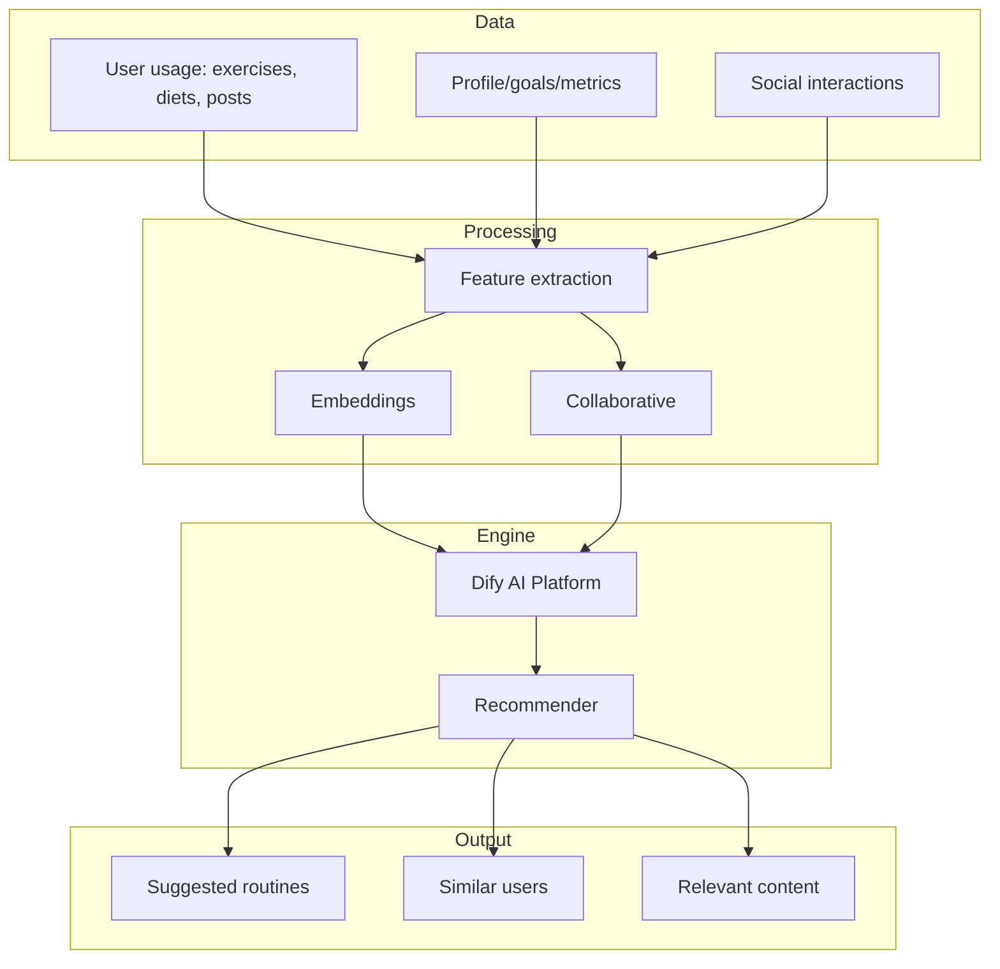
```mermaid
graph TB
  subgraph Data
    USAGE[User usage: exercises, diets, posts]
    PROFILE[Profile/goals/metrics]
    SOCIAL[Social interactions]
  end
  subgraph Processing
    FEATURES[Feature extraction]
    EMB[Embeddings]
    CF[Collaborative]
  end
  subgraph Engine
    DIFY[Dify AI Platform]
    RECO[Recommender]
  end
  subgraph Output
    ROUTINES[Suggested routines]
    FRIENDS[Similar users]
    CONTENT[Relevant content]
  end
  
  USAGE --> FEATURES
  PROFILE --> FEATURES
  SOCIAL --> FEATURES
  FEATURES --> EMB
  FEATURES --> CF
  EMB --> DIFY
  CF --> DIFY
  DIFY --> RECO
  RECO --> ROUTINES
  RECO --> FRIENDS
  RECO --> CONTENT
```

## AUTH Security Validation and Authentication Flow

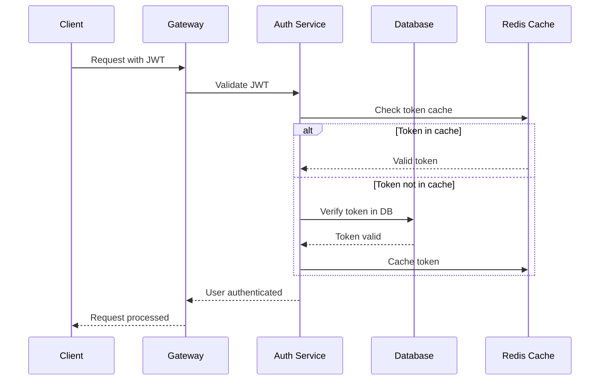
```mermaid
sequenceDiagram
  participant C as Client
  participant G as Gateway
  participant A as Auth Service
  participant DB as Database
  participant R as Redis Cache
  
  C->>G: Request with JWT
  G->>A: Validate JWT
  A->>R: Check token cache
  alt Token in cache
    R-->>A: Valid token
  else Token not in cache
    A->>DB: Verify token in DB
    DB-->>A: Token valid
    A->>R: Cache token
  end
  A-->>G: User authenticated
  G-->>C: Request processed
```

## Real-time Events and WebSocket Communication Flow

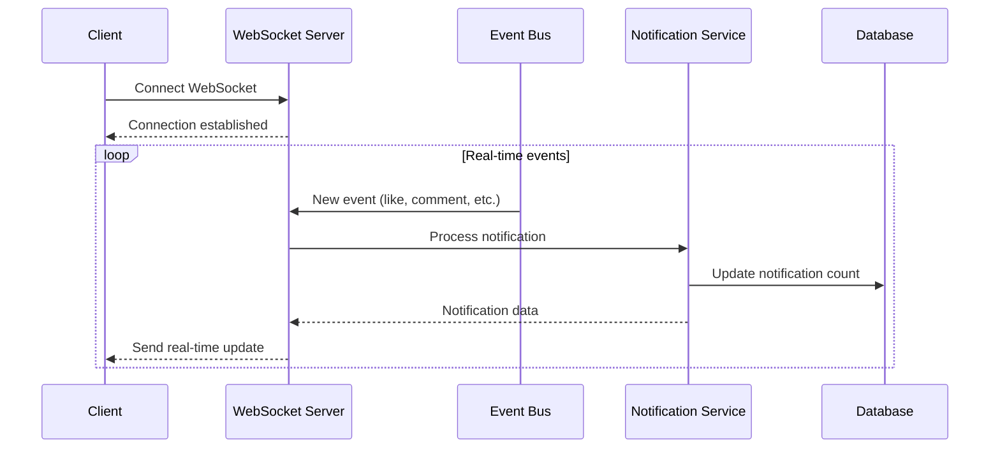
```mermaid
sequenceDiagram
  participant C as Client
  participant WS as WebSocket Server
  participant E as Event Bus
  participant N as Notification Service
  participant DB as Database
  
  C->>WS: Connect WebSocket
  WS-->>C: Connection established
  
  loop Real-time events
    E->>WS: New event (like, comment, etc.)
    WS->>N: Process notification
    N->>DB: Update notification count
    N-->>WS: Notification data
    WS-->>C: Send real-time update
  end
```

## Admin Management and Monitoring Flow

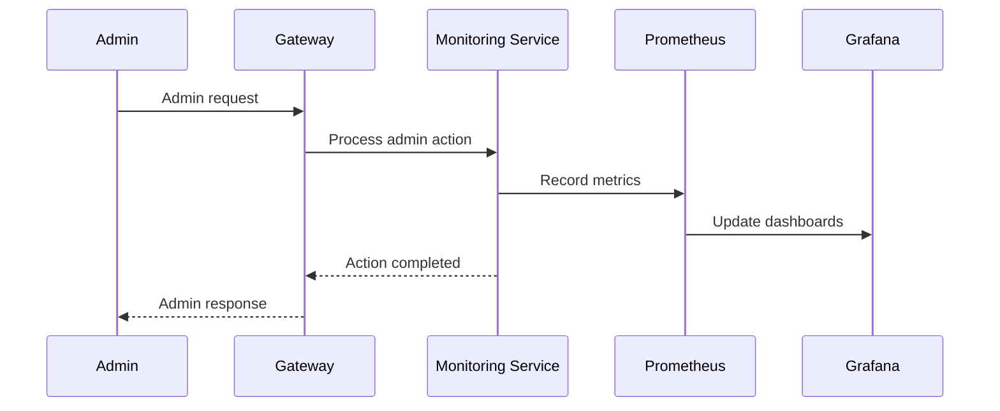
```mermaid
sequenceDiagram
  participant A as Admin
  participant G as Gateway
  participant M as Monitoring Service
  participant P as Prometheus
  participant GR as Grafana
  
  A->>G: Admin request
  G->>M: Process admin action
  M->>P: Record metrics
  P->>GR: Update dashboards
  M-->>G: Action completed
  G-->>A: Admin response
```

## Scalability and Load Balancing Flow

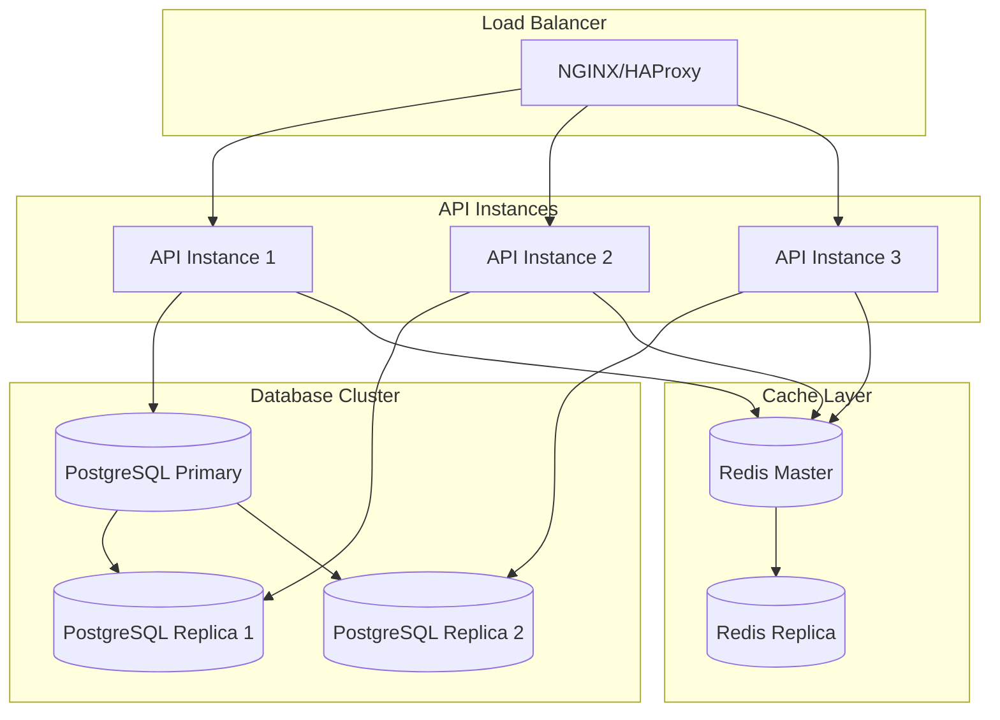
```mermaid
graph TB
  subgraph "Load Balancer"
    LB[NGINX/HAProxy]
  end
  
  subgraph "API Instances"
    API1[API Instance 1]
    API2[API Instance 2]
    API3[API Instance 3]
  end
  
  subgraph "Database Cluster"
    DB1[(PostgreSQL Primary)]
    DB2[(PostgreSQL Replica 1)]
    DB3[(PostgreSQL Replica 2)]
  end
  
  subgraph "Cache Layer"
    REDIS1[(Redis Master)]
    REDIS2[(Redis Replica)]
  end
  
  LB --> API1
  LB --> API2
  LB --> API3
  
  API1 --> DB1
  API2 --> DB2
  API3 --> DB3
  
  API1 --> REDIS1
  API2 --> REDIS1
  API3 --> REDIS1
  
  DB1 --> DB2
  DB1 --> DB3
  REDIS1 --> REDIS2
```
