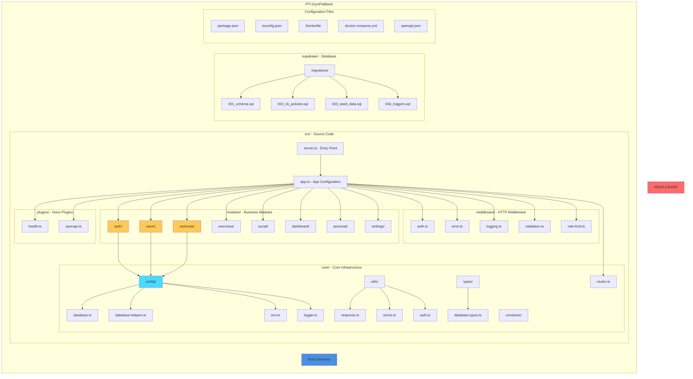
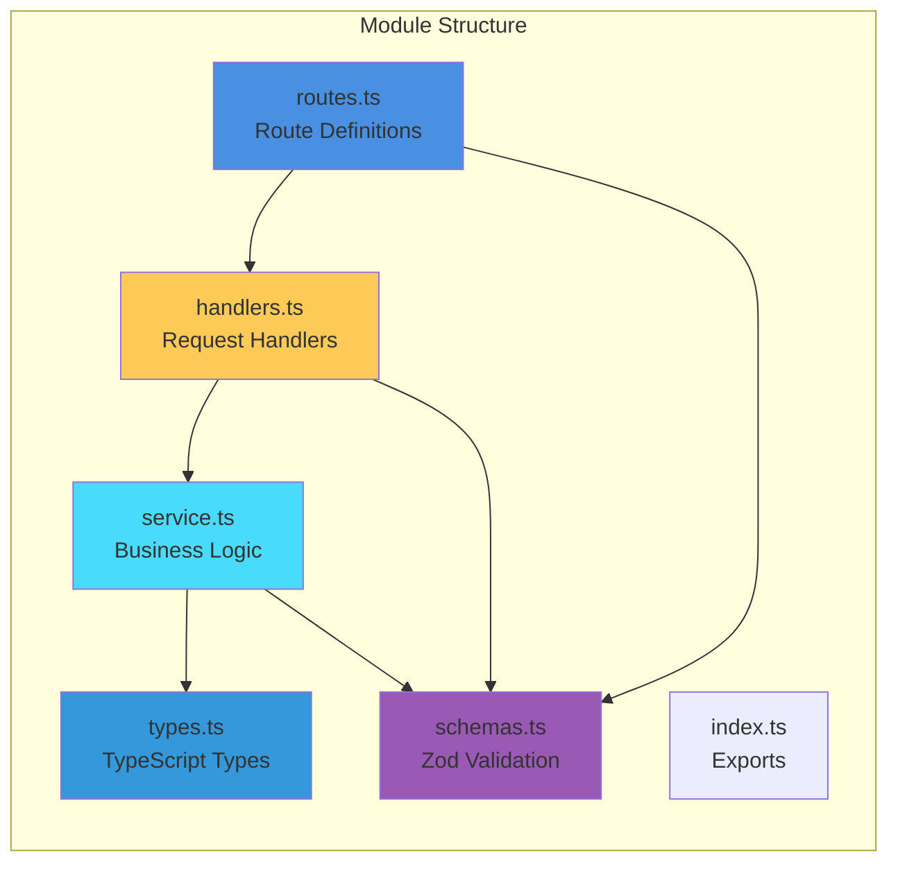
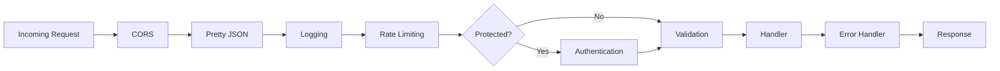

# GymPal Project Structure 🏗️

## 📋 **Table of Contents**

- [Backend Project Structure](#backend-project-structure)
- [Module Structure Pattern](#module-structure-pattern)
- [Core Infrastructure](#core-infrastructure)
- [Middleware System](#middleware-system)
- [Plugin System](#plugin-system)

---

## 🏗️ **Backend Project Structure**

### Complete Structure Diagram



### Detailed Directory Structure

```
PTI-GymPalBack/
├── src/                              # Source code directory
│   ├── app.ts                        # Main Hono application setup
│   ├── server.ts                     # Server entry point
│   │
│   ├── core/                         # Core application infrastructure
│   │   ├── config/                   # Configuration files
│   │   │   ├── database.ts           # Supabase client configuration
│   │   │   ├── database-helpers.ts   # Type-safe DB operation helpers
│   │   │   ├── env.ts                # Environment variables with Zod
│   │   │   ├── logger.ts             # Pino logger configuration
│   │   │   └── index.ts              # Config exports
│   │   │
│   │   ├── constants/                # Application constants
│   │   │   ├── api.ts                # HTTP status codes, error codes, messages
│   │   │   └── index.ts              # Constants exports
│   │   │
│   │   ├── types/                    # Type definitions
│   │   │   ├── database.types.ts     # Supabase generated types
│   │   │   └── index.ts              # Type exports
│   │   │
│   │   ├── utils/                     # Utility functions
│   │   │   ├── response.ts           # Response helpers (sendSuccess, sendError, etc.)
│   │   │   ├── errors.ts             # Custom error classes
│   │   │   ├── auth.ts               # Authentication utilities
│   │   │   ├── auth-errors.ts        # Auth-specific error classes
│   │   │   └── index.ts              # Utils exports
│   │   │
│   │   └── routes.ts                 # Centralized route constants
│   │
│   ├── middleware/                   # HTTP middleware
│   │   ├── auth.ts                   # Authentication middleware
│   │   ├── error.ts                  # Global error handler
│   │   ├── logging.ts                # Request logging with Pino
│   │   ├── validation.ts            # Zod validation middleware
│   │   ├── rate-limit.ts             # Rate limiting middleware
│   │   └── index.ts                  # Middleware exports
│   │
│   ├── modules/                      # Business domain modules
│   │   ├── auth/                     # Authentication module
│   │   │   ├── routes.ts             # Route definitions with @openapi
│   │   │   ├── handlers.ts           # HTTP request handlers
│   │   │   ├── service.ts            # Business logic
│   │   │   ├── schemas.ts            # Zod validation schemas
│   │   │   ├── types.ts              # TypeScript type definitions
│   │   │   └── index.ts              # Module exports
│   │   │
│   │   ├── users/                    # User management module
│   │   │   ├── routes.ts
│   │   │   ├── handlers.ts
│   │   │   ├── service.ts
│   │   │   ├── schemas.ts
│   │   │   ├── types.ts
│   │   │   └── index.ts
│   │   │
│   │   ├── workouts/                 # Workout management module
│   │   ├── exercises/                # Exercise library module
│   │   ├── social/                   # Social features module
│   │   ├── dashboard/                # Dashboard analytics module
│   │   ├── personal/                 # Personal data module
│   │   └── settings/                 # User settings module
│   │
│   └── plugins/                      # Hono plugins
│       ├── health.ts                 # Health check plugin
│       ├── openapi.ts                # OpenAPI documentation plugin
│       └── index.ts                  # Plugin exports
│
├── supabase/                         # Database configuration
│   └── migrations/                   # Database migrations
│       ├── 001_schema.sql            # Database schema
│       ├── 002_rls_policies.sql      # Row Level Security policies
│       ├── 003_seed_data.sql        # Seed data (optional)
│       └── 004_triggers.sql         # Triggers and database functions
│
├── dist/                             # Compiled TypeScript output
├── node_modules/                     # Dependencies
│
├── Dockerfile                        # Production Docker image
├── docker-compose.yml                # Development environment
├── package.json                      # Dependencies and scripts
├── pnpm-lock.yaml                    # Dependency lock file
├── tsconfig.json                     # TypeScript configuration
├── openapi.json                      # OpenAPI specification
└── .env.example                      # Environment variables template
```

---

## 🔧 **Module Structure Pattern**

Each module follows a consistent structure for maintainability:

### Module File Structure



### File Responsibilities

#### 1. **routes.ts**
- Defines HTTP endpoints using Hono router
- Applies middleware (auth, validation)
- Connects routes to handlers
- Includes `@openapi` comments for documentation

```typescript
// Example: src/modules/auth/routes.ts
authRoutes.post(
  AUTH_ROUTES.REGISTER,
  validate(authSchemas.register, 'body'),
  authHandlers.register
);
```

#### 2. **handlers.ts**
- HTTP request handlers
- Extracts data from request context
- Calls service layer
- Formats responses using response utilities
- Handles errors and logs actions

```typescript
// Example: src/modules/auth/handlers.ts
async register(c: Context) {
  const data = c.get('validated') as RegisterData;
  const result = await authService.register(data);
  return sendCreated(c, result, 'User registered successfully');
}
```

#### 3. **service.ts**
- Business logic layer
- Interacts with Supabase database
- Uses type-safe database helpers
- Implements domain-specific rules
- Returns domain models

```typescript
// Example: src/modules/auth/service.ts
async register(data: RegisterData): Promise<AuthResponse> {
  // Business logic here
  const { data: userData } = await supabase.auth.signUp({...});
  return { user, token, refresh_token };
}
```

#### 4. **schemas.ts**
- Zod validation schemas
- Request/response validation
- Type inference for TypeScript

```typescript
// Example: src/modules/auth/schemas.ts
export const authSchemas = {
  register: z.object({
    email: z.string().email(),
    password: z.string().min(8),
    // ...
  })
};
```

#### 5. **types.ts**
- TypeScript type definitions
- Domain models
- Request/response types
- Derived from Zod schemas where applicable

```typescript
// Example: src/modules/auth/types.ts
export type RegisterData = z.infer<typeof authSchemas.register>;
export interface AuthResponse {
  user: User;
  token: string;
  refresh_token: string;
}
```

---

## 🏛️ **Core Infrastructure**

### Configuration (`core/config/`)

#### `database.ts`
- Creates Supabase clients (regular and admin)
- Configures connection settings
- Exports `supabase` and `supabaseAdmin` instances

#### `database-helpers.ts`
- Type-safe database operation helpers
- Functions: `insertRow`, `updateRow`, `upsertRow`, `selectRow`, `selectRows`
- Uses TypeScript generics with `TableInsert`, `TableUpdate`, `TableRow` types
- Avoids unsafe type casts

#### `env.ts`
- Environment variable validation with Zod
- Type-safe environment configuration
- Default values for development
- Exports validated `env` object

#### `logger.ts`
- Pino logger configuration
- Structured JSON logging
- Log levels based on environment
- Request/response logging

### Constants (`core/constants/`)

#### `api.ts`
- HTTP status codes (`HTTP_STATUS`)
- Error codes (`ERROR_CODES`)
- API messages (`API_MESSAGES`)
- Centralized constants for consistency

### Routes (`core/routes.ts`)

- Centralized route constants
- Single source of truth for API paths
- Organized by module
- Type-safe route definitions

```typescript
export const BASE_ROUTES = {
  AUTH: `${API_VERSION}/auth`,
  USERS: `${API_VERSION}/users`,
  // ...
} as const;
```

### Utils (`core/utils/`)

#### `response.ts`
- Response formatting helpers
- `sendSuccess`, `sendCreated`, `sendUpdated`, `sendDeleted`
- `sendError`, `sendNotFound`, `sendUnauthorized`
- Consistent response format across all endpoints

#### `errors.ts`
- Custom error classes
- `AppError` base class
- Domain-specific error types
- Error serialization

#### `auth.ts`
- Authentication utilities
- `verifySupabaseToken` - Token verification
- `extractToken` - Extract token from headers

### Types (`core/types/`)

#### `database.types.ts`
- Supabase generated types
- Helper types: `TableRow<T>`, `TableInsert<T>`, `TableUpdate<T>`
- Used throughout the application for type safety

---

## 🔄 **Middleware System**

### Middleware Stack Order



### Middleware Details

#### 1. **auth.ts** - Authentication Middleware
- Verifies JWT tokens
- Extracts user information
- Adds user to request context
- Protects routes

#### 2. **error.ts** - Global Error Handler
- Catches all errors
- Logs error details
- Formats error responses
- Handles different error types (HTTPException, AppError, ZodError, JWT errors)

#### 3. **logging.ts** - Request Logging
- Logs all incoming requests
- Logs responses and status codes
- Structured logging with Pino
- Request duration tracking

#### 4. **validation.ts** - Request Validation
- Validates request body, query, params using Zod
- Extracts validated data to context
- Returns validation errors if invalid

#### 5. **rate-limit.ts** - Rate Limiting
- Prevents API abuse
- Configurable window and max requests
- Uses in-memory store (Redis for production)

---

## 🔌 **Plugin System**

### Available Plugins

#### 1. **health.ts** - Health Check Plugin
- Endpoint: `GET /health`
- Returns server status
- Useful for monitoring and load balancers

#### 2. **openapi.ts** - OpenAPI Documentation
- Endpoint: `GET /reference` - Interactive API docs (Scalar)
- Endpoint: `GET /openapi.json` - OpenAPI specification
- Auto-generated from `@openapi` comments in routes

---

## 📦 **Module Examples**

### Auth Module Structure

```
auth/
├── routes.ts          # Defines: /register, /login, /logout, etc.
├── handlers.ts        # register(), login(), logout() handlers
├── service.ts         # register(), login() business logic
├── schemas.ts         # RegisterSchema, LoginSchema
├── types.ts           # RegisterData, LoginData, AuthResponse
└── index.ts           # Exports module
```

### Users Module Structure

```
users/
├── routes.ts          # Defines: /profile, /:id, /search
├── handlers.ts        # getProfile(), updateProfile(), search()
├── service.ts         # getProfile(), updateProfile() business logic
├── schemas.ts         # UpdateProfileSchema, SearchSchema
├── types.ts           # UpdateProfileData, UserProfile
└── index.ts           # Exports module
```

---

## 🔑 **Key Patterns**

### 1. Type-Safe Database Operations

```typescript
// Instead of:
const { data } = await supabase.from('profiles').insert(data as any);

// Use:
const { data } = await insertRow('profiles', profileData);
```

### 2. Centralized Route Constants

```typescript
// In routes.ts:
authRoutes.delete(
  AUTH_ROUTES.DELETE_ACCOUNT,
  auth,
  authHandlers.deleteAccount
);
```

### 3. Consistent Response Format

```typescript
// All responses follow the same structure:
{
  success: boolean,
  message?: string,
  data?: T,
  error?: { code, message, details },
  metadata?: { timestamp }
}
```

### 4. Error Handling

```typescript
// Handlers throw errors, middleware catches them:
try {
  const result = await service.operation();
  return sendSuccess(c, result);
} catch (error) {
  // Error middleware handles formatting
  throw error;
}
```

---

## 📝 **Development Workflow**

### Adding a New Module

1. Create module directory: `src/modules/new-module/`
2. Create files: `routes.ts`, `handlers.ts`, `service.ts`, `schemas.ts`, `types.ts`, `index.ts`
3. Add routes to `src/core/routes.ts`
4. Register module in `src/app.ts`
5. Add OpenAPI documentation comments
6. Implement business logic

### Adding a New Endpoint

1. Define route constant in module's route structure
2. Add route definition in `routes.ts` with OpenAPI comments
3. Create handler in `handlers.ts`
4. Implement service method in `service.ts`
5. Define Zod schema in `schemas.ts`
6. Add types in `types.ts`

---

**Documentation Version**: 2.0.0  
**Last Updated**: October 2025
