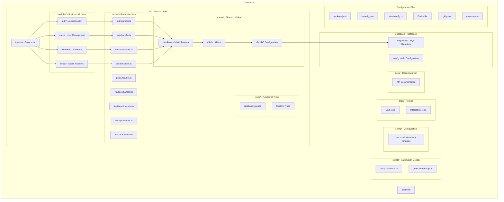
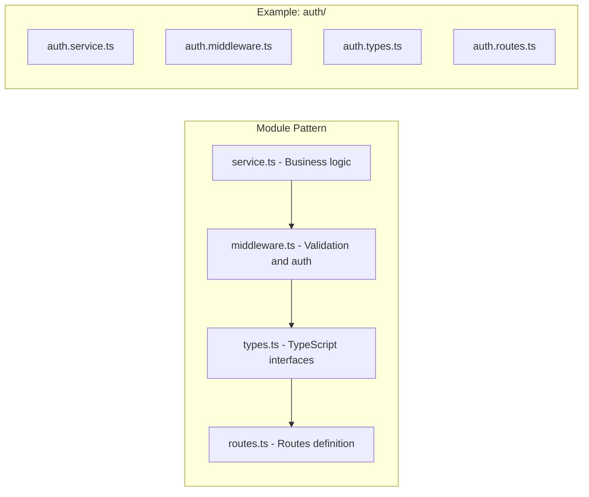

# GymPal Project Structure 🏗️

## 📋 **Table of Contents**

- [Actual Backend Project Structure](#actual-backend-project-structure)
- [Actual Frontend Project Structure](#actual-frontend-project-structure)
- [Backend Module Pattern](#backend-module-pattern)
- [Frontend Architecture with App Router](#frontend-architecture-with-app-router)

---

## 🏗️ **Actual Backend Project Structure**

### Structure Diagram

### Structure Details

#### **📁 src/modules/ - Business Modules**

Each module follows the **Service-Middleware-Types** pattern:

- **`auth/`**: Authentication and Authorization
  - `auth.service.ts` - Business logic
  - `auth.middleware.ts` - Validation and middleware
  - `auth.types.ts` - TypeScript interfaces
  - `auth.routes.ts` - Route definitions

- **`users/`**: User Management
  - `user.service.ts` - Business logic
  - `user.middleware.ts` - Validation and middleware
  - `user.types.ts` - TypeScript interfaces

- **`workouts/`**: Workouts
  - `workout.service.ts` - Business logic
  - `workout.middleware.ts` - Validation and middleware
  - `workout.types.ts` - TypeScript interfaces

- **`social/`**: Social Features
  - `social.service.ts` - Business logic
  - `social.middleware.ts` - Validation and middleware
  - `social.types.ts` - TypeScript interfaces

#### **📁 src/routes/ - Route Handlers**

- **`auth.handler.ts`**: Authentication endpoints
- **`user.handler.ts`**: User endpoints
- **`workout.handler.ts`**: Workout endpoints
- **`social.handler.ts`**: Social endpoints
- **`posts.handler.ts`**: Posts endpoints
- **`routines.handler.ts`**: Routines endpoints
- **`dashboard.handler.ts`**: Dashboard endpoints
- **`settings.handler.ts`**: Settings endpoints
- **`personal.handler.ts`**: Personal info endpoints

#### **📁 src/shared/ - Shared Utilities**

- **`db/`**: Database configuration
- **`middleware/`**: Shared middlewares
  - `auth.middleware.ts` - Authentication
  - `error.middleware.ts` - Error handling
  - `rate-limit.middleware.ts` - Rate limiting
  - `validation.middleware.ts` - Validation
- **`utils/`**: General utilities
  - `arrays.ts`, `cache.ts`, `config.ts`, `constants.ts`
  - `database.ts`, `dates.ts`, `email.ts`, `errors.ts`
  - `files.ts`, `helpers.ts`, `logger.ts`, `logs.ts`
  - `middleware.ts`, `numbers.ts`, `objects.ts`, `pagination.ts`
  - `promises.ts`, `response.ts`, `security.ts`, `storage.ts`
  - `strings.ts`, `testing.ts`, `validation.ts`, `validators.ts`

#### **📁 supabase/ - Database**

- **`config.toml`**: Local Supabase configuration
- **`migrations/`**: SQL migrations
  - `001_initial_schema.sql` - Initial schema
  - `002_rls_policies.sql` - RLS Policies
  - `003_seed_data.sql` - Seed data
  - `004_personal_info_and_enhanced_features.sql` - Advanced features

#### **📁 scripts/ - Automation Scripts**

- **`setup-database.sh`**: Initial DB setup
- **`generate-openapi.js`**: Unified OpenAPI documentation generation

**OpenAPI Simplification:**
- ✅ **Single script**: `generate-openapi.js` replaces the previous two
- ✅ **Single command**: `npm run docs:generate` to generate all documentation
- ✅ **Full specification**: Includes all endpoints, schemas, and tags

---

## 🎨 **Frontend Project Structure**

### Structure Diagram

```mermaid
graph TB  
  subgraph "frontend/"
    ROOT["frontend/"]
    
    subgraph "src/ - Source Code"
      APP["app/ - App Router (Next.js 14)"]
      
      subgraph "app/ - App Router"
        LAYOUT["layout.tsx - Main layout"]
        PAGE["page.tsx - Main page"]
        GLOBAL_CSS["globals.css - Global styles"]
        
        subgraph "auth/ - Authentication"
          LOGIN_PAGE["login/page.tsx"]
          REGISTER_PAGE["register/page.tsx"]
          AUTH_LAYOUT["auth/layout.tsx"]
        end
        
        subgraph "dashboard/ - Main Dashboard"
          DASHBOARD_PAGE["dashboard/page.tsx"]
          DASHBOARD_LAYOUT["dashboard/layout.tsx"]
        end
        
        subgraph "workouts/ - Workouts"
          WORKOUTS_PAGE["workouts/page.tsx"]
          WORKOUT_DETAIL["workouts/[id]/page.tsx"]
          WORKOUT_CREATE["workouts/create/page.tsx"]
        end
        
        subgraph "social/ - Social Network"
          SOCIAL_PAGE["social/page.tsx"]
          POST_DETAIL["social/posts/[id]/page.tsx"]
          PROFILE_PAGE["social/profile/[id]/page.tsx"]
        end
        
        subgraph "api/ - API Routes"
          AUTH_API["api/auth/[...nextauth]/route.ts"]
          WORKOUT_API["api/workouts/route.ts"]
          SOCIAL_API["api/social/route.ts"]
        end
      end
      
      subgraph "components/ - Reusable Components"
        UI["ui/ - shadcn/ui components"]
        FORMS["forms/ - Forms"]
        LAYOUTS["layouts/ - Specific layouts"]
        
        subgraph "ui/ - Base Components"
          BUTTON["button.tsx"]
          INPUT["input.tsx"]
          CARD["card.tsx"]
          DIALOG["dialog.tsx"]
          TOAST["toast.tsx"]
        end
        
        subgraph "forms/ - Forms"
          LOGIN_FORM["LoginForm.tsx"]
          WORKOUT_FORM["WorkoutForm.tsx"]
          POST_FORM["PostForm.tsx"]
        end
      end
      
      subgraph "lib/ - Utilities and Configuration"
        AUTH_CONFIG["auth.ts - Auth.js config"]
        API_CLIENT["api-client.ts - API client"]
        UTILS["utils.ts - General utilities"]
        VALIDATIONS["validations.ts - Zod schemas"]
        CONSTANTS["constants.ts - Constants"]
      end
      
      subgraph "hooks/ - Custom Hooks"
        USE_AUTH["useAuth.ts"]
        USE_WORKOUTS["useWorkouts.ts"]
        USE_SOCIAL["useSocial.ts"]
        USE_API["useApi.ts"]
      end
      
      subgraph "stores/ - Global State (Zustand)"
        AUTH_STORE["authStore.ts"]
        WORKOUT_STORE["workoutStore.ts"]
        SOCIAL_STORE["socialStore.ts"]
        UI_STORE["uiStore.ts"]
      end
      
      subgraph "types/ - TypeScript Types"
        API_TYPES["api.types.ts"]
        COMPONENT_TYPES["component.types.ts"]
        STORE_TYPES["store.types.ts"]
      end
    end
    
    subgraph "public/ - Static Files"
      IMAGES["images/ - Images"]
      ICONS["icons/ - Icons"]
      FONTS["fonts/ - Custom fonts"]
    end
    
    subgraph "styles/ - Styles"
      GLOBAL_CSS["globals.css"]
      COMPONENTS_CSS["components.css"]
      UTILITIES_CSS["utilities.css"]
    end
    
    subgraph "tests/ - Testing"
      UNIT_TESTS["__tests__/ - Unit tests"]
      E2E_TESTS["e2e/ - E2E tests"]
      TEST_UTILS["test-utils.tsx"]
    end
    
    subgraph "Configuration Files"
      PACKAGE["package.json"]
      NEXT_CONFIG["next.config.js"]
      TAILWIND_CONFIG["tailwind.config.js"]
      TSCONFIG["tsconfig.json"]
      ESLINT_CONFIG[".eslintrc.json"]
      PRETTIER_CONFIG[".prettierrc"]
      PLAYWRIGHT_CONFIG["playwright.config.ts"]
    end
  end
  
  %% Main relations
  LAYOUT --> AUTH_PAGE
  LAYOUT --> DASHBOARD_PAGE
  LAYOUT --> WORKOUTS_PAGE
  LAYOUT --> SOCIAL_PAGE
  
  AUTH_PAGE --> LOGIN_FORM
  WORKOUTS_PAGE --> WORKOUT_FORM
  SOCIAL_PAGE --> POST_FORM
  
  LOGIN_FORM --> AUTH_STORE
  WORKOUT_FORM --> WORKOUT_STORE
  POST_FORM --> SOCIAL_STORE
  
  AUTH_STORE --> API_CLIENT
  WORKOUT_STORE --> API_CLIENT
  SOCIAL_STORE --> API_CLIENT
  
  API_CLIENT --> AUTH_API
  API_CLIENT --> WORKOUT_API
  API_CLIENT --> SOCIAL_API
```

### Frontend Structure Details

#### **📁 app/ - App Router (Next.js 14)**

**App Router Structure:**
- **`app/layout.tsx`**: Root layout with global providers
- **`app/page.tsx`**: Main page (landing/home)
- **`app/globals.css`**: Global styles using Tailwind CSS

**Feature-based Routing:**
- **`app/auth/`**: Authentication pages (login, register)
- **`app/dashboard/`**: Main user dashboard
- **`app/workouts/`**: Workouts management
- **`app/social/`**: Social network and posts
- **`app/api/`**: Next.js API routes

#### **📁 components/ - Reusable Components**

**Component Architecture:**
- **`components/ui/`**: shadcn/ui base components
- **`components/forms/`**: Feature-specific forms
- **`components/layouts/`**: Specific layouts

#### **📁 lib/ - Utilities and Configuration**

- **`auth.ts`**: Auth.js configuration
- **`api-client.ts`**: Centralized API client
- **`utils.ts`**: General utilities
- **`validations.ts`**: Zod schemas for validation
- **`constants.ts`**: Application constants

#### **📁 stores/ - Global State (Zustand)**

- **`authStore.ts`**: Authentication state
- **`workoutStore.ts`**: Workouts state
- **`socialStore.ts`**: Social features state
- **`uiStore.ts`**: UI state

#### **📁 hooks/ - Custom Hooks**

- **`useAuth.ts`**: Authentication hook
- **`useWorkouts.ts`**: Workouts hook
- **`useSocial.ts`**: Social features hook
- **`useApi.ts`**: API calls hook

---

## 🔧 **Backend Module Pattern**

### Pattern Diagram

### Per-Module Structure

Each backend module follows this consistent pattern:

1. **`service.ts`**: Contains all business logic
2. **`middleware.ts`**: Validations, authentication, and module-specific middleware
3. **`types.ts`**: Interfaces, types, and module-specific DTOs
4. **`routes.ts`**: Route and endpoint definitions (optional, could be in handler)
