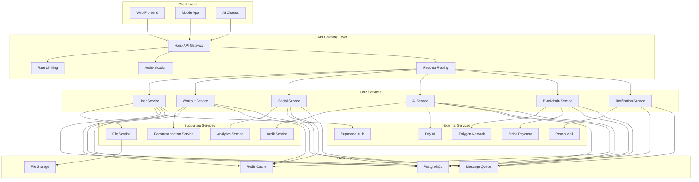
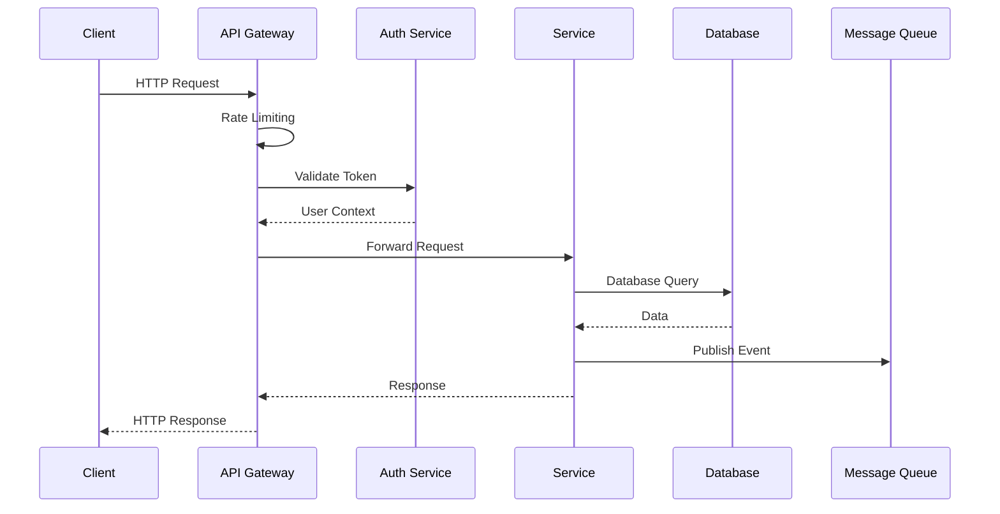
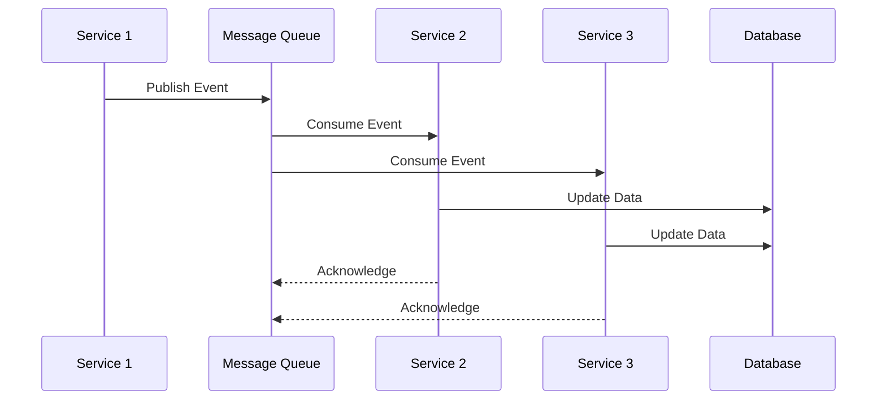
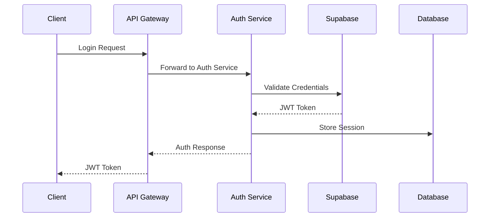

# Backend Architecture Documentation

## Table of Contents

1. [Architectural Overview](#architectural-overview)
2. [Technology Stack](#technology-stack)
3. [Microservices Architecture](#microservices-architecture)
4. [API Gateway Design](#api-gateway-design)
5. [Service Communication Patterns](#service-communication-patterns)
6. [Data Flow and Integration](#data-flow-and-integration)
7. [Security Architecture](#security-architecture)
8. [Scalability and Performance](#scalability-and-performance)
9. [Monitoring and Observability](#monitoring-and-observability)
10. [Deployment and DevOps](#deployment-and-devops)

---

## Architectural Overview

### Project Context
**FitnessHub Backend** is a comprehensive microservices-based backend system designed to support a fitness/gym management platform with social networking features and AI-powered personal assistant capabilities. The system serves as the foundation for a 5-person student team project spanning 5 months, focusing on robust, scalable, and maintainable architecture.

### Architecture Principles

#### 1. Microservices Architecture
- **Service Independence**: Each microservice operates independently with its own database and business logic
- **Domain-Driven Design**: Services are organized around business domains (User, Workout, Social, AI, etc.)
- **Loose Coupling**: Services communicate through well-defined APIs and message queues
- **High Cohesion**: Each service focuses on a specific business capability

#### 2. API-First Design
- **RESTful APIs**: Standard HTTP methods and status codes
- **OpenAPI Specification**: Comprehensive API documentation with Swagger/OpenAPI 3.0
- **Versioning Strategy**: Semantic versioning for API endpoints
- **Consistent Response Format**: Standardized error handling and response structure

#### 3. Event-Driven Architecture
- **Asynchronous Communication**: Event-driven patterns for non-critical operations
- **Event Sourcing**: Audit trail and state reconstruction capabilities
- **CQRS**: Command Query Responsibility Segregation for read/write optimization
- **Eventual Consistency**: Acceptable for non-critical business operations

### Technology Justification

#### Hono Framework
- **Performance**: Ultra-fast HTTP framework built on Web Standards
- **TypeScript Native**: First-class TypeScript support with excellent type inference
- **Middleware Ecosystem**: Rich middleware support for authentication, validation, and logging
- **Edge Runtime**: Compatible with edge computing platforms
- **Lightweight**: Minimal overhead compared to Express.js

#### Node.js Runtime
- **JavaScript Ecosystem**: Leverages existing team expertise
- **NPM Package Manager**: Rich ecosystem of packages and libraries
- **Event-Driven**: Non-blocking I/O for high concurrency
- **Community Support**: Large community and extensive documentation

---

## Technology Stack

### Core Technologies
- **Runtime**: Node.js 18+ with TypeScript 5+
- **Framework**: Hono (API Gateway and microservices)
- **Database**: PostgreSQL 15+ (primary), Redis 7+ (caching)
- **Message Queue**: Apache Kafka or Redis Streams
- **Authentication**: Supabase Auth + JWT
- **File Storage**: AWS S3 or MinIO (self-hosted)

### Development Tools
- **Language**: TypeScript with strict mode
- **Validation**: Zod for runtime type validation
- **Testing**: Jest + Supertest for API testing
- **Linting**: ESLint + Prettier
- **Documentation**: OpenAPI 3.0 + Swagger UI

### Infrastructure
- **Containerization**: Docker + Docker Compose
- **Orchestration**: Kubernetes
- **Service Mesh**: Istio (optional)
- **API Gateway**: Hono + Kong (optional)
- **Monitoring**: Prometheus + Grafana
- **Logging**: ELK Stack (Elasticsearch, Logstash, Kibana)

---

## Microservices Architecture

### Service Overview



### Service Responsibilities

#### 1. User Service
- **Domain**: User management and profiles
- **Responsibilities**:
  - User registration and authentication
  - Profile management and preferences
  - User statistics and achievements
  - Privacy settings and data export
- **Database**: `users` schema in PostgreSQL
- **APIs**: `/api/v1/users/*`

#### 2. Workout Service
- **Domain**: Workout and exercise management
- **Responsibilities**:
  - Workout creation and templates
  - Exercise library and tracking
  - Progress tracking and analytics
  - Workout recommendations
- **Database**: `workouts` schema in PostgreSQL
- **APIs**: `/api/v1/workouts/*`

#### 3. Social Service
- **Domain**: Social networking features
- **Responsibilities**:
  - Social feed and posts
  - User connections and following
  - Comments and interactions
  - Social recommendations
- **Database**: `social` schema in PostgreSQL
- **APIs**: `/api/v1/social/*`

#### 4. AI Service
- **Domain**: AI-powered features and recommendations
- **Responsibilities**:
  - Chat interface with AI assistant
  - Personalized recommendations
  - Workout plan generation
  - Nutrition advice and tracking
- **Database**: `ai` schema in PostgreSQL
- **APIs**: `/api/v1/ai/*`

#### 5. Blockchain Service
- **Domain**: NFT and blockchain integration
- **Responsibilities**:
  - NFT minting for achievements
  - Wallet integration
  - Smart contract interactions
  - Transaction history
- **Database**: `blockchain` schema in PostgreSQL
- **APIs**: `/api/v1/blockchain/*`

#### 6. Notification Service
- **Domain**: Communication and notifications
- **Responsibilities**:
  - Push notifications
  - Email notifications
  - SMS notifications (optional)
  - Notification preferences
- **Database**: `notifications` schema in PostgreSQL
- **APIs**: `/api/v1/notifications/*`

---

## API Gateway Design

### Hono API Gateway Architecture

```typescript
// API Gateway Structure
import { Hono } from 'hono'
import { cors } from 'hono/cors'
import { logger } from 'hono/logger'
import { rateLimiter } from 'hono/rate-limiter'
import { jwt } from 'hono/jwt'
import { validator } from 'hono/validator'

const app = new Hono()

// Global Middleware
app.use('*', logger())
app.use('*', cors({
  origin: process.env.ALLOWED_ORIGINS?.split(',') || ['http://localhost:3000'],
  credentials: true
}))

// Rate Limiting
app.use('*', rateLimiter({
  windowMs: 15 * 60 * 1000, // 15 minutes
  max: 100, // limit each IP to 100 requests per windowMs
  standardHeaders: true,
  legacyHeaders: false
}))

// Health Check
app.get('/health', (c) => {
  return c.json({
    status: 'healthy',
    timestamp: new Date().toISOString(),
    version: process.env.APP_VERSION || '1.0.0',
    services: await checkServiceHealth()
  })
})

// Service Routes
app.route('/api/v1/users', userRoutes)
app.route('/api/v1/workouts', workoutRoutes)
app.route('/api/v1/social', socialRoutes)
app.route('/api/v1/ai', aiRoutes)
app.route('/api/v1/blockchain', blockchainRoutes)
app.route('/api/v1/notifications', notificationRoutes)

// Error Handling
app.onError((err, c) => {
  console.error('API Gateway Error:', err)
  return c.json({
    error: 'Internal Server Error',
    message: process.env.NODE_ENV === 'development' ? err.message : 'Something went wrong',
    timestamp: new Date().toISOString()
  }, 500)
})

export default app
```

### Routing Strategy

#### 1. Service Discovery
```typescript
// Service Registry
interface ServiceConfig {
  name: string
  url: string
  healthCheck: string
  timeout: number
  retries: number
}

const services: Record<string, ServiceConfig> = {
  user: {
    name: 'user-service',
    url: process.env.USER_SERVICE_URL || 'http://user-service:3001',
    healthCheck: '/health',
    timeout: 5000,
    retries: 3
  },
  workout: {
    name: 'workout-service',
    url: process.env.WORKOUT_SERVICE_URL || 'http://workout-service:3002',
    healthCheck: '/health',
    timeout: 5000,
    retries: 3
  },
  // ... other services
}
```

#### 2. Request Routing
```typescript
// Dynamic Service Routing
const createServiceRouter = (serviceName: string) => {
  return new Hono()
    .use('*', async (c, next) => {
      const service = services[serviceName]
      if (!service) {
        return c.json({ error: 'Service not found' }, 404)
      }
      
      // Add service context
      c.set('service', service)
      await next()
    })
    .all('*', async (c) => {
      const service = c.get('service')
      const path = c.req.path.replace(`/api/v1/${serviceName}`, '')
      
      try {
        const response = await fetch(`${service.url}${path}`, {
          method: c.req.method,
          headers: c.req.headers,
          body: c.req.method !== 'GET' ? await c.req.text() : undefined
        })
        
        return new Response(response.body, {
          status: response.status,
          headers: response.headers
        })
      } catch (error) {
        return c.json({ error: 'Service unavailable' }, 503)
      }
    })
}
```

### Authentication and Authorization

#### 1. JWT Middleware
```typescript
// JWT Authentication
app.use('/api/v1/*', async (c, next) => {
  const token = c.req.header('Authorization')?.replace('Bearer ', '')
  
  if (!token) {
    return c.json({ error: 'No token provided' }, 401)
  }
  
  try {
    const payload = await verifyJWT(token)
    c.set('user', payload)
    await next()
  } catch (error) {
    return c.json({ error: 'Invalid token' }, 401)
  }
})
```

#### 2. Role-Based Access Control
```typescript
// RBAC Middleware
const requireRole = (roles: string[]) => {
  return async (c: Context, next: Next) => {
    const user = c.get('user')
    
    if (!user || !roles.includes(user.role)) {
      return c.json({ error: 'Insufficient permissions' }, 403)
    }
    
    await next()
  }
}

// Usage
app.get('/api/v1/admin/*', requireRole(['admin', 'moderator']))
```

---

## Service Communication Patterns

### 1. Synchronous Communication (REST)

#### Service-to-Service Calls
```typescript
// Service Client
class ServiceClient {
  constructor(private baseUrl: string, private timeout: number = 5000) {}
  
  async get<T>(path: string, headers?: Record<string, string>): Promise<T> {
    const response = await fetch(`${this.baseUrl}${path}`, {
      method: 'GET',
      headers: {
        'Content-Type': 'application/json',
        ...headers
      },
      signal: AbortSignal.timeout(this.timeout)
    })
    
    if (!response.ok) {
      throw new Error(`HTTP ${response.status}: ${response.statusText}`)
    }
    
    return response.json()
  }
  
  async post<T>(path: string, data: any, headers?: Record<string, string>): Promise<T> {
    const response = await fetch(`${this.baseUrl}${path}`, {
      method: 'POST',
      headers: {
        'Content-Type': 'application/json',
        ...headers
      },
      body: JSON.stringify(data),
      signal: AbortSignal.timeout(this.timeout)
    })
    
    if (!response.ok) {
      throw new Error(`HTTP ${response.status}: ${response.statusText}`)
    }
    
    return response.json()
  }
}
```

### 2. Asynchronous Communication (Events)

#### Event Publishing
```typescript
// Event Publisher
interface Event {
  id: string
  type: string
  data: any
  timestamp: Date
  source: string
}

class EventPublisher {
  constructor(private kafka: Kafka) {}
  
  async publish(topic: string, event: Event): Promise<void> {
    const producer = this.kafka.producer()
    await producer.connect()
    
    await producer.send({
      topic,
      messages: [{
        key: event.id,
        value: JSON.stringify(event)
      }]
    })
    
    await producer.disconnect()
  }
}
```

#### Event Consumption
```typescript
// Event Consumer
class EventConsumer {
  constructor(private kafka: Kafka, private serviceName: string) {}
  
  async subscribe(topic: string, handler: (event: Event) => Promise<void>): Promise<void> {
    const consumer = this.kafka.consumer({ groupId: this.serviceName })
    await consumer.connect()
    await consumer.subscribe({ topic })
    
    await consumer.run({
      eachMessage: async ({ message }) => {
        try {
          const event = JSON.parse(message.value?.toString() || '{}')
          await handler(event)
        } catch (error) {
          console.error('Error processing event:', error)
        }
      }
    })
  }
}
```

### 3. Circuit Breaker Pattern

```typescript
// Circuit Breaker Implementation
class CircuitBreaker {
  private failures = 0
  private lastFailureTime = 0
  private state: 'CLOSED' | 'OPEN' | 'HALF_OPEN' = 'CLOSED'
  
  constructor(
    private threshold: number = 5,
    private timeout: number = 60000,
    private resetTimeout: number = 30000
  ) {}
  
  async execute<T>(operation: () => Promise<T>): Promise<T> {
    if (this.state === 'OPEN') {
      if (Date.now() - this.lastFailureTime > this.resetTimeout) {
        this.state = 'HALF_OPEN'
      } else {
        throw new Error('Circuit breaker is OPEN')
      }
    }
    
    try {
      const result = await operation()
      this.onSuccess()
      return result
    } catch (error) {
      this.onFailure()
      throw error
    }
  }
  
  private onSuccess(): void {
    this.failures = 0
    this.state = 'CLOSED'
  }
  
  private onFailure(): void {
    this.failures++
    this.lastFailureTime = Date.now()
    
    if (this.failures >= this.threshold) {
      this.state = 'OPEN'
    }
  }
}
```

---

## Data Flow and Integration

### 1. Request Flow Diagram



### 2. Event Flow Diagram



### 3. Data Consistency Patterns

#### Saga Pattern
```typescript
// Saga Coordinator
class WorkoutCreationSaga {
  async execute(workoutData: WorkoutData): Promise<void> {
    const sagaId = generateId()
    
    try {
      // Step 1: Create workout
      const workout = await this.workoutService.create(workoutData)
      
      // Step 2: Update user stats
      await this.userService.updateStats(workout.userId, workout)
      
      // Step 3: Publish social event
      await this.eventPublisher.publish('workout.created', {
        workoutId: workout.id,
        userId: workout.userId,
        timestamp: new Date()
      })
      
      // Step 4: Generate AI recommendations
      await this.aiService.generateRecommendations(workout.userId)
      
    } catch (error) {
      // Compensate for failures
      await this.compensate(sagaId, error)
      throw error
    }
  }
  
  private async compensate(sagaId: string, error: any): Promise<void> {
    // Implement compensation logic
    console.error(`Saga ${sagaId} failed:`, error)
  }
}
```

---

## Security Architecture

### 1. Authentication Flow



### 2. Security Middleware Stack

```typescript
// Security Middleware
app.use('*', helmet({
  contentSecurityPolicy: {
    directives: {
      defaultSrc: ["'self'"],
      styleSrc: ["'self'", "'unsafe-inline'"],
      scriptSrc: ["'self'"],
      imgSrc: ["'self'", "data:", "https:"],
    },
  },
  hsts: {
    maxAge: 31536000,
    includeSubDomains: true,
    preload: true
  }
}))

// CORS Configuration
app.use('*', cors({
  origin: process.env.ALLOWED_ORIGINS?.split(',') || ['http://localhost:3000'],
  credentials: true,
  methods: ['GET', 'POST', 'PUT', 'DELETE', 'PATCH', 'OPTIONS'],
  allowedHeaders: ['Content-Type', 'Authorization', 'X-Requested-With']
}))

// Rate Limiting
app.use('*', rateLimiter({
  windowMs: 15 * 60 * 1000, // 15 minutes
  max: 100, // limit each IP to 100 requests per windowMs
  standardHeaders: true,
  legacyHeaders: false,
  skip: (req) => {
    // Skip rate limiting for health checks
    return req.path === '/health'
  }
}))
```

---

## Scalability and Performance

### 1. Horizontal Scaling Strategy

```yaml
# Kubernetes Deployment
apiVersion: apps/v1
kind: Deployment
metadata:
  name: api-gateway
spec:
  replicas: 3
  selector:
    matchLabels:
      app: api-gateway
  template:
    metadata:
      labels:
        app: api-gateway
    spec:
      containers:
      - name: api-gateway
        image: fitnesshub/api-gateway:latest
        ports:
        - containerPort: 3000
        env:
        - name: NODE_ENV
          value: "production"
        - name: REDIS_URL
          valueFrom:
            secretKeyRef:
              name: redis-secret
              key: url
        resources:
          requests:
            memory: "256Mi"
            cpu: "250m"
          limits:
            memory: "512Mi"
            cpu: "500m"
        livenessProbe:
          httpGet:
            path: /health
            port: 3000
          initialDelaySeconds: 30
          periodSeconds: 10
        readinessProbe:
          httpGet:
            path: /health
            port: 3000
          initialDelaySeconds: 5
          periodSeconds: 5
```

### 2. Caching Strategy

```typescript
// Redis Caching Service
class CacheService {
  constructor(private redis: Redis) {}
  
  async get<T>(key: string): Promise<T | null> {
    try {
      const value = await this.redis.get(key)
      return value ? JSON.parse(value) : null
    } catch (error) {
      console.error('Cache get error:', error)
      return null
    }
  }
  
  async set(key: string, value: any, ttl: number = 3600): Promise<void> {
    try {
      await this.redis.setex(key, ttl, JSON.stringify(value))
    } catch (error) {
      console.error('Cache set error:', error)
    }
  }
  
  async del(key: string): Promise<void> {
    try {
      await this.redis.del(key)
    } catch (error) {
      console.error('Cache delete error:', error)
    }
  }
  
  async invalidatePattern(pattern: string): Promise<void> {
    try {
      const keys = await this.redis.keys(pattern)
      if (keys.length > 0) {
        await this.redis.del(...keys)
      }
    } catch (error) {
      console.error('Cache pattern invalidation error:', error)
    }
  }
}
```

### 3. Database Connection Pooling

```typescript
// Database Connection Pool
class DatabasePool {
  private pool: Pool
  
  constructor() {
    this.pool = new Pool({
      host: process.env.DB_HOST,
      port: parseInt(process.env.DB_PORT || '5432'),
      database: process.env.DB_NAME,
      user: process.env.DB_USER,
      password: process.env.DB_PASSWORD,
      max: 20, // Maximum number of clients in the pool
      idleTimeoutMillis: 30000, // Close idle clients after 30 seconds
      connectionTimeoutMillis: 2000, // Return an error after 2 seconds if connection could not be established
      ssl: process.env.NODE_ENV === 'production' ? { rejectUnauthorized: false } : false
    })
  }
  
  async query(text: string, params?: any[]): Promise<QueryResult> {
    const client = await this.pool.connect()
    try {
      return await client.query(text, params)
    } finally {
      client.release()
    }
  }
  
  async transaction<T>(callback: (client: PoolClient) => Promise<T>): Promise<T> {
    const client = await this.pool.connect()
    try {
      await client.query('BEGIN')
      const result = await callback(client)
      await client.query('COMMIT')
      return result
    } catch (error) {
      await client.query('ROLLBACK')
      throw error
    } finally {
      client.release()
    }
  }
}
```

---

## Monitoring and Observability

### 1. Health Check Endpoints

```typescript
// Comprehensive Health Check
app.get('/health', async (c) => {
  const health = {
    status: 'healthy',
    timestamp: new Date().toISOString(),
    version: process.env.APP_VERSION || '1.0.0',
    uptime: process.uptime(),
    memory: process.memoryUsage(),
    services: {}
  }
  
  // Check each service
  for (const [name, service] of Object.entries(services)) {
    try {
      const response = await fetch(`${service.url}${service.healthCheck}`, {
        signal: AbortSignal.timeout(5000)
      })
      
      health.services[name] = {
        status: response.ok ? 'healthy' : 'unhealthy',
        responseTime: Date.now() - startTime,
        lastCheck: new Date().toISOString()
      }
    } catch (error) {
      health.services[name] = {
        status: 'unhealthy',
        error: error.message,
        lastCheck: new Date().toISOString()
      }
    }
  }
  
  const allHealthy = Object.values(health.services).every(s => s.status === 'healthy')
  return c.json(health, allHealthy ? 200 : 503)
})
```

### 2. Metrics Collection

```typescript
// Prometheus Metrics
import { register, collectDefaultMetrics, Counter, Histogram } from 'prom-client'

// Collect default metrics
collectDefaultMetrics()

// Custom metrics
const httpRequestsTotal = new Counter({
  name: 'http_requests_total',
  help: 'Total number of HTTP requests',
  labelNames: ['method', 'route', 'status_code']
})

const httpRequestDuration = new Histogram({
  name: 'http_request_duration_seconds',
  help: 'Duration of HTTP requests in seconds',
  labelNames: ['method', 'route', 'status_code'],
  buckets: [0.1, 0.5, 1, 2, 5]
})

// Metrics endpoint
app.get('/metrics', async (c) => {
  const metrics = await register.metrics()
  return c.text(metrics)
})
```

### 3. Structured Logging

```typescript
// Winston Logger Configuration
import winston from 'winston'

const logger = winston.createLogger({
  level: process.env.LOG_LEVEL || 'info',
  format: winston.format.combine(
    winston.format.timestamp(),
    winston.format.errors({ stack: true }),
    winston.format.json()
  ),
  defaultMeta: { service: 'api-gateway' },
  transports: [
    new winston.transports.File({ filename: 'logs/error.log', level: 'error' }),
    new winston.transports.File({ filename: 'logs/combined.log' }),
    new winston.transports.Console({
      format: winston.format.combine(
        winston.format.colorize(),
        winston.format.simple()
      )
    })
  ]
})

// Request logging middleware
app.use('*', async (c, next) => {
  const start = Date.now()
  const { method, url } = c.req
  
  await next()
  
  const duration = Date.now() - start
  const { status } = c.res
  
  logger.info('HTTP Request', {
    method,
    url,
    status,
    duration,
    userAgent: c.req.header('User-Agent'),
    ip: c.req.header('X-Forwarded-For') || c.req.header('X-Real-IP')
  })
})
```

---

## Deployment and DevOps

### 1. Docker Configuration

```dockerfile
# Multi-stage Dockerfile for API Gateway
FROM node:18-alpine AS builder

WORKDIR /app
COPY package*.json ./
RUN npm ci --only=production

FROM node:18-alpine AS runtime

WORKDIR /app
COPY --from=builder /app/node_modules ./node_modules
COPY . .

# Create non-root user
RUN addgroup -g 1001 -S nodejs
RUN adduser -S nodejs -u 1001
USER nodejs

EXPOSE 3000
CMD ["node", "dist/index.js"]
```

### 2. Kubernetes Manifests

```yaml
# Service
apiVersion: v1
kind: Service
metadata:
  name: api-gateway-service
spec:
  selector:
    app: api-gateway
  ports:
  - protocol: TCP
    port: 80
    targetPort: 3000
  type: LoadBalancer

---
# Ingress
apiVersion: networking.k8s.io/v1
kind: Ingress
metadata:
  name: api-gateway-ingress
  annotations:
    nginx.ingress.kubernetes.io/rewrite-target: /
    nginx.ingress.kubernetes.io/ssl-redirect: "true"
    cert-manager.io/cluster-issuer: "letsencrypt-prod"
spec:
  tls:
  - hosts:
    - api.fitnesshub.com
    secretName: api-gateway-tls
  rules:
  - host: api.fitnesshub.com
    http:
      paths:
      - path: /
        pathType: Prefix
        backend:
          service:
            name: api-gateway-service
            port:
              number: 80
```

### 3. CI/CD Pipeline

```yaml
# GitHub Actions Workflow
name: Deploy API Gateway

on:
  push:
    branches: [main]
    paths: ['apps/api-gateway/**']

jobs:
  test:
    runs-on: ubuntu-latest
    steps:
    - uses: actions/checkout@v3
    - uses: actions/setup-node@v3
      with:
        node-version: '18'
        cache: 'npm'
    
    - name: Install dependencies
      run: npm ci
    
    - name: Run tests
      run: npm test
    
    - name: Run linting
      run: npm run lint
    
    - name: Run type checking
      run: npm run type-check

  build:
    needs: test
    runs-on: ubuntu-latest
    steps:
    - uses: actions/checkout@v3
    
    - name: Build Docker image
      run: |
        docker build -t fitnesshub/api-gateway:${{ github.sha }} .
        docker tag fitnesshub/api-gateway:${{ github.sha }} fitnesshub/api-gateway:latest
    
    - name: Push to registry
      run: |
        echo ${{ secrets.DOCKER_PASSWORD }} | docker login -u ${{ secrets.DOCKER_USERNAME }} --password-stdin
        docker push fitnesshub/api-gateway:${{ github.sha }}
        docker push fitnesshub/api-gateway:latest

  deploy:
    needs: build
    runs-on: ubuntu-latest
    steps:
    - name: Deploy to Kubernetes
      run: |
        echo "${{ secrets.KUBECONFIG }}" | base64 -d > kubeconfig
        export KUBECONFIG=kubeconfig
        kubectl set image deployment/api-gateway api-gateway=fitnesshub/api-gateway:${{ github.sha }}
        kubectl rollout status deployment/api-gateway
```

---

This backend architecture documentation provides a comprehensive foundation for building a scalable, maintainable, and performant microservices-based backend system for the FitnessHub project.

