# GymPal Backend API - Architecture Documentation

## Overview

GymPal Backend is a comprehensive RESTful API built with **Hono**, **TypeScript**, and **Supabase** for a fitness tracking application with social features. The API provides endpoints for user authentication, workout management, exercise tracking, social interactions, and analytics.

## Table of Contents

- [Architecture Overview](#architecture-overview)
- [Technology Stack](#technology-stack)
- [Project Structure](#project-structure)
- [Request Flow](#request-flow)
- [Authentication Flow](#authentication-flow)
- [Database Schema](#database-schema)
- [Module Architecture](#module-architecture)
- [API Endpoints](#api-endpoints)
- [Error Handling](#error-handling)
- [Security Architecture](#security-architecture)
- [Deployment Architecture](#deployment-architecture)

## Architecture Overview

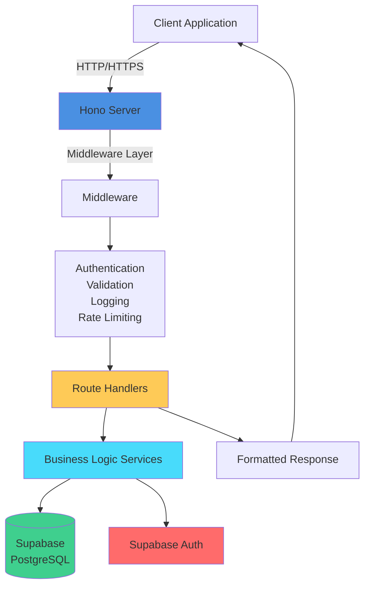

## Technology Stack

### Core Framework
- **Hono**: Fast, lightweight web framework for the edge
- **TypeScript**: Type-safe JavaScript with strict mode
- **Node.js**: Runtime environment (v20+)
- **@hono/node-server**: Node.js server adapter for Hono

### Database & Auth
- **Supabase**: PostgreSQL database with built-in auth
- **PostgreSQL**: Relational database
- **Row Level Security (RLS)**: Database-level security

### Validation & Schema
- **Zod**: Runtime schema validation and TypeScript type inference

### Logging & Monitoring
- **Pino**: Fast, JSON-logging library
- Structured logging with request/response tracking

### Additional Tools
- **OpenAPI/Scalar**: Interactive API documentation
- **Docker**: Containerization
- **pnpm**: Package manager

## Project Structure

```mermaid
graph TD
    Root[GymPal Backend] --> Src[src/]
    Root --> Dist[dist/]
    Root --> Supabase[supabase/]
    
    Src --> Core[core/]
    Src --> Modules[modules/]
    Src --> Middleware[middleware/]
    Src --> Plugins[plugins/]
    Src --> App[app.ts]
    Src --> Server[server.ts]
    
    Core --> Config[config/]
    Core --> Utils[utils/]
    Core --> Constants[constants/]
    Core --> Routes[routes.ts]
    Core --> Types[types/]
    
    Modules --> Auth[auth/]
    Modules --> Users[users/]
    Modules --> Workouts[workouts/]
    Modules --> Exercises[exercises/]
    Modules --> Social[social/]
    Modules --> Dashboard[dashboard/]
    Modules --> Personal[personal/]
    Modules --> Settings[settings/]
    
    Auth --> AuthHandlers[handlers.ts]
    Auth --> AuthService[service.ts]
    Auth --> AuthRoutes[routes.ts]
    Auth --> AuthSchemas[schemas.ts]
    Auth --> AuthTypes[types.ts]
    
    Middleware --> AuthMW[auth.ts]
    Middleware --> ErrorMW[error.ts]
    Middleware --> LoggingMW[logging.ts]
    Middleware --> ValidationMW[validation.ts]
    Middleware --> RateLimitMW[rate-limit.ts]
    
    Plugins --> Health[health.ts]
    Plugins --> OpenAPI[openapi.ts]
    
    style Root fill:#4a90e2
    style Modules fill:#feca57
    style Core fill:#48dbfb
    style Middleware fill:#ff6b6b
    style Plugins fill:#9b59b6
```

### Directory Structure Details

```
PTI-GymPalBack/
├── src/
│   ├── app.ts                    # Main Hono application setup
│   ├── server.ts                 # Server entry point
│   ├── core/                     # Core application infrastructure
│   │   ├── config/               # Configuration files
│   │   │   ├── database.ts       # Supabase client configuration
│   │   │   ├── database-helpers.ts # Type-safe DB operation helpers
│   │   │   ├── env.ts            # Environment variables
│   │   │   └── logger.ts         # Pino logger configuration
│   │   ├── constants/           # Application constants
│   │   │   └── api.ts            # HTTP status codes, error codes
│   │   ├── routes.ts             # Centralized route constants
│   │   ├── types/                # Type definitions
│   │   │   └── database.types.ts # Supabase generated types
│   │   └── utils/                # Utility functions
│   │       ├── response.ts       # Response helpers
│   │       ├── errors.ts         # Custom error classes
│   │       └── auth.ts           # Auth utilities
│   ├── middleware/               # HTTP middleware
│   │   ├── auth.ts              # Authentication middleware
│   │   ├── error.ts             # Global error handler
│   │   ├── logging.ts           # Request logging
│   │   ├── validation.ts        # Zod validation
│   │   └── rate-limit.ts         # Rate limiting
│   ├── modules/                  # Business domain modules
│   │   ├── auth/                # Authentication module
│   │   ├── users/               # User management module
│   │   ├── workouts/            # Workout management module
│   │   ├── exercises/           # Exercise library module
│   │   ├── social/              # Social features module
│   │   ├── dashboard/           # Dashboard analytics module
│   │   ├── personal/           # Personal data module
│   │   └── settings/            # User settings module
│   └── plugins/                 # Hono plugins
│       ├── health.ts            # Health check plugin
│       └── openapi.ts           # OpenAPI documentation plugin
├── supabase/
│   └── migrations/               # Database migrations
│       ├── 001_schema.sql       # Database schema
│       ├── 002_rls_policies.sql # Row Level Security
│       ├── 003_seed_data.sql    # Seed data
│       └── 004_triggers.sql     # Database triggers & functions
├── dist/                         # Compiled TypeScript output
├── Dockerfile                    # Production Docker image
├── docker-compose.yml            # Development environment
├── package.json                  # Dependencies
├── tsconfig.json                 # TypeScript configuration
└── openapi.json                  # OpenAPI specification
```

### Module Structure

Each module follows a consistent structure:

```
module-name/
├── routes.ts      # Route definitions with @openapi comments
├── handlers.ts    # HTTP request handlers
├── service.ts     # Business logic layer
├── schemas.ts     # Zod validation schemas
├── types.ts       # TypeScript type definitions
└── index.ts       # Module exports
```

## Request Flow

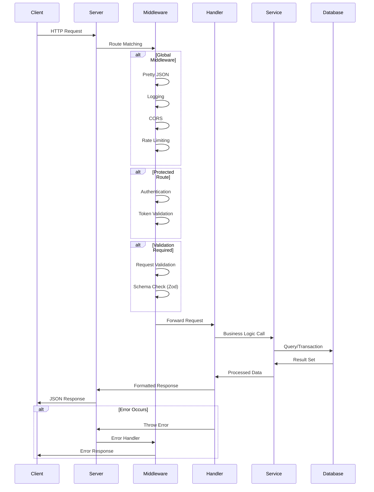

## Authentication Flow

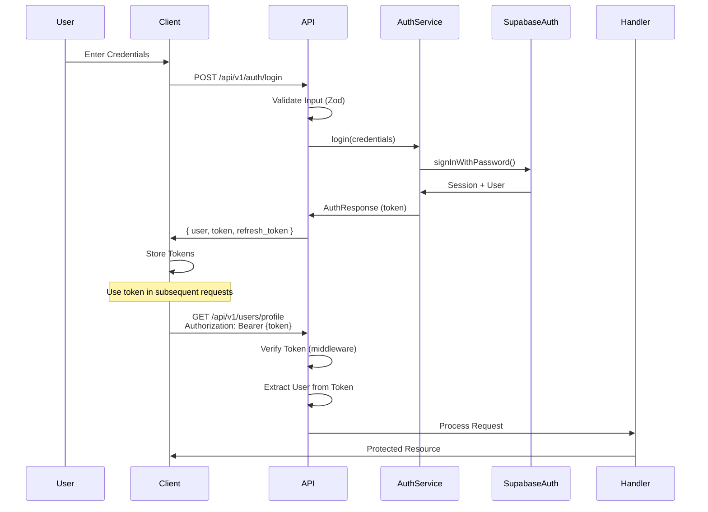

## Module Architecture

Each module follows a consistent structure:

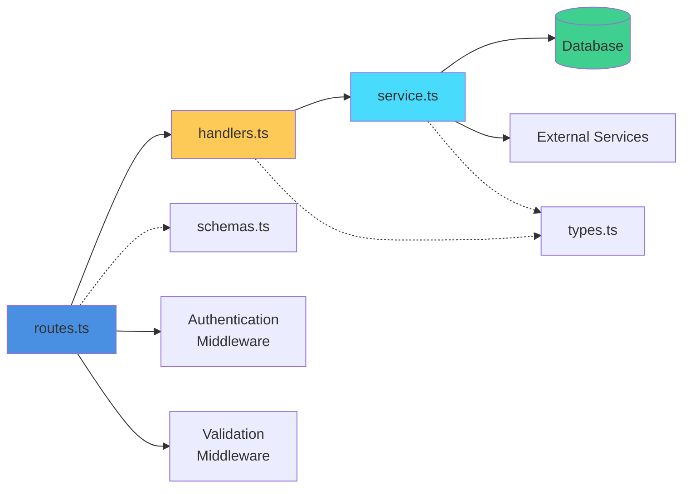

### Module Responsibilities

1. **routes.ts**: Defines HTTP endpoints, applies middleware, connects routes to handlers
2. **handlers.ts**: HTTP request handlers that process requests, call services, format responses
3. **service.ts**: Business logic layer that interacts with database and external services
4. **schemas.ts**: Zod validation schemas for request/response validation
5. **types.ts**: TypeScript type definitions for the module

## Database Schema

The application uses Supabase (PostgreSQL) with the following main entities:

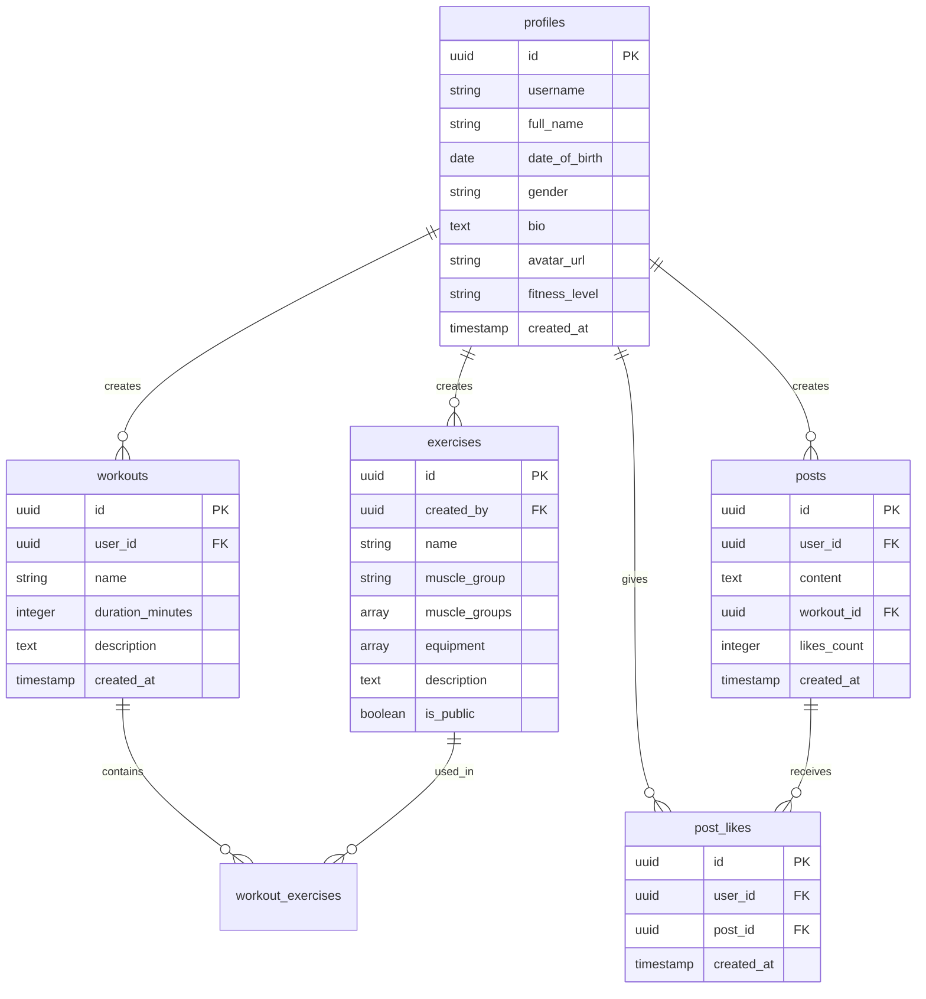

### Database Features

- **Row Level Security (RLS)**: Enabled on all tables
- **Foreign Key Constraints**: CASCADE deletions for data integrity
- **Triggers**: Auto-create profiles, handle user deletions
- **Functions**: Self-delete account function with SECURITY DEFINER

## API Endpoints

### Authentication Module (`/api/v1/auth`)

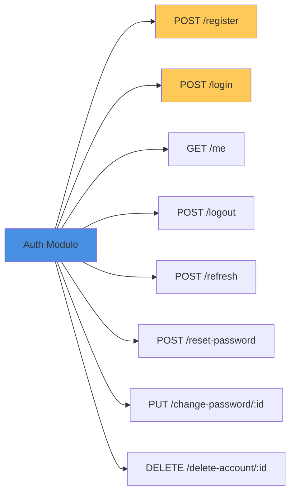

**Endpoints:**
- `POST /api/v1/auth/register` - Register new user
- `POST /api/v1/auth/login` - User login
- `GET /api/v1/auth/me` - Get authenticated user
- `POST /api/v1/auth/logout` - Logout
- `POST /api/v1/auth/refresh` - Refresh token
- `POST /api/v1/auth/reset-password` - Reset password
- `PUT /api/v1/auth/change-password/:id` - Change password
- `DELETE /api/v1/auth/delete-account/:id` - Delete account (self-service, no service role key required)

### Users Module (`/api/v1/users`)

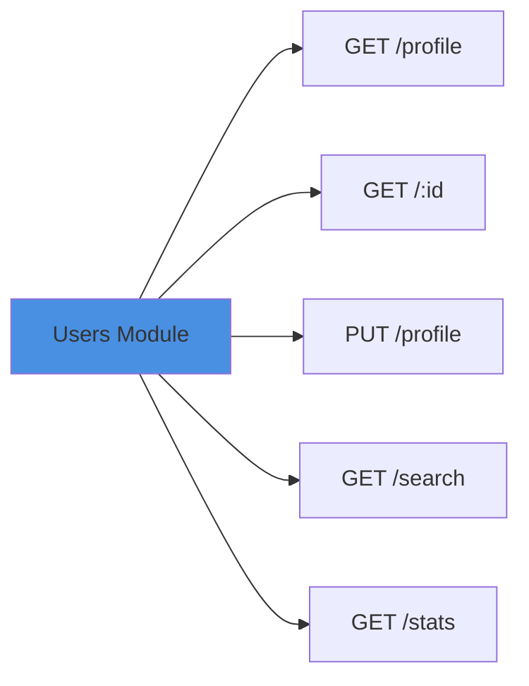

**Endpoints:**
- `GET /api/v1/users/profile` - Get authenticated user profile
- `PUT /api/v1/users/profile` - Update profile
- `GET /api/v1/users/:id` - Get user by ID
- `GET /api/v1/users/search` - Search users
- `GET /api/v1/users/stats` - Get user statistics

### Workouts Module (`/api/v1/workouts`)

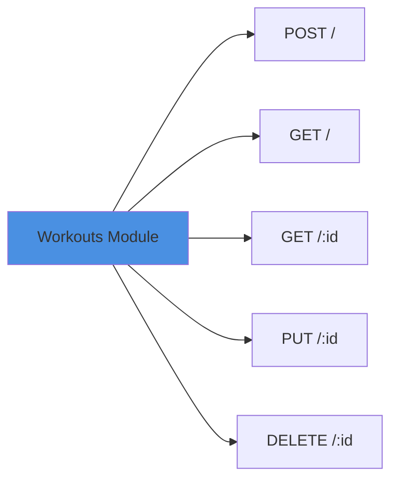

### Exercises Module (`/api/v1/exercises`)

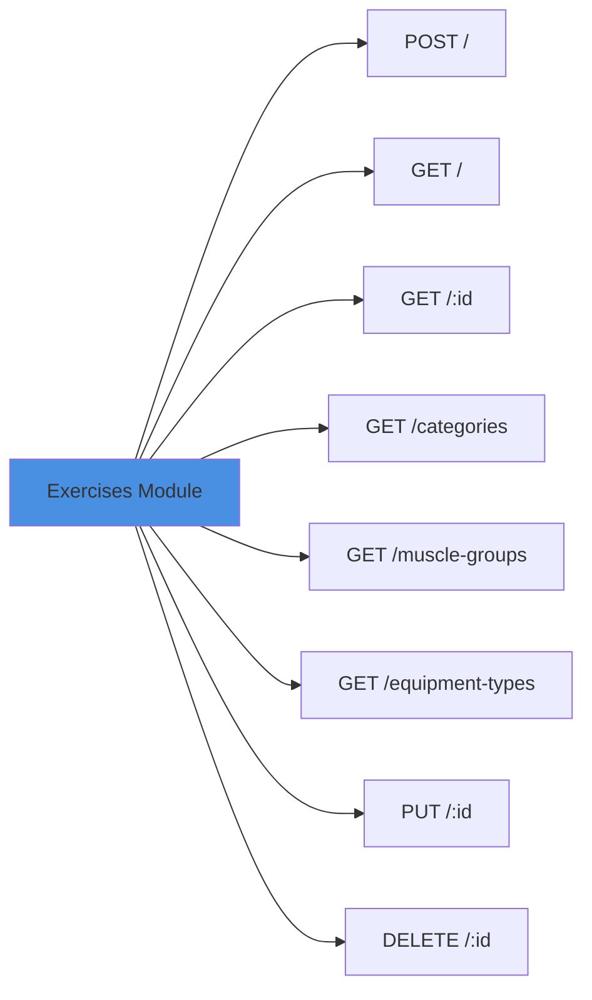

### Social Module (`/api/v1/social`)

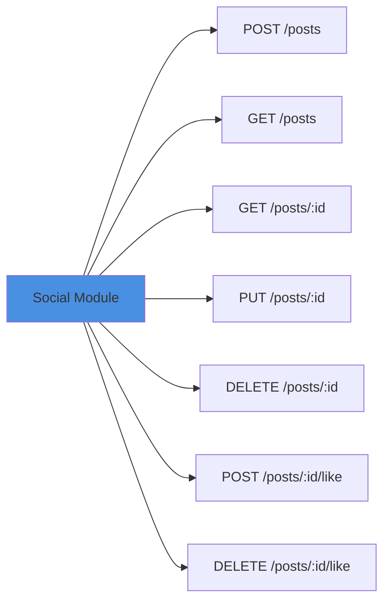

### Dashboard Module (`/api/v1/dashboard`)

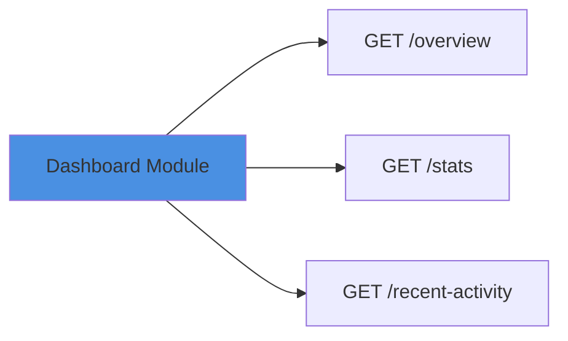

### Personal Module (`/api/v1/personal`)

- `GET /api/v1/personal` - Get personal information
- `PUT /api/v1/personal` - Update personal information
- `GET /api/v1/personal/fitness-profile` - Get fitness profile
- `PUT /api/v1/personal/fitness-profile` - Update fitness profile

### Settings Module (`/api/v1/settings`)

- `GET /api/v1/settings` - Get all settings
- `PUT /api/v1/settings` - Update settings
- `GET /api/v1/settings/notifications` - Get notification settings
- `PUT /api/v1/settings/notifications` - Update notification settings
- `GET /api/v1/settings/privacy` - Get privacy settings
- `PUT /api/v1/settings/privacy` - Update privacy settings

## Error Handling Flow

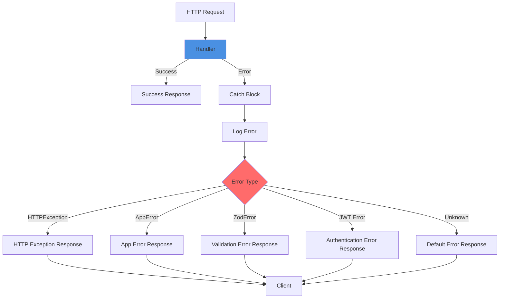

## Security Layers

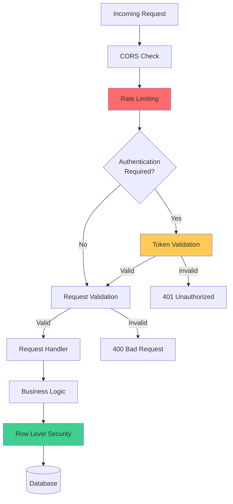

### Security Features

- **JWT Authentication**: Token-based authentication via Supabase
- **Row Level Security (RLS)**: Database-level access control
- **Rate Limiting**: Request throttling to prevent abuse
- **CORS**: Configurable cross-origin resource sharing
- **Input Validation**: Zod schema validation for all requests
- **Self-Service Account Deletion**: Database function allows users to delete their own accounts without requiring service role key

## Deployment Architecture

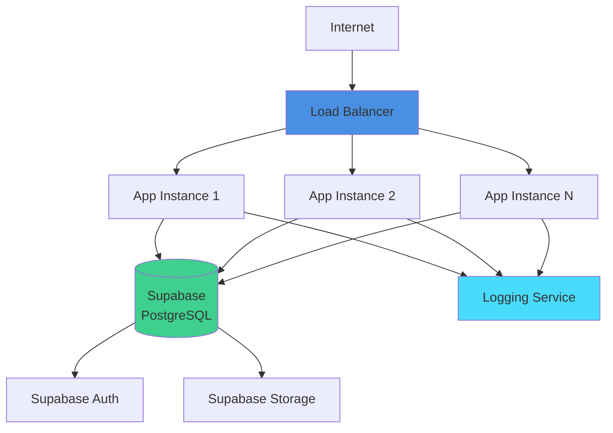

### Docker Configuration

The project includes multi-stage Dockerfiles for:
- **Development**: Hot reload with all dependencies
- **Production**: Optimized image with only production dependencies
- **Build Cache**: Cached build stages for faster CI/CD

---

## Module Details

### Authentication Module
- Handles user registration, login, logout
- Token management (access & refresh tokens)
- Password reset and change
- Account deletion (via database function, no service role key required)

### Users Module
- Profile management (CRUD operations)
- User search and discovery
- User statistics and analytics

### Workouts Module
- Create, read, update, delete workouts
- Workout history and filtering
- Workout templates

### Exercises Module
- Exercise library management
- Custom exercise creation
- Exercise categorization and filtering
- Reference data (categories, muscle groups, equipment)

### Social Module
- Post creation and management
- Like/unlike functionality
- Social feed and activity

### Dashboard Module
- Overview statistics
- Time-based analytics
- Recent activity feed

### Personal Module
- Personal information management
- Fitness profile (metrics, goals, preferences)

### Settings Module
- General settings
- Notification preferences
- Privacy settings

---

## Key Architectural Decisions

### 1. Type-Safe Database Operations
- Custom helper functions (`database-helpers.ts`) for type-safe Supabase operations
- Avoids unsafe `as any` or `as never` casts
- Uses TypeScript generics with `TableInsert`, `TableUpdate`, and `TableRow` types

### 2. Self-Service Account Deletion
- Database function `delete_own_account()` with `SECURITY DEFINER`
- Users can delete their own accounts without requiring service role key
- Automatic cascade deletion of related data

### 3. Centralized Route Management
- All routes defined as constants in `src/core/routes.ts`
- Single source of truth for API versioning and route paths
- Type-safe route constants

### 4. Modular Architecture
- Each domain feature is a self-contained module
- Consistent structure across all modules
- Easy to add new features or modify existing ones

### 5. Middleware Chain
- Request flows through: CORS → Rate Limiting → Auth → Validation → Handler
- Error handling middleware catches all errors
- Logging middleware tracks all requests

---

**Documentation Version**: 2.0.0  
**Last Updated**: October 2025  
**Maintained by**: GymPal Development Team
