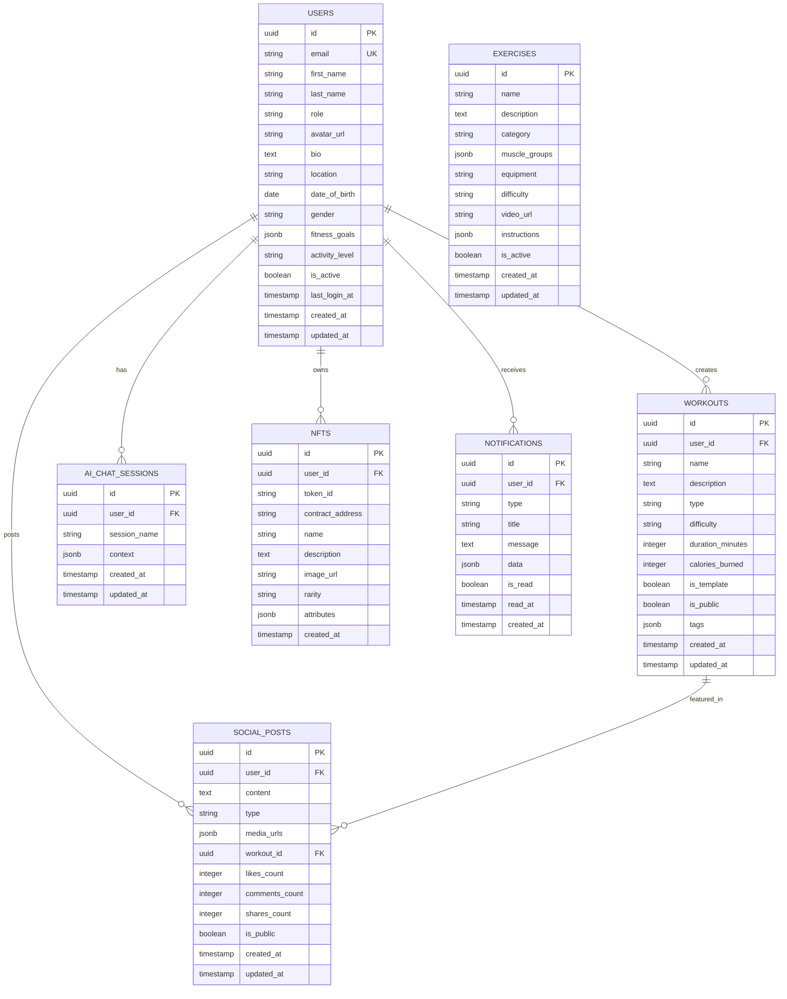
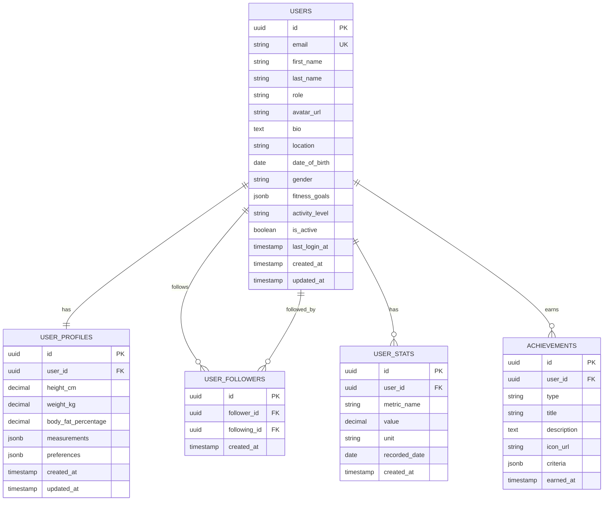
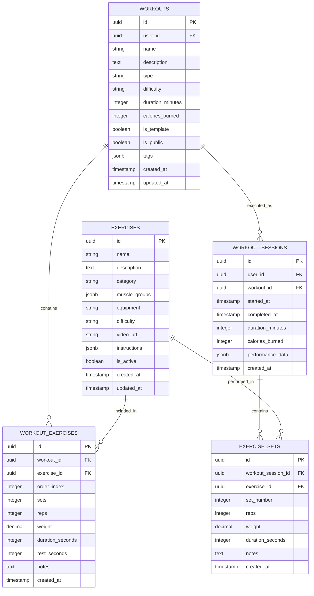
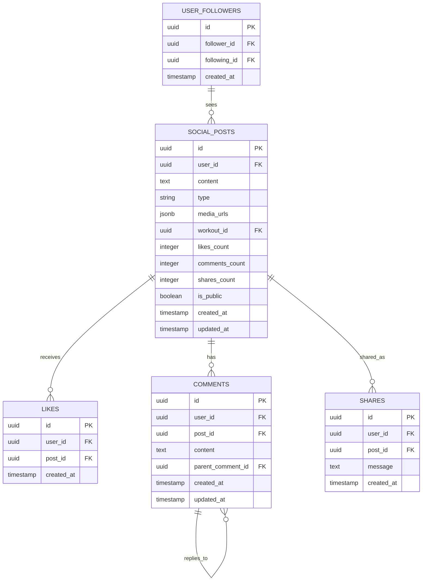
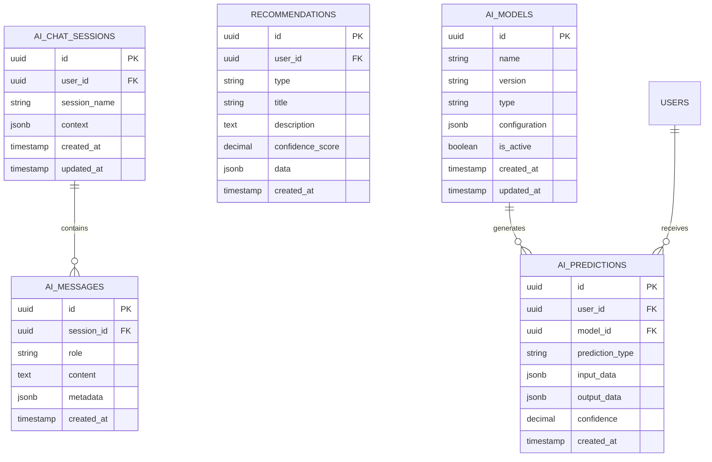
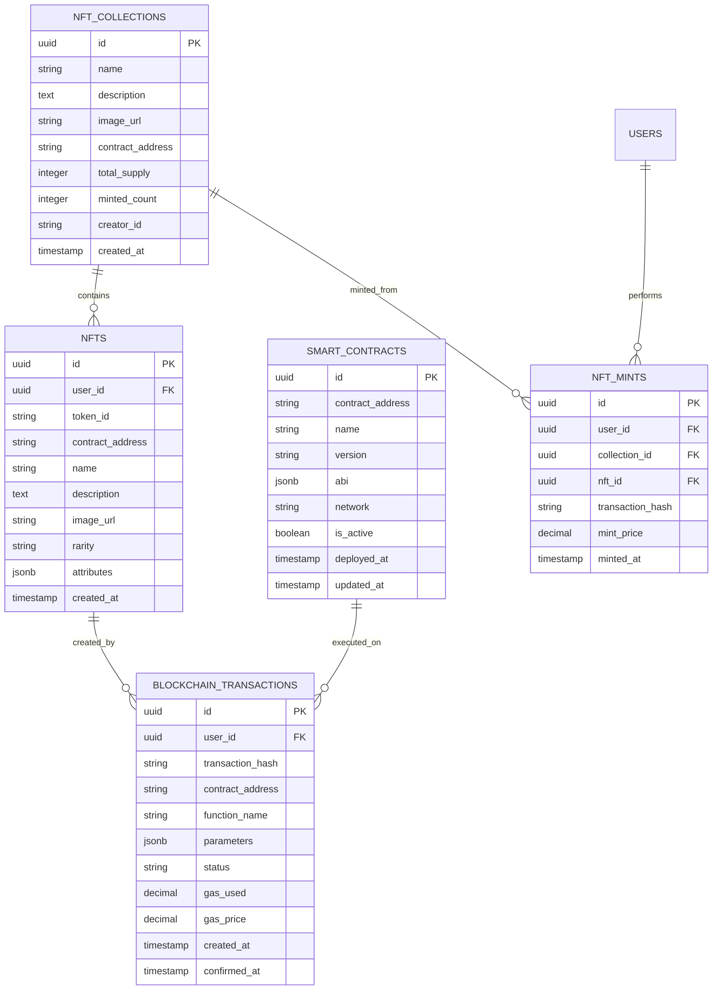
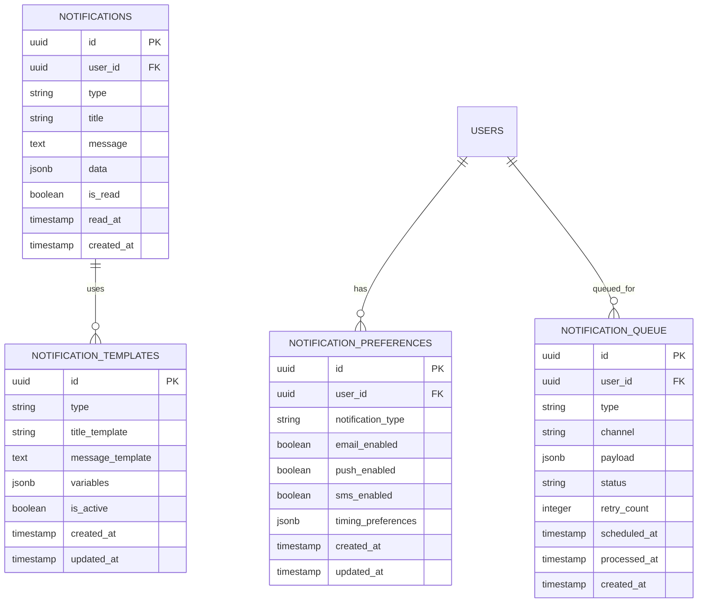
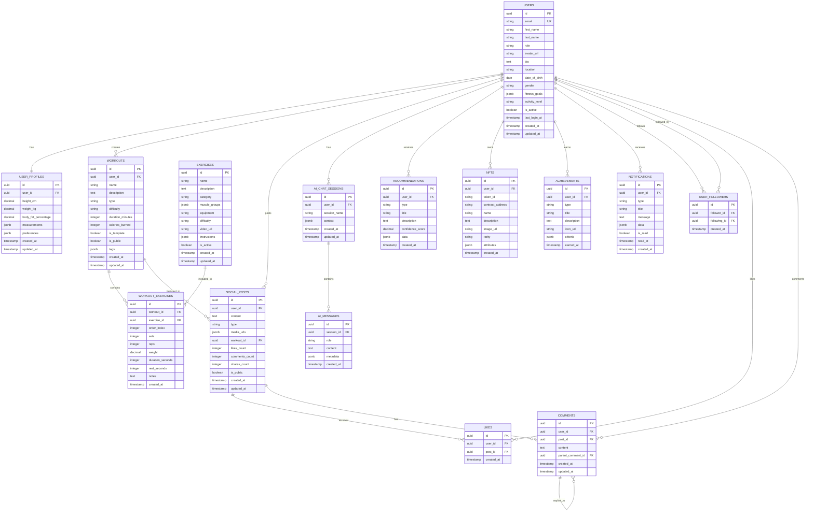

# Database Entity-Relationship Diagrams

## Table of Contents

1. [High-Level ERD](#high-level-erd)
2. [User Management ERD](#user-management-erd)
3. [Workout Management ERD](#workout-management-erd)
4. [Social Features ERD](#social-features-erd)
5. [AI Integration ERD](#ai-integration-erd)
6. [Blockchain Integration ERD](#blockchain-integration-erd)
7. [Notification System ERD](#notification-system-erd)
8. [Complete System ERD](#complete-system-erd)

---

## High-Level ERD

### Core Entities and Relationships

---

## User Management ERD

### User Profile and Authentication

---

## Workout Management ERD

### Workout and Exercise System

---

## Social Features ERD

### Social Networking and Interactions

---

## AI Integration ERD

### AI Chat and Recommendations

---

## Blockchain Integration ERD

### NFT and Blockchain Features

---

## Notification System ERD

### Notification Management

---

## Complete System ERD

### Full Database Schema Overview

---

## Database Schema Summary

### Table Count by Domain

| Domain | Tables | Description |
|--------|--------|-------------|
| **User Management** | 4 | Users, profiles, followers, stats |
| **Workout Management** | 4 | Workouts, exercises, sessions, sets |
| **Social Features** | 4 | Posts, likes, comments, shares |
| **AI Integration** | 3 | Chat sessions, messages, recommendations |
| **Blockchain** | 2 | NFTs, achievements |
| **Notifications** | 1 | Notification system |
| **Total** | **18** | Complete database schema |

### Key Relationships

1. **One-to-One**: Users ↔ User Profiles
2. **One-to-Many**: Users → Workouts, Posts, Sessions, etc.
3. **Many-to-Many**: Users ↔ Users (followers), Workouts ↔ Exercises
4. **Self-Referencing**: Comments → Comments (replies)
