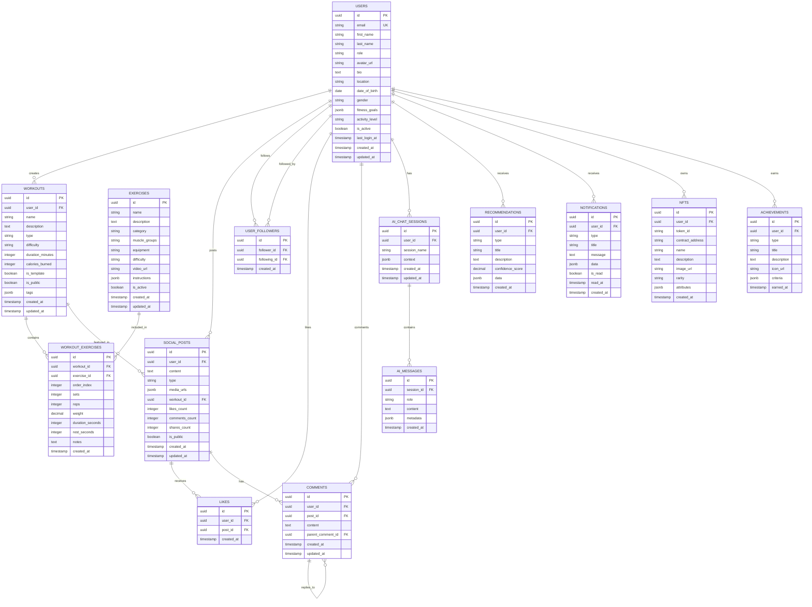
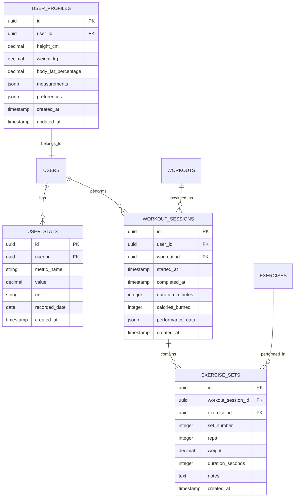

# Database Architecture Documentation

## Table of Contents

1. [Entity-Relationship Diagram](#entity-relationship-diagram)
2. [Core Data Models](#core-data-models)
3. [Schema Organization](#schema-organization)
4. [Data Dictionary](#data-dictionary)
5. [Indexing Strategy](#indexing-strategy)
6. [Data Migration Strategy](#data-migration-strategy)
7. [Performance Optimization](#performance-optimization)
8.  [Security and Compliance](#security-and-compliance)

---

## Entity-Relationship Diagram

### High-Level ERD



### Detailed Schema Relationships



---

## Core Data Models

### 1. User Management Schema

#### Users Table
```sql
CREATE TABLE users (
    id UUID PRIMARY KEY DEFAULT gen_random_uuid(),
    email VARCHAR(255) UNIQUE NOT NULL,
    first_name VARCHAR(100) NOT NULL,
    last_name VARCHAR(100) NOT NULL,
    role VARCHAR(20) NOT NULL DEFAULT 'user' CHECK (role IN ('user', 'trainer', 'admin')),
    avatar_url TEXT,
    bio TEXT,
    location VARCHAR(255),
    date_of_birth DATE,
    gender VARCHAR(20) CHECK (gender IN ('male', 'female', 'other', 'prefer_not_to_say')),
    fitness_goals JSONB DEFAULT '[]',
    activity_level VARCHAR(20) CHECK (activity_level IN ('sedentary', 'lightly_active', 'moderately_active', 'very_active', 'extremely_active')),
    is_active BOOLEAN DEFAULT true,
    last_login_at TIMESTAMP WITH TIME ZONE,
    created_at TIMESTAMP WITH TIME ZONE DEFAULT NOW(),
    updated_at TIMESTAMP WITH TIME ZONE DEFAULT NOW()
);

-- Indexes
CREATE INDEX idx_users_email ON users(email);
CREATE INDEX idx_users_role ON users(role);
CREATE INDEX idx_users_is_active ON users(is_active);
CREATE INDEX idx_users_created_at ON users(created_at);
```

#### User Profiles Table
```sql
CREATE TABLE user_profiles (
    id UUID PRIMARY KEY DEFAULT gen_random_uuid(),
    user_id UUID NOT NULL REFERENCES users(id) ON DELETE CASCADE,
    height_cm DECIMAL(5,2),
    weight_kg DECIMAL(5,2),
    body_fat_percentage DECIMAL(4,2),
    measurements JSONB DEFAULT '{}',
    preferences JSONB DEFAULT '{}',
    created_at TIMESTAMP WITH TIME ZONE DEFAULT NOW(),
    updated_at TIMESTAMP WITH TIME ZONE DEFAULT NOW(),
    UNIQUE(user_id)
);

-- Indexes
CREATE INDEX idx_user_profiles_user_id ON user_profiles(user_id);
```

### 2. Workout Management Schema

#### Workouts Table
```sql
CREATE TABLE workouts (
    id UUID PRIMARY KEY DEFAULT gen_random_uuid(),
    user_id UUID NOT NULL REFERENCES users(id) ON DELETE CASCADE,
    name VARCHAR(255) NOT NULL,
    description TEXT,
    type VARCHAR(50) NOT NULL CHECK (type IN ('strength', 'cardio', 'flexibility', 'sports', 'other')),
    difficulty VARCHAR(20) NOT NULL CHECK (difficulty IN ('beginner', 'intermediate', 'advanced')),
    duration_minutes INTEGER NOT NULL CHECK (duration_minutes > 0),
    calories_burned INTEGER,
    is_template BOOLEAN DEFAULT false,
    is_public BOOLEAN DEFAULT false,
    tags JSONB DEFAULT '[]',
    created_at TIMESTAMP WITH TIME ZONE DEFAULT NOW(),
    updated_at TIMESTAMP WITH TIME ZONE DEFAULT NOW()
);

-- Indexes
CREATE INDEX idx_workouts_user_id ON workouts(user_id);
CREATE INDEX idx_workouts_type ON workouts(type);
CREATE INDEX idx_workouts_difficulty ON workouts(difficulty);
CREATE INDEX idx_workouts_is_template ON workouts(is_template);
CREATE INDEX idx_workouts_is_public ON workouts(is_public);
CREATE INDEX idx_workouts_created_at ON workouts(created_at);
```

#### Exercises Table
```sql
CREATE TABLE exercises (
    id UUID PRIMARY KEY DEFAULT gen_random_uuid(),
    name VARCHAR(255) NOT NULL,
    description TEXT,
    category VARCHAR(100) NOT NULL,
    muscle_groups JSONB DEFAULT '[]',
    equipment VARCHAR(100),
    difficulty VARCHAR(20) NOT NULL CHECK (difficulty IN ('beginner', 'intermediate', 'advanced')),
    video_url TEXT,
    instructions JSONB DEFAULT '[]',
    is_active BOOLEAN DEFAULT true,
    created_at TIMESTAMP WITH TIME ZONE DEFAULT NOW(),
    updated_at TIMESTAMP WITH TIME ZONE DEFAULT NOW()
);

-- Indexes
CREATE INDEX idx_exercises_category ON exercises(category);
CREATE INDEX idx_exercises_difficulty ON exercises(difficulty);
CREATE INDEX idx_exercises_is_active ON exercises(is_active);
CREATE INDEX idx_exercises_name ON exercises(name);
```

#### Workout Exercises Junction Table
```sql
CREATE TABLE workout_exercises (
    id UUID PRIMARY KEY DEFAULT gen_random_uuid(),
    workout_id UUID NOT NULL REFERENCES workouts(id) ON DELETE CASCADE,
    exercise_id UUID NOT NULL REFERENCES exercises(id) ON DELETE CASCADE,
    order_index INTEGER NOT NULL,
    sets INTEGER NOT NULL CHECK (sets > 0),
    reps INTEGER NOT NULL CHECK (reps > 0),
    weight DECIMAL(8,2),
    duration_seconds INTEGER,
    rest_seconds INTEGER,
    notes TEXT,
    created_at TIMESTAMP WITH TIME ZONE DEFAULT NOW(),
    UNIQUE(workout_id, exercise_id, order_index)
);

-- Indexes
CREATE INDEX idx_workout_exercises_workout_id ON workout_exercises(workout_id);
CREATE INDEX idx_workout_exercises_exercise_id ON workout_exercises(exercise_id);
```

### 3. Social Features Schema

#### Social Posts Table
```sql
CREATE TABLE social_posts (
    id UUID PRIMARY KEY DEFAULT gen_random_uuid(),
    user_id UUID NOT NULL REFERENCES users(id) ON DELETE CASCADE,
    content TEXT NOT NULL,
    type VARCHAR(50) NOT NULL CHECK (type IN ('text', 'image', 'video', 'workout', 'achievement')),
    media_urls JSONB DEFAULT '[]',
    workout_id UUID REFERENCES workouts(id) ON DELETE SET NULL,
    likes_count INTEGER DEFAULT 0,
    comments_count INTEGER DEFAULT 0,
    shares_count INTEGER DEFAULT 0,
    is_public BOOLEAN DEFAULT true,
    created_at TIMESTAMP WITH TIME ZONE DEFAULT NOW(),
    updated_at TIMESTAMP WITH TIME ZONE DEFAULT NOW()
);

-- Indexes
CREATE INDEX idx_social_posts_user_id ON social_posts(user_id);
CREATE INDEX idx_social_posts_type ON social_posts(type);
CREATE INDEX idx_social_posts_workout_id ON social_posts(workout_id);
CREATE INDEX idx_social_posts_created_at ON social_posts(created_at);
CREATE INDEX idx_social_posts_is_public ON social_posts(is_public);
```

#### User Followers Table
```sql
CREATE TABLE user_followers (
    id UUID PRIMARY KEY DEFAULT gen_random_uuid(),
    follower_id UUID NOT NULL REFERENCES users(id) ON DELETE CASCADE,
    following_id UUID NOT NULL REFERENCES users(id) ON DELETE CASCADE,
    created_at TIMESTAMP WITH TIME ZONE DEFAULT NOW(),
    UNIQUE(follower_id, following_id),
    CHECK (follower_id != following_id)
);

-- Indexes
CREATE INDEX idx_user_followers_follower_id ON user_followers(follower_id);
CREATE INDEX idx_user_followers_following_id ON user_followers(following_id);
```

#### Likes Table
```sql
CREATE TABLE likes (
    id UUID PRIMARY KEY DEFAULT gen_random_uuid(),
    user_id UUID NOT NULL REFERENCES users(id) ON DELETE CASCADE,
    post_id UUID NOT NULL REFERENCES social_posts(id) ON DELETE CASCADE,
    created_at TIMESTAMP WITH TIME ZONE DEFAULT NOW(),
    UNIQUE(user_id, post_id)
);

-- Indexes
CREATE INDEX idx_likes_user_id ON likes(user_id);
CREATE INDEX idx_likes_post_id ON likes(post_id);
```

### 4. AI Integration Schema

#### AI Chat Sessions Table
```sql
CREATE TABLE ai_chat_sessions (
    id UUID PRIMARY KEY DEFAULT gen_random_uuid(),
    user_id UUID NOT NULL REFERENCES users(id) ON DELETE CASCADE,
    session_name VARCHAR(255),
    context JSONB DEFAULT '{}',
    created_at TIMESTAMP WITH TIME ZONE DEFAULT NOW(),
    updated_at TIMESTAMP WITH TIME ZONE DEFAULT NOW()
);

-- Indexes
CREATE INDEX idx_ai_chat_sessions_user_id ON ai_chat_sessions(user_id);
CREATE INDEX idx_ai_chat_sessions_created_at ON ai_chat_sessions(created_at);
```

#### AI Messages Table
```sql
CREATE TABLE ai_messages (
    id UUID PRIMARY KEY DEFAULT gen_random_uuid(),
    session_id UUID NOT NULL REFERENCES ai_chat_sessions(id) ON DELETE CASCADE,
    role VARCHAR(20) NOT NULL CHECK (role IN ('user', 'assistant', 'system')),
    content TEXT NOT NULL,
    metadata JSONB DEFAULT '{}',
    created_at TIMESTAMP WITH TIME ZONE DEFAULT NOW()
);

-- Indexes
CREATE INDEX idx_ai_messages_session_id ON ai_messages(session_id);
CREATE INDEX idx_ai_messages_role ON ai_messages(role);
CREATE INDEX idx_ai_messages_created_at ON ai_messages(created_at);
```

#### Recommendations Table
```sql
CREATE TABLE recommendations (
    id UUID PRIMARY KEY DEFAULT gen_random_uuid(),
    user_id UUID NOT NULL REFERENCES users(id) ON DELETE CASCADE,
    type VARCHAR(50) NOT NULL CHECK (type IN ('workout', 'nutrition', 'social', 'general')),
    title VARCHAR(255) NOT NULL,
    description TEXT,
    confidence_score DECIMAL(3,2) NOT NULL CHECK (confidence_score >= 0 AND confidence_score <= 1),
    data JSONB DEFAULT '{}',
    created_at TIMESTAMP WITH TIME ZONE DEFAULT NOW()
);

-- Indexes
CREATE INDEX idx_recommendations_user_id ON recommendations(user_id);
CREATE INDEX idx_recommendations_type ON recommendations(type);
CREATE INDEX idx_recommendations_confidence_score ON recommendations(confidence_score);
CREATE INDEX idx_recommendations_created_at ON recommendations(created_at);
```

### 5. Blockchain Integration Schema

#### NFTs Table
```sql
CREATE TABLE nfts (
    id UUID PRIMARY KEY DEFAULT gen_random_uuid(),
    user_id UUID NOT NULL REFERENCES users(id) ON DELETE CASCADE,
    token_id VARCHAR(255) NOT NULL,
    contract_address VARCHAR(255) NOT NULL,
    name VARCHAR(255) NOT NULL,
    description TEXT,
    image_url TEXT,
    rarity VARCHAR(20) NOT NULL CHECK (rarity IN ('common', 'uncommon', 'rare', 'epic', 'legendary')),
    attributes JSONB DEFAULT '{}',
    created_at TIMESTAMP WITH TIME ZONE DEFAULT NOW()
);

-- Indexes
CREATE INDEX idx_nfts_user_id ON nfts(user_id);
CREATE INDEX idx_nfts_token_id ON nfts(token_id);
CREATE INDEX idx_nfts_contract_address ON nfts(contract_address);
CREATE INDEX idx_nfts_rarity ON nfts(rarity);
```

#### Achievements Table
```sql
CREATE TABLE achievements (
    id UUID PRIMARY KEY DEFAULT gen_random_uuid(),
    user_id UUID NOT NULL REFERENCES users(id) ON DELETE CASCADE,
    type VARCHAR(50) NOT NULL,
    title VARCHAR(255) NOT NULL,
    description TEXT,
    icon_url TEXT,
    criteria JSONB DEFAULT '{}',
    earned_at TIMESTAMP WITH TIME ZONE DEFAULT NOW()
);

-- Indexes
CREATE INDEX idx_achievements_user_id ON achievements(user_id);
CREATE INDEX idx_achievements_type ON achievements(type);
CREATE INDEX idx_achievements_earned_at ON achievements(earned_at);
```

### 6. Notification Schema

#### Notifications Table
```sql
CREATE TABLE notifications (
    id UUID PRIMARY KEY DEFAULT gen_random_uuid(),
    user_id UUID NOT NULL REFERENCES users(id) ON DELETE CASCADE,
    type VARCHAR(50) NOT NULL CHECK (type IN ('workout', 'social', 'achievement', 'system', 'reminder')),
    title VARCHAR(255) NOT NULL,
    message TEXT NOT NULL,
    data JSONB DEFAULT '{}',
    is_read BOOLEAN DEFAULT false,
    read_at TIMESTAMP WITH TIME ZONE,
    created_at TIMESTAMP WITH TIME ZONE DEFAULT NOW()
);

-- Indexes
CREATE INDEX idx_notifications_user_id ON notifications(user_id);
CREATE INDEX idx_notifications_type ON notifications(type);
CREATE INDEX idx_notifications_is_read ON notifications(is_read);
CREATE INDEX idx_notifications_created_at ON notifications(created_at);
```

---

## Schema Organization

### 1. Schema Separation Strategy

#### Microservice Schemas
```sql
-- User Service Schema
CREATE SCHEMA user_service;

-- Workout Service Schema
CREATE SCHEMA workout_service;

-- Social Service Schema
CREATE SCHEMA social_service;

-- AI Service Schema
CREATE SCHEMA ai_service;

-- Blockchain Service Schema
CREATE SCHEMA blockchain_service;

-- Notification Service Schema
CREATE SCHEMA notification_service;

-- Shared Schema for common entities
CREATE SCHEMA shared;
```

#### Schema Permissions
```sql
-- Grant permissions to service users
GRANT USAGE ON SCHEMA user_service TO user_service_user;
GRANT ALL PRIVILEGES ON ALL TABLES IN SCHEMA user_service TO user_service_user;
GRANT ALL PRIVILEGES ON ALL SEQUENCES IN SCHEMA user_service TO user_service_user;

-- Grant read-only access to shared data
GRANT USAGE ON SCHEMA shared TO user_service_user;
GRANT SELECT ON ALL TABLES IN SCHEMA shared TO user_service_user;
```

### 2. Data Partitioning Strategy

#### Time-Based Partitioning
```sql
-- Partition social_posts by month
CREATE TABLE social_posts (
    id UUID NOT NULL,
    user_id UUID NOT NULL,
    content TEXT NOT NULL,
    created_at TIMESTAMP WITH TIME ZONE NOT NULL,
    -- other columns
    PRIMARY KEY (id, created_at)
) PARTITION BY RANGE (created_at);

-- Create monthly partitions
CREATE TABLE social_posts_2024_01 PARTITION OF social_posts
    FOR VALUES FROM ('2024-01-01') TO ('2024-02-01');

CREATE TABLE social_posts_2024_02 PARTITION OF social_posts
    FOR VALUES FROM ('2024-02-01') TO ('2024-03-01');
```

#### Hash-Based Partitioning
```sql
-- Partition users by user_id hash
CREATE TABLE users (
    id UUID NOT NULL,
    email VARCHAR(255) NOT NULL,
    -- other columns
    PRIMARY KEY (id)
) PARTITION BY HASH (id);

-- Create hash partitions
CREATE TABLE users_0 PARTITION OF users
    FOR VALUES WITH (modulus 4, remainder 0);

CREATE TABLE users_1 PARTITION OF users
    FOR VALUES WITH (modulus 4, remainder 1);
```

---

## Data Dictionary

### 1. Core Entities

#### Users Entity
| Column | Type | Constraints | Description |
|--------|------|-------------|-------------|
| id | UUID | PRIMARY KEY, NOT NULL | Unique user identifier |
| email | VARCHAR(255) | UNIQUE, NOT NULL | User email address |
| first_name | VARCHAR(100) | NOT NULL | User's first name |
| last_name | VARCHAR(100) | NOT NULL | User's last name |
| role | VARCHAR(20) | NOT NULL, CHECK | User role (user, trainer, admin) |
| avatar_url | TEXT | NULL | URL to user's avatar image |
| bio | TEXT | NULL | User biography |
| location | VARCHAR(255) | NULL | User location |
| date_of_birth | DATE | NULL | User's date of birth |
| gender | VARCHAR(20) | CHECK | User's gender |
| fitness_goals | JSONB | DEFAULT '[]' | User's fitness goals array |
| activity_level | VARCHAR(20) | CHECK | User's activity level |
| is_active | BOOLEAN | DEFAULT true | Whether account is active |
| last_login_at | TIMESTAMP WITH TIME ZONE | NULL | Last login timestamp |
| created_at | TIMESTAMP WITH TIME ZONE | DEFAULT NOW() | Creation timestamp |
| updated_at | TIMESTAMP WITH TIME ZONE | DEFAULT NOW() | Last update timestamp |

#### Workouts Entity
| Column | Type | Constraints | Description |
|--------|------|-------------|-------------|
| id | UUID | PRIMARY KEY, NOT NULL | Unique workout identifier |
| user_id | UUID | FOREIGN KEY, NOT NULL | ID of user who created workout |
| name | VARCHAR(255) | NOT NULL | Workout name |
| description | TEXT | NULL | Workout description |
| type | VARCHAR(50) | NOT NULL, CHECK | Type of workout |
| difficulty | VARCHAR(20) | NOT NULL, CHECK | Difficulty level |
| duration_minutes | INTEGER | NOT NULL, CHECK > 0 | Duration in minutes |
| calories_burned | INTEGER | NULL | Estimated calories burned |
| is_template | BOOLEAN | DEFAULT false | Whether it's a reusable template |
| is_public | BOOLEAN | DEFAULT false | Whether workout is public |
| tags | JSONB | DEFAULT '[]' | Workout tags array |
| created_at | TIMESTAMP WITH TIME ZONE | DEFAULT NOW() | Creation timestamp |
| updated_at | TIMESTAMP WITH TIME ZONE | DEFAULT NOW() | Last update timestamp |

#### Exercises Entity
| Column | Type | Constraints | Description |
|--------|------|-------------|-------------|
| id | UUID | PRIMARY KEY, NOT NULL | Unique exercise identifier |
| name | VARCHAR(255) | NOT NULL | Exercise name |
| description | TEXT | NULL | Exercise description |
| category | VARCHAR(100) | NOT NULL | Exercise category |
| muscle_groups | JSONB | DEFAULT '[]' | Targeted muscle groups |
| equipment | VARCHAR(100) | NULL | Required equipment |
| difficulty | VARCHAR(20) | NOT NULL, CHECK | Difficulty level |
| video_url | TEXT | NULL | URL to exercise video |
| instructions | JSONB | DEFAULT '[]' | Exercise instructions |
| is_active | BOOLEAN | DEFAULT true | Whether exercise is active |
| created_at | TIMESTAMP WITH TIME ZONE | DEFAULT NOW() | Creation timestamp |
| updated_at | TIMESTAMP WITH TIME ZONE | DEFAULT NOW() | Last update timestamp |

### 2. Relationship Tables

#### Workout Exercises Junction
| Column | Type | Constraints | Description |
|--------|------|-------------|-------------|
| id | UUID | PRIMARY KEY, NOT NULL | Unique junction record ID |
| workout_id | UUID | FOREIGN KEY, NOT NULL | Reference to workout |
| exercise_id | UUID | FOREIGN KEY, NOT NULL | Reference to exercise |
| order_index | INTEGER | NOT NULL | Order of exercise in workout |
| sets | INTEGER | NOT NULL, CHECK > 0 | Number of sets |
| reps | INTEGER | NOT NULL, CHECK > 0 | Number of repetitions |
| weight | DECIMAL(8,2) | NULL | Weight used |
| duration_seconds | INTEGER | NULL | Duration for time-based exercises |
| rest_seconds | INTEGER | NULL | Rest time between sets |
| notes | TEXT | NULL | Additional notes |
| created_at | TIMESTAMP WITH TIME ZONE | DEFAULT NOW() | Creation timestamp |

#### User Followers
| Column | Type | Constraints | Description |
|--------|------|-------------|-------------|
| id | UUID | PRIMARY KEY, NOT NULL | Unique relationship ID |
| follower_id | UUID | FOREIGN KEY, NOT NULL | ID of user who follows |
| following_id | UUID | FOREIGN KEY, NOT NULL | ID of user being followed |
| created_at | TIMESTAMP WITH TIME ZONE | DEFAULT NOW() | When follow relationship started |
| UNIQUE(follower_id, following_id) | | | Prevent duplicate follows |
| CHECK (follower_id != following_id) | | | Prevent self-following |

### 3. JSONB Fields Documentation

#### Fitness Goals (users.fitness_goals)
```json
[
  "weight_loss",
  "muscle_gain",
  "endurance",
  "flexibility",
  "general_fitness"
]
```

#### Measurements (user_profiles.measurements)
```json
{
  "chest": 95.5,
  "waist": 80.0,
  "hips": 90.0,
  "biceps": 35.0,
  "thighs": 60.0,
  "unit": "cm"
}
```

#### Workout Tags (workouts.tags)
```json
[
  "upper_body",
  "strength",
  "beginner",
  "home_workout"
]
```

#### Exercise Instructions (exercises.instructions)
```json
[
  {
    "step": 1,
    "instruction": "Stand with feet shoulder-width apart",
    "duration": null
  },
  {
    "step": 2,
    "instruction": "Lower your body until thighs are parallel to floor",
    "duration": 2
  },
  {
    "step": 3,
    "instruction": "Push through heels to return to starting position",
    "duration": 2
  }
]
```

---

## Indexing Strategy

### 1. Primary Indexes

#### Clustered Indexes
```sql
-- Primary key indexes (automatically created)
CREATE UNIQUE INDEX users_pkey ON users(id);
CREATE UNIQUE INDEX workouts_pkey ON workouts(id);
CREATE UNIQUE INDEX exercises_pkey ON exercises(id);
```

#### Foreign Key Indexes
```sql
-- Foreign key indexes for join performance
CREATE INDEX idx_workouts_user_id ON workouts(user_id);
CREATE INDEX idx_workout_exercises_workout_id ON workout_exercises(workout_id);
CREATE INDEX idx_workout_exercises_exercise_id ON workout_exercises(exercise_id);
CREATE INDEX idx_social_posts_user_id ON social_posts(user_id);
CREATE INDEX idx_user_followers_follower_id ON user_followers(follower_id);
CREATE INDEX idx_user_followers_following_id ON user_followers(following_id);
```

### 2. Performance Indexes

#### Composite Indexes
```sql
-- Multi-column indexes for complex queries
CREATE INDEX idx_workouts_user_type_difficulty ON workouts(user_id, type, difficulty);
CREATE INDEX idx_social_posts_user_created ON social_posts(user_id, created_at DESC);
CREATE INDEX idx_notifications_user_unread ON notifications(user_id, is_read, created_at DESC);
```

#### Partial Indexes
```sql
-- Indexes on filtered subsets
CREATE INDEX idx_users_active ON users(id) WHERE is_active = true;
CREATE INDEX idx_workouts_public ON workouts(id, name) WHERE is_public = true;
CREATE INDEX idx_social_posts_recent ON social_posts(id, created_at) WHERE created_at > NOW() - INTERVAL '30 days';
```

#### GIN Indexes for JSONB
```sql
-- Full-text search on JSONB fields
CREATE INDEX idx_users_fitness_goals_gin ON users USING GIN (fitness_goals);
CREATE INDEX idx_workouts_tags_gin ON workouts USING GIN (tags);
CREATE INDEX idx_exercises_muscle_groups_gin ON exercises USING GIN (muscle_groups);
```

### 3. Full-Text Search Indexes

```sql
-- Full-text search on text content
CREATE INDEX idx_social_posts_content_fts ON social_posts USING GIN (to_tsvector('english', content));
CREATE INDEX idx_exercises_name_fts ON exercises USING GIN (to_tsvector('english', name));
CREATE INDEX idx_workouts_name_fts ON workouts USING GIN (to_tsvector('english', name));
```

---

## Data Migration Strategy

### 1. Migration Framework

#### Migration Table
```sql
CREATE TABLE schema_migrations (
    version VARCHAR(255) PRIMARY KEY,
    applied_at TIMESTAMP WITH TIME ZONE DEFAULT NOW(),
    checksum VARCHAR(64),
    description TEXT
);
```

#### Migration Scripts Structure
```
migrations/
├── 001_initial_schema.sql
├── 002_add_user_profiles.sql
├── 003_add_workout_sessions.sql
├── 004_add_ai_integration.sql
├── 005_add_blockchain_support.sql
└── 006_add_performance_indexes.sql
```

### 2. Version Control Strategy

#### Semantic Versioning
- **Major Version**: Breaking changes requiring data migration
- **Minor Version**: New features with backward compatibility
- **Patch Version**: Bug fixes and performance improvements

#### Migration Naming Convention
```
{version}_{timestamp}_{description}.sql
Example: 001_20240115_initial_schema.sql
```

### 3. Rollback Strategy

#### Reversible Migrations
```sql
-- Migration: Add column
ALTER TABLE users ADD COLUMN middle_name VARCHAR(100);

-- Rollback: Remove column
ALTER TABLE users DROP COLUMN middle_name;
```

#### Data Preservation
```sql
-- Migration: Rename column with data preservation
ALTER TABLE users RENAME COLUMN full_name TO first_name;
ALTER TABLE users ADD COLUMN last_name VARCHAR(100);

-- Rollback: Restore original structure
ALTER TABLE users DROP COLUMN last_name;
ALTER TABLE users RENAME COLUMN first_name TO full_name;
```

---

## Performance Optimization

### 1. Query Optimization

#### Query Analysis
```sql
-- Enable query analysis
CREATE EXTENSION IF NOT EXISTS pg_stat_statements;

-- Analyze slow queries
SELECT query, calls, total_time, mean_time, rows
FROM pg_stat_statements
ORDER BY total_time DESC
LIMIT 10;
```

#### Query Hints
```sql
-- Use appropriate indexes
EXPLAIN (ANALYZE, BUFFERS) 
SELECT u.*, w.name as workout_name
FROM users u
JOIN workouts w ON u.id = w.user_id
WHERE u.is_active = true
  AND w.created_at > NOW() - INTERVAL '30 days';
```

### 2. Connection Pooling

#### PgBouncer Configuration
```ini
[databases]
fitnesshub = host=localhost port=5432 dbname=fitnesshub

[pgbouncer]
pool_mode = transaction
max_client_conn = 100
default_pool_size = 20
max_db_connections = 50
```

#### Application Connection Pool
```typescript
// Connection pool configuration
const poolConfig = {
  host: process.env.DB_HOST,
  port: parseInt(process.env.DB_PORT || '5432'),
  database: process.env.DB_NAME,
  user: process.env.DB_USER,
  password: process.env.DB_PASSWORD,
  max: 20, // Maximum connections
  idleTimeoutMillis: 30000,
  connectionTimeoutMillis: 2000,
  ssl: process.env.NODE_ENV === 'production' ? { rejectUnauthorized: false } : false
};
```

### 3. Caching Strategy

#### Redis Caching
```typescript
// Cache frequently accessed data
const cacheKey = `user:${userId}:profile`;
const cachedProfile = await redis.get(cacheKey);

if (cachedProfile) {
  return JSON.parse(cachedProfile);
}

const profile = await db.query('SELECT * FROM user_profiles WHERE user_id = $1', [userId]);
await redis.setex(cacheKey, 3600, JSON.stringify(profile)); // 1 hour TTL
```

#### Database-Level Caching
```sql
-- Materialized views for complex aggregations
CREATE MATERIALIZED VIEW user_workout_stats AS
SELECT 
    u.id as user_id,
    COUNT(w.id) as total_workouts,
    AVG(w.duration_minutes) as avg_duration,
    SUM(w.calories_burned) as total_calories
FROM users u
LEFT JOIN workouts w ON u.id = w.user_id
GROUP BY u.id;

-- Refresh materialized view
REFRESH MATERIALIZED VIEW user_workout_stats;
```

---

## Security and Compliance

### 1. Data Encryption

#### Encryption at Rest
```sql
-- Enable transparent data encryption
-- (Requires additional setup with TDE or similar solution)
```

#### Encryption in Transit
```sql
-- SSL/TLS configuration
-- ssl = on
-- ssl_cert_file = 'server.crt'
-- ssl_key_file = 'server.key'
```

### 2. Access Control

#### Role-Based Access Control
```sql
-- Create service-specific roles
CREATE ROLE user_service_user;
CREATE ROLE workout_service_user;
CREATE ROLE social_service_user;

-- Grant schema-specific permissions
GRANT USAGE ON SCHEMA user_service TO user_service_user;
GRANT ALL PRIVILEGES ON ALL TABLES IN SCHEMA user_service TO user_service_user;

-- Grant cross-schema read permissions
GRANT USAGE ON SCHEMA shared TO user_service_user;
GRANT SELECT ON ALL TABLES IN SCHEMA shared TO user_service_user;
```

#### Row-Level Security
```sql
-- Enable RLS on sensitive tables
ALTER TABLE users ENABLE ROW LEVEL SECURITY;

-- Create policy for user data access
CREATE POLICY user_data_policy ON users
    FOR ALL TO user_service_user
    USING (id = current_setting('app.current_user_id')::uuid);
```

### 3. Audit Logging

#### Audit Table
```sql
CREATE TABLE audit_log (
    id UUID PRIMARY KEY DEFAULT gen_random_uuid(),
    table_name VARCHAR(255) NOT NULL,
    record_id UUID NOT NULL,
    operation VARCHAR(10) NOT NULL CHECK (operation IN ('INSERT', 'UPDATE', 'DELETE')),
    old_values JSONB,
    new_values JSONB,
    changed_by UUID REFERENCES users(id),
    changed_at TIMESTAMP WITH TIME ZONE DEFAULT NOW()
);
```

#### Audit Trigger
```sql
-- Create audit trigger function
CREATE OR REPLACE FUNCTION audit_trigger_function()
RETURNS TRIGGER AS $$
BEGIN
    INSERT INTO audit_log (
        table_name,
        record_id,
        operation,
        old_values,
        new_values,
        changed_by
    ) VALUES (
        TG_TABLE_NAME,
        COALESCE(NEW.id, OLD.id),
        TG_OP,
        CASE WHEN TG_OP = 'DELETE' THEN to_jsonb(OLD) ELSE NULL END,
        CASE WHEN TG_OP = 'INSERT' OR TG_OP = 'UPDATE' THEN to_jsonb(NEW) ELSE NULL END,
        current_setting('app.current_user_id')::uuid
    );
    RETURN COALESCE(NEW, OLD);
END;
$$ LANGUAGE plpgsql;

-- Apply audit trigger to users table
CREATE TRIGGER users_audit_trigger
    AFTER INSERT OR UPDATE OR DELETE ON users
    FOR EACH ROW EXECUTE FUNCTION audit_trigger_function();
```

### 4. Data Privacy

#### Personal Data Identification
```sql
-- Identify PII columns
SELECT 
    table_name,
    column_name,
    data_type
FROM information_schema.columns
WHERE column_name IN ('email', 'first_name', 'last_name', 'date_of_birth', 'location')
ORDER BY table_name, column_name;
```

#### Data Anonymization
```sql
-- Anonymize user data for testing
UPDATE users 
SET 
    email = 'user' || id || '@example.com',
    first_name = 'User',
    last_name = 'Test',
    location = 'Test City'
WHERE id IN (SELECT id FROM users WHERE email LIKE '%@test.com');
```

---

