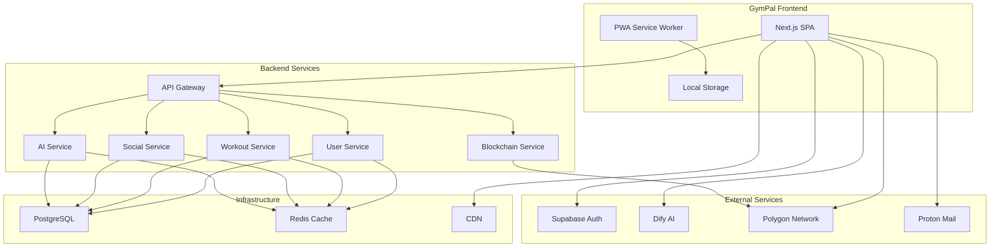
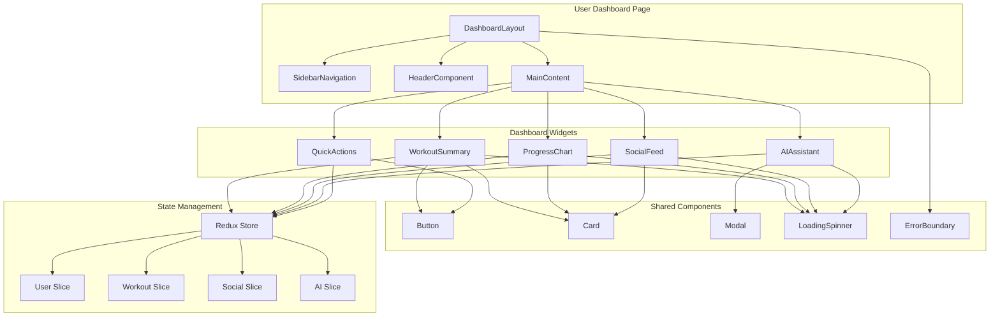

# Frontend Architecture Documentation

## Table of Contents

1. [C4 Model Diagrams](#c4-model-diagrams)
2. [Folder Structure](#folder-structure)
3. [Coding Standards](#coding-standards)
4. [State Management Strategy](#state-management-strategy)
5. [UI/UX and Design System](#uiux-and-design-system)
6. [Wireframes and Mockups](#wireframes-and-mockups)

---

## C4 Model Diagrams

### Container Diagram



### Component Diagram - User Dashboard



---

## Folder Structure

```
apps/frontend/
├── public/                          # Static assets
│   ├── icons/                       # App icons and favicons
│   ├── images/                      # Static images
│   └── manifest.json                # PWA manifest
├── src/
│   ├── app/                         # Next.js App Router
│   │   ├── (auth)/                  # Route groups
│   │   │   ├── login/
│   │   │   └── register/
│   │   ├── (dashboard)/             # Protected routes
│   │   │   ├── dashboard/
│   │   │   ├── workouts/
│   │   │   ├── social/
│   │   │   └── profile/
│   │   ├── api/                     # API routes
│   │   │   ├── auth/
│   │   │   └── webhooks/
│   │   ├── globals.css              # Global styles
│   │   ├── layout.tsx               # Root layout
│   │   └── page.tsx                 # Home page
│   ├── components/                  # Reusable components
│   │   ├── ui/                      # ShadCN/UI components
│   │   │   ├── button.tsx
│   │   │   ├── card.tsx
│   │   │   ├── input.tsx
│   │   │   └── ...
│   │   ├── atoms/                   # Atomic design - atoms
│   │   │   ├── button/
│   │   │   ├── input/
│   │   │   └── icon/
│   │   ├── molecules/               # Atomic design - molecules
│   │   │   ├── search-bar/
│   │   │   ├── user-avatar/
│   │   │   └── workout-card/
│   │   ├── organisms/               # Atomic design - organisms
│   │   │   ├── header/
│   │   │   ├── sidebar/
│   │   │   ├── workout-list/
│   │   │   └── social-feed/
│   │   ├── templates/               # Page templates
│   │   │   ├── dashboard-layout/
│   │   │   ├── auth-layout/
│   │   │   └── error-layout/
│   │   └── features/                # Feature-specific components
│   │       ├── auth/
│   │       ├── workouts/
│   │       ├── social/
│   │       └── ai-chat/
│   ├── lib/                         # Utility functions
│   │   ├── api/                     # API client configuration
│   │   │   ├── client.ts
│   │   │   ├── endpoints.ts
│   │   │   └── interceptors.ts
│   │   ├── auth/                    # Authentication utilities
│   │   │   ├── supabase.ts
│   │   │   ├── jwt.ts
│   │   │   └── guards.ts
│   │   ├── utils/                   # General utilities
│   │   │   ├── cn.ts               # Class name utility
│   │   │   ├── formatters.ts
│   │   │   └── validators.ts
│   │   └── constants/               # Application constants
│   │       ├── routes.ts
│   │       ├── api.ts
│   │       └── ui.ts
│   ├── hooks/                       # Custom React hooks
│   │   ├── use-auth.ts
│   │   ├── use-workouts.ts
│   │   ├── use-social.ts
│   │   └── use-ai-chat.ts
│   ├── store/                       # Redux store
│   │   ├── index.ts                 # Store configuration
│   │   ├── slices/                  # Redux slices
│   │   │   ├── auth-slice.ts
│   │   │   ├── user-slice.ts
│   │   │   ├── workout-slice.ts
│   │   │   ├── social-slice.ts
│   │   │   └── ai-slice.ts
│   │   └── middleware/              # Custom middleware
│   │       ├── auth-middleware.ts
│   │       └── error-middleware.ts
│   ├── types/                       # TypeScript type definitions
│   │   ├── api.ts                   # API response types
│   │   ├── auth.ts                  # Authentication types
│   │   ├── user.ts                  # User-related types
│   │   ├── workout.ts               # Workout-related types
│   │   ├── social.ts                # Social features types
│   │   └── common.ts                # Common types
│   └── styles/                      # Styling files
│       ├── globals.css              # Global CSS
│       ├── components.css           # Component-specific styles
│       └── utilities.css            # Utility classes
├── tests/                           # Test files
│   ├── __mocks__/                   # Mock files
│   ├── components/                  # Component tests
│   ├── pages/                       # Page tests
│   └── utils/                       # Utility tests
├── .env.local                       # Environment variables
├── .env.example                     # Environment variables template
├── next.config.js                   # Next.js configuration
├── tailwind.config.js               # Tailwind CSS configuration
├── tsconfig.json                    # TypeScript configuration
├── package.json                     # Dependencies and scripts
└── README.md                        # Project documentation
```

---

## Coding Standards

### TypeScript Standards
- **Strict Mode**: Enable all strict type checking options
- **No Implicit Any**: Explicitly type all variables and function parameters
- **Interface vs Type**: Use interfaces for object shapes, types for unions/primitives
- **Naming Conventions**:
  - Interfaces: `IUser`, `IWorkoutData`
  - Types: `UserRole`, `WorkoutStatus`
  - Enums: `UserRole`, `WorkoutType`

### Component Standards
- **Functional Components**: Use React functional components with hooks
- **Props Interface**: Define explicit props interfaces for all components
- **Default Props**: Use default parameters instead of defaultProps
- **Component Naming**: PascalCase for component names and files
- **File Naming**: kebab-case for component files

### File Organization
- **One Component Per File**: Each component in its own file
- **Index Files**: Use index.ts files for clean imports
- **Barrel Exports**: Export components from index files
- **Co-location**: Keep related files together (component + tests + styles)

### Code Quality
- **ESLint Rules**: Enforce consistent code style
- **Prettier**: Automatic code formatting
- **Import Order**: Group imports (external, internal, relative)
- **Unused Imports**: Remove unused imports and variables
- **Console Statements**: No console.log in production code

---

## State Management Strategy

### Redux Toolkit Architecture Overview

The GymPal frontend uses Redux Toolkit as the primary state management solution, providing a predictable and scalable approach to managing application state. The architecture follows the **"Feature-Based Slices"** pattern, where each domain feature has its own slice and API endpoints.

### Store Configuration

```typescript
// store/index.ts
import { configureStore } from '@reduxjs/toolkit'
import { persistStore, persistReducer } from 'redux-persist'
import storage from 'redux-persist/lib/storage'
import { authSlice } from './slices/auth-slice'
import { userSlice } from './slices/user-slice'
import { workoutSlice } from './slices/workout-slice'
import { socialSlice } from './slices/social-slice'
import { aiSlice } from './slices/ai-slice'
import { blockchainSlice } from './slices/blockchain-slice'
import { api } from '@/lib/api/api'

const persistConfig = {
  key: 'root',
  storage,
  whitelist: ['auth', 'user'], // Only persist auth and user data
}

const rootReducer = {
  auth: persistReducer(persistConfig, authSlice.reducer),
  user: userSlice.reducer,
  workout: workoutSlice.reducer,
  social: socialSlice.reducer,
  ai: aiSlice.reducer,
  blockchain: blockchainSlice.reducer,
  [api.reducerPath]: api.reducer,
}

export const store = configureStore({
  reducer: rootReducer,
  middleware: (getDefaultMiddleware) =>
    getDefaultMiddleware({
      serializableCheck: {
        ignoredActions: ['persist/PERSIST', 'persist/REHYDRATE'],
      },
    }).concat(api.middleware),
  devTools: process.env.NODE_ENV !== 'production',
})

export const persistor = persistStore(store)

export type RootState = ReturnType<typeof store.getState>
export type AppDispatch = typeof store.dispatch
```

### Slice Architecture Pattern

Each feature slice follows a consistent structure:

```typescript
// store/slices/[feature]-slice.ts
import { createSlice, createAsyncThunk, PayloadAction } from '@reduxjs/toolkit'
import { api } from '@/lib/api/api'
import { IFeatureData, IFeatureState } from '@/types/feature'

// 1. Define the state interface
interface FeatureState {
  data: IFeatureData | null
  list: IFeatureData[]
  loading: boolean
  error: string | null
  filters: Record<string, any>
  pagination: {
    page: number
    limit: number
    total: number
  }
}

// 2. Define initial state
const initialState: FeatureState = {
  data: null,
  list: [],
  loading: false,
  error: null,
  filters: {},
  pagination: {
    page: 1,
    limit: 10,
    total: 0,
  },
}

// 3. Create async thunks for API calls
export const fetchFeatureData = createAsyncThunk(
  'feature/fetchData',
  async (id: string, { rejectWithValue }) => {
    try {
      const response = await api.get(`/features/${id}`)
      return response.data
    } catch (error) {
      return rejectWithValue(error.message)
    }
  }
)

export const createFeatureData = createAsyncThunk(
  'feature/createData',
  async (data: Partial<IFeatureData>, { rejectWithValue }) => {
    try {
      const response = await api.post('/features', data)
      return response.data
    } catch (error) {
      return rejectWithValue(error.message)
    }
  }
)

// 4. Create the slice
const featureSlice = createSlice({
  name: 'feature',
  initialState,
  reducers: {
    // Synchronous actions
    setFilters: (state, action: PayloadAction<Record<string, any>>) => {
      state.filters = { ...state.filters, ...action.payload }
    },
    clearError: (state) => {
      state.error = null
    },
    resetFeature: (state) => {
      return { ...initialState }
    },
  },
  extraReducers: (builder) => {
    builder
      // Fetch data cases
      .addCase(fetchFeatureData.pending, (state) => {
        state.loading = true
        state.error = null
      })
      .addCase(fetchFeatureData.fulfilled, (state, action) => {
        state.loading = false
        state.data = action.payload
      })
      .addCase(fetchFeatureData.rejected, (state, action) => {
        state.loading = false
        state.error = action.payload as string
      })
      // Create data cases
      .addCase(createFeatureData.pending, (state) => {
        state.loading = true
        state.error = null
      })
      .addCase(createFeatureData.fulfilled, (state, action) => {
        state.loading = false
        state.list.unshift(action.payload)
        state.pagination.total += 1
      })
      .addCase(createFeatureData.rejected, (state, action) => {
        state.loading = false
        state.error = action.payload as string
      })
  },
})

export const { setFilters, clearError, resetFeature } = featureSlice.actions
export default featureSlice.reducer
```

### RTK Query Integration

RTK Query handles all server state management and caching:

```typescript
// lib/api/api.ts
import { createApi, fetchBaseQuery } from '@reduxjs/toolkit/query/react'
import { RootState } from '@/store'
import { IUser, IWorkout, ISocialPost, IAIResponse } from '@/types'

export const api = createApi({
  reducerPath: 'api',
  baseQuery: fetchBaseQuery({
    baseUrl: process.env.NEXT_PUBLIC_API_URL,
    prepareHeaders: (headers, { getState }) => {
      const token = (getState() as RootState).auth.token
      if (token) {
        headers.set('authorization', `Bearer ${token}`)
      }
      return headers
    },
  }),
  tagTypes: ['User', 'Workout', 'Social', 'AI', 'Blockchain'],
  endpoints: (builder) => ({
    // User endpoints
    getUsers: builder.query<IUser[], { page?: number; limit?: number }>({
      query: ({ page = 1, limit = 10 }) => `users?page=${page}&limit=${limit}`,
      providesTags: ['User'],
    }),
    getUserProfile: builder.query<IUser, string>({
      query: (userId) => `users/${userId}`,
      providesTags: (result, error, userId) => [{ type: 'User', id: userId }],
    }),
    updateUserProfile: builder.mutation<IUser, { id: string; data: Partial<IUser> }>({
      query: ({ id, data }) => ({
        url: `users/${id}`,
        method: 'PATCH',
        body: data,
      }),
      invalidatesTags: (result, error, { id }) => [{ type: 'User', id }],
    }),

    // Workout endpoints
    getWorkouts: builder.query<IWorkout[], { userId: string; page?: number }>({
      query: ({ userId, page = 1 }) => `users/${userId}/workouts?page=${page}`,
      providesTags: ['Workout'],
    }),
    createWorkout: builder.mutation<IWorkout, Partial<IWorkout>>({
      query: (workout) => ({
        url: 'workouts',
        method: 'POST',
        body: workout,
      }),
      invalidatesTags: ['Workout'],
    }),
    updateWorkout: builder.mutation<IWorkout, { id: string; data: Partial<IWorkout> }>({
      query: ({ id, data }) => ({
        url: `workouts/${id}`,
        method: 'PATCH',
        body: data,
      }),
      invalidatesTags: (result, error, { id }) => [{ type: 'Workout', id }],
    }),

    // Social endpoints
    getSocialFeed: builder.query<ISocialPost[], { page?: number; limit?: number }>({
      query: ({ page = 1, limit = 10 }) => `social/feed?page=${page}&limit=${limit}`,
      providesTags: ['Social'],
    }),
    createPost: builder.mutation<ISocialPost, Partial<ISocialPost>>({
      query: (post) => ({
        url: 'social/posts',
        method: 'POST',
        body: post,
      }),
      invalidatesTags: ['Social'],
    }),

    // AI endpoints
    getAIResponse: builder.mutation<IAIResponse, { message: string; context?: any }>({
      query: (data) => ({
        url: 'ai/chat',
        method: 'POST',
        body: data,
      }),
      invalidatesTags: ['AI'],
    }),
    getRecommendations: builder.query<any[], { userId: string; type: string }>({
      query: ({ userId, type }) => `ai/recommendations/${userId}?type=${type}`,
      providesTags: ['AI'],
    }),
  }),
})

export const {
  useGetUsersQuery,
  useGetUserProfileQuery,
  useUpdateUserProfileMutation,
  useGetWorkoutsQuery,
  useCreateWorkoutMutation,
  useUpdateWorkoutMutation,
  useGetSocialFeedQuery,
  useCreatePostMutation,
  useGetAIResponseMutation,
  useGetRecommendationsQuery,
} = api
```

### State Management Patterns

#### 1. Authentication State
```typescript
// store/slices/auth-slice.ts
interface AuthState {
  user: IUser | null
  token: string | null
  refreshToken: string | null
  isAuthenticated: boolean
  loading: boolean
  error: string | null
}

// Actions: login, logout, refreshToken, clearError
```

#### 2. User Profile State
```typescript
// store/slices/user-slice.ts
interface UserState {
  profile: IUserProfile | null
  preferences: IUserPreferences | null
  stats: IUserStats | null
  loading: boolean
  error: string | null
}

// Actions: fetchProfile, updateProfile, updatePreferences, clearError
```

#### 3. Workout State
```typescript
// store/slices/workout-slice.ts
interface WorkoutState {
  currentWorkout: IWorkout | null
  workoutHistory: IWorkout[]
  templates: IWorkoutTemplate[]
  exercises: IExercise[]
  loading: boolean
  error: string | null
  filters: IWorkoutFilters
}

// Actions: startWorkout, completeWorkout, saveTemplate, setFilters
```

#### 4. Social State
```typescript
// store/slices/social-slice.ts
interface SocialState {
  feed: ISocialPost[]
  friends: IUser[]
  notifications: INotification[]
  loading: boolean
  error: string | null
  pagination: IPagination
}

// Actions: loadFeed, addPost, likePost, followUser, markNotificationRead
```

#### 5. AI State
```typescript
// store/slices/ai-slice.ts
interface AIState {
  chatHistory: IAIMessage[]
  recommendations: IRecommendation[]
  isTyping: boolean
  loading: boolean
  error: string | null
}

// Actions: sendMessage, getRecommendations, clearChat, setTyping
```

#### 6. Blockchain State
```typescript
// store/slices/blockchain-slice.ts
interface BlockchainState {
  wallet: IWallet | null
  nfts: INFT[]
  transactions: ITransaction[]
  loading: boolean
  error: string | null
}

// Actions: connectWallet, mintNFT, transferNFT, fetchTransactions
```

### Custom Hooks for State Management

```typescript
// hooks/useAuth.ts
export const useAuth = () => {
  const dispatch = useAppDispatch()
  const { user, token, isAuthenticated, loading, error } = useAppSelector(
    (state) => state.auth
  )

  const login = useCallback(
    (credentials: ILoginCredentials) => {
      dispatch(loginUser(credentials))
    },
    [dispatch]
  )

  const logout = useCallback(() => {
    dispatch(logoutUser())
  }, [dispatch])

  return {
    user,
    token,
    isAuthenticated,
    loading,
    error,
    login,
    logout,
  }
}

// hooks/useWorkouts.ts
export const useWorkouts = (userId: string) => {
  const { data: workouts, isLoading, error } = useGetWorkoutsQuery({ userId })
  const [createWorkout] = useCreateWorkoutMutation()
  const [updateWorkout] = useUpdateWorkoutMutation()

  const addWorkout = useCallback(
    (workout: Partial<IWorkout>) => {
      createWorkout(workout)
    },
    [createWorkout]
  )

  const editWorkout = useCallback(
    (id: string, data: Partial<IWorkout>) => {
      updateWorkout({ id, data })
    },
    [updateWorkout]
  )

  return {
    workouts: workouts || [],
    loading: isLoading,
    error,
    addWorkout,
    editWorkout,
  }
}
```

### State Persistence Strategy

- **Persisted State**: Authentication tokens and user preferences
- **Session State**: Current workout, chat history, temporary data
- **Cache State**: API responses cached by RTK Query
- **Local State**: Component-specific state using useState/useReducer

### Performance Optimizations

- **Selective Re-renders**: Use selectors to prevent unnecessary re-renders
- **Memoization**: Memoize expensive selectors and callbacks
- **Lazy Loading**: Load state slices on demand
- **Cache Management**: Configure RTK Query cache policies
- **Bundle Splitting**: Code-split state management logic

---

## UI/UX and Design System

### Design Principles

#### 1. User-Centered Design
- **User Research**: Regular user testing and feedback collection
- **Persona-Driven**: Design decisions based on fitness enthusiast personas
- **Accessibility First**: WCAG 2.1 AA compliance for inclusive design
- **Progressive Enhancement**: Core functionality works without JavaScript

#### 2. Visual Hierarchy
- **Clear Information Architecture**: Logical content organization
- **Consistent Navigation**: Predictable user flows and patterns
- **Visual Weight**: Strategic use of typography, color, and spacing
- **Content Prioritization**: Most important information prominently displayed

#### 3. Performance & Usability
- **Mobile-First**: Responsive design starting from mobile devices
- **Fast Loading**: Optimized images, lazy loading, and efficient rendering
- **Smooth Interactions**: 60fps animations and transitions
- **Error Prevention**: Clear validation and helpful error messages

### Design System Foundation

#### Color Palette
```css
:root {
  /* Primary Brand Colors */
  --primary-50: #f0f9ff;
  --primary-100: #e0f2fe;
  --primary-200: #bae6fd;
  --primary-300: #7dd3fc;
  --primary-400: #38bdf8;
  --primary-500: #0ea5e9;
  --primary-600: #0284c7;
  --primary-700: #0369a1;
  --primary-800: #075985;
  --primary-900: #0c4a6e;
  
  /* Secondary Accent Colors */
  --secondary-50: #fdf4ff;
  --secondary-100: #fae8ff;
  --secondary-200: #f5d0fe;
  --secondary-300: #f0abfc;
  --secondary-400: #e879f9;
  --secondary-500: #d946ef;
  --secondary-600: #c026d3;
  --secondary-700: #a21caf;
  --secondary-800: #86198f;
  --secondary-900: #701a75;
  
  /* Neutral Colors */
  --gray-50: #f9fafb;
  --gray-100: #f3f4f6;
  --gray-200: #e5e7eb;
  --gray-300: #d1d5db;
  --gray-400: #9ca3af;
  --gray-500: #6b7280;
  --gray-600: #4b5563;
  --gray-700: #374151;
  --gray-800: #1f2937;
  --gray-900: #111827;
  
  /* Semantic Colors */
  --success-50: #ecfdf5;
  --success-500: #10b981;
  --success-900: #064e3b;
  
  --warning-50: #fffbeb;
  --warning-500: #f59e0b;
  --warning-900: #78350f;
  
  --error-50: #fef2f2;
  --error-500: #ef4444;
  --error-900: #7f1d1d;
  
  --info-50: #eff6ff;
  --info-500: #3b82f6;
  --info-900: #1e3a8a;
}
```

#### Typography System
```css
/* Font Families */
--font-primary: 'Inter', system-ui, -apple-system, sans-serif;
--font-mono: 'JetBrains Mono', 'Fira Code', monospace;

/* Font Sizes */
--text-xs: 0.75rem;    /* 12px */
--text-sm: 0.875rem;   /* 14px */
--text-base: 1rem;     /* 16px */
--text-lg: 1.125rem;   /* 18px */
--text-xl: 1.25rem;    /* 20px */
--text-2xl: 1.5rem;    /* 24px */
--text-3xl: 1.875rem;  /* 30px */
--text-4xl: 2.25rem;   /* 36px */
--text-5xl: 3rem;      /* 48px */
--text-6xl: 3.75rem;   /* 60px */

/* Font Weights */
--font-normal: 400;
--font-medium: 500;
--font-semibold: 600;
--font-bold: 700;
--font-extrabold: 800;

/* Line Heights */
--leading-tight: 1.25;
--leading-snug: 1.375;
--leading-normal: 1.5;
--leading-relaxed: 1.625;
--leading-loose: 2;
```

#### Spacing System
```css
/* Base Unit: 4px */
--space-0: 0;
--space-1: 0.25rem;   /* 4px */
--space-2: 0.5rem;    /* 8px */
--space-3: 0.75rem;   /* 12px */
--space-4: 1rem;      /* 16px */
--space-5: 1.25rem;   /* 20px */
--space-6: 1.5rem;    /* 24px */
--space-8: 2rem;      /* 32px */
--space-10: 2.5rem;   /* 40px */
--space-12: 3rem;     /* 48px */
--space-16: 4rem;     /* 64px */
--space-20: 5rem;     /* 80px */
--space-24: 6rem;     /* 96px */
--space-32: 8rem;     /* 128px */
```

### Component Library Strategy

#### ShadCN/UI Foundation
```typescript
// Component customization example
import { Button } from "@/components/ui/button"
import { cn } from "@/lib/utils"

interface CustomButtonProps extends React.ButtonHTMLAttributes<HTMLButtonElement> {
  variant?: "default" | "destructive" | "outline" | "secondary" | "ghost" | "link" | "fitness"
  size?: "default" | "sm" | "lg" | "icon" | "xl"
}

const CustomButton = React.forwardRef<HTMLButtonElement, CustomButtonProps>(
  ({ className, variant = "default", size = "default", ...props }, ref) => {
    return (
      <Button
        className={cn(
          // Base styles
          "font-medium transition-all duration-200",
          // Fitness variant
          variant === "fitness" && "bg-gradient-to-r from-primary-500 to-secondary-500 text-white hover:shadow-lg",
          // Size variants
          size === "xl" && "h-12 px-8 text-lg",
          className
        )}
        ref={ref}
        {...props}
      />
    )
  }
)
```

#### Atomic Design Methodology
```
components/
├── atoms/                    # Basic building blocks
│   ├── button/
│   │   ├── Button.tsx
│   │   ├── Button.stories.tsx
│   │   └── Button.test.tsx
│   ├── input/
│   │   ├── Input.tsx
│   │   ├── Input.stories.tsx
│   │   └── Input.test.tsx
│   └── icon/
│       ├── Icon.tsx
│       └── icons/
├── molecules/                # Simple component groups
│   ├── search-bar/
│   │   ├── SearchBar.tsx
│   │   ├── SearchBar.stories.tsx
│   │   └── SearchBar.test.tsx
│   ├── user-avatar/
│   └── workout-card/
├── organisms/                # Complex component groups
│   ├── header/
│   │   ├── Header.tsx
│   │   ├── Navigation.tsx
│   │   └── UserMenu.tsx
│   ├── sidebar/
│   ├── workout-list/
│   └── social-feed/
└── templates/                # Page layouts
    ├── dashboard-layout/
    ├── auth-layout/
    └── error-layout/
```

### Component Guidelines

#### 1. ShadCN/UI Usage
- **Base Components**: Use ShadCN/UI as the foundation for all UI elements
- **Customization**: Extend components with custom variants and themes
- **Consistency**: Maintain consistent styling across all components
- **Accessibility**: Preserve built-in accessibility features

#### 2. Component Development Standards
```typescript
// Component structure template
interface ComponentProps {
  // Required props
  children: React.ReactNode
  className?: string
  
  // Optional props with defaults
  variant?: 'default' | 'primary' | 'secondary'
  size?: 'sm' | 'md' | 'lg'
  disabled?: boolean
  
  // Event handlers
  onClick?: (event: React.MouseEvent) => void
  onChange?: (value: string) => void
}

export const Component: React.FC<ComponentProps> = ({
  children,
  className,
  variant = 'default',
  size = 'md',
  disabled = false,
  onClick,
  onChange,
  ...props
}) => {
  return (
    <div
      className={cn(
        // Base styles
        "base-styles",
        // Variant styles
        variant === 'primary' && "primary-styles",
        variant === 'secondary' && "secondary-styles",
        // Size styles
        size === 'sm' && "small-styles",
        size === 'md' && "medium-styles",
        size === 'lg' && "large-styles",
        // State styles
        disabled && "disabled-styles",
        className
      )}
      onClick={onClick}
      {...props}
    >
      {children}
    </div>
  )
}
```

#### 3. Styling Conventions
```typescript
// Tailwind CSS usage patterns
const styles = {
  // Layout
  container: "max-w-7xl mx-auto px-4 sm:px-6 lg:px-8",
  section: "py-12 sm:py-16 lg:py-20",
  
  // Typography
  heading: "text-3xl font-bold text-gray-900 sm:text-4xl",
  subheading: "text-xl text-gray-600 mt-4",
  body: "text-base text-gray-700 leading-relaxed",
  
  // Interactive elements
  button: "inline-flex items-center px-4 py-2 border border-transparent text-sm font-medium rounded-md shadow-sm text-white bg-primary-600 hover:bg-primary-700 focus:outline-none focus:ring-2 focus:ring-offset-2 focus:ring-primary-500",
  input: "block w-full px-3 py-2 border border-gray-300 rounded-md shadow-sm placeholder-gray-400 focus:outline-none focus:ring-primary-500 focus:border-primary-500",
  
  // Cards
  card: "bg-white overflow-hidden shadow rounded-lg",
  cardHeader: "px-4 py-5 sm:px-6 border-b border-gray-200",
  cardBody: "px-4 py-5 sm:p-6",
  cardFooter: "px-4 py-4 sm:px-6 border-t border-gray-200",
  
  // Responsive design
  responsive: "grid grid-cols-1 gap-6 sm:grid-cols-2 lg:grid-cols-3",
  mobile: "block sm:hidden",
  desktop: "hidden sm:block",
}
```

### Responsive Design Strategy

#### Breakpoints
```css
/* Tailwind CSS breakpoints */
sm: 640px   /* Small devices */
md: 768px   /* Medium devices */
lg: 1024px  /* Large devices */
xl: 1280px  /* Extra large devices */
2xl: 1536px /* 2X large devices */
```

#### Mobile-First Approach
```typescript
// Responsive component example
const ResponsiveCard = () => (
  <div className="
    w-full
    sm:w-1/2
    md:w-1/3
    lg:w-1/4
    xl:w-1/5
    p-4
    sm:p-6
    lg:p-8
  ">
    <h3 className="
      text-lg
      sm:text-xl
      lg:text-2xl
      font-semibold
      mb-2
      sm:mb-4
    ">
      Card Title
    </h3>
    <p className="
      text-sm
      sm:text-base
      text-gray-600
    ">
      Card content
    </p>
  </div>
)
```

### Dark Mode Support

#### Theme Configuration
```typescript
// tailwind.config.js
module.exports = {
  darkMode: 'class',
  theme: {
    extend: {
      colors: {
        // Dark mode colors
        dark: {
          50: '#f8fafc',
          100: '#f1f5f9',
          200: '#e2e8f0',
          300: '#cbd5e1',
          400: '#94a3b8',
          500: '#64748b',
          600: '#475569',
          700: '#334155',
          800: '#1e293b',
          900: '#0f172a',
        }
      }
    }
  }
}
```

#### Dark Mode Implementation
```typescript
// Theme provider
const ThemeProvider = ({ children }: { children: React.ReactNode }) => {
  const [theme, setTheme] = useState<'light' | 'dark'>('light')
  
  useEffect(() => {
    const savedTheme = localStorage.getItem('theme') as 'light' | 'dark'
    if (savedTheme) {
      setTheme(savedTheme)
    }
  }, [])
  
  useEffect(() => {
    document.documentElement.classList.toggle('dark', theme === 'dark')
    localStorage.setItem('theme', theme)
  }, [theme])
  
  return (
    <ThemeContext.Provider value={{ theme, setTheme }}>
      {children}
    </ThemeContext.Provider>
  )
}
```

### Accessibility Standards

#### WCAG 2.1 AA Compliance
- **Color Contrast**: Minimum 4.5:1 ratio for normal text
- **Keyboard Navigation**: All interactive elements accessible via keyboard
- **Screen Reader Support**: Proper ARIA labels and semantic HTML
- **Focus Management**: Clear focus indicators and logical tab order

#### Accessibility Implementation
```typescript
// Accessible button component
const AccessibleButton = ({ children, ...props }) => (
  <button
    className="
      inline-flex items-center px-4 py-2
      border border-transparent text-sm font-medium
      rounded-md shadow-sm
      focus:outline-none focus:ring-2 focus:ring-offset-2
      focus:ring-primary-500
      disabled:opacity-50 disabled:cursor-not-allowed
    "
    aria-label={props['aria-label']}
    {...props}
  >
    {children}
  </button>
)
```

### Animation and Transitions

#### Animation Principles
- **Purposeful**: Animations should enhance UX, not distract
- **Performance**: Use CSS transforms and opacity for smooth 60fps animations
- **Accessibility**: Respect `prefers-reduced-motion` user preference
- **Consistent**: Use consistent timing and easing functions

#### Animation System
```css
/* Animation utilities */
.transition-all {
  transition: all 0.2s ease-in-out;
}

.transition-colors {
  transition: color 0.2s ease-in-out, background-color 0.2s ease-in-out;
}

.transition-transform {
  transition: transform 0.2s ease-in-out;
}

/* Hover effects */
.hover-lift:hover {
  transform: translateY(-2px);
  box-shadow: 0 10px 25px -5px rgba(0, 0, 0, 0.1);
}

.hover-scale:hover {
  transform: scale(1.05);
}
```

---

## Wireframes and Mockups

### 1. Main Dashboard Layout

#### Desktop Layout
```
┌─────────────────────────────────────────────────────────────────────────┐
│ Header: [Logo] [Search Bar] [Notifications] [User Avatar] [Settings]   │
├─────────────────────────────────────────────────────────────────────────┤
│ Sidebar │ Main Content Area                                            │
│ ┌─────┐ │ ┌─────────────────┐ ┌─────────────────┐ ┌─────────────────┐   │
│ │Home │ │ │ Workout Summary │ │ Progress Chart  │ │ Quick Actions   │   │
│ │Work │ │ │                 │ │                 │ │                 │   │
│ │Soc  │ │ │ Today: 45 min   │ │ [Chart Widget]  │ │ [Start Workout] │   │
│ │AI   │ │ │ Calories: 320   │ │                 │ │ [Log Food]      │   │
│ │Prof │ │ │                 │ │                 │ │ [Check In]      │   │
│ └─────┘ │ └─────────────────┘ └─────────────────┘ └─────────────────┘   │
│         │ ┌─────────────────┐ ┌─────────────────┐ ┌─────────────────┐   │
│         │ │ Social Feed     │ │ AI Assistant    │ │ Recent Activity │   │
│         │ │                 │ │                 │ │                 │   │
│         │ │ [Post 1]        │ │ [Chat Preview]  │ │ [Activity 1]    │   │
│         │ │ [Post 2]        │ │ [Quick Tips]    │ │ [Activity 2]    │   │
│         │ │ [Post 3]        │ │ [Ask Question]  │ │ [Activity 3]    │   │
│         │ └─────────────────┘ └─────────────────┘ └─────────────────┘   │
└─────────────────────────────────────────────────────────────────────────┘
```

#### Mobile Layout
```
┌─────────────────────────────────────────┐
│ [☰] GymPal [🔔] [👤]                   
├─────────────────────────────────────────┤
│ ┌─────────────────────────────────────┐ │
│ │ Workout Summary                     │ │
│ │ Today: 45 min | Calories: 320       │ │
│ └─────────────────────────────────────┘ │
│ ┌─────────────────────────────────────┐ │
│ │ Progress Chart                      │ │
│ │ [Chart Widget]                      │ │
│ └─────────────────────────────────────┘ │
│ ┌─────────────────────────────────────┐ │
│ │ Quick Actions                       │ │
│ │ [Start Workout] [Log Food] [Check]  │ │
│ └─────────────────────────────────────┘ │
│ ┌─────────────────────────────────────┐ │
│ │ Social Feed                         │ │
│ │ [Post 1] [Post 2] [Post 3]          │ │
│ └─────────────────────────────────────┘ │
│ ┌─────────────────────────────────────┐ │
│ │ AI Assistant                        │ │
│ │ [Chat Preview] [Ask Question]       │ │
│ └─────────────────────────────────────┘ │
└─────────────────────────────────────────┘
```

### 2. Authentication Pages

#### Login Page
```
┌─────────────────────────────────────────────────────────┐
│                    GymPal Logo                          
│                                                         │
│              ┌─────────────────────┐                    │
│              │   Welcome Back!     │                    │
│              │                     │                    │
│              │ Email: [________]   │                    │
│              │ Password: [______]  │                    │
│              │                     │                    │
│              │ [Remember Me] [Forgot?]                  │
│              │                     │                    │
│              │ [Login Button]      │                    │
│              │                     │                    │
│              │ ──── or ────        │                    │
│              │                     │                    │
│              │ [Google] [GitHub]   │                    │
│              │                     │                    │
│              │ Don't have account? [Sign Up]            │
│              └─────────────────────┘                    │
└─────────────────────────────────────────────────────────┘
```

#### Registration Page
```
┌─────────────────────────────────────────────────────────┐
│                    GymPal Logo                          │
│                                                         │
│              ┌─────────────────────┐                    │
│              │   Create Account    │                    │
│              │                     │                    │
│              │ Full Name: [_____]  │                    │
│              │ Email: [________]   │                    │
│              │ Password: [______]  │                    │
│              │ Confirm: [_______]  │                    │
│              │                     │                    │
│              │ [Terms & Privacy]   │                    │
│              │                     │                    │
│              │ [Create Account]    │                    │
│              │                     │                    │
│              │ ──── or ────        │                    │
│              │                     │                    │
│              │ [Google] [GitHub]   │                    │
│              │                     │                    │
│              │ Have account? [Login]                    │
│              └─────────────────────┘                    │
└─────────────────────────────────────────────────────────┘
```

### 3. Workout Management Pages

#### Workout List Page
```
┌─────────────────────────────────────────────────────────┐
│ [← Back] Workouts [Filter] [Sort] [Create New]          │
├─────────────────────────────────────────────────────────┤
│ ┌─────────────────────────────────────────────────────┐ │
│ │ Today's Workout                                     │ │
│ │ Upper Body Strength | 45 min | 8 exercises          │ │
│ │ [Start Workout] [Edit] [Delete]                     │ │
│ └─────────────────────────────────────────────────────┘ │
│ ┌─────────────────────────────────────────────────────┐ │
│ │ Yesterday's Workout                                 │ │
│ │ Cardio HIIT | 30 min | 6 exercises                  │ │
│ │ [View Details] [Repeat] [Delete]                    │ │
│ └─────────────────────────────────────────────────────┘ │
│ ┌─────────────────────────────────────────────────────┐ │
│ │ Workout Templates                                   │ │
│ │ [Create Template] [Browse Templates]                │ │
│ └─────────────────────────────────────────────────────┘ │
└─────────────────────────────────────────────────────────┘
```

#### Active Workout Page
```
┌─────────────────────────────────────────────────────────┐
│ [Pause] Upper Body Strength [Settings] [End Workout]    │
├─────────────────────────────────────────────────────────┤
│ ┌─────────────────────────────────────────────────────┐ │
│ │ Exercise 1: Bench Press                             │ │
│ │ Sets: 3/4 | Reps: 10/12 | Weight: 135 lbs           │ │
│ │ [Previous Set] [Next Set] [Rest Timer: 2:30]        │ │
│ └─────────────────────────────────────────────────────┘ │
│ ┌─────────────────────────────────────────────────────┐ │
│ │ Exercise 2: Pull-ups                                │ │
│ │ Sets: 2/3 | Reps: 8/10 | Body Weight                │ │
│ │ [Previous Set] [Next Set] [Rest Timer: 1:30]        │ │
│ └─────────────────────────────────────────────────────┘ │
│ ┌─────────────────────────────────────────────────────┐ │
│ │ Exercise 3: Shoulder Press                          │ │
│ │ Sets: 0/3 | Reps: 0/12 | Weight: 0 lbs              │ │
│ │ [Start Exercise] [Skip] [Rest Timer: 0:00]          │ │
│ └─────────────────────────────────────────────────────┘ │
└─────────────────────────────────────────────────────────┘
```

### 4. Social Features Pages

#### Social Feed Page
```
┌─────────────────────────────────────────────────────────┐
│ [← Back] Social Feed [Filter] [Search] [Create Post]    │
├─────────────────────────────────────────────────────────┤
│ ┌─────────────────────────────────────────────────────┐ │
│ │ Create Post                                         │ │
│ │ [What's on your mind?] [Photo] [Video] [Workout]    │ │
│ │ [Post] [Cancel]                                     │ │
│ └─────────────────────────────────────────────────────┘ │
│ ┌─────────────────────────────────────────────────────┐ │
│ │ John Doe • 2 hours ago                              │ │
│ │ Just completed a 5K run! 🏃‍♂️                         │ │
│ │ [Photo] [Like] [Comment] [Share]                    │ │
│ └─────────────────────────────────────────────────────┘ │
│ ┌─────────────────────────────────────────────────────┐ │
│ │ Jane Smith • 4 hours ago                            │ │
│ │ New PR on deadlift! 225 lbs 💪                      │ │
│ │ [Video] [Like] [Comment] [Share]                    │ │
│ └─────────────────────────────────────────────────────┘ │
└─────────────────────────────────────────────────────────┘
```

#### User Profile Page
```
┌─────────────────────────────────────────────────────────┐
│ [← Back] John Doe [Edit Profile] [Settings] [Share]     │
├─────────────────────────────────────────────────────────┤
│ ┌─────────────────────────────────────────────────────┐ │
│ │ Profile Header                                     │ │
│ │ [Avatar] John Doe | Fitness Enthusiast             │ │
│ │ [Follow] [Message] [Block]                         │ │
│ │ 150 Following | 1.2K Followers | 45 Workouts      │ │
│ └─────────────────────────────────────────────────────┘ │
│ ┌─────────────────────────────────────────────────────┐ │
│ │ Recent Activity                                    │ │
│ │ [Workout 1] [Workout 2] [Workout 3]               │ │
│ └─────────────────────────────────────────────────────┘ │
│ ┌─────────────────────────────────────────────────────┐ │
│ │ Posts                                              │ │
│ │ [Post 1] [Post 2] [Post 3]                        │ │
│ └─────────────────────────────────────────────────────┘ │
└─────────────────────────────────────────────────────────┘
```

### 5. AI Assistant Pages

#### AI Chat Interface
```
┌─────────────────────────────────────────────────────────┐
│ [← Back] AI Assistant [Settings] [History] [Clear]     │
├─────────────────────────────────────────────────────────┤
│ ┌─────────────────────────────────────────────────────┐ │
│ │ Chat Messages Area                                 │ │
│ │ ┌─────────────────────────────────────────────────┐ │ │
│ │ │ User: How can I improve my bench press?        │ │ │
│ │ └─────────────────────────────────────────────────┘ │ │
│ │ ┌─────────────────────────────────────────────────┐ │ │
│ │ │ Bot: Here are some tips for improving...       │ │ │
│ │ │ [Workout Plan Card] [Video Link]               │ │ │
│ │ └─────────────────────────────────────────────────┘ │ │
│ │ ┌─────────────────────────────────────────────────┐ │ │
│ │ │ User: Thanks! Can you create a routine?        │ │ │
│ │ └─────────────────────────────────────────────────┘ │ │
│ │ ┌─────────────────────────────────────────────────┐ │ │
│ │ │ Bot: I'll create a personalized routine...     │ │ │
│ │ │ [Routine Card] [Save Routine]                  │ │ │
│ │ └─────────────────────────────────────────────────┘ │ │
│ └─────────────────────────────────────────────────────┘ │
├─────────────────────────────────────────────────────────┤
│ Input: [Type message...] [Send] [Voice] [Attach] [More] │
└─────────────────────────────────────────────────────────┘
```

#### AI Recommendations Page
```
┌─────────────────────────────────────────────────────────┐
│ [← Back] AI Recommendations [Refresh] [Settings]        │
├─────────────────────────────────────────────────────────┤
│ ┌─────────────────────────────────────────────────────┐ │
│ │ Workout Recommendations                             │ │
│ │ [Workout 1] [Workout 2] [Workout 3]               │ │
│ └─────────────────────────────────────────────────────┘ │
│ ┌─────────────────────────────────────────────────────┐ │
│ │ Nutrition Recommendations                          │ │
│ │ [Meal 1] [Meal 2] [Meal 3]                        │ │
│ └─────────────────────────────────────────────────────┘ │
│ ┌─────────────────────────────────────────────────────┐ │
│ │ Social Recommendations                             │ │
│ │ [User 1] [User 2] [User 3]                        │ │
│ └─────────────────────────────────────────────────────┘ │
└─────────────────────────────────────────────────────────┘
```

### 6. Profile and Settings Pages

#### User Profile Edit Page
```
┌─────────────────────────────────────────────────────────┐
│ [← Back] Edit Profile [Save] [Cancel] [Preview]         │
├─────────────────────────────────────────────────────────┤
│ ┌─────────────────────────────────────────────────────┐ │
│ │ Profile Information                                │ │
│ │ [Avatar Upload]                                    │ │
│ │ First Name: [John]                                 │ │
│ │ Last Name: [Doe]                                   │ │
│ │ Bio: [Fitness enthusiast...]                       │ │
│ │ Location: [New York, NY]                           │ │
│ └─────────────────────────────────────────────────────┘ │
│ ┌─────────────────────────────────────────────────────┐ │
│ │ Fitness Goals                                      │ │
│ │ [Weight Loss] [Muscle Gain] [Endurance]            │ │
│ │ Target Weight: [180 lbs]                           │ │
│ │ Activity Level: [Moderate]                         │ │
│ └─────────────────────────────────────────────────────┘ │
│ ┌─────────────────────────────────────────────────────┐ │
│ │ Privacy Settings                                   │ │
│ │ [Public Profile] [Private Workouts] [Show Stats]   │ │
│ └─────────────────────────────────────────────────────┘ │
└─────────────────────────────────────────────────────────┘
```

#### Settings Page
```
┌─────────────────────────────────────────────────────────┐
│ [← Back] Settings [Save] [Reset] [Export Data]          │
├─────────────────────────────────────────────────────────┤
│ ┌─────────────────────────────────────────────────────┐ │
│ │ Account Settings                                   │ │
│ │ [Change Password] [Change Email] [Delete Account]  │ │
│ └─────────────────────────────────────────────────────┘ │
│ ┌─────────────────────────────────────────────────────┐ │
│ │ Notification Settings                              │ │
│ │ [Push Notifications] [Email Notifications]         │ │
│ │ [Workout Reminders] [Social Updates]               │ │
│ └─────────────────────────────────────────────────────┘ │
│ ┌─────────────────────────────────────────────────────┐ │
│ │ Privacy & Security                                 │ │
│ │ [Data Sharing] [Location Services] [Analytics]     │ │
│ └─────────────────────────────────────────────────────┘ │
│ ┌─────────────────────────────────────────────────────┐ │
│ │ AI Assistant Settings                              │ │
│ │ [AI Personality] [Response Style] [Data Access]    │ │
│ └─────────────────────────────────────────────────────┘ │
└─────────────────────────────────────────────────────────┘
```

### 7. Mobile-Specific Wireframes

#### Mobile Navigation
```
┌─────────────────────────────────────────┐
│ Bottom Navigation Bar                   │
│ [Home] [Workouts] [Social] [AI] [Profile] │
└─────────────────────────────────────────┘
```

#### Mobile Workout Creation
```
┌─────────────────────────────────────────┐
│ [← Back] Create Workout [Save] [Cancel] │
├─────────────────────────────────────────┤
│ Workout Name: [Upper Body Strength]     │
│ Duration: [45 minutes]                  │
│ Difficulty: [Intermediate]              │
│ ┌─────────────────────────────────────┐ │
│ │ Exercises                           │ │
│ │ [Add Exercise] [Browse Templates]   │ │
│ │ [Exercise 1] [Exercise 2] [Exercise 3] │
│ └─────────────────────────────────────┘ │
└─────────────────────────────────────────┘
```

### 8. Error and Loading States

#### Loading States
```
┌─────────────────────────────────────────────────────────┐
│ [Skeleton Header]                                       │
├─────────────────────────────────────────────────────────┤
│ ┌─────────────────────────────────────────────────────┐ │
│ │ [Skeleton Card]                                     │ │
│ │ [Skeleton Text] [Skeleton Button]                   │ │
│ └─────────────────────────────────────────────────────┘ │
│ ┌─────────────────────────────────────────────────────┐ │
│ │ [Skeleton Card]                                     │ │
│ │ [Skeleton Text] [Skeleton Button]                   │ │
│ └─────────────────────────────────────────────────────┘ │
└─────────────────────────────────────────────────────────┘
```

#### Error States
```
┌─────────────────────────────────────────────────────────┐
│ [← Back] Something went wrong                           │
├─────────────────────────────────────────────────────────┤
│ ┌─────────────────────────────────────────────────────┐ │
│ │ [Error Icon]                                        │ │
│ │ Oops! Something went wrong                          │ │
│ │ We're having trouble loading your data.             │ │
│ │ [Try Again] [Contact Support]                       │ │
│ └─────────────────────────────────────────────────────┘ │
└─────────────────────────────────────────────────────────┘
```
