# Database - Schema and Architecture

## Data Architecture

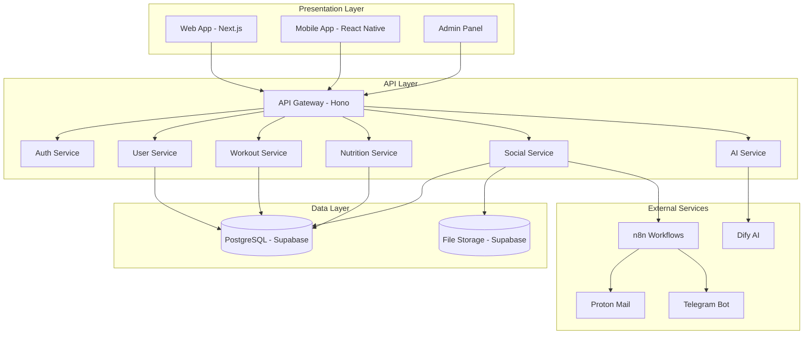

## Data Architecture (Simplified Version)

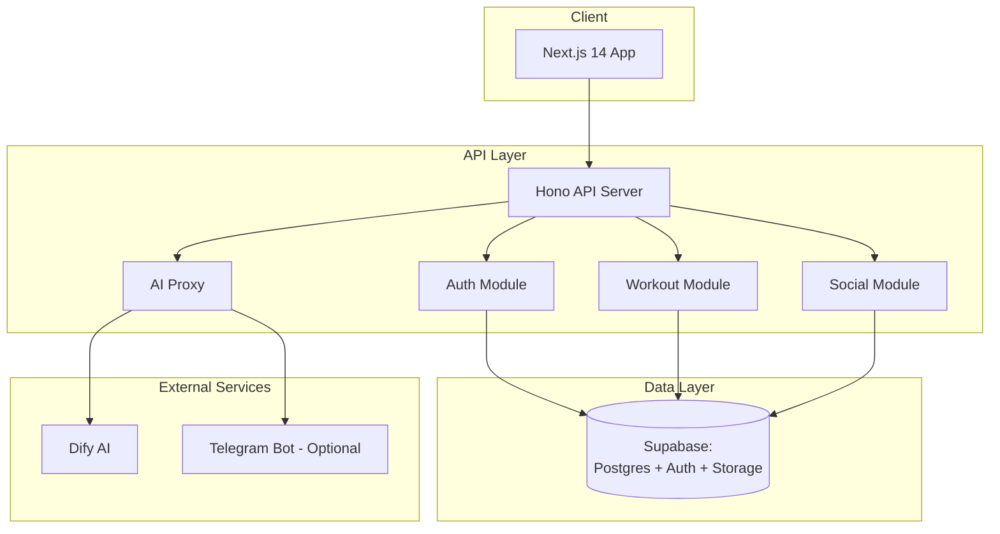

## Database Schema

### Main Tables

```sql
-- users (managed by Supabase Auth)
CREATE TABLE public.profiles (
  id UUID REFERENCES auth.users(id) PRIMARY KEY,
  username TEXT UNIQUE NOT NULL,
  full_name TEXT,
  avatar_url TEXT,
  bio TEXT,
  date_of_birth DATE,
  gender TEXT CHECK (gender IN ('male', 'female', 'other', 'prefer_not_to_say')),
  fitness_level TEXT CHECK (fitness_level IN ('beginner', 'intermediate', 'advanced', 'expert')),
  created_at TIMESTAMPTZ DEFAULT NOW(),
  updated_at TIMESTAMPTZ DEFAULT NOW()
);

-- Detailed personal information
CREATE TABLE public.user_personal_info (
  id UUID PRIMARY KEY DEFAULT gen_random_uuid(),
  user_id UUID REFERENCES profiles(id) ON DELETE CASCADE,
  age INTEGER CHECK (age >= 13 AND age <= 120),
  weight_kg DECIMAL(5,2) CHECK (weight_kg > 0 AND weight_kg < 500),
  height_cm INTEGER CHECK (height_cm > 0 AND height_cm < 300),
  bmi DECIMAL(4,1) CHECK (bmi > 0 AND bmi < 100),
  body_fat_percentage DECIMAL(4,1) CHECK (body_fat_percentage >= 0 AND body_fat_percentage <= 100),
  created_at TIMESTAMPTZ DEFAULT NOW(),
  updated_at TIMESTAMPTZ DEFAULT NOW(),
  UNIQUE(user_id)
);

-- Fitness profile and goals
CREATE TABLE public.user_fitness_profile (
  id UUID PRIMARY KEY DEFAULT gen_random_uuid(),
  user_id UUID REFERENCES profiles(id) ON DELETE CASCADE,
  experience_level TEXT NOT NULL CHECK (experience_level IN ('beginner', 'intermediate', 'advanced', 'expert')),
  primary_goal TEXT NOT NULL CHECK (primary_goal IN ('weight_loss', 'muscle_gain', 'maintain_fitness', 'improve_endurance', 'strength_building', 'flexibility', 'general_health')),
  secondary_goals TEXT[] DEFAULT '{}',
  workout_frequency INTEGER NOT NULL CHECK (workout_frequency >= 1 AND workout_frequency <= 7),
  preferred_workout_duration INTEGER CHECK (preferred_workout_duration > 0 AND preferred_workout_duration <= 300),
  available_equipment TEXT[] DEFAULT '{}' CHECK (available_equipment <@ ARRAY['full_gym', 'home_basic_weights', 'no_equipment', 'cardio_equipment', 'resistance_bands', 'dumbbells', 'barbell', 'kettlebell']),
  workout_preferences JSONB DEFAULT '{}',
  injury_history TEXT[] DEFAULT '{}',
  medical_restrictions TEXT[] DEFAULT '{}',
  fitness_goals_timeline TEXT CHECK (fitness_goals_timeline IN ('1_month', '3_months', '6_months', '1_year', 'long_term')),
  motivation_level INTEGER CHECK (motivation_level >= 1 AND motivation_level <= 10),
  created_at TIMESTAMPTZ DEFAULT NOW(),
  updated_at TIMESTAMPTZ DEFAULT NOW(),
  UNIQUE(user_id)
);

-- Dietary preferences
CREATE TABLE public.user_dietary_preferences (
  id UUID PRIMARY KEY DEFAULT gen_random_uuid(),
  user_id UUID REFERENCES profiles(id) ON DELETE CASCADE,
  dietary_restrictions TEXT[] DEFAULT '{}' CHECK (dietary_restrictions <@ ARRAY['high_protein', 'vegetarian', 'dairy_free', 'low_carb', 'vegan', 'gluten_free', 'keto', 'paleo', 'mediterranean', 'intermittent_fasting']),
  allergies TEXT[] DEFAULT '{}',
  food_preferences JSONB DEFAULT '{}',
  calorie_goal INTEGER CHECK (calorie_goal > 0 AND calorie_goal < 10000),
  protein_goal INTEGER CHECK (protein_goal >= 0 AND protein_goal < 500),
  carb_goal INTEGER CHECK (carb_goal >= 0 AND carb_goal < 1000),
  fat_goal INTEGER CHECK (fat_goal >= 0 AND fat_goal < 500),
  water_intake_goal INTEGER CHECK (water_intake_goal > 0 AND water_intake_goal < 10000),
  meal_frequency INTEGER CHECK (meal_frequency >= 1 AND meal_frequency <= 10),
  created_at TIMESTAMPTZ DEFAULT NOW(),
  updated_at TIMESTAMPTZ DEFAULT NOW(),
  UNIQUE(user_id)
);

-- user_stats
CREATE TABLE public.user_stats (
  id UUID PRIMARY KEY DEFAULT gen_random_uuid(),
  user_id UUID REFERENCES profiles(id) ON DELETE CASCADE,
  height_cm DECIMAL(5,2),
  weight_kg DECIMAL(5,2),
  body_fat_percentage DECIMAL(4,2),
  target_weight_kg DECIMAL(5,2),
  recorded_at TIMESTAMPTZ DEFAULT NOW()
);

-- exercises (exercise library)
CREATE TABLE public.exercises (
  id UUID PRIMARY KEY DEFAULT gen_random_uuid(),
  name TEXT NOT NULL,
  description TEXT,
  muscle_group TEXT NOT NULL,
  equipment TEXT[],
  difficulty TEXT CHECK (difficulty IN ('beginner', 'intermediate', 'advanced')),
  video_url TEXT,
  image_url TEXT,
  is_public BOOLEAN DEFAULT true,
  created_by UUID REFERENCES profiles(id),
  created_at TIMESTAMPTZ DEFAULT NOW()
);

-- workouts
CREATE TABLE public.workouts (
  id UUID PRIMARY KEY DEFAULT gen_random_uuid(),
  user_id UUID REFERENCES profiles(id) ON DELETE CASCADE,
  name TEXT NOT NULL,
  description TEXT,
  type TEXT CHECK (type IN ('strength', 'cardio', 'flexibility', 'hiit', 'mixed', 'custom')),
  difficulty TEXT CHECK (difficulty IN ('beginner', 'intermediate', 'advanced', 'expert')),
  duration_minutes INTEGER CHECK (duration_minutes > 0 AND duration_minutes <= 300),
  is_template BOOLEAN DEFAULT false,
  is_public BOOLEAN DEFAULT false,
  is_shared BOOLEAN DEFAULT false,
  target_goal TEXT CHECK (target_goal IN ('weight_loss', 'muscle_gain', 'maintain_fitness', 'improve_endurance', 'strength_building', 'flexibility', 'general_health')),
  target_level TEXT CHECK (target_level IN ('beginner', 'intermediate', 'advanced', 'expert')),
  days_per_week INTEGER CHECK (days_per_week >= 1 AND days_per_week <= 7),
  equipment_required TEXT[] DEFAULT '{}' CHECK (equipment_required <@ ARRAY['full_gym', 'home_basic_weights', 'no_equipment', 'cardio_equipment', 'resistance_bands', 'dumbbells', 'barbell', 'kettlebell']),
  user_notes TEXT,
  tags TEXT[] DEFAULT '{}',
  share_count INTEGER DEFAULT 0,
  like_count INTEGER DEFAULT 0,
  created_at TIMESTAMPTZ DEFAULT NOW(),
  updated_at TIMESTAMPTZ DEFAULT NOW()
);

-- shared_workouts
CREATE TABLE public.shared_workouts (
  id UUID PRIMARY KEY DEFAULT gen_random_uuid(),
  original_workout_id UUID REFERENCES workouts(id) ON DELETE CASCADE,
  shared_by_user_id UUID REFERENCES profiles(id) ON DELETE CASCADE,
  shared_with_user_id UUID REFERENCES profiles(id) ON DELETE CASCADE,
  shared_at TIMESTAMPTZ DEFAULT NOW(),
  is_accepted BOOLEAN DEFAULT false,
  accepted_at TIMESTAMPTZ,
  UNIQUE(original_workout_id, shared_with_user_id)
);

-- workout_exercises (M2M relationship)
CREATE TABLE public.workout_exercises (
  id UUID PRIMARY KEY DEFAULT gen_random_uuid(),
  workout_id UUID REFERENCES workouts(id) ON DELETE CASCADE,
  exercise_id UUID REFERENCES exercises(id) ON DELETE CASCADE,
  order_index INTEGER NOT NULL,
  sets INTEGER,
  reps INTEGER,
  weight_kg DECIMAL(5,2),
  rest_seconds INTEGER,
  notes TEXT
);

-- workout_sessions (completed sessions)
CREATE TABLE public.workout_sessions (
  id UUID PRIMARY KEY DEFAULT gen_random_uuid(),
  user_id UUID REFERENCES profiles(id) ON DELETE CASCADE,
  workout_id UUID REFERENCES workouts(id) ON DELETE SET NULL,
  started_at TIMESTAMPTZ NOT NULL,
  completed_at TIMESTAMPTZ,
  duration_minutes INTEGER,
  calories_burned INTEGER,
  notes TEXT,
  created_at TIMESTAMPTZ DEFAULT NOW()
);

-- Social features
CREATE TABLE public.posts (
  id UUID PRIMARY KEY DEFAULT gen_random_uuid(),
  user_id UUID REFERENCES profiles(id) ON DELETE CASCADE,
  content TEXT NOT NULL,
  post_type TEXT NOT NULL CHECK (post_type IN ('achievement', 'routine', 'tip', 'progress', 'motivation', 'question', 'general')),
  workout_id UUID REFERENCES workouts(id) ON DELETE SET NULL,
  image_urls TEXT[] DEFAULT '{}',
  video_url TEXT,
  hashtags TEXT[] DEFAULT '{}',
  likes_count INTEGER DEFAULT 0,
  comments_count INTEGER DEFAULT 0,
  shares_count INTEGER DEFAULT 0,
  reposts_count INTEGER DEFAULT 0,
  is_public BOOLEAN DEFAULT true,
  is_original BOOLEAN DEFAULT true, -- false if it's a repost
  original_post_id UUID REFERENCES posts(id) ON DELETE SET NULL, -- for reposts
  shared_from_user_id UUID REFERENCES profiles(id) ON DELETE SET NULL, -- user who originally shared
  created_at TIMESTAMPTZ DEFAULT NOW(),
  updated_at TIMESTAMPTZ DEFAULT NOW()
);

-- shared_posts
CREATE TABLE public.post_shares (
  id UUID PRIMARY KEY DEFAULT gen_random_uuid(),
  post_id UUID REFERENCES posts(id) ON DELETE CASCADE,
  shared_by_user_id UUID REFERENCES profiles(id) ON DELETE CASCADE,
  shared_with_user_id UUID REFERENCES profiles(id) ON DELETE CASCADE,
  share_type TEXT CHECK (share_type IN ('share', 'repost', 'forward')),
  shared_at TIMESTAMPTZ DEFAULT NOW(),
  UNIQUE(post_id, shared_by_user_id, shared_with_user_id)
);

-- reposts
CREATE TABLE public.post_reposts (
  id UUID PRIMARY KEY DEFAULT gen_random_uuid(),
  original_post_id UUID REFERENCES posts(id) ON DELETE CASCADE,
  reposted_by_user_id UUID REFERENCES profiles(id) ON DELETE CASCADE,
  reposted_at TIMESTAMPTZ DEFAULT NOW(),
  UNIQUE(original_post_id, reposted_by_user_id)
);

CREATE TABLE public.follows (
  id UUID PRIMARY KEY DEFAULT gen_random_uuid(),
  follower_id UUID REFERENCES profiles(id) ON DELETE CASCADE,
  following_id UUID REFERENCES profiles(id) ON DELETE CASCADE,
  created_at TIMESTAMPTZ DEFAULT NOW(),
  UNIQUE(follower_id, following_id),
  CHECK (follower_id != following_id)
);

CREATE TABLE public.likes (
  id UUID PRIMARY KEY DEFAULT gen_random_uuid(),
  user_id UUID REFERENCES profiles(id) ON DELETE CASCADE,
  post_id UUID REFERENCES posts(id) ON DELETE CASCADE,
  created_at TIMESTAMPTZ DEFAULT NOW(),
  UNIQUE(user_id, post_id)
);

CREATE TABLE public.comments (
  id UUID PRIMARY KEY DEFAULT gen_random_uuid(),
  user_id UUID REFERENCES profiles(id) ON DELETE CASCADE,
  post_id UUID REFERENCES posts(id) ON DELETE CASCADE,
  content TEXT NOT NULL,
  parent_comment_id UUID REFERENCES comments(id) ON DELETE CASCADE,
  created_at TIMESTAMPTZ DEFAULT NOW(),
  updated_at TIMESTAMPTZ DEFAULT NOW()
);
```

## Row Level Security (RLS)

Implement security policies for each table:
- Profiles: users can read public profiles, update only their own
- Workouts: read public and own, update only own
- Posts: read public, update only own

## Indexes and Optimization

```sql
-- Critical indexes for performance
CREATE INDEX idx_profiles_username ON profiles(username);
CREATE INDEX idx_workouts_user_id ON workouts(user_id);
CREATE INDEX idx_posts_user_id ON posts(user_id);
CREATE INDEX idx_posts_created_at ON posts(created_at DESC);
CREATE INDEX idx_follows_follower ON follows(follower_id);
CREATE INDEX idx_follows_following ON follows(following_id);
```

## Database Schema Diagrams

### Main ER Diagram - Core Entities

```mermaid
erDiagram
    %% === AUTHENTICATION (Supabase Auth) ===
    AUTH_USERS {
        uuid id PK "Supabase Auth User ID"
        text email "User Email"
        timestamptz created_at "Account Creation"
        timestamptz updated_at "Last Update"
        timestamptz last_sign_in_at "Last Login"
        boolean email_confirmed "Email Confirmed"
    }

    %% === MAIN USER PROFILES (Optimized - No Duplication) ===
    PROFILES {
        uuid id PK "References auth.users(id)"
        text username UK "Unique Username"
        text full_name "Full Display Name"
        text avatar_url "Profile Picture URL"
        text bio "User Biography"
        date date_of_birth "Date of Birth"
        text gender "Gender Preference"
        text fitness_level "Fitness Level"
        text timezone "User Timezone"
        text language "Preferred Language"
        boolean is_active "Account Status"
        jsonb preferences "User Preferences"
        jsonb social_links "Social Media Links"
        timestamptz created_at "Profile Creation"
        timestamptz updated_at "Last Update"
    }

    %% === DETAILED PERSONAL INFORMATION ===
    USER_PERSONAL_INFO {
        uuid id PK "Unique ID"
        uuid user_id FK "Reference to profiles"
        integer age "Age (13-120)"
        decimal weight_kg "Weight in kg"
        integer height_cm "Height in cm"
        decimal bmi "Calculated BMI"
        decimal body_fat_percentage "Body Fat %"
        timestamptz created_at "Creation Date"
        timestamptz updated_at "Last Update"
    }

    USER_FITNESS_PROFILE {
        uuid id PK "Unique ID"
        uuid user_id FK "Reference to profiles"
        text experience_level "Experience Level"
        text primary_goal "Primary Fitness Goal"
        text[] secondary_goals "Secondary Goals"
        integer workout_frequency "Days per Week"
        integer preferred_workout_duration "Duration in Minutes"
        text[] available_equipment "Available Equipment"
        jsonb workout_preferences "Workout Preferences"
        text[] injury_history "Injury History"
        text[] medical_restrictions "Medical Restrictions"
        text fitness_goals_timeline "Goals Timeline"
        integer motivation_level "Motivation Level (1-10)"
        timestamptz created_at "Creation Date"
        timestamptz updated_at "Last Update"
    }

    USER_DIETARY_PREFERENCES {
        uuid id PK "Unique ID"
        uuid user_id FK "Reference to profiles"
        text[] dietary_restrictions "Dietary Restrictions"
        text[] allergies "Food Allergies"
        text[] preferred_cuisines "Preferred Cuisines"
        text[] disliked_foods "Disliked Foods"
        integer daily_calorie_target "Daily Calorie Target"
        decimal protein_target_percentage "Protein Target %"
        decimal carb_target_percentage "Carb Target %"
        decimal fat_target_percentage "Fat Target %"
        text meal_preferences "Meal Preferences"
        timestamptz created_at "Creation Date"
        timestamptz updated_at "Last Update"
    }

    USER_STATS {
        uuid id PK "Unique ID"
        uuid user_id FK "Reference to profiles"
        decimal height_cm "Height in cm"
        decimal weight_kg "Weight in kg"
        decimal body_fat_percentage "Body Fat %"
        decimal target_weight_kg "Target Weight"
        timestamptz recorded_at "Record Date"
    }

    %% === EXERCISES AND WORKOUTS ===
    EXERCISES {
        uuid id PK "Unique ID"
        text name "Exercise Name"
        text description "Detailed Description"
        text muscle_group "Primary Muscle Group"
        text[] muscle_groups "Secondary Muscle Groups"
        text[] equipment "Required Equipment"
        text difficulty "Difficulty Level"
        text instructions "Execution Instructions"
        text video_url "Demo Video URL"
        text image_url "Image URL"
        text[] tags "Exercise Tags"
        boolean is_public "Public Visibility"
        uuid created_by FK "Exercise Creator"
        timestamptz created_at "Creation Date"
        timestamptz updated_at "Last Update"
    }

    WORKOUTS {
        uuid id PK "Unique ID"
        uuid user_id FK "Reference to profiles"
        text name "Workout Name"
        text description "Workout Description"
        text type "Workout Type"
        text difficulty "Workout Difficulty"
        integer duration_minutes "Duration in Minutes"
        boolean is_template "Is Template"
        boolean is_public "Public Visibility"
        boolean is_shared "Is Shared"
        text target_goal "Workout Target Goal"
        text target_level "Target Level"
        integer days_per_week "Days per Week"
        text[] equipment_required "Required Equipment"
        text user_notes "User Notes"
        text[] tags "Workout Tags"
        integer share_count "Share Counter"
        integer like_count "Like Counter"
        timestamptz created_at "Creation Date"
        timestamptz updated_at "Last Update"
    }

    SHARED_WORKOUTS {
        uuid id PK "Unique ID"
        uuid original_workout_id FK "Reference to original workout"
        uuid shared_by_user_id FK "User who shares"
        uuid shared_with_user_id FK "User who receives"
        timestamptz shared_at "Share Date"
        boolean is_accepted "Accepted by Recipient"
        timestamptz accepted_at "Acceptance Date"
    }

    WORKOUT_EXERCISES {
        uuid id PK "Unique ID"
        uuid workout_id FK "Reference to workout"
        uuid exercise_id FK "Reference to exercise"
        integer order_index "Order in Workout"
        integer sets "Number of Sets"
        integer reps "Number of Repetitions"
        decimal weight_kg "Weight in kg"
        integer rest_seconds "Rest in Seconds"
        text notes "Specific Notes"
    }

    WORKOUT_SESSIONS {
        uuid id PK "Unique ID"
        uuid user_id FK "Reference to profiles"
        uuid workout_id FK "Reference to workout"
        timestamptz started_at "Start Time"
        timestamptz completed_at "Completion Time"
        integer duration_minutes "Duration in Minutes"
        integer calories_burned "Calories Burned"
        text notes "Session Notes"
        timestamptz created_at "Creation Date"
    }

    %% === SOCIAL FEATURES ===
    POSTS {
        uuid id PK "Unique ID"
        uuid user_id FK "Reference to profiles"
        text content "Post Content"
        text post_type "Post Type"
        uuid workout_id FK "Reference to workout (optional)"
        text[] image_urls "Image URLs"
        text video_url "Video URL"
        text[] hashtags "Post Hashtags"
        integer likes_count "Likes Counter"
        integer comments_count "Comments Counter"
        integer shares_count "Shares Counter"
        integer reposts_count "Reposts Counter"
        boolean is_public "Public Visibility"
        boolean is_original "Is Original Content"
        uuid original_post_id FK "Reference to original post (reposts)"
        uuid shared_from_user_id FK "User who originally shared"
        timestamptz created_at "Creation Date"
        timestamptz updated_at "Last Update"
    }

    POST_LIKES {
        uuid id PK "Unique ID"
        uuid user_id FK "Reference to profiles"
        uuid post_id FK "Reference to post"
        timestamptz created_at "Creation Date"
    }

    POST_COMMENTS {
        uuid id PK "Unique ID"
        uuid user_id FK "Reference to profiles"
        uuid post_id FK "Reference to post"
        text content "Comment Content"
        uuid parent_comment_id FK "Reference to parent comment (replies)"
        timestamptz created_at "Creation Date"
        timestamptz updated_at "Last Update"
    }

    POST_SHARES {
        uuid id PK "Unique ID"
        uuid post_id FK "Reference to post"
        uuid shared_by_user_id FK "User who shares"
        uuid shared_with_user_id FK "User who receives"
        text share_type "Share Type"
        timestamptz shared_at "Share Date"
    }

    POST_REPOSTS {
        uuid id PK "Unique ID"
        uuid original_post_id FK "Reference to original post"
        uuid reposted_by_user_id FK "User who reposts"
        timestamptz reposted_at "Repost Date"
    }

    %% === FOLLOW SYSTEM ===
    FOLLOWS {
        uuid id PK "Unique ID"
        uuid follower_id FK "User who follows"
        uuid following_id FK "User being followed"
        timestamptz created_at "Follow Date"
    }

    %% === USER CONFIGURATION ===
    USER_SETTINGS {
        uuid id PK "Unique ID"
        uuid user_id FK "Reference to profiles"
        boolean email_notifications "Email Notifications"
        boolean push_notifications "Push Notifications"
        boolean workout_reminders "Workout Reminders"
        text timezone "Timezone"
        text language "Preferred Language"
        text theme "App Theme"
        boolean profile_visibility "Profile Visibility"
        boolean workout_visibility "Workout Visibility"
        boolean progress_visibility "Progress Visibility"
        timestamptz created_at "Creation Date"
        timestamptz updated_at "Last Update"
    }

    %% === MAIN RELATIONSHIPS ===
    %% Authentication and Profiles
    AUTH_USERS ||--|| PROFILES : "authenticates"

    %% User and Personal Information
    PROFILES ||--o{ USER_PERSONAL_INFO : "has"
    PROFILES ||--o{ USER_FITNESS_PROFILE : "has"
    PROFILES ||--o{ USER_DIETARY_PREFERENCES : "has"
    PROFILES ||--o{ USER_STATS : "records"
    PROFILES ||--|| USER_SETTINGS : "configures"

    %% User and Content
    PROFILES ||--o{ EXERCISES : "creates"
    PROFILES ||--o{ WORKOUTS : "creates"
    PROFILES ||--o{ POSTS : "publishes"
    PROFILES ||--o{ WORKOUT_SESSIONS : "performs"

    %% Social System
    PROFILES ||--o{ FOLLOWS : "follows"
    PROFILES ||--o{ FOLLOWS : "followed_by"
    PROFILES ||--o{ POST_LIKES : "likes"
    PROFILES ||--o{ POST_COMMENTS : "comments"
    PROFILES ||--o{ POST_SHARES : "shares"
    PROFILES ||--o{ POST_REPOSTS : "reposts"
    PROFILES ||--o{ SHARED_WORKOUTS : "shares_workout"
    PROFILES ||--o{ SHARED_WORKOUTS : "receives_workout"

    %% Workouts and Exercises
    WORKOUTS ||--o{ WORKOUT_EXERCISES : "contains"
    EXERCISES ||--o{ WORKOUT_EXERCISES : "included_in"
    WORKOUTS ||--o{ WORKOUT_SESSIONS : "executed_as"
    WORKOUTS ||--o{ SHARED_WORKOUTS : "shared_as"
    WORKOUTS ||--o{ POSTS : "featured_in"

    %% Posts and Interactions
    POSTS ||--o{ POST_LIKES : "receives_likes"
    POSTS ||--o{ POST_COMMENTS : "has_comments"
    POSTS ||--o{ POST_SHARES : "is_shared"
    POSTS ||--o{ POST_REPOSTS : "is_reposted"
    POST_COMMENTS ||--o{ POST_COMMENTS : "replies_to"

    %% Sharing Relationships
    POSTS ||--o{ POST_SHARES : "shared_via"
    POSTS ||--o{ POST_REPOSTS : "reposted_as"
```

### Social Relationships Diagram

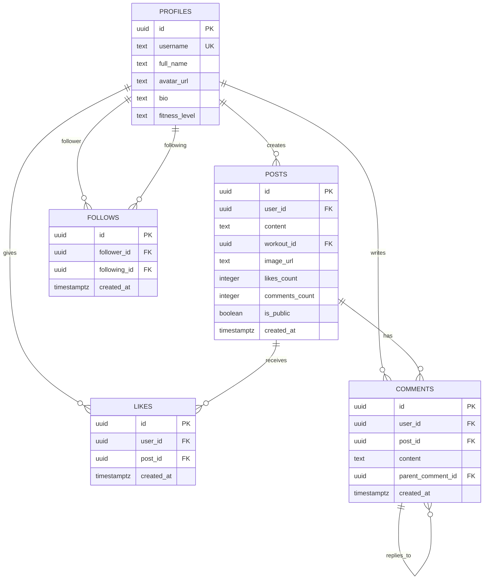

### Workouts and Exercises Diagram

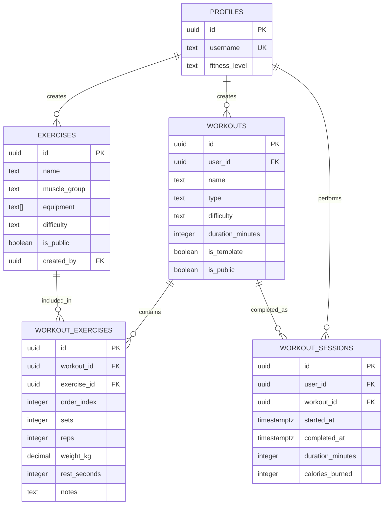

### User Statistics Diagram

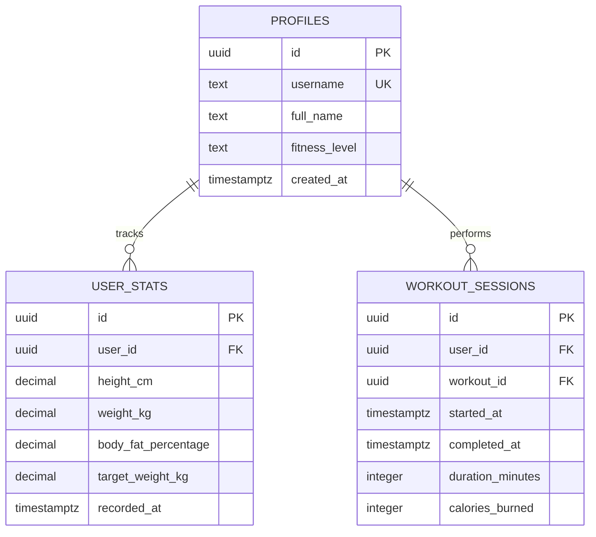

### Indexes and Performance Diagram

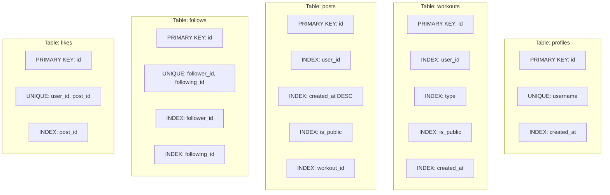

### Row Level Security (RLS) Diagram

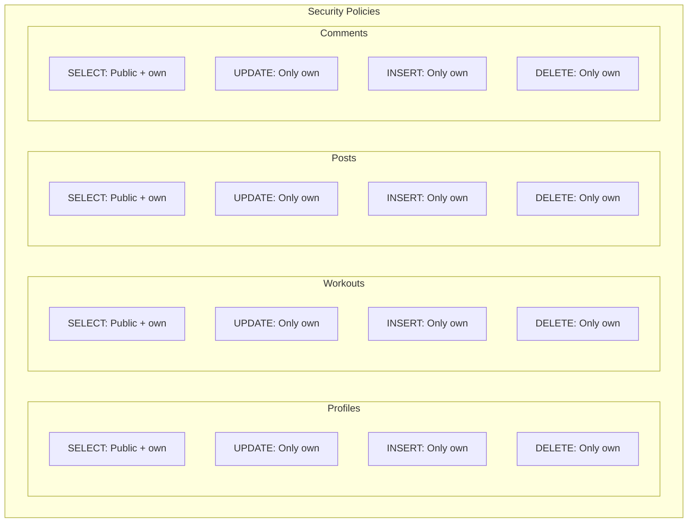

## Database Data Flow

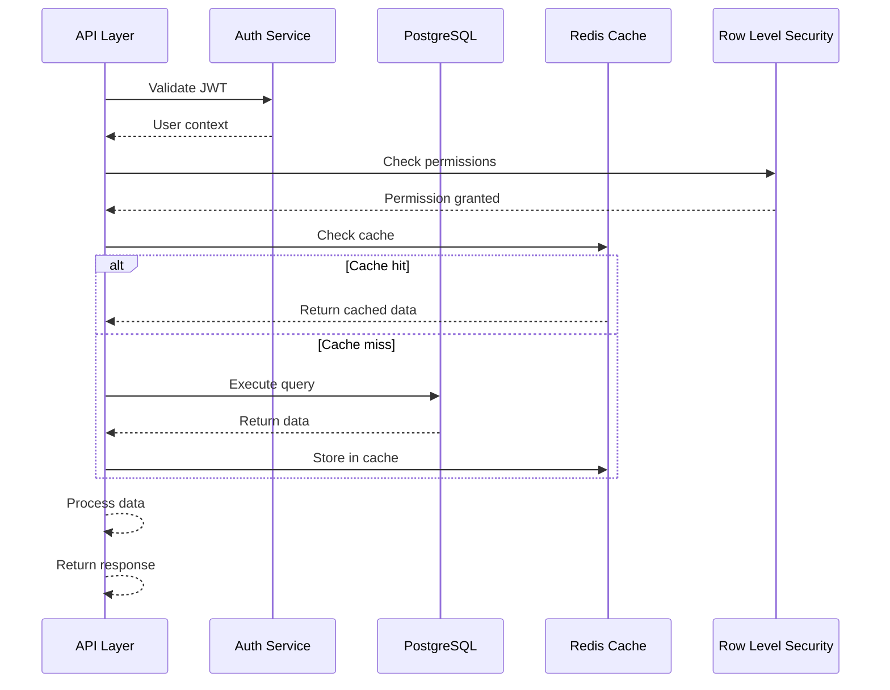

## Migration Strategy

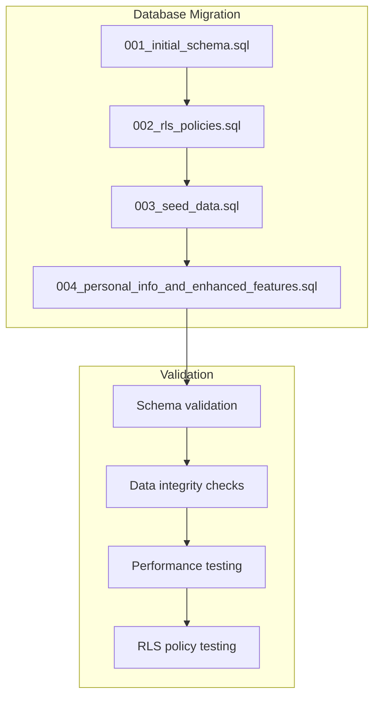

## Query Optimization

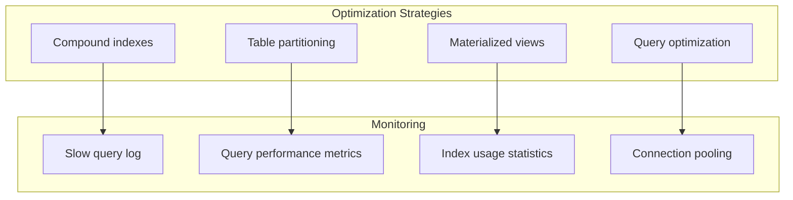
