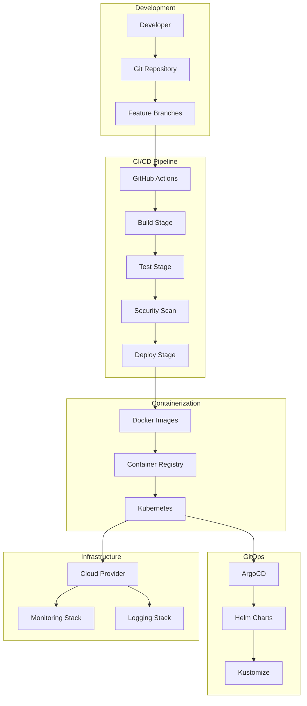
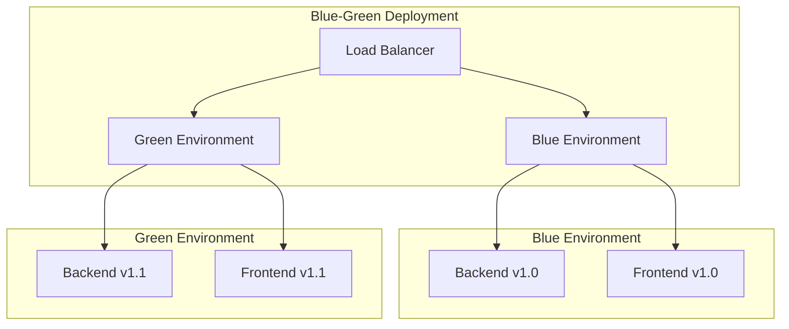
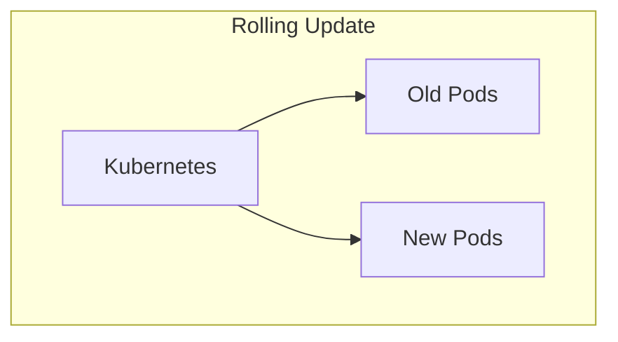

# DevOps, CI/CD and GitOps 🚀

## DevOps Architecture



## CI/CD Pipeline

```yaml
# .github/workflows/ci-cd.yml
name: CI/CD Pipeline

on:
  push:
    branches: [main, develop]
  pull_request:
    branches: [main]

env:
  REGISTRY: ghcr.io
  IMAGE_NAME: ${{ github.repository }}

jobs:
  test:
    runs-on: ubuntu-latest
    steps:
      - uses: actions/checkout@v4
      
      - name: Setup Node.js
        uses: actions/setup-node@v4
        with:
          node-version: '20'
          cache: 'npm'
      
      - name: Install dependencies
        run: npm ci
      
      - name: Run linting
        run: npm run lint
      
      - name: Run tests
        run: npm run test:coverage
      
      - name: Upload coverage
        uses: codecov/codecov-action@v3
        with:
          file: ./coverage/lcov.info

  build:
    needs: test
    runs-on: ubuntu-latest
    steps:
      - uses: actions/checkout@v4
      
      - name: Setup Node.js
        uses: actions/setup-node@v4
        with:
          node-version: '20'
          cache: 'npm'
      
      - name: Install dependencies
        run: npm ci
      
      - name: Build application
        run: npm run build
      
      - name: Build Docker image
        run: |
          docker build -t ${{ env.REGISTRY }}/${{ env.IMAGE_NAME }}:${{ github.sha }} .
          docker build -t ${{ env.REGISTRY }}/${{ env.IMAGE_NAME }}:latest .
      
      - name: Push to registry
        run: |
          echo ${{ secrets.GITHUB_TOKEN }} | docker login ${{ env.REGISTRY }} -u ${{ github.actor }} --password-stdin
          docker push ${{ env.REGISTRY }}/${{ env.IMAGE_NAME }}:${{ github.sha }}
          docker push ${{ env.REGISTRY }}/${{ env.IMAGE_NAME }}:latest

  deploy:
    needs: build
    runs-on: ubuntu-latest
    if: github.ref == 'refs/heads/main'
    steps:
      - uses: actions/checkout@v4
      
      - name: Deploy to Kubernetes
        run: |
          # Deploy using ArgoCD or kubectl
          kubectl apply -f k8s/
```

## Docker Configuration

### Backend Dockerfile
```dockerfile
# backend/Dockerfile
FROM node:20-alpine AS builder

WORKDIR /app
COPY package*.json ./
RUN npm ci --only=production

FROM node:20-alpine AS runtime
WORKDIR /app

COPY --from=builder /app/node_modules ./node_modules
COPY . .

EXPOSE 3000
CMD ["npm", "start"]
```

### Frontend Dockerfile
```dockerfile
# frontend/Dockerfile
FROM node:20-alpine AS builder

WORKDIR /app
COPY package*.json ./
RUN npm ci

COPY . .
RUN npm run build

FROM nginx:alpine AS runtime
COPY --from=builder /app/dist /usr/share/nginx/html
COPY nginx.conf /etc/nginx/nginx.conf

EXPOSE 80
CMD ["nginx", "-g", "daemon off;"]
```

### Docker Compose for Development
```yaml
# docker-compose.yml
version: '3.8'

services:
  backend:
    build: ./backend
    ports:
      - "3000:3000"
    environment:
      - NODE_ENV=development
      - DATABASE_URL=postgresql://postgres:password@db:5432/gympal
    depends_on:
      - db

  frontend:
    build: ./frontend
    ports:
      - "3001:80"
    depends_on:
      - backend

  db:
    image: postgres:15
    environment:
      - POSTGRES_DB=gympal
      - POSTGRES_USER=postgres
      - POSTGRES_PASSWORD=password
    ports:
      - "5432:5432"
    volumes:
      - postgres_data:/var/lib/postgresql/data

volumes:
  postgres_data:
```

## Kubernetes Configuration

### Namespace
```yaml
# k8s/namespace.yaml
apiVersion: v1
kind: Namespace
metadata:
  name: gympal
```

### Backend Deployment
```yaml
# k8s/backend-deployment.yaml
apiVersion: apps/v1
kind: Deployment
metadata:
  name: gympal-backend
  namespace: gympal
spec:
  replicas: 3
  selector:
    matchLabels:
      app: gympal-backend
  template:
    metadata:
      labels:
        app: gympal-backend
    spec:
      containers:
      - name: backend
        image: ghcr.io/username/gympal:latest
        ports:
        - containerPort: 3000
        env:
        - name: NODE_ENV
          value: "production"
        - name: DATABASE_URL
          valueFrom:
            secretKeyRef:
              name: gympal-secrets
              key: database-url
        resources:
          requests:
            memory: "256Mi"
            cpu: "250m"
          limits:
            memory: "512Mi"
            cpu: "500m"
```

### Frontend Deployment
```yaml
# k8s/frontend-deployment.yaml
apiVersion: apps/v1
kind: Deployment
metadata:
  name: gympal-frontend
  namespace: gympal
spec:
  replicas: 3
  selector:
    matchLabels:
      app: gympal-frontend
  template:
    metadata:
      labels:
        app: gympal-frontend
    spec:
      containers:
      - name: frontend
        image: ghcr.io/username/gympal-frontend:latest
        ports:
        - containerPort: 80
        resources:
          requests:
            memory: "128Mi"
            cpu: "100m"
          limits:
            memory: "256Mi"
            cpu: "200m"
```

### Services
```yaml
# k8s/services.yaml
apiVersion: v1
kind: Service
metadata:
  name: gympal-backend-service
  namespace: gympal
spec:
  selector:
    app: gympal-backend
  ports:
  - port: 80
    targetPort: 3000
  type: ClusterIP

---
apiVersion: v1
kind: Service
metadata:
  name: gympal-frontend-service
  namespace: gympal
spec:
  selector:
    app: gympal-frontend
  ports:
  - port: 80
    targetPort: 80
  type: ClusterIP
```

### Ingress
```yaml
# k8s/ingress.yaml
apiVersion: networking.k8s.io/v1
kind: Ingress
metadata:
  name: gympal-ingress
  namespace: gympal
  annotations:
    nginx.ingress.kubernetes.io/rewrite-target: /
spec:
  rules:
  - host: gympal.local
    http:
      paths:
      - path: /api
        pathType: Prefix
        backend:
          service:
            name: gympal-backend-service
            port:
              number: 80
      - path: /
        pathType: Prefix
        backend:
          service:
            name: gympal-frontend-service
            port:
              number: 80
```

## ArgoCD Configuration

### Application
```yaml
# argocd/gympal-app.yaml
apiVersion: argoproj.io/v1alpha1
kind: Application
metadata:
  name: gympal
  namespace: argocd
spec:
  project: default
  source:
    repoURL: https://github.com/username/gympal
    targetRevision: HEAD
    path: k8s
  destination:
    server: https://kubernetes.default.svc
    namespace: gympal
  syncPolicy:
    automated:
      prune: true
      selfHeal: true
    syncOptions:
    - CreateNamespace=true
```

## Helm Charts

### Chart.yaml
```yaml
# helm/gympal/Chart.yaml
apiVersion: v2
name: gympal
description: GymPal Fitness Application
type: application
version: 0.1.0
appVersion: "1.0.0"
```

### values.yaml
```yaml
# helm/gympal/values.yaml
replicaCount: 3

image:
  repository: ghcr.io/username/gympal
  tag: latest
  pullPolicy: IfNotPresent

service:
  type: ClusterIP
  port: 80

ingress:
  enabled: true
  className: nginx
  annotations: {}
  hosts:
    - host: gympal.local
      paths:
        - path: /
          pathType: Prefix
  tls: []

resources:
  limits:
    cpu: 500m
    memory: 512Mi
  requests:
    cpu: 250m
    memory: 256Mi

autoscaling:
  enabled: false
  minReplicas: 3
  maxReplicas: 10
  targetCPUUtilizationPercentage: 80
```

## Deployment Scripts

# Build and push images
echo "📦 Building Docker images..."
docker build -t ghcr.io/username/gympal:latest ./backend
docker build -t ghcr.io/username/gympal-frontend:latest ./frontend


## Deployment Strategy

### Blue-Green Deployment


### Rolling Update


---


---

## 📊 **Monitoring Configuration**

### Prometheus Config
```yaml
# monitoring/prometheus-config.yaml
apiVersion: v1
kind: ConfigMap
metadata:
  name: prometheus-config
  namespace: monitoring
data:
  prometheus.yml: |
    global:
      scrape_interval: 15s
      evaluation_interval: 15s

    rule_files:
      - "rules/*.yml"

    scrape_configs:
      - job_name: 'kubernetes-pods'
        kubernetes_sd_configs:
          - role: pod
        relabel_configs:
          - source_labels: [__meta_kubernetes_pod_annotation_prometheus_io_scrape]
            action: keep
            regex: true
          - source_labels: [__meta_kubernetes_pod_annotation_prometheus_io_path]
            action: replace
            target_label: __metrics_path__
            regex: (.+)
          - source_labels: [__address__, __meta_kubernetes_pod_annotation_prometheus_io_port]
            action: replace
            regex: ([^:]+)(?::\d+)?;(\d+)
            replacement: $1:$2
            target_label: __address__
          - action: labelmap
            regex: __meta_kubernetes_pod_label_(.+)
          - source_labels: [__meta_kubernetes_namespace]
            action: replace
            target_label: kubernetes_namespace
          - source_labels: [__meta_kubernetes_pod_name]
            action: replace
            target_label: kubernetes_pod_name

      - job_name: 'kubernetes-nodes'
        kubernetes_sd_configs:
          - role: node
        relabel_configs:
          - action: labelmap
            regex: __meta_kubernetes_node_label_(.+)
          - target_label: __address__
            replacement: kubernetes.default.svc:443
          - source_labels: [__meta_kubernetes_node_name]
            regex: (.+)
            target_label: __metrics_path__
            replacement: /api/v1/nodes/${1}/proxy/metrics

      - job_name: 'gympal-backend'
        static_configs:
          - targets: ['gympal-backend-service:80']
        metrics_path: '/metrics'
        scrape_interval: 5s

      - job_name: 'gympal-frontend'
        static_configs:
          - targets: ['gympal-frontend-service:80']
        metrics_path: '/api/metrics'
        scrape_interval: 10s
```

### Grafana Dashboard
```yaml
# monitoring/grafana-dashboard.yaml
apiVersion: v1
kind: ConfigMap
metadata:
  name: gympal-dashboard
  namespace: monitoring
data:
  dashboard.json: |
    {
      "dashboard": {
        "title": "GymPal Monitoring Dashboard",
        "panels": [
          {
            "title": "Request Rate",
            "type": "graph",
            "targets": [
              {
                "expr": "rate(http_requests_total[5m])",
                "legendFormat": "{{method}} {{endpoint}}"
              }
            ]
          },
          {
            "title": "Response Time",
            "type": "graph",
            "targets": [
              {
                "expr": "histogram_quantile(0.95, rate(http_request_duration_seconds_bucket[5m]))",
                "legendFormat": "95th percentile"
              }
            ]
          },
          {
            "title": "Error Rate",
            "type": "graph",
            "targets": [
              {
                "expr": "rate(http_requests_total{status=~\"5..\"}[5m])",
                "legendFormat": "5xx errors"
              }
            ]
          },
          {
            "title": "Active Users",
            "type": "stat",
            "targets": [
              {
                "expr": "sum(active_users_total)",
                "legendFormat": "Active Users"
              }
            ]
          }
        ]
      }
    }
```

### Grafana Alerts
```yaml
# monitoring/grafana-alerts.yaml
apiVersion: v1
kind: ConfigMap
metadata:
  name: grafana-alerts
  namespace: monitoring
data:
  alerts.yaml: |
    groups:
    - name: gympal-alerts
      rules:
      - alert: HighErrorRate
        expr: rate(http_requests_total{status=~"5.."}[5m]) > 0.1
        for: 5m
        labels:
          severity: warning
        annotations:
          summary: "High error rate detected"
          description: "Error rate is {{ $value }} errors per second"

      - alert: HighMemoryUsage
        expr: (node_memory_MemTotal_bytes - node_memory_MemAvailable_bytes) / node_memory_MemTotal_bytes > 0.9
        for: 5m
        labels:
          severity: critical
        annotations:
          summary: "High memory usage"
          description: "Memory usage is {{ $value | humanizePercentage }}"

      - alert: PodCrashLooping
        expr: rate(kube_pod_container_status_restarts_total[15m]) > 0
        for: 5m
        labels:
          severity: warning
        annotations:
          summary: "Pod is crash looping"
          description: "Pod {{ $labels.pod }} is restarting frequently"

      - alert: DatabaseConnectionHigh
        expr: rate(database_connections_total[5m]) > 10
        for: 5m
        labels:
          severity: warning
        annotations:
          summary: "High database connection rate"
          description: "Database connections are {{ $value }} per second"

      - alert: ResponseTimeHigh
        expr: histogram_quantile(0.95, rate(http_request_duration_seconds_bucket[5m])) > 2
        for: 5m
        labels:
          severity: warning
        annotations:
          summary: "High response time"
          description: "95th percentile response time is {{ $value }}s"
```

### Logging with Loki
```yaml
# monitoring/loki-config.yaml
apiVersion: v1
kind: ConfigMap
metadata:
  name: loki-config
  namespace: monitoring
data:
  loki.yml: |
    auth_enabled: false

    server:
      http_listen_port: 3100

    ingester:
      lifecycler:
        address: 127.0.0.1
        ring:
          kvstore:
            store: inmemory
          replication_factor: 1
        final_sleep: 0s
      chunk_idle_period: 5m
      chunk_retain_period: 30s

    schema_config:
      configs:
        - from: 2020-10-24
          store: boltdb
          object_store: filesystem
          schema: v11
          index:
            prefix: index_
            period: 168h

    storage_config:
      boltdb:
        directory: /tmp/loki/index

      filesystem:
        directory: /tmp/loki/chunks

    limits_config:
      enforce_metric_name: false
      reject_old_samples: true
      reject_old_samples_max_age: 168h
```

---

## 🔔 **Production Alerts and Notifications**

### AlertManager Configuration
```yaml
# monitoring/alertmanager-config.yaml
apiVersion: v1
kind: ConfigMap
metadata:
  name: alertmanager-config
  namespace: monitoring
data:
  alertmanager.yml: |
    global:
      smtp_smarthost: 'smtp.gmail.com:587'
      smtp_from: 'alerts@gympal.app'
      smtp_auth_username: 'alerts@gympal.app'
      smtp_auth_password: 'your-app-password'

    route:
      group_by: ['alertname']
      group_wait: 10s
      group_interval: 10s
      repeat_interval: 1h
      receiver: 'web.hook'
      routes:
      - match:
          severity: critical
        receiver: 'critical-alerts'
      - match:
          severity: warning
        receiver: 'warning-alerts'

    receivers:
    - name: 'web.hook'
      webhook_configs:
      - url: 'http://127.0.0.1:5001/'

    - name: 'critical-alerts'
      email_configs:
      - to: 'devops@gympal.app'
        subject: '[CRITICAL] GymPal Alert: {{ .GroupLabels.alertname }}'
        body: |
          {{ range .Alerts }}
          Alert: {{ .Annotations.summary }}
          Description: {{ .Annotations.description }}
          {{ end }}

    - name: 'warning-alerts'
      email_configs:
      - to: 'team@gympal.app'
        subject: '[WARNING] GymPal Alert: {{ .GroupLabels.alertname }}'
        body: |
          {{ range .Alerts }}
          Alert: {{ .Annotations.summary }}
          Description: {{ .Annotations.description }}
          {{ end }}
```

### Slack Notifications
```yaml
# monitoring/slack-notifications.yaml
apiVersion: v1
kind: ConfigMap
metadata:
  name: slack-notifications
  namespace: monitoring
data:
  slack-config.yaml: |
    receivers:
    - name: 'slack-critical'
      slack_configs:
      - api_url: 'https://hooks.slack.com/services/YOUR/SLACK/WEBHOOK'
        channel: '#gympal-alerts'
        title: 'GymPal Critical Alert'
        text: |
          *Alert:* {{ .GroupLabels.alertname }}
          *Severity:* {{ .GroupLabels.severity }}
          *Description:* {{ range .Alerts }}{{ .Annotations.description }}{{ end }}

    - name: 'slack-warning'
      slack_configs:
      - api_url: 'https://hooks.slack.com/services/YOUR/SLACK/WEBHOOK'
        channel: '#gympal-warnings'
        title: 'GymPal Warning'
        text: |
          *Alert:* {{ .GroupLabels.alertname }}
          *Severity:* {{ .GroupLabels.severity }}
          *Description:* {{ range .Alerts }}{{ .Annotations.description }}{{ end }}
```

### Health Checks and Uptime
```yaml
# monitoring/health-checks.yaml
apiVersion: v1
kind: ConfigMap
metadata:
  name: health-checks
  namespace: monitoring
data:
  health-check.sh: |
    #!/bin/bash
    
    # Health check endpoints
    BACKEND_URL="http://gympal-backend-service:80/health"
    FRONTEND_URL="http://gympal-frontend-service:80/health"
    DATABASE_URL="postgresql://user:pass@db:5432/gympal"
    
    # Check backend
    if ! curl -f $BACKEND_URL > /dev/null 2>&1; then
        echo "Backend health check failed"
        exit 1
    fi
    
    # Check frontend
    if ! curl -f $FRONTEND_URL > /dev/null 2>&1; then
        echo "Frontend health check failed"
        exit 1
    fi
    
    # Check database
    if ! pg_isready -h db -p 5432 > /dev/null 2>&1; then
        echo "Database health check failed"
        exit 1
    fi
    
    echo "All health checks passed"
    exit 0
```

### Business Metrics
```yaml
# monitoring/business-metrics.yaml
apiVersion: v1
kind: ConfigMap
metadata:
  name: business-metrics
  namespace: monitoring
data:
  business-metrics.yaml: |
    metrics:
      - name: active_users_total
        type: counter
        help: "Total number of active users"
        
      - name: workouts_created_total
        type: counter
        help: "Total number of workouts created"
        
      - name: posts_created_total
        type: counter
        help: "Total number of posts created"
        
      - name: ai_requests_total
        type: counter
        help: "Total number of AI requests"
        
      - name: user_engagement_score
        type: gauge
        help: "User engagement score"
        
      - name: api_response_time_seconds
        type: histogram
        help: "API response time in seconds"
        
      - name: database_connections_active
        type: gauge
        help: "Number of active database connections"
```
