# Mermaid Diagrams - GymPal 🎨

## 📊 **Diagrams Index**

This document contains all Mermaid diagrams used in the GymPal documentation, organized by categories for easy navigation.

---

## 🏗️ **System Architecture**

### 1. General Architecture
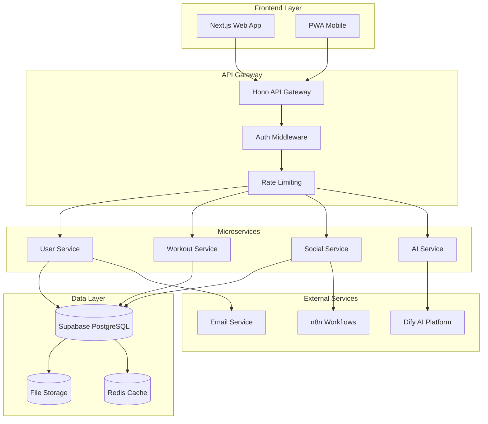

### 2. Microservices Architecture
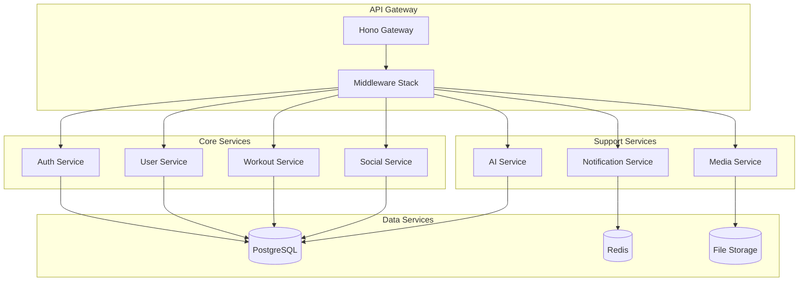

---

## 🗄️ **Database**

### 1. Main ER Diagram - Core Entities
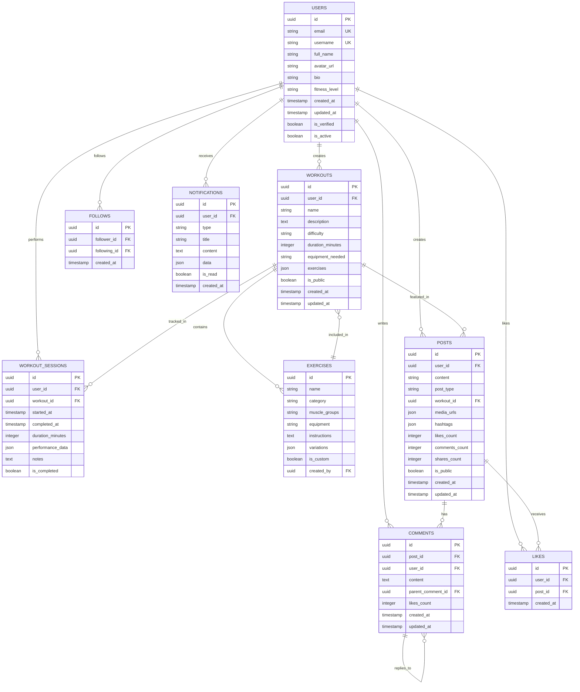

### 2. Detailed Database Schema
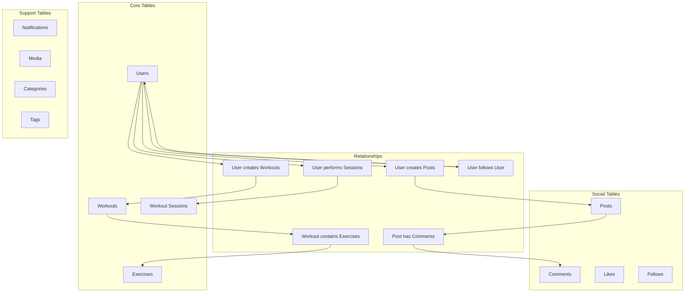

---

## 🔄 **Communication Flows**

### 1. Authentication Flow
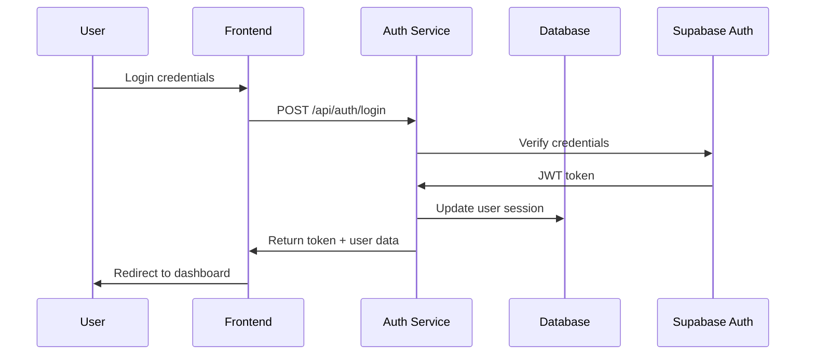

### 2. Workout Creation Flow
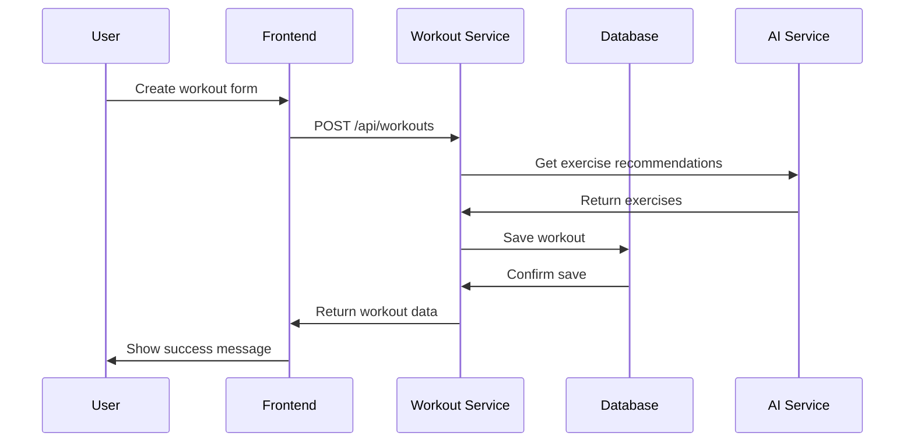

### 3. Social Feed Flow
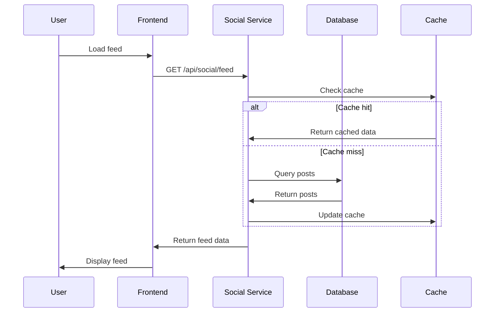

---

## 🎯 **System States**

### 1. User States
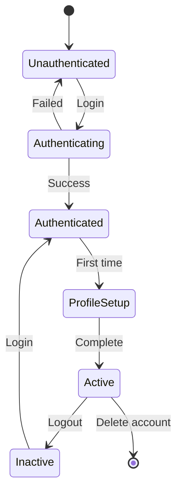

### 2. Workout States
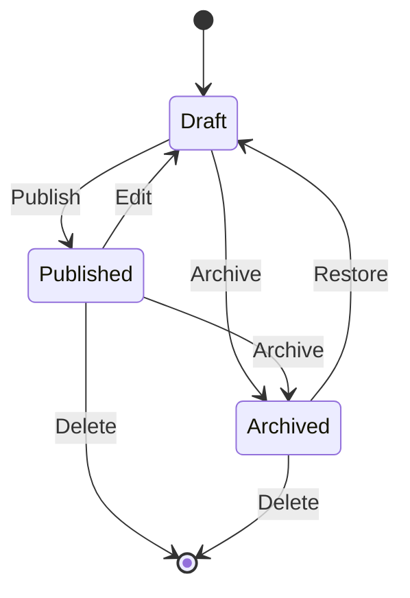

### 3. Post States
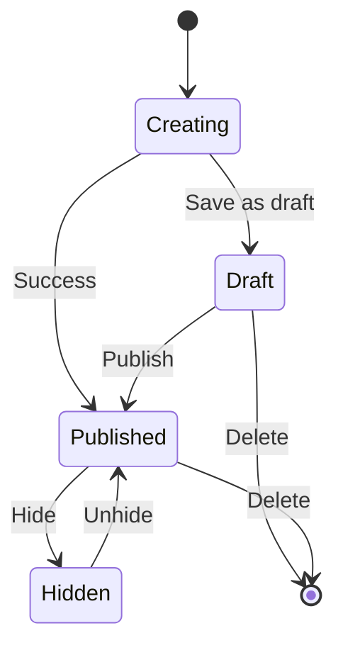

---

## 🚀 **DevOps and Deployment**

### 1. Pipeline CI/CD
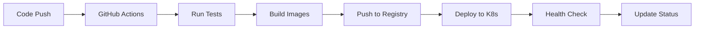

### 2. Deployment Strategy
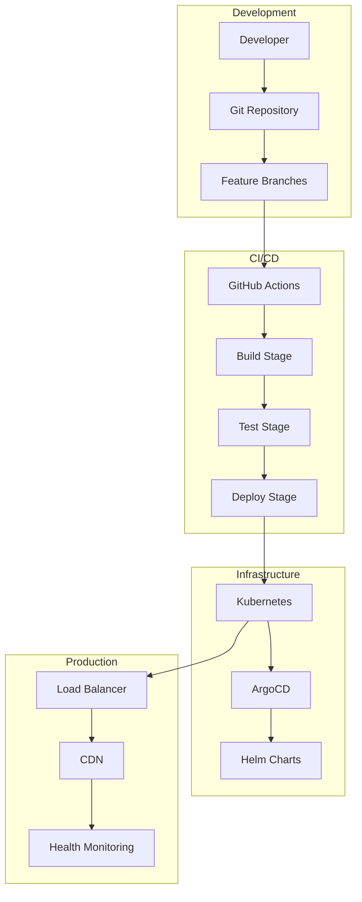

### 3. ArgoCD Deployment Flow
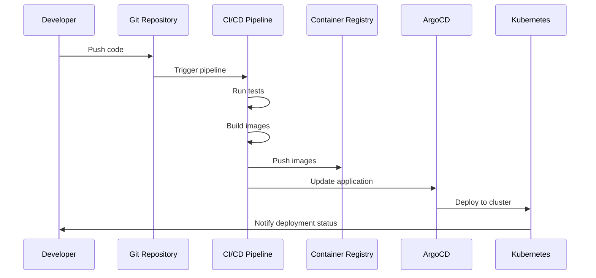

---

## 🔐 **Security**

### 1. Authentication and Authorization Flow
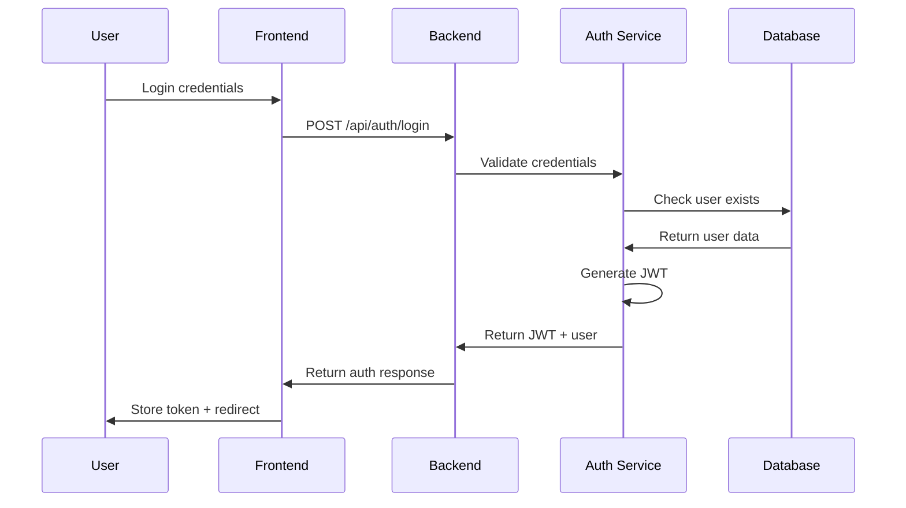

### 2. Authorization Flow
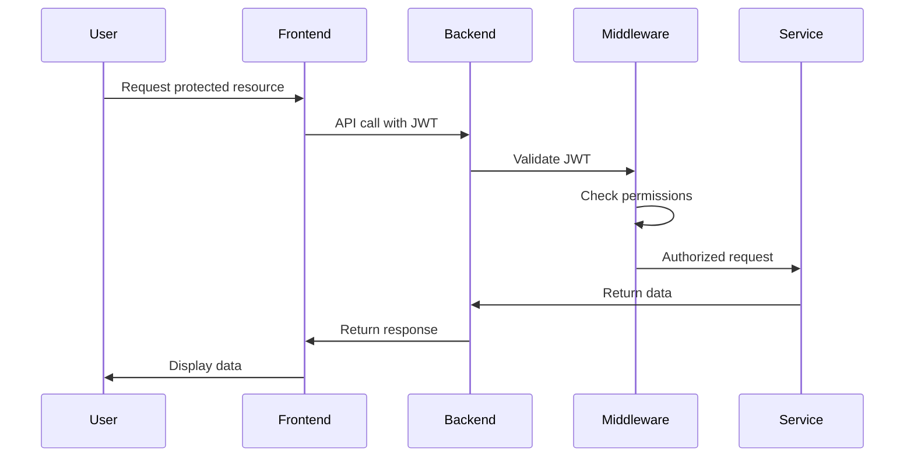

---

## 🧪 **Testing**

### 1. Testing Strategy
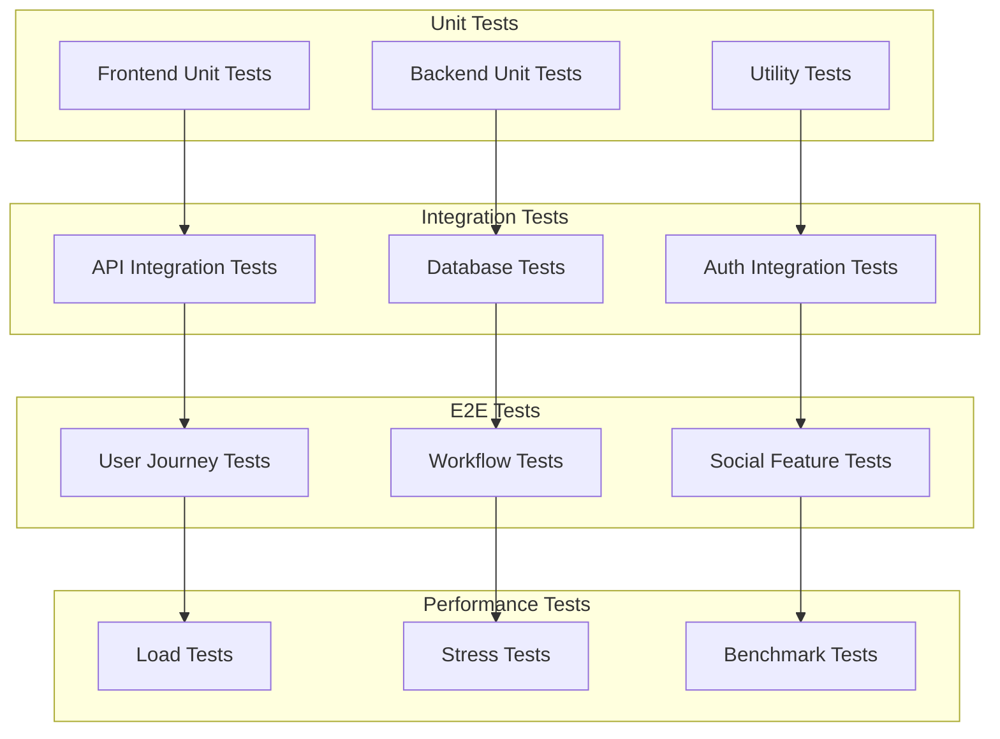

### 2. Testing Flow
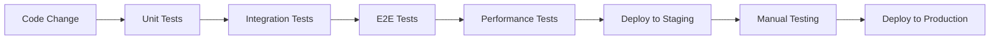

---

## 📱 **Frontend Architecture**

### 1. Components Architecture
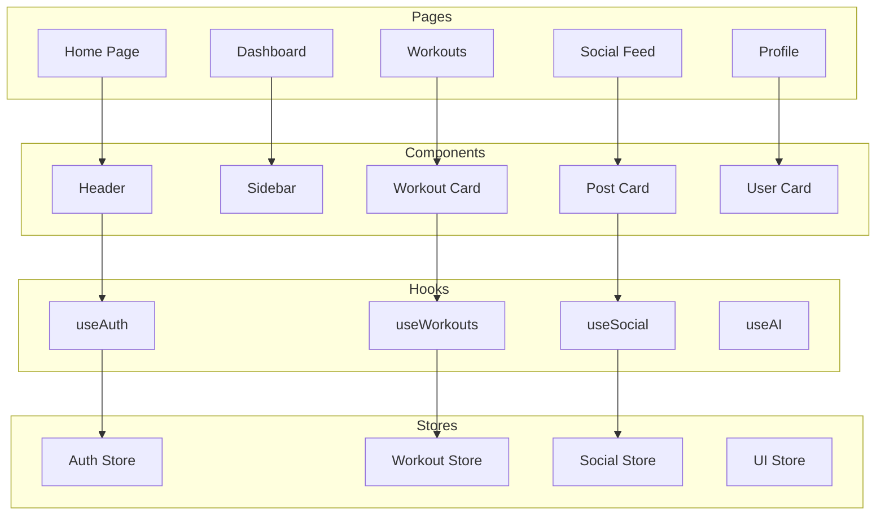

### 2. State Flow
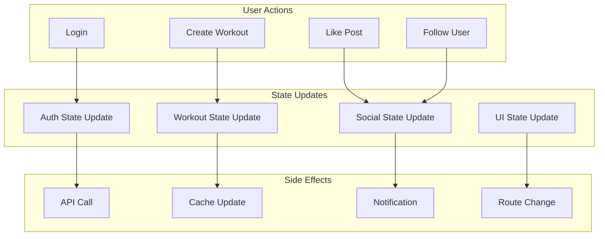

---

## 🤖 **AI Integration**

### 1. Flujo de IA
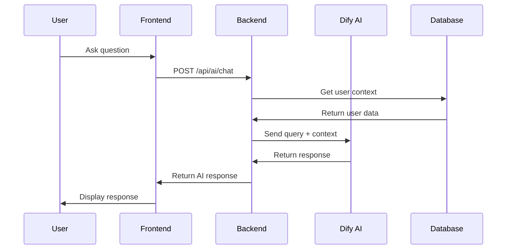

### 2. Sistema de Recomendaciones
```mermaid
graph TB
  subgraph "Data Collection"
    USER_DATA[User Data]
    WORKOUT_DATA[Workout Data]
    INTERACTION_DATA[Interaction Data]
  end
  
  subgraph "AI Processing"
    CONTEXT_BUILDER[Context Builder]
    RECOMMENDATION_ENGINE[Recommendation Engine]
    PERSONALIZATION[Personalization]
  end
  
  subgraph "Output"
    WORKOUT_RECS[Workout Recommendations]
    EXERCISE_RECS[Exercise Recommendations]
    NUTRITION_RECS[Nutrition Recommendations]
  end
  
  USER_DATA --> CONTEXT_BUILDER
  WORKOUT_DATA --> CONTEXT_BUILDER
  INTERACTION_DATA --> CONTEXT_BUILDER
  
  CONTEXT_BUILDER --> RECOMMENDATION_ENGINE
  RECOMMENDATION_ENGINE --> PERSONALIZATION
  
  PERSONALIZATION --> WORKOUT_RECS
  PERSONALIZATION --> EXERCISE_RECS
  PERSONALIZATION --> NUTRITION_RECS
```

---

## 📊 **Diagrams Summary**

### Diagram Categories
- **Architecture**: 3 diagrams
- **Database**: 2 diagrams
- **Communication Flows**: 3 diagrams
- **System States**: 3 diagrams
- **DevOps**: 3 diagrams
- **Security**: 2 diagrams
- **Testing**: 2 diagrams
- **Frontend**: 2 diagrams
- **AI Integration**: 2 diagrams

### Total: 22 Diagrams

---

## 🎯 **How to Use the Diagrams**

### For Developers
- **Architecture**: Understand the system structure
- **Flows**: Understand interactions
- **States**: Manage business logic
- **Testing**: Design test cases

### For DevOps
- **Deployment**: Understand the pipeline
- **Infrastructure**: Understand the architecture
- **Monitoring**: Identify observation points

### For Product Managers
- **Features**: See user flow
- **States**: Understand user experience

---

## 🏗️ **Project Structure**

### Backend
```
backend/
├── src/
│   ├── modules/          # Business modules
│   ├── routes/           # Route handlers
│   ├── shared/           # Shared utilities
│   └── types/            # Type definitions
├── supabase/             # Migrations and configuration
├── scripts/              # Automation scripts
├── tests/                # Backend tests
└── docs/                 # Specific documentation
```

### Frontend
```
frontend/
├── src/
│   ├── app/              # Next.js App Router
│   ├── components/       # Reusable components
│   ├── lib/              # Utilities and configuration
│   ├── hooks/            # Custom hooks
│   ├── stores/           # Global state (Zustand)
│   └── types/            # Type definitions
├── public/               # Static files
├── styles/               # Global styles
└── tests/                # Frontend tests
```

### Documentation
```
docs/
├── architecture/         # System architecture
├── api/                  # API documentation
├── database/             # Schemas and migrations
├── devops/               # CI/CD and deployment
├── testing/              # Testing strategies
├── security/             # Security and compliance
├── ai/                   # AI integration
├── team/                 # Team organization
├── configuration/        # Project configuration
└── quick-start/          # Getting started guides
```
