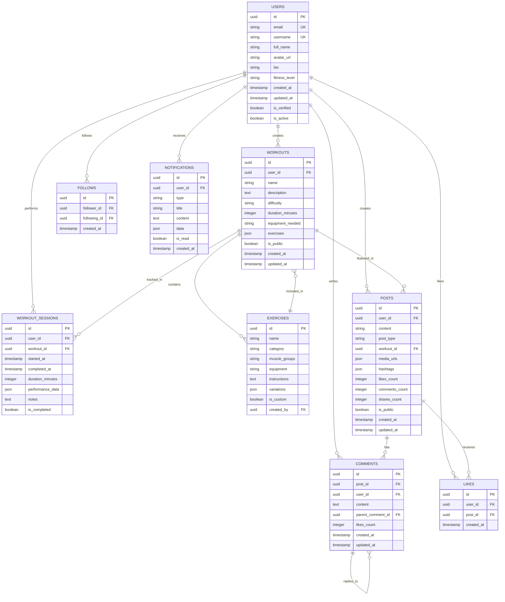

# Diagramas Mermaid - GymPal 🎨

## 📊 **Índice de Diagramas**

This document contains all Mermaid diagrams used in the GymPal documentation, organized by categories for easy navigation.

---

## 🏗️ **Arquitectura del Sistema**

### 1. Arquitectura General


### 2. Arquitectura de Microservicios


---

## 🗄️ **Base de Datos**

### 1. Diagrama ER Principal - Entidades Core


### 2. Esquema de Base de Datos Detallado


---

## 🔄 **Flujos de Comunicación**

### 1. Flujo de Autenticación


### 2. Flujo de Creación de Workout


### 3. Flujo de Feed Social


---

## 🎯 **Estados del Sistema**

### 1. Estados de Usuario


### 2. Estados de Workout


### 3. Estados de Post


---

## 🚀 **DevOps y Despliegue**

### 1. Pipeline CI/CD


### 2. Estrategia de Despliegue


### 3. Flujo de Despliegue con ArgoCD


---

## 🔐 **Seguridad**

### 1. Flujo de Autenticación y Autorización


### 2. Flujo de Autorización


---

## 🧪 **Testing**

### 1. Estrategia de Testing


### 2. Flujo de Testing


---

## 📱 **Frontend Architecture**

### 1. Arquitectura de Componentes


### 2. Flujo de Estado


---

## 🤖 **AI Integration**

### 1. Flujo de IA


### 2. Sistema de Recomendaciones
```mermaid
graph TB
  subgraph "Data Collection"
    USER_DATA[User Data]
    WORKOUT_DATA[Workout Data]
    INTERACTION_DATA[Interaction Data]
  end
  
  subgraph "AI Processing"
    CONTEXT_BUILDER[Context Builder]
    RECOMMENDATION_ENGINE[Recommendation Engine]
    PERSONALIZATION[Personalization]
  end
  
  subgraph "Output"
    WORKOUT_RECS[Workout Recommendations]
    EXERCISE_RECS[Exercise Recommendations]
    NUTRITION_RECS[Nutrition Recommendations]
  end
  
  USER_DATA --> CONTEXT_BUILDER
  WORKOUT_DATA --> CONTEXT_BUILDER
  INTERACTION_DATA --> CONTEXT_BUILDER
  
  CONTEXT_BUILDER --> RECOMMENDATION_ENGINE
  RECOMMENDATION_ENGINE --> PERSONALIZATION
  
  PERSONALIZATION --> WORKOUT_RECS
  PERSONALIZATION --> EXERCISE_RECS
  PERSONALIZATION --> NUTRITION_RECS
```

---

## 📊 **Resumen de Diagramas**

### Categorías de Diagramas
- **Arquitectura**: 3 diagramas
- **Base de Datos**: 2 diagramas
- **Flujos de Comunicación**: 3 diagramas
- **Estados del Sistema**: 3 diagramas
- **DevOps**: 3 diagramas
- **Seguridad**: 2 diagramas
- **Testing**: 2 diagramas
- **Frontend**: 2 diagramas
- **AI Integration**: 2 diagramas

### Total: 22 Diagramas

---

## 🎯 **Uso de los Diagramas**

### Para Desarrolladores
- **Arquitectura**: Entender la estructura del sistema
- **Flujos**: Comprender las interacciones
- **Estados**: Manejar la lógica de negocio
- **Testing**: Diseñar casos de prueba

### Para DevOps
- **Despliegue**: Entender el pipeline
- **Infraestructura**: Comprender la arquitectura
- **Monitoreo**: Identificar puntos de observación

### Para Product Managers
- **Funcionalidades**: Ver el flujo de usuario
- **Estados**: Comprender la experiencia de usuario

---

## 🏗️ **Estructura del Proyecto**

### Backend
```
backend/
├── src/
│   ├── modules/          # Módulos de negocio
│   ├── routes/           # Handlers de rutas
│   ├── shared/           # Utilidades compartidas
│   └── types/            # Definiciones de tipos
├── supabase/             # Migraciones y configuración
├── scripts/              # Scripts de automatización
├── tests/                # Tests del backend
└── docs/                 # Documentación específica
```

### Frontend
```
frontend/
├── src/
│   ├── app/              # App Router de Next.js
│   ├── components/       # Componentes reutilizables
│   ├── lib/              # Utilidades y configuraciones
│   ├── hooks/            # Custom hooks
│   ├── stores/           # Estado global (Zustand)
│   └── types/            # Definiciones de tipos
├── public/               # Archivos estáticos
├── styles/               # Estilos globales
└── tests/                # Tests del frontend
```

### Documentación
```
docs/
├── architecture/         # Arquitectura del sistema
├── api/                  # Documentación de APIs
├── database/             # Esquemas y migraciones
├── devops/               # CI/CD y despliegue
├── testing/              # Estrategias de testing
├── security/             # Seguridad y compliance
├── ai/                   # Integración de IA
├── team/                 # Organización del equipo
├── configuration/        # Configuración del proyecto
└── quick-start/          # Guías de inicio
```
