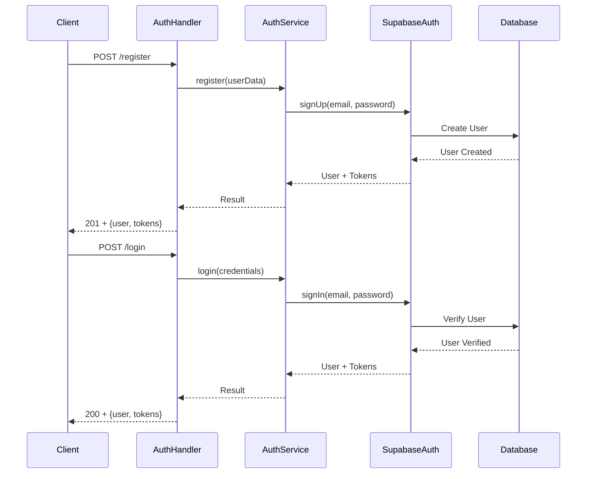
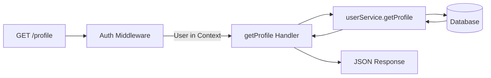
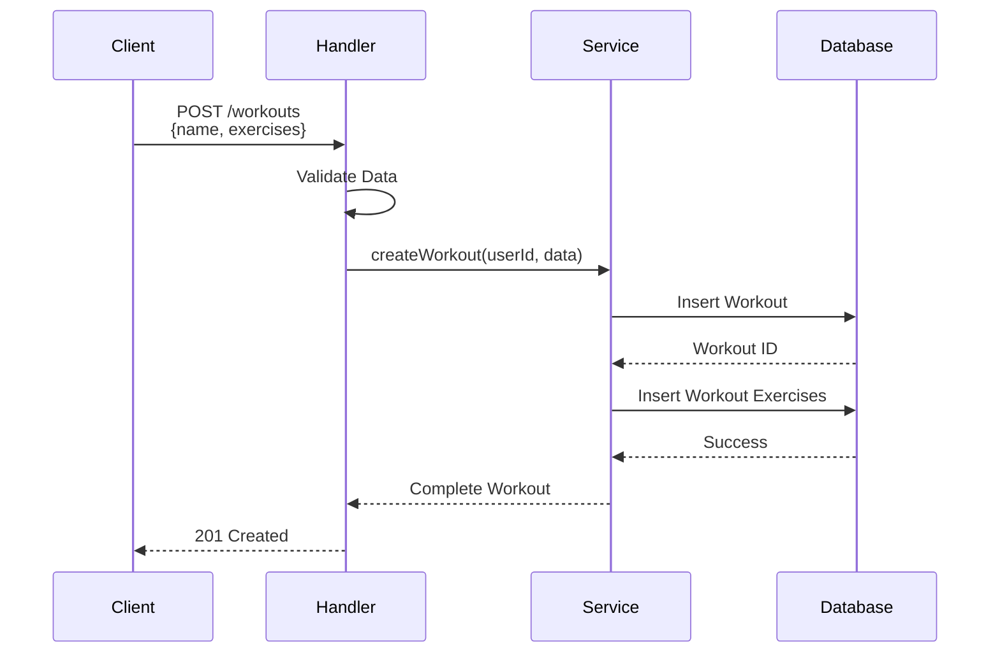
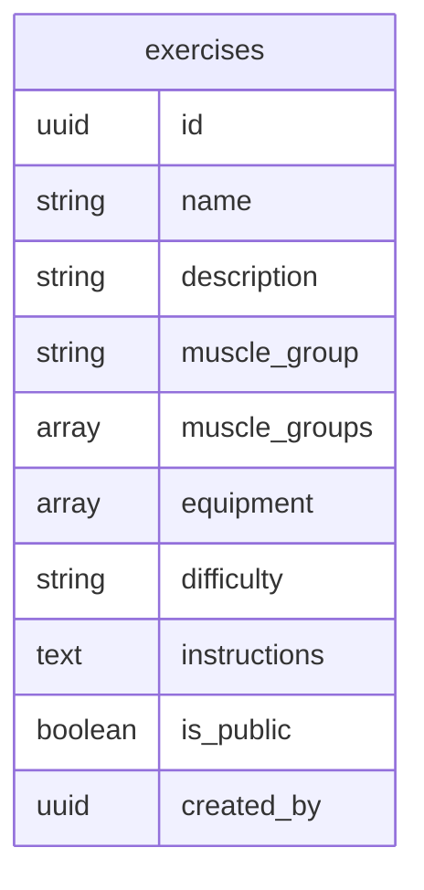
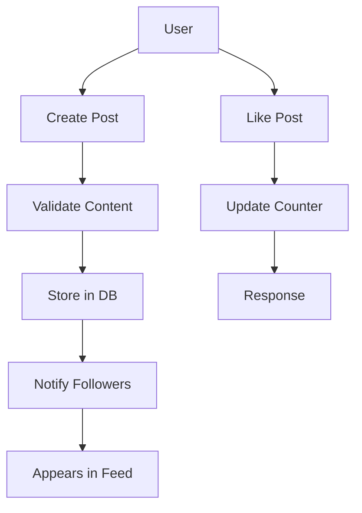
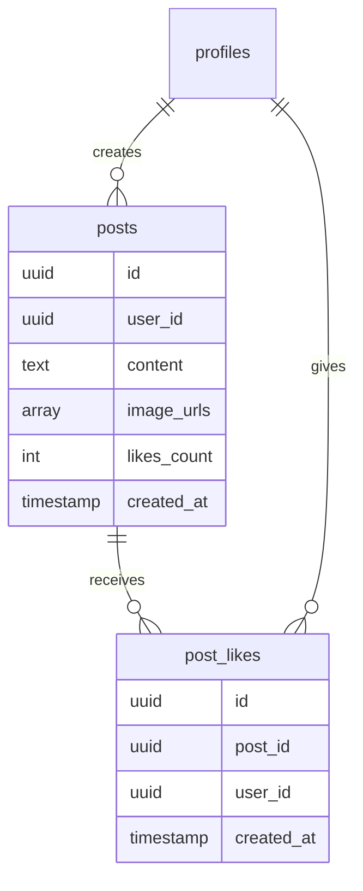
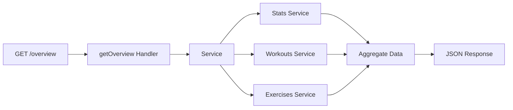

# GymPal Backend - Modules Documentation

This documentation describes each module of the GymPal Backend system, its endpoints, functionalities and data flow.

## 📋 Table of Contents

- [Auth Module](#-auth-module)
- [Users Module](#-users-module)
- [Workouts Module](#-workouts-module)
- [Exercises Module](#-exercises-module)
- [Social Module](#-social-module)
- [Dashboard Module](#-dashboard-module)
- [Personal Module](#-personal-module)
- [Settings Module](#-settings-module)
- [Module Relationships](#-module-relationships)

---

## 🔐 Auth Module

**Base Route:** `/api/v1/auth`

### Description
Module responsible for all authentication and authorization in the system. Handles registration, login, logout, token management and passwords.

### Authentication Flow



### Endpoints

| Method | Route | Description | Auth Required |
|--------|------|-------------|---------------|
| POST | `/register` | Registers a new user | No |
| POST | `/login` | Authenticates a user | Yes |
| GET | `/me` | Gets authenticated user information | Yes |
| POST | `/logout` | Closes user session | Yes |
| POST | `/refresh` | Renews access token | No |
| POST | `/reset-password` | Resets password with token | No |
| PUT | `/change-password/:id` | Changes user password | Yes |
| DELETE | `/delete-account/:id` | Deletes user account | Yes |

### Handlers

- `register`: Creates a new user and generates tokens
- `login`: Authenticates user and returns tokens
- `getMe`: Gets authenticated user information
- `logout`: Closes session
- `refresh`: Renews access tokens
- `resetPassword`: Resets password using reset token
- `changePassword`: Changes password (authenticated users only)
- `deleteAccount`: Deletes account (self-service via database function, no service role key required)

### Special Feature: Self-Service Account Deletion

**Note**: Account deletion no longer requires `SUPABASE_SERVICE_ROLE_KEY`. Users can delete their own accounts using a database function (`delete_own_account`) that:
- Uses `SECURITY DEFINER` for elevated privileges
- Validates user identity via `auth.uid()`
- Automatically handles cascade deletion of related data
- See: `supabase/migrations/004_triggers.sql` for implementation

---

## 👥 Users Module

**Base Route:** `/api/v1/users`

### Description
Module for user profile management, user search and user statistics.

### Get Profile Flow



### Endpoints

| Method | Route | Description | Auth Required |
|--------|------|-------------|---------------|
| GET | `/profile` | Gets authenticated user's profile | Yes |
| PUT | `/profile` | Updates user profile | Yes |
| GET | `/:id` | Gets public information of a user | Yes |
| GET | `/search` | Searches users by name or username | Yes |
| GET | `/stats` | Gets user statistics | Yes |

### Handlers

- `getProfile`: Gets complete authenticated user profile
- `updateProfile`: Updates profile information
- `getById`: Gets public information of a user
- `search`: Searches users with filters
- `getStats`: Gets aggregated user statistics

---

## 💪 Workouts Module

**Base Route:** `/api/v1/workouts`

### Description
Module for managing workouts, routines and exercises within workouts.

### Create Workout Flow



### Endpoints

| Method | Route | Description | Auth Required |
|--------|------|-------------|---------------|
| POST | `/` | Creates a new workout | Yes |
| GET | `/` | Lists user workouts | Yes |
| GET | `/:id` | Gets a specific workout | Yes |
| PUT | `/:id` | Updates a workout | Yes |
| DELETE | `/:id` | Deletes a workout | Yes |

### Handlers

- `createWorkout`: Creates a new workout
- `listWorkouts`: Lists workouts with filters
- `getWorkout`: Gets workout details
- `updateWorkout`: Updates a workout
- `deleteWorkout`: Deletes a workout

---

## 🏋️ Exercises Module

**Base Route:** `/api/v1/exercises`

### Description
Module for managing the catalog of exercises available in the system.

### Data Structure



### Endpoints

| Method | Route | Description | Auth Required |
|--------|------|-------------|---------------|
| GET | `/` | Lists exercises with filters | Yes |
| GET | `/:id` | Gets a specific exercise | Yes |
| POST | `/` | Creates a new exercise | Yes |
| PUT | `/:id` | Updates an exercise | Yes |
| DELETE | `/:id` | Deletes an exercise | Yes |
| GET | `/categories` | Gets exercise categories | Yes |
| GET | `/muscle-groups` | Gets muscle groups | Yes |
| GET | `/equipment-types` | Gets equipment types | Yes |

### Handlers

- `listExercises`: Lists exercises with filters and pagination
- `getExercise`: Gets exercise details
- `createExercise`: Creates a new exercise
- `updateExercise`: Updates an exercise
- `deleteExercise`: Deletes an exercise

---

## 🌐 Social Module

**Base Route:** `/api/v1/social`

### Description
Module for social features: posts, likes, comments and interactions between users.

### Social Post Flow



### Endpoints

| Method | Route | Description | Auth Required |
|--------|------|-------------|---------------|
| POST | `/posts` | Creates a new post | Yes |
| GET | `/posts` | Lists posts with filters | Yes |
| GET | `/posts/:id` | Gets a specific post | Yes |
| PUT | `/posts/:id` | Updates a post | Yes |
| DELETE | `/posts/:id` | Deletes a post | Yes |
| POST | `/posts/:id/like` | Likes a post | Yes |
| DELETE | `/posts/:id/like` | Removes like from a post | Yes |

### Handlers

- `createPost`: Creates a new social post
- `listPosts`: Lists posts with filters and pagination
- `getPost`: Gets post details
- `updatePost`: Updates a post (author only)
- `deletePost`: Deletes a post (author only)
- `likePost`: Likes a post
- `unlikePost`: Removes like from a post

### Data Model



---

## 📊 Dashboard Module

**Base Route:** `/api/v1/dashboard`

### Description
Module that provides an overview and statistics of user activity.

### Dashboard Flow



### Endpoints

| Method | Route | Description | Auth Required |
|--------|------|-------------|---------------|
| GET | `/overview` | Gets complete dashboard summary | Yes |
| GET | `/stats` | Gets statistics by period | Yes |
| GET | `/activity` | Gets recent activity | Yes |

### Handlers

- `getOverview`: Provides complete dashboard summary
- `getStats`: Gets detailed statistics by period (week, month, year)
- `getRecentActivity`: Gets list of recent activities

### Data Provided

- Total workouts
- Total exercises performed
- Total training time
- Weight progress
- Recent workouts
- Unlocked achievements

---

## 👤 Personal Module

**Base Route:** `/api/v1/personal`

### Description
Module for managing user personal data: health information, goals, body measurements, etc.

### Endpoints

| Method | Route | Description | Auth Required |
|--------|------|-------------|---------------|
| GET | `/` | Gets personal data | Yes |
| PUT | `/` | Updates personal data | Yes |
| GET | `/fitness-profile` | Gets fitness profile | Yes |
| PUT | `/fitness-profile` | Updates fitness profile | Yes |

### Handlers

- `getPersonalData`: Gets all personal data
- `updatePersonalData`: Updates personal data
- `getFitnessProfile`: Gets user fitness profile
- `updateFitnessProfile`: Updates fitness profile

---

## ⚙️ Settings Module

**Base Route:** `/api/v1/settings`

### Description
Module for managing user settings and preferences.

### Endpoints

| Method | Route | Description | Auth Required |
|--------|------|-------------|---------------|
| GET | `/` | Gets all settings | Yes |
| PUT | `/` | Updates settings | Yes |
| GET | `/notifications` | Gets notification preferences | Yes |
| PUT | `/notifications` | Updates notification preferences | Yes |
| GET | `/privacy` | Gets privacy settings | Yes |
| PUT | `/privacy` | Updates privacy settings | Yes |

### Handlers

- `getSettings`: Gets all settings
- `updateSettings`: Updates settings
- `getNotificationSettings`: Gets notification preferences
- `updateNotificationSettings`: Updates notification preferences
- `getPrivacySettings`: Gets privacy settings
- `updatePrivacySettings`: Updates privacy settings

---

## 🔄 Module Relationships

```mermaid
graph TD
    Auth[Auth Module] -->|Provides User Context| Users[Users Module]
    Auth -->|Provides User Context| Workouts[Workouts Module]
    Auth -->|Provides User Context| Social[Social Module]
    Auth -->|Provides User Context| Dashboard[Dashboard Module]
    
    Users -->|User Data| Dashboard
    Workouts -->|Workout Data| Dashboard
    Exercises -->|Exercise Data| Workouts
    Social -->|Social Activity| Dashboard
    
    Dashboard -->|Aggregates Data From| Users
    Dashboard -->|Aggregates Data From| Workouts
    Dashboard -->|Aggregates Data From| Social
    
    Personal -->|Personal Data| Dashboard
    Settings -->|Preferences| All Modules
    
    style Auth fill:#ffebee
    style Dashboard fill:#e8f5e9
```

## 📝 Module Development Pattern

All modules follow a consistent structure:

1. **routes.ts**: Route definitions with OpenAPI comments
2. **handlers.ts**: HTTP request handlers
3. **service.ts**: Business logic layer
4. **schemas.ts**: Zod validation schemas
5. **types.ts**: TypeScript type definitions

This pattern ensures:
- **Consistency**: All modules work the same way
- **Maintainability**: Easy to understand and modify
- **Type Safety**: Full TypeScript coverage
- **Validation**: Automatic request/response validation

---

**Documentation Version**: 2.0.0  
**Last Updated**: October 2025  
**Maintained by**: GymPal Development Team

