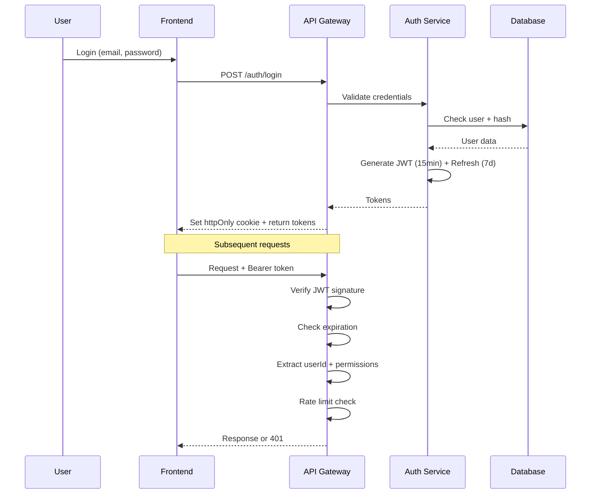
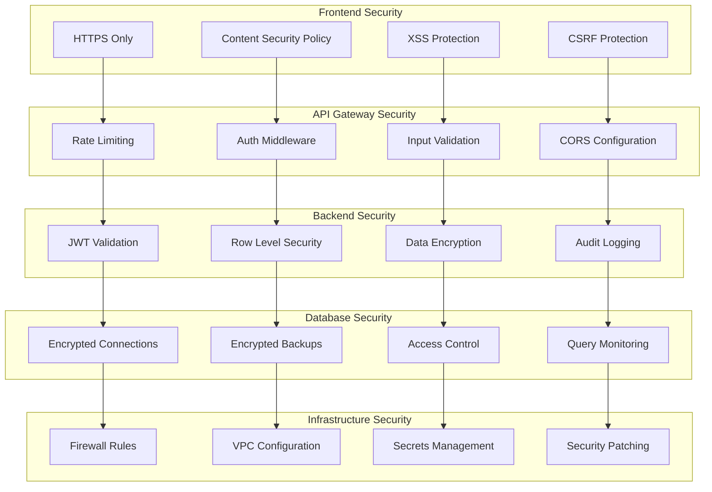
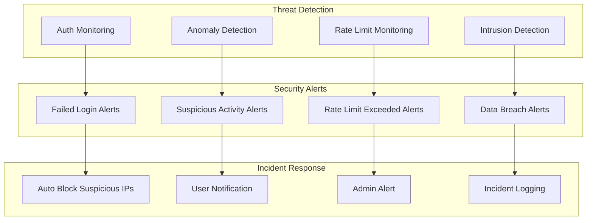
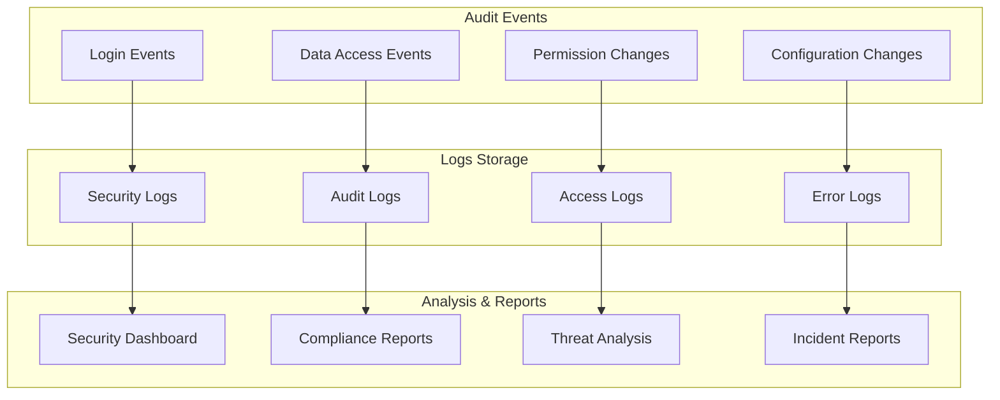

# Security and Compliance 🔐

## Authentication and Authorization



## Security Architecture



## JWT Implementation

```typescript
// backend/src/lib/auth.ts
import jwt from 'jsonwebtoken';
import { z } from 'zod';

const JWT_SECRET = process.env.JWT_SECRET!;
const JWT_EXPIRY = '15m';
const REFRESH_EXPIRY = '7d';

export interface JWTPayload {
  userId: string;
  email: string;
  role: string;
  iat: number;
  exp: number;
}

export class AuthService {
  static generateTokens(user: { id: string; email: string; role: string }) {
    const payload: Omit<JWTPayload, 'iat' | 'exp'> = {
      userId: user.id,
      email: user.email,
      role: user.role
    };

    const accessToken = jwt.sign(payload, JWT_SECRET, { 
      expiresIn: JWT_EXPIRY,
      issuer: 'gympal-api',
      audience: 'gympal-client'
    });

    const refreshToken = jwt.sign(payload, JWT_SECRET, { 
      expiresIn: REFRESH_EXPIRY,
      issuer: 'gympal-api',
      audience: 'gympal-client'
    });

    return { accessToken, refreshToken };
  }

  static verifyToken(token: string): JWTPayload {
    try {
      return jwt.verify(token, JWT_SECRET, {
        issuer: 'gympal-api',
        audience: 'gympal-client'
      }) as JWTPayload;
    } catch (error) {
      throw new Error('Invalid token');
    }
  }

  static refreshToken(refreshToken: string) {
    const payload = this.verifyToken(refreshToken);
    return this.generateTokens({
      id: payload.userId,
      email: payload.email,
      role: payload.role
    });
  }
}
```

## Row Level Security (RLS)

```sql
-- Enable RLS on all tables
ALTER TABLE profiles ENABLE ROW LEVEL SECURITY;
ALTER TABLE workouts ENABLE ROW LEVEL SECURITY;
ALTER TABLE posts ENABLE ROW LEVEL SECURITY;
ALTER TABLE comments ENABLE ROW LEVEL SECURITY;

-- Policies for profiles
CREATE POLICY "Users can view public profiles" ON profiles
  FOR SELECT USING (true);

CREATE POLICY "Users can update own profile" ON profiles
  FOR UPDATE USING (auth.uid() = id);

-- Policies for workouts
CREATE POLICY "Users can view public workouts" ON workouts
  FOR SELECT USING (is_public = true);

CREATE POLICY "Users can view own workouts" ON workouts
  FOR SELECT USING (auth.uid() = user_id);

CREATE POLICY "Users can create own workouts" ON workouts
  FOR INSERT WITH CHECK (auth.uid() = user_id);

CREATE POLICY "Users can update own workouts" ON workouts
  FOR UPDATE USING (auth.uid() = user_id);

-- Policies for posts
CREATE POLICY "Users can view public posts" ON posts
  FOR SELECT USING (is_public = true);

CREATE POLICY "Users can create own posts" ON posts
  FOR INSERT WITH CHECK (auth.uid() = user_id);

CREATE POLICY "Users can update own posts" ON posts
  FOR UPDATE USING (auth.uid() = user_id);
```

## Rate Limiting

```typescript
// backend/src/middleware/rate-limit.middleware.ts
import { Hono } from 'hono';
import { rateLimiter } from 'hono-rate-limiter';
import { Redis } from 'ioredis';

const redis = new Redis(process.env.REDIS_URL!);

export const rateLimitMiddleware = rateLimiter({
  windowMs: 15 * 60 * 1000, // 15 minutes
  limit: 100, // 100 requests per window
  standardHeaders: 'draft-6',
  legacyHeaders: false,
  keyGenerator: (c) => {
    const userId = c.get('userId');
    return userId ? `user:${userId}` : `ip:${c.req.header('x-forwarded-for')}`;
  },
  redis,
  message: 'Too many requests, please try again later.',
  skipSuccessfulRequests: false,
  skipFailedRequests: false,
});
```

## Input Validation

```typescript
// backend/src/lib/validation.ts
import { z } from 'zod';

export const userRegistrationSchema = z.object({
  email: z.string().email().max(255),
  password: z.string().min(8).max(128).regex(
    /^(?=.*[a-z])(?=.*[A-Z])(?=.*\d)(?=.*[@$!%*?&])[A-Za-z\d@$!%*?&]/,
    'Password must contain at least one uppercase letter, one lowercase letter, one number, and one special character'
  ),
  username: z.string().min(3).max(50).regex(/^[a-zA-Z0-9_]+$/),
  fullName: z.string().min(2).max(100),
  dateOfBirth: z.string().datetime().optional(),
  gender: z.enum(['male', 'female', 'other', 'prefer_not_to_say']).optional(),
});

export const workoutCreationSchema = z.object({
  name: z.string().min(1).max(100),
  description: z.string().max(1000).optional(),
  type: z.enum(['strength', 'cardio', 'flexibility', 'hiit', 'mixed', 'custom']),
  difficulty: z.enum(['beginner', 'intermediate', 'advanced', 'expert']),
  durationMinutes: z.number().int().min(1).max(300),
  isPublic: z.boolean().default(false),
  equipmentRequired: z.array(z.string()).default([]),
  tags: z.array(z.string()).default([]),
});

export const postCreationSchema = z.object({
  content: z.string().min(1).max(2000),
  postType: z.enum(['achievement', 'routine', 'tip', 'progress', 'motivation', 'question', 'general']),
  imageUrls: z.array(z.string().url()).max(5).default([]),
  hashtags: z.array(z.string().regex(/^#[a-zA-Z0-9_]+$/)).max(10).default([]),
  isPublic: z.boolean().default(true),
});
```

## Security Logging

```typescript
// backend/src/lib/security-logger.ts
import { logger } from './logger';

export class SecurityLogger {
  static logAuthAttempt(userId: string, success: boolean, ip: string) {
    logger.warn('Auth attempt', {
      userId,
      success,
      ip,
      timestamp: new Date().toISOString(),
      type: 'auth_attempt'
    });
  }

  static logSuspiciousActivity(userId: string, activity: string, details: any) {
    logger.error('Suspicious activity detected', {
      userId,
      activity,
      details,
      timestamp: new Date().toISOString(),
      type: 'suspicious_activity'
    });
  }

  static logDataAccess(userId: string, resource: string, action: string) {
    logger.info('Data access', {
      userId,
      resource,
      action,
      timestamp: new Date().toISOString(),
      type: 'data_access'
    });
  }

  static logSecurityEvent(event: string, details: any) {
    logger.error('Security event', {
      event,
      details,
      timestamp: new Date().toISOString(),
      type: 'security_event'
    });
  }
}
```

## Security Monitoring



## GDPR Compliance

```typescript
// backend/src/lib/gdpr.ts
export class GDPRService {
  static async exportUserData(userId: string) {
    // Export all user data
    const userData = await this.getAllUserData(userId);
    return {
      personalInfo: userData.profile,
      workoutData: userData.workouts,
      socialData: userData.posts,
      preferences: userData.preferences,
      exportDate: new Date().toISOString()
    };
  }

  static async deleteUserData(userId: string) {
    // Soft delete user data
    await this.softDeleteUser(userId);
    
    // Anonymize remaining data
    await this.anonymizeUserData(userId);
    
    // Log deletion
    SecurityLogger.logDataAccess(userId, 'user_data', 'delete');
  }

  static async anonymizeUserData(userId: string) {
    // Replace personal data with anonymized versions
    await this.updateUserProfile(userId, {
      username: `user_${userId.slice(0, 8)}`,
      fullName: 'Deleted User',
      email: `deleted_${userId.slice(0, 8)}@deleted.com`,
      bio: null,
      avatarUrl: null
    });
  }
}
```

## CORS Configuration

```typescript
// backend/src/middleware/cors.middleware.ts
import { cors } from 'hono/cors';

export const corsMiddleware = cors({
  origin: (origin) => {
    const allowedOrigins = [
      'http://localhost:3000',
      'https://gympal.app',
      'https://staging.gympal.app'
    ];
    
    if (!origin) return true; // Allow requests with no origin (mobile apps)
    return allowedOrigins.includes(origin);
  },
  allowMethods: ['GET', 'POST', 'PUT', 'DELETE', 'OPTIONS'],
  allowHeaders: ['Content-Type', 'Authorization', 'X-Requested-With'],
  credentials: true,
  maxAge: 86400, // 24 hours
});
```

## Security Audit


