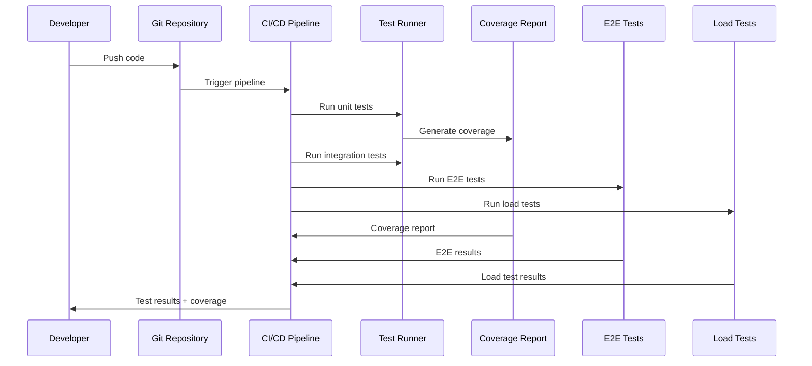

# Testing Strategy 🧪

## Testing Architecture

```mermaid
graph TB
  subgraph "Frontend Testing"
    UNIT_FE[Unit Tests - Jest/Vitest]
    INTEGRATION_FE[Integration Tests - Testing Library]
    E2E_FE[E2E Tests - Playwright]
    VISUAL[Visual Tests - Chromatic]
  end
  
  subgraph "Backend Testing"
    UNIT_BE[Unit Tests - Vitest]
    INTEGRATION_BE[Integration Tests - Supertest]
    API_TESTS[API Tests - Postman/Newman]
    LOAD_TESTS[Load Tests - Artillery]
  end
  
  subgraph "Database Testing"
    DB_TESTS[Database Tests - Jest]
    MIGRATION_TESTS[Migration Tests]
    SEED_TESTS[Seed Data Tests]
  end
  
  subgraph "CI/CD Testing"
    LINT[Linting - ESLint]
    TYPE_CHECK[Type Checking - TypeScript]
    SECURITY[Security Tests - Snyk]
    COVERAGE[Coverage Reports]
  end
  
  UNIT_FE --> INTEGRATION_FE
  INTEGRATION_FE --> E2E_FE
  E2E_FE --> VISUAL
  
  UNIT_BE --> INTEGRATION_BE
  INTEGRATION_BE --> API_TESTS
  API_TESTS --> LOAD_TESTS
  
  DB_TESTS --> MIGRATION_TESTS
  MIGRATION_TESTS --> SEED_TESTS
  
  LINT --> TYPE_CHECK
  TYPE_CHECK --> SECURITY
  SECURITY --> COVERAGE
```



## Testing Configuration

### Frontend Testing (Vitest + Testing Library)

```typescript
// frontend/vitest.config.ts
import { defineConfig } from 'vitest/config';
import react from '@vitejs/plugin-react';
import path from 'path';

export default defineConfig({
  plugins: [react()],
  test: {
    globals: true,
    environment: 'jsdom',
    setupFiles: ['./src/test/setup.ts'],
    coverage: {
      provider: 'v8',
      reporter: ['text', 'json', 'html'],
      exclude: [
        'node_modules/',
        'src/test/',
        '**/*.d.ts',
        '**/*.config.*',
        '**/coverage/**'
      ]
    }
  },
  resolve: {
    alias: {
      '@': path.resolve(__dirname, './src')
    }
  }
});
```

```typescript
// frontend/src/test/setup.ts
import '@testing-library/jest-dom';
import { server } from './mocks/server';

// Mock IntersectionObserver
global.IntersectionObserver = class IntersectionObserver {
  constructor() {}
  disconnect() {}
  observe() {}
  unobserve() {}
};

// Mock ResizeObserver
global.ResizeObserver = class ResizeObserver {
  constructor() {}
  disconnect() {}
  observe() {}
  unobserve() {}
};

// Start MSW server
beforeAll(() => server.listen());
afterEach(() => server.resetHandlers());
afterAll(() => server.close());
```

### Backend Testing (Vitest + Supertest)

```typescript
// backend/vitest.config.ts
import { defineConfig } from 'vitest/config';
import { resolve } from 'path';

export default defineConfig({
  test: {
    globals: true,
    environment: 'node',
    setupFiles: ['./src/test/setup.ts'],
    coverage: {
      provider: 'v8',
      reporter: ['text', 'json', 'html'],
      exclude: [
        'node_modules/',
        'src/test/',
        '**/*.d.ts',
        '**/*.config.*',
        '**/coverage/**',
        'dist/'
      ]
    }
  },
  resolve: {
    alias: {
      '@': resolve(__dirname, './src')
    }
  }
});
```

```typescript
// backend/src/test/setup.ts
import { beforeAll, afterAll, beforeEach } from 'vitest';
import { createClient } from '@supabase/supabase-js';

// Mock Supabase client
const mockSupabase = {
  auth: {
    getUser: vi.fn(),
    signInWithPassword: vi.fn(),
    signUp: vi.fn(),
    signOut: vi.fn()
  },
  from: vi.fn(() => ({
    select: vi.fn().mockReturnThis(),
    insert: vi.fn().mockReturnThis(),
    update: vi.fn().mockReturnThis(),
    delete: vi.fn().mockReturnThis(),
    eq: vi.fn().mockReturnThis(),
    single: vi.fn()
  }))
};

vi.mock('@supabase/supabase-js', () => ({
  createClient: vi.fn(() => mockSupabase)
}));

// Global test setup
beforeAll(async () => {
  // Setup test database
  process.env.NODE_ENV = 'test';
  process.env.SUPABASE_URL = 'http://localhost:54321';
  process.env.SUPABASE_ANON_KEY = 'test-key';
  process.env.JWT_SECRET = 'test-secret';
});

beforeEach(() => {
  // Reset mocks before each test
  vi.clearAllMocks();
});

afterAll(async () => {
  // Cleanup test database
});
```

## Unit Tests

### Frontend Unit Tests

```typescript
// frontend/src/components/__tests__/WorkoutCard.test.tsx
import { render, screen, fireEvent } from '@testing-library/react';
import { WorkoutCard } from '../WorkoutCard';
import { mockWorkout } from '../../test/mocks/workout';

describe('WorkoutCard', () => {
  it('renders workout information correctly', () => {
    render(<WorkoutCard workout={mockWorkout} />);
    
    expect(screen.getByText(mockWorkout.name)).toBeInTheDocument();
    expect(screen.getByText(mockWorkout.description)).toBeInTheDocument();
    expect(screen.getByText(`${mockWorkout.durationMinutes} min`)).toBeInTheDocument();
  });

  it('handles like button click', () => {
    const onLike = vi.fn();
    render(<WorkoutCard workout={mockWorkout} onLike={onLike} />);
    
    const likeButton = screen.getByRole('button', { name: /like/i });
    fireEvent.click(likeButton);
    
    expect(onLike).toHaveBeenCalledWith(mockWorkout.id);
  });

  it('shows difficulty badge', () => {
    render(<WorkoutCard workout={mockWorkout} />);
    
    const difficultyBadge = screen.getByText(mockWorkout.difficulty);
    expect(difficultyBadge).toBeInTheDocument();
    expect(difficultyBadge).toHaveClass('badge-intermediate');
  });
});
```

### Backend Unit Tests

```typescript
// backend/src/modules/auth/__tests__/auth.service.test.ts
import { describe, it, expect, beforeEach, vi } from 'vitest';
import { AuthService } from '../auth.service';
import { mockUser, mockJWT } from '../../test/mocks/auth';

describe('AuthService', () => {
  let authService: AuthService;

  beforeEach(() => {
    authService = new AuthService();
  });

  describe('generateTokens', () => {
    it('should generate access and refresh tokens', () => {
      const tokens = authService.generateTokens(mockUser);
      
      expect(tokens).toHaveProperty('accessToken');
      expect(tokens).toHaveProperty('refreshToken');
      expect(typeof tokens.accessToken).toBe('string');
      expect(typeof tokens.refreshToken).toBe('string');
    });

    it('should include user information in tokens', () => {
      const tokens = authService.generateTokens(mockUser);
      const decoded = authService.verifyToken(tokens.accessToken);
      
      expect(decoded.userId).toBe(mockUser.id);
      expect(decoded.email).toBe(mockUser.email);
      expect(decoded.role).toBe(mockUser.role);
    });
  });

  describe('verifyToken', () => {
    it('should verify valid token', () => {
      const tokens = authService.generateTokens(mockUser);
      const decoded = authService.verifyToken(tokens.accessToken);
      
      expect(decoded.userId).toBe(mockUser.id);
    });

    it('should throw error for invalid token', () => {
      expect(() => {
        authService.verifyToken('invalid-token');
      }).toThrow('Invalid token');
    });
  });
});
```

## Integration Tests

### API Integration Tests

```typescript
// backend/src/test/integration/auth.integration.test.ts
import { describe, it, expect, beforeAll, afterAll } from 'vitest';
import request from 'supertest';
import { app } from '../../index';
import { setupTestDB, cleanupTestDB } from '../helpers/database';

describe('Auth API Integration', () => {
  beforeAll(async () => {
    await setupTestDB();
  });

  afterAll(async () => {
    await cleanupTestDB();
  });

  describe('POST /api/v1/auth/register', () => {
    it('should register a new user', async () => {
      const userData = {
        email: 'test@example.com',
        password: 'Password123!',
        username: 'testuser',
        fullName: 'Test User'
      };

      const response = await request(app)
        .post('/api/v1/auth/register')
        .send(userData)
        .expect(201);

      expect(response.body).toHaveProperty('success', true);
      expect(response.body.data).toHaveProperty('user');
      expect(response.body.data).toHaveProperty('tokens');
    });

    it('should return error for invalid email', async () => {
      const userData = {
        email: 'invalid-email',
        password: 'Password123!',
        username: 'testuser',
        fullName: 'Test User'
      };

      const response = await request(app)
        .post('/api/v1/auth/register')
        .send(userData)
        .expect(400);

      expect(response.body).toHaveProperty('success', false);
      expect(response.body.error).toContain('email');
    });
  });

  describe('POST /api/v1/auth/login', () => {
    it('should login with valid credentials', async () => {
      const loginData = {
        email: 'test@example.com',
        password: 'Password123!'
      };

      const response = await request(app)
        .post('/api/v1/auth/login')
        .send(loginData)
        .expect(200);

      expect(response.body).toHaveProperty('success', true);
      expect(response.body.data).toHaveProperty('user');
      expect(response.body.data).toHaveProperty('tokens');
    });

    it('should return error for invalid credentials', async () => {
      const loginData = {
        email: 'test@example.com',
        password: 'wrong-password'
      };

      const response = await request(app)
        .post('/api/v1/auth/login')
        .send(loginData)
        .expect(401);

      expect(response.body).toHaveProperty('success', false);
      expect(response.body.error).toContain('Invalid credentials');
    });
  });
});
```

### Frontend Integration Tests

```typescript
// frontend/src/components/__tests__/WorkoutList.integration.test.tsx
import { render, screen, waitFor } from '@testing-library/react';
import { QueryClient, QueryClientProvider } from '@tanstack/react-query';
import { WorkoutList } from '../WorkoutList';
import { server } from '../../test/mocks/server';
import { rest } from 'msw';

const createTestQueryClient = () => new QueryClient({
  defaultOptions: {
    queries: {
      retry: false,
    },
  },
});

const renderWithQueryClient = (component: React.ReactElement) => {
  const queryClient = createTestQueryClient();
  return render(
    <QueryClientProvider client={queryClient}>
      {component}
    </QueryClientProvider>
  );
};

describe('WorkoutList Integration', () => {
  it('should fetch and display workouts', async () => {
    server.use(
      rest.get('/api/v1/workouts', (req, res, ctx) => {
        return res(
          ctx.json({
            success: true,
            data: {
              workouts: [
                {
                  id: '1',
                  name: 'Test Workout',
                  description: 'Test Description',
                  durationMinutes: 60,
                  difficulty: 'intermediate'
                }
              ]
            }
          })
        );
      })
    );

    renderWithQueryClient(<WorkoutList />);

    await waitFor(() => {
      expect(screen.getByText('Test Workout')).toBeInTheDocument();
    });

    expect(screen.getByText('Test Description')).toBeInTheDocument();
    expect(screen.getByText('60 min')).toBeInTheDocument();
  });

  it('should handle loading state', () => {
    server.use(
      rest.get('/api/v1/workouts', (req, res, ctx) => {
        return res(ctx.delay('infinite'));
      })
    );

    renderWithQueryClient(<WorkoutList />);

    expect(screen.getByText('Loading workouts...')).toBeInTheDocument();
  });

  it('should handle error state', async () => {
    server.use(
      rest.get('/api/v1/workouts', (req, res, ctx) => {
        return res(ctx.status(500), ctx.json({ error: 'Server error' }));
      })
    );

    renderWithQueryClient(<WorkoutList />);

    await waitFor(() => {
      expect(screen.getByText('Error loading workouts')).toBeInTheDocument();
    });
  });
});
```

## End-to-End Tests

### Playwright E2E Tests

```typescript
// e2e/tests/auth.spec.ts
import { test, expect } from '@playwright/test';

test.describe('Authentication Flow', () => {
  test('should register and login successfully', async ({ page }) => {
    // Go to registration page
    await page.goto('/auth/register');

    // Fill registration form
    await page.fill('[data-testid="email-input"]', 'test@example.com');
    await page.fill('[data-testid="password-input"]', 'Password123!');
    await page.fill('[data-testid="username-input"]', 'testuser');
    await page.fill('[data-testid="fullname-input"]', 'Test User');

    // Submit form
    await page.click('[data-testid="register-button"]');

    // Should redirect to dashboard
    await expect(page).toHaveURL('/dashboard');
    await expect(page.locator('[data-testid="user-menu"]')).toBeVisible();
  });

  test('should login with existing credentials', async ({ page }) => {
    // Go to login page
    await page.goto('/auth/login');

    // Fill login form
    await page.fill('[data-testid="email-input"]', 'test@example.com');
    await page.fill('[data-testid="password-input"]', 'Password123!');

    // Submit form
    await page.click('[data-testid="login-button"]');

    // Should redirect to dashboard
    await expect(page).toHaveURL('/dashboard');
    await expect(page.locator('[data-testid="welcome-message"]')).toContainText('Welcome back');
  });

  test('should show error for invalid credentials', async ({ page }) => {
    await page.goto('/auth/login');

    await page.fill('[data-testid="email-input"]', 'test@example.com');
    await page.fill('[data-testid="password-input"]', 'wrong-password');
    await page.click('[data-testid="login-button"]');

    await expect(page.locator('[data-testid="error-message"]')).toBeVisible();
    await expect(page.locator('[data-testid="error-message"]')).toContainText('Invalid credentials');
  });
});
```

```typescript
// e2e/tests/workout.spec.ts
import { test, expect } from '@playwright/test';

test.describe('Workout Management', () => {
  test.beforeEach(async ({ page }) => {
    // Login before each test
    await page.goto('/auth/login');
    await page.fill('[data-testid="email-input"]', 'test@example.com');
    await page.fill('[data-testid="password-input"]', 'Password123!');
    await page.click('[data-testid="login-button"]');
    await expect(page).toHaveURL('/dashboard');
  });

  test('should create a new workout', async ({ page }) => {
    await page.goto('/workouts');

    // Click create workout button
    await page.click('[data-testid="create-workout-button"]');

    // Fill workout form
    await page.fill('[data-testid="workout-name-input"]', 'Test Workout');
    await page.fill('[data-testid="workout-description-input"]', 'Test Description');
    await page.selectOption('[data-testid="workout-type-select"]', 'strength');
    await page.selectOption('[data-testid="workout-difficulty-select"]', 'intermediate');
    await page.fill('[data-testid="workout-duration-input"]', '60');

    // Submit form
    await page.click('[data-testid="save-workout-button"]');

    // Should show success message
    await expect(page.locator('[data-testid="success-message"]')).toBeVisible();
    await expect(page.locator('[data-testid="success-message"]')).toContainText('Workout created successfully');

    // Should show workout in list
    await expect(page.locator('[data-testid="workout-list"]')).toContainText('Test Workout');
  });

  test('should edit an existing workout', async ({ page }) => {
    await page.goto('/workouts');

    // Click edit button on first workout
    await page.click('[data-testid="workout-item"]:first-child [data-testid="edit-button"]');

    // Update workout name
    await page.fill('[data-testid="workout-name-input"]', 'Updated Workout Name');

    // Submit form
    await page.click('[data-testid="save-workout-button"]');

    // Should show success message
    await expect(page.locator('[data-testid="success-message"]')).toBeVisible();

    // Should show updated name in list
    await expect(page.locator('[data-testid="workout-list"]')).toContainText('Updated Workout Name');
  });

  test('should delete a workout', async ({ page }) => {
    await page.goto('/workouts');

    // Click delete button on first workout
    await page.click('[data-testid="workout-item"]:first-child [data-testid="delete-button"]');

    // Confirm deletion
    await page.click('[data-testid="confirm-delete-button"]');

    // Should show success message
    await expect(page.locator('[data-testid="success-message"]')).toBeVisible();
    await expect(page.locator('[data-testid="success-message"]')).toContainText('Workout deleted successfully');
  });
});
```

## Load Tests

### Artillery Load Tests

```yaml
# load-tests/artillery-config.yml
config:
  target: 'https://api.gympal.app'
  phases:
    - duration: 60
      arrivalRate: 5
    - duration: 120
      arrivalRate: 10
    - duration: 60
      arrivalRate: 5
  defaults:
    headers:
      Content-Type: 'application/json'
  plugins:
    metrics-by-endpoint: {}

scenarios:
  - name: "User Registration and Login"
    weight: 30
    flow:
      - post:
          url: "/api/v1/auth/register"
          json:
            email: "{{ $randomString() }}@example.com"
            password: "Password123!"
            username: "{{ $randomString() }}"
            fullName: "{{ $randomString() }}"
      - post:
          url: "/api/v1/auth/login"
          json:
            email: "{{ $randomString() }}@example.com"
            password: "Password123!"

  - name: "Workout CRUD Operations"
    weight: 40
    flow:
      - post:
          url: "/api/v1/auth/login"
          json:
            email: "test@example.com"
            password: "Password123!"
      - post:
          url: "/api/v1/workouts"
          json:
            name: "Load Test Workout"
            description: "Generated during load test"
            type: "strength"
            difficulty: "intermediate"
            durationMinutes: 60
      - get:
          url: "/api/v1/workouts"
      - put:
          url: "/api/v1/workouts/{{ $randomString() }}"
          json:
            name: "Updated Workout"

  - name: "Social Features"
    weight: 30
    flow:
      - post:
          url: "/api/v1/auth/login"
          json:
            email: "test@example.com"
            password: "Password123!"
      - get:
          url: "/api/v1/social/feed"
      - post:
          url: "/api/v1/social/posts"
          json:
            content: "Load test post {{ $randomString() }}"
            postType: "general"
      - get:
          url: "/api/v1/social/posts"
```

## Mocks and Fixtures

### Frontend Mocks

```typescript
// frontend/src/test/mocks/workout.ts
export const mockWorkout = {
  id: '1',
  name: 'Test Workout',
  description: 'Test Description',
  type: 'strength',
  difficulty: 'intermediate',
  durationMinutes: 60,
  isPublic: true,
  isTemplate: false,
  targetGoal: 'muscle_gain',
  targetLevel: 'intermediate',
  daysPerWeek: 4,
  equipmentRequired: ['dumbbells', 'barbell'],
  userNotes: 'Test notes',
  tags: ['test', 'strength'],
  shareCount: 0,
  likeCount: 0,
  createdAt: '2024-01-01T00:00:00Z',
  updatedAt: '2024-01-01T00:00:00Z'
};

export const mockWorkouts = [
  mockWorkout,
  {
    ...mockWorkout,
    id: '2',
    name: 'Another Workout',
    type: 'cardio'
  }
];
```

### Backend Mocks

```typescript
// backend/src/test/mocks/auth.ts
export const mockUser = {
  id: 'test-user-id',
  email: 'test@example.com',
  username: 'testuser',
  fullName: 'Test User',
  role: 'user',
  createdAt: new Date('2024-01-01T00:00:00Z'),
  updatedAt: new Date('2024-01-01T00:00:00Z')
};

export const mockJWT = {
  accessToken: 'mock-access-token',
  refreshToken: 'mock-refresh-token'
};

export const mockAuthResponse = {
  success: true,
  data: {
    user: mockUser,
    tokens: mockJWT
  }
};
```

## Coverage Configuration

```json
// package.json
{
  "scripts": {
    "test": "vitest",
    "test:ui": "vitest --ui",
    "test:run": "vitest run",
    "test:coverage": "vitest run --coverage",
    "test:watch": "vitest --watch",
    "test:e2e": "playwright test",
    "test:e2e:ui": "playwright test --ui",
    "test:load": "artillery run load-tests/artillery-config.yml"
  }
}
```

## CI/CD Testing Flow



